# AgentDoc Roadmap — V10 Cycle: Cloud-First Product V1 — Contract Spine, Control Plane, and Governed Trust Chain

**Document version:** 0.1
**Document status:** Draft
**Last updated:** 2026-08-12
**Product scope:** Cloud-first product V1 (locked PRD-v1.0 Part I boundary, ADR-0055)
**Repositories:** `agentdoc-dev/adoc` and `agentdoc-dev/action`, plus the Cloud control-plane surface (repository home pending V10.1.1)
**Planning baseline:** AgentDoc `v0.3.4` and AgentDoc Action `v2.0.0-alpha.18`

This roadmap continues [ROADMAP-V9.md](ROADMAP-V9.md) from the repository state that actually exists on 2026-08-12. It is an implementation handoff, not a claim that V9 is complete: V9.1–V9.3 are implemented with recorded evidence; the entire V9.4 evidence track is not started and is restaged inside this cycle. V10 builds the Cloud-first product V1 accepted by ADR-0055: it front-loads every cycle-gating decision, performs exactly one graph-contract migration (v5→v6), completes provider-neutral semantic assessment inside the shipped Action with no Cloud dependency, then attaches a thin Cloud control plane — ingestion, governed record, approval, gates, checks, review surface — and resolves permission-aware retrieval and sensitive-access audit in-cycle, converging on a governance trust chain proven on two real pilot repositories.

Three terms are load-bearing throughout this document and must never be conflated. **Product V1** is the locked product boundary in PRD-v1.0 Part I (Accepted 2026-08-11, ADR-0055). **V7/V8/V9/V10** are internal engineering roadmap cycles; this document is the V10 cycle plan. The PRD's **"gated V10" and "gated V11"** tags name gated *successor programs* (the managed multi-repository runtime and the Enterprise/zero-egress program, outlined in ROADMAP-V9's back matter), not engineering cycles; every such tag is explicitly dispositioned in this plan — pulled in-cycle, kept gated, or split. From this document forward, cycle names (V10, V11, …) refer to engineering cycles only.

Citation convention: a bare `§N` in this document cites `docs/product/PRD-v1.0.md` Part I unless a Part II anchor is named; the superseded v0.2 document is always cited as "PRD v0.2 §N". Until the §36 items 8–9 citation migration lands, other repository documents may still use bare `PRD §N` for v0.2 — this document does not.

---

## Executive Outcome

At V10 exit, the following exists:

1. A free AgentDoc Cloud workspace connecting ~10 GitHub repositories through a least-privilege GitHub App, with tenant isolation and per-repository assessor, gate, approval, and data-egress configuration (WS-001–WS-005, §10.1–§10.2, §10.5, §10.8, §11).
2. Graph contract v6 — authored-carriers-only content hashes (position-stable, §38.3), closed per-kind field schemas (unknown keys are structural errors, §39.5), and first-class per-object/per-field visibility carriage — shipped as the cycle's single breaking migration, released as adoc `v0.4.0` (§36 item 13, V10.1.4–V10.1.5).
3. Provider-neutral semantic assessment: the AgentDoc-owned `adoc.semantic_assessment.v0` schema validated before any influence, Claude and Codex as selectable primaries over one adapter contract, one optional fallback, and a fail-closed failure chain — all running in CI via the shipped Action with zero Cloud dependency (ASM-005–ASM-007, §10.9–§10.11, §13).
4. Visible receipted negative verdicts: every `no_change_required` assessment renders as a PR check stating what was scanned, and merging under branch protection is recorded as acceptance by the merging principal (ruling R1, §34.14).
5. A durable Cloud governed record — proposals, receipts, approval state, policy state, audit history (§10.14, §10.20) — with hash-bound approval invalidation built once, on the v6 authored-carriers hash, so position-only source moves never invalidate an approval (PROP-006, §32.1 item 15).
6. AgentDoc-native Cloud approval plus GitHub approval attestation with bot approvals rejected by default behind a governed, receipted allowlist (GOV-001, GOV-002, R3, §15.1–§15.2), and authority-bearing status promotions in PR diffs routed through the same gate and approval treatment (R2, §14).
7. A Cloud gate evaluator with the four §14 modes (advisory / assessment_required / proposal_required / approval_required), the full §17.2 failure matrix, and a by-construction guarantee that model output can never set a gate result (GOV-004, ASM-008, §10.21); governance state published back to GitHub as advisory or required checks (GOV-007, §10.18).
8. Both proposal delivery paths wired to Cloud with the §16.2 reference block, and the §17.1 proposal review surface — the only V1 Cloud UI (§49.2) — where a reviewer sees the object/field diff, citations, model rationale labeled as model output, obligations, and hashes, and can edit, approve, reject, or request changes.
9. Permission-aware retrieval resolved in-cycle: three retrieval classes (governed / supporting / excluded), excluded content never returned on any path (RET-003), sensitive-object access recorded as audit events (§27.1), redacted rendering, field-level visibility, and embedding exclusion — the ADR-0055 contradiction resolution, deliberately mid-cycle, not terminal (§36 item 12).
10. Per-repository data-egress policy over the seven §27 categories, honored by the Action at transmit time, plus deletion, export, and retention workflows (§27, §27.1).
11. Evidence: gates G1–G5 and the pilot cohort frozen at V10.1.7 before any run counts (ADR-0042), two real pilot repositories running the full loop end to end (§32.1 item 20), and the V10.8.2 evidence decision that either declares product V1 or names the remainder to a V11 product-V1 continuation — the declaration slips, never the scope, and never back behind a gated program.

Four deliberate divergences are carried, per the product-README precedence (shipped behavior > active roadmap > PRD) and recorded in full in this document's divergence register: **D1** — Cloud build starts before the entry evidence ROADMAP-V9's gated-program gates demanded, compensated by front-loaded thresholds (V10.1.7), the G1 falsification gate at first ingestion (V10.3.4), a pilot-only Cloud surface until G5, and an evidence-gated V1 declaration (V10.8.2); **D2** — permission-aware retrieval leaves the gated successor program, as §36 item 12 mandates; **D3** — the four §14 gate modes supersede both the five PRD v0.2 CI modes and the shipped Action `advisory|strict/full|strict/diff` vocabulary; **D4** — the shipped 5-pair-assess/3-pair-impact surface asymmetry is kept documented-as-deliberate, with R2 detection riding the 5-pair assessment surface; **D5** — under `assessment_required`, the minimum is a valid, complete deterministic assessment with semantic status recorded per repo configuration, deliberately weaker than PRD §14's "valid deterministic and semantic assessment exists": a repository may keep semantic advisory under `assessment_required` (configure semantic as required to get the PRD posture), while `proposal_required`/`approval_required` still fail closed on semantic failure (§13.3).

V10 does **not** introduce non-Git connectors, dual approval, policy-authorized auto-promotion, multi-model consensus, runtime interception, OPA/Cedar policy engines, Agent Use Receipts, cross-repository identity or namespacing, RBAC/SSO/SIEM, zero-egress deployment, the `regulated` gate mode, or any §55 "Later (gated)" row (AUTH-013/014/015, COMP-012/013). Those are scope guards and gated successor programs described later in this document.

---

## Baseline Truth

### Shipped baseline

Verified against the working tree (adoc `v0.3.4` line), the sibling `agentdoc-dev/action` checkout at `v2.0.0-alpha.18`, `CONTEXT.md`, and ADRs 0043–0055.

| Surface | Shipped behavior |
| --- | --- |
| AgentDoc compiler and knowledge model | Fifteen typed kinds with lifecycle, ownership, evidence, relations; Graph Artifact `adoc.graph.v5` with required `repository_identity` and portable `content_hash` over authored semantics + Logical Source Path (ADR-0049); exact-version rejection on mismatch. |
| Versioned wire contracts | `adoc.search.v1`, `adoc.retrieval.v1`, `adoc.graph.traversal.v0`, `adoc.patch.v0` / `adoc.patch.check.v0` / `adoc.patch.apply.v0`, `adoc.diff.v0`, `adoc.review.v0`, lifecycle signals (`adoc.stale.v0`, `adoc.contradictions.v0`, `adoc.impacted.v0`), `adoc.migrate.report.v0`, `adoc.project.status.v0` — all deterministic, digest-bearing, exact-versioned envelopes. |
| Change assessment | `adoc.change_assessment.v0` (ADR-0050): merge-base semantics, authored kind/status authority table, exact-path linkage, completeness×outcome tuples, digests, `assessment.*` diagnostic codes. Sole deterministic policy owner — the Action does not reconstruct it. |
| Repository baseline | `adoc.repository_baseline.v0` + `adoc baseline --ref` (PR #140): whole-repo coverage inventory at one immutable ref; consumed by the Action's bootstrap mode. Shipped **without an ADR or slice tag** — see Known trust gaps. |
| Local CLI | 15 commands including `assess-changes`, `baseline`, `patch`, `diff`, `review`, `search`; pinned `--as-of` evaluation date threads one UTC date through every date-sensitive projection (ADR-0050). |
| MCP Agent Gateway | 14 tools over rmcp stdio; every result wrapped in `adoc.mcp.command.v0`; project-root path sandbox; `adoc_patch_apply` config-gated (ADR-0037); no assess-changes or baseline tool (ADR-0050 deferral); `agent_instruction` never consulted as a runtime ACL (ADR-0025). |
| Action — stable line | `v1` floating tag, `v1.0.0`–`v1.6.1`: fail-honest reporting, PR assessment receipts (`adoc.pr_assessment_receipt.v0`, ADR-0051, caller-owned retention), advisory disposition. |
| Action — immutable v2 prerelease train | `v2.0.0-alpha.1`–`v2.0.0-alpha.18`; **no floating `v2` tag** (ADR-0053 forbids it before governed delivery completes). Shipped: cited semantic review `adoc.semantic_review.v0` (ADR-0052; pinned Claude provider only, opt-in, advisory), canonical create-only proposals with sandbox gauntlet (ADR-0053), governed comment/commit/draft-PR delivery, full post-change sync (ADR-0054), repository-baseline bootstrap mode; sha256-verified pinned adoc binaries (ADR-0047). |
| Cloud | **No substrate.** No workspace, tenancy, credential custody, governance store, gate evaluator, or check publication exists anywhere. |
| Canonical source | AgentDoc source in Git. Compiled artifacts are disposable read models. |

### V9 status at this planning snapshot

Cross-repo note: Action slices ship from the sibling `agentdoc-dev/action` repository on the immutable v2 prerelease train; absence from this repo's git log is not proof of absence. Such rows are marked "evidence external" — the V9 Status Summary's PR/release/run links are the recorded evidence.

| Slice | Status | Evidence in `adoc` (`git log main`) | External evidence recorded in V9 | Verdict |
| --- | --- | --- | --- | --- |
| V9.1.1 Canonical source identity / portable hashes | Implemented | 2 commits tagged `(V9.1.1)` (`c48d08a` ADR, `40f9b63` feat, graph v5); ADR-0049 (Accepted 2026-07-21); shipped in v0.3.0 | — | Done |
| V9.1.2 Code-change impact correctness | Implemented | 6 commits tagged `(V9.1.2)` on main; PR #122; v0.3.0 | — | Done (see stale-branch note) |
| V9.1.3 Fail-honestly PR reporting | Implemented | none (Action-only slice — correct) | Action #6, v1.4.1 | Done — evidence external |
| V9.1.4 Proposal trust-boundary hardening | Implemented | none (Action-only) | Action #7/#8, v1.4.2 | Done — evidence external |
| V9.2.1 Local assessment command + `adoc.change_assessment.v0` | Implemented | 15 commits tagged `(V9.2.1)` incl. ADR-0050 (`e60a260`); PR #123; v0.3.0 | — | Done |
| V9.2.2 Exact-SHA GitHub assessment + receipt | Implemented | 11 commits tagged `(V9.2.2)`; ADR-0051; PRs #125/#126; v0.3.1 | Action #9/#10, v1.5.1; retained run 29922744068; repeatability run 29922202760 | Done |
| V9.2.3 Advisory knowledge disposition | Implemented | 4 commits tagged `(V9.2.3)`; PRs #128/#129; v0.3.2 | Action #11/#12, v1.6.1; Marketplace listing; retained run 29987385082 | Done |
| V9.3.1 Cited semantic classification | Implemented | 1 commit tagged `(V9.3.1)` (`225017f` ADR-0052, Accepted 2026-07-23, amended 2026-07-27) | Action #13, v2.0.0-alpha.1; smoke run 29990509831 | Done — Action side evidence external |
| V9.3.2 Canonical AgentDoc patch proposals | Implemented | 4 commits tagged `(V9.3.2)`; ADR-0053; PRs #134/#135; v0.3.3 | Action #14, v2.0.0-alpha.2; live provider run 29995163041 | Done |
| V9.3.3 Human-governed delivery | Implemented | none (Action-only) | Action #15, v2.0.0-alpha.3 | Done — evidence external |
| V9.3.4 Full post-change knowledge synchronization | Implemented | ADR-0054 (Accepted 2026-07-27; merged `d9736ad`, PR #139); no code commits (Action-only) | Action #22, v2.0.0-alpha.10 | Done — evidence external |
| V9.4.1 Threshold and pilot ledger | Planned | none; no ADR | — | Not started — restaged to V10.1.7 |
| V9.4.2 Dogfood and external PR runs | Planned | none | — | Not started — restaged to V10.8.1 |
| V9.4.3 Synthesis, enforcement, product truth | Planned | none | — | Not started — restaged to V10.8.2 |
| V9.4.4 Conditional deterministic knowledge enforcement | Planned (conditional) | none | — | Not started — carried as conditional to V10.8.3 |

Post-V9.3.2 releases in this repo: `v0.3.4` exists (current `adoc-cli` version) and contains no V9-slice-tagged code — it is the repository coverage baseline (PR #140) plus Action-related docs. PRD-v1.0 records the shipped substrate as AgentDoc `v0.3.4` + Action `v2.0.0-alpha.10`; the Action train has since advanced to `v2.0.0-alpha.18` (bootstrap-proposal hardening), which is this plan's baseline.

Stale branch, not in-flight work: `origin/agent/v9-1-2-code-change-impact` exists but every commit on it is patch-equivalent to main (`git cherry` all `-`); V9.1.2 merged via PR #122. The branch is superseded leftover, safe to delete — housekeeping, not a slice. Do not count V9.1.2 as in-flight.

### Known trust gaps

1. **The entire Cloud control plane is net-new.** §17's fourteen required capabilities have zero substrate; tenancy and credential custody have no substrate at all. Three V1-blocking §35 decisions (item 4 materiality, item 19 tenancy/custody, item 17 availability/emergency posture) gate the three largest build fronts and are scheduled as decision slices before the builds they gate (V10.1.3, V10.1.2, V10.4.1).
2. **Provider-neutral semantic assessment does not exist.** The shipped `adoc.semantic_review.v0` is an Action-owned advisory predecessor with a single pinned Claude provider (ADR-0052); the AgentDoc-owned schema (ASM-005), the Codex adapter (ASM-006), and the fallback chain (ASM-007) are all missing and all blocked on the §35 item 4 materiality decision (V10.1.3).
3. **RET-003 and §27.1 sensitive-access audit have no mechanism.** `adoc.graph.v5` carries no permission or visibility field; no retrieval log exists anywhere. This is the recorded ADR-0055 contradiction — ROADMAP-V9 staged both behind the gated managed program while §36 item 12 makes them product-V1 P0. Resolved in-cycle at V10.6; not re-deferrable.
4. **No approval or gate machinery exists beyond advisory Action checks.** GOV-001–GOV-008 and rulings R1–R3 are unimplemented, and PROP-006 approval invalidation must not be built on the shipped position-covering `content_hash` — the §36 item 13a authored-carriers hashing decision (V10.1.4) lands before any Cloud approval binding exists (V10.4.3).
5. **All evidence work is untouched.** V9.4.1–V9.4.4, the inherited V7.2 dogfood (ADR-0042, `docs/pilots/dogfood/report.md`) and V8.2 external-pilot debt, and §32.1 item 20 remain open. V10 starts Cloud build before the evidence V9's successor-program entry gates demanded — divergence D1, documented with its compensations.
6. **`adoc.repository_baseline.v0` shipped without an ADR or slice tag** (PR #140, "feat: add repository coverage baseline"). A public contract exists with no decision record and no contract registration — a contract-governance defect, trued up at V10.1.6 before Cloud ingestion (V10.3.4) consumes the envelope.

These are V10 inputs, not optional cleanup.

---

## Product and Tier Boundary

| Tier | Source of truth | Product surface | Governance and trace posture |
| --- | --- | --- | --- |
| Cloud-first product V1 — this cycle | Code and AgentDoc source in each connected Git repository; Cloud stores versioned envelopes, digests, and policy-scoped excerpts per the V10.3.1 decision, never a source mirror | One free Cloud workspace (~10 repos), GitHub App + Action connect, CLI, MCP, §17.1 proposal review surface (the only V1 Cloud UI) | Cloud governed record: proposals, native + attested approvals, receipts, audit history; four gate modes; advisory/required GitHub checks; per-repo data-egress policy |
| Local/standalone — carried unchanged | Code and AgentDoc source in one Git repository | CLI, MCP, GitHub Action, local artifacts | Git history, CODEOWNERS, branch protection, human PR review, PR assessment receipts; every envelope remains locally producible — the Action works standalone at every Cloud rollout stage |
| Managed Multi-Repository Runtime — gated successor program (post-V1; formerly the V9-era "V10 program") | Managed central knowledge across repositories | Cross-repo identity/namespacing, managed runtime (1K+ agents), Agent Use Receipts, connector program | Entry evidence is the V10.8.2 decision; nothing in this cycle builds it |
| Enterprise / Zero-Egress — gated successor program (post-V1; formerly the "V11 program") | Customer-controlled deployment and storage | Zero-egress deployment, SSO (SEC-010), RBAC (SEC-011), SIEM/audit export, retention administration, residency | Same contracts, customer infrastructure; only V1 obligation toward it is §31.3 envelope portability |

Rules:

1. `adoc-core` stays free of Cloud, model, and tenancy concepts — no tenant IDs, no HTTP, no provider names. New behavior starts as a domain concept; Cloud, CLI, MCP, and the Action are adapters that depend inward.
2. Cloud is a third driving adapter over the same versioned envelopes CLI/MCP/Action consume, driving `adoc-local::use_cases` — contract coupling, never forked contracts (§10.4).
3. V1 connectors are GitHub/Git only (§10.3). The demand-gated connector program (Part II §50.5) stays gated; no connector work of any kind is scheduled.
4. The free workspace connects ~10 repositories (§10.2), enforced with a typed error. Workspace-wide identity and cross-repository namespacing stay gated; graph v6 `repository_identity` remains the designed seam for the successor program.
5. Object IDs remain repository-local in V1.
6. Enterprise must package the same behavior (§31.3); it must not become a second implementation. Envelope-portability discipline (all V10 contracts usable outside GitHub and outside Cloud) is the only V1 work owed to that program.
7. Connector/source content is an observation or proposal source. It never becomes verified knowledge automatically (no auto-promotion, §15.4 scope guard).

---

## Terms and Guarantee Levels

### Structural validity

The AgentDoc source parses and satisfies deterministic schema, reference, lifecycle, and evidence rules. `adoc check` owns this guarantee. From graph v6 (V10.1.5), unknown field keys are structural errors (`schema.unknown_field` family) — a misspelled key can no longer pass through inert.

### Declared linkage

A changed repository path exactly matches a Knowledge Object's `impacts:` entry or a path-bearing evidence/source relationship. This proves a declared relationship, not semantic consistency. Unchanged from V9.

### Authoritative governing object

Unchanged from V9: an object authoritatively governs code only when its kind/status pair is `claim/verified`, `decision/accepted`, `api/verified`, `policy/active`, or `procedure/verified`; other linked objects are provisional; lifecycle and contradiction signals add warnings and obligations, never erase links. V10 adds the promotion side (ruling R2): a status promotion *into* an authoritative status appearing in a PR diff receives the configured gate and approval treatment exactly as a proposal does, regardless of authorship (detected V10.2.5, gated V10.5.1). Demotion-side proof obligations remain as shipped.

### Path classification

Every successfully assessed changed path receives exactly one of `covered`, `provisional`, `uncovered`, `excluded`. An unavailable analysis is not a classification; it is completeness `partial` or `error` and can never render as covered. Unchanged from V9.

### Semantic review

The shipped Action-owned, opt-in, advisory step (`adoc.semantic_review.v0`, ADR-0052; pinned Claude provider; four closed classifications; cited findings). It never changes the deterministic assessment outcome. In V10 it is the declared advisory **predecessor** of Semantic Assessment; its deprecation follows the V10.1.1 envelope-stability policy with explicit release notes on the Action v2 train.

### Semantic Assessment

A provider-neutral, AgentDoc-owned versioned model output (`adoc.semantic_assessment.v0`, V10.2.1) containing the §13.2 field list — schema version, base/head revisions, affected object IDs + hashes, classification, cited evidence, proposed disposition, candidate updates, unresolved questions, provider + model identity. It is validated in `adoc-core` **before** it can influence any proposal or gate state; invalid output is a failure (`fell_back`/`failed`), never an absent result. Distinct from the advisory Semantic review above; the schema, not the provider, is the contract.

### Gate Mode

One of four per-repository policy modes — `advisory`, `assessment_required`, `proposal_required`, `approval_required` (§14) — evaluated by the Cloud gate evaluator (V10.5.1). Gate Modes supersede both the five PRD v0.2 CI modes and the shipped Action `advisory|strict/full|strict/diff` vocabulary (divergence D3). `regulated` is explicitly post-V1. Default is `advisory` until the §35 item 9 post-evidence decision (V10.8.2).

### Governed Record

The durable Cloud record of proposals, approval state, policy state, receipts, and audit history (§10.14, §10.20; built V10.4.2–V10.4.6). It proves what was recorded, by whom, against which exact revisions, hashes, and policy versions. It is not a claim of organizational truth, and the north-star metric counts **governed** — not verified — objects (§33).

### Retrieval Class

Every retrieval result is exactly one of three classes (§19): **governed** (citable per policy), **supporting** (source context, labeled unverified), **excluded** (permissions/risk/sensitivity/trust — never returned). Class carriage lands in the retrieval contract and MCP responses at V10.6.2; exclusion enforcement (RET-003) at V10.6.3.

### Visibility

First-class per-object and per-field data carried in graph v6 (decided V10.1.4, carried V10.1.5, enforced V10.6): it drives retrieval exclusion, redacted rendering, and embedding exclusion (§27.1). Visibility is policy configuration, never an `agent_instruction` ACL (ADR-0025) — `agent_instruction` remains informational, and prose can never smuggle permissions.

### PR assessment receipt

A durable CI artifact proving which revisions, graph, objects, hashes, diagnostics, and optional proposal artifacts were evaluated (`adoc.pr_assessment_receipt.v0`, ADR-0051). It proves the CI assessment, not that a runtime agent relied on the knowledge. V10 extends where receipts persist (the Cloud governed record, V10.4.2) — not what they prove.

### Sensitive-Access Audit Event

A per-call audit record emitted at the `adoc.mcp.command.v0` envelope boundary when a sensitive (excluded/restricted-class) object is accessed, delivered to the Cloud audit sink with a fail-honest local posture when the sink is unreachable (§27.1; V10.6.4). It proves the gateway served the content to an identified caller. It is **not** an Agent Use Receipt: it proves access, not model-internal reliance, and "returned," "selected," "cited," and "acted upon" must never be inferred from one another (CONTEXT.md Avoid list).

### Agent Use Receipt

A future managed-runtime event linking retrieval, explicit agent selection/citation, and a downstream action. Stays gated with the successor program. Nothing in V10 — including retrieval envelopes, sensitive-access audit events, and the §19 no-reliance wording (V10.6.2) — may claim or imply it.

---

## Roadmap Rules

All still-applicable rules from [ROADMAP.md](ROADMAP.md), [ROADMAP-V6.md](ROADMAP-V6.md), [ROADMAP-V7.md](ROADMAP-V7.md), [ROADMAP-V8.md](ROADMAP-V8.md), and [ROADMAP-V9.md](ROADMAP-V9.md) continue. V10 adds:

1. **Cloud consumes envelopes only.** Every byte Cloud ingests is a versioned, digest-bearing envelope the local toolchain can produce (§10.4, §31.3). Cloud never forks a contract, never parses AgentDoc source directly, and never reconstructs domain rules server-side. The optional reuse of adoc-core as a validation library inside Cloud is settled inside V10.1.1 — but the wire is envelopes either way.
2. **Providers execute in CI, never in Cloud.** Model invocation stays Action-owned (ADR-0052 posture carried forward); no model concepts enter adoc-core; model credentials are verifiably separated from write credentials (§31.2, decided V10.1.2). Cloud stores validated model *output*, not provider access.
3. **One deterministic policy owner.** `adoc.change_assessment.v0` remains the sole owner of deterministic changed-path policy. Neither the Action nor Cloud reconstructs its semantics in shell, `jq`, or server code.
4. **Scope guards are plan rules, not slices.** §10.3 (GitHub/Git only), §15.3–§15.4 (dual approval, auto-promotion, per-object-class composition), and the §55 "Later (gated)" rows (AUTH-013/014/015, COMP-012/013) stay refused. Scheduling any of them requires an affirmative gating decision first; none appears in this plan's slice register.
5. **Model output is never authoritative.** No model output can set a gate result, approve, verify, accept, activate, or satisfy an approval — including a model approving its own proposal (§10.21, §32.1 item 19). The gate evaluator carries a by-construction test (ASM-008); attestation rejects Bot/app identities by default (R3).
6. **Thresholds before evidence.** ADR-0042 discipline: evidence gates G1–G5 and the pilot cohort are frozen at V10.1.7, before any run counts. Every rate names its denominator; no unnamed-population percentages; changing a number after evidence exists requires a decision record.
7. **Decision slices land before the build they gate.** Every [D] slice's decision is Accepted before the first commit of any build slice it gates. ADR numbers are allocated at slice start, never pre-reserved; this document reserves none.

---

## Repository Responsibility Boundary

| Repository | Owns in V10 | Consumes |
| --- | --- | --- |
| `agentdoc-dev/adoc` (this repo) | adoc-core domain: graph v6 (authored-carriers hashing, closed schemas, visibility), `adoc.semantic_assessment.v0` schema + validator, promotion detection, retrieval classes + permission predicate, redaction/embedding exclusion; adoc-cli; adoc-mcp (class-aware responses, sensitive-access events); adoc-local orchestration | — |
| `agentdoc-dev/action` (sibling, immutable v2 train) | Provider invocation harness (Claude refit / Codex / fallback — invocation stays Action-owned; no model concepts in core), R1 negative-verdict check rendering, Cloud hand-off (envelope + receipt upload by digest, config fetch, check sync), data-egress-policy-honoring transmission | adoc pinned sha256-verified binaries; Cloud API |
| Cloud control plane (**new — repository home is decision content of V10.1.1**; recommendation: new sibling repo) | Workspace/identity/tenancy, GitHub App, envelope ingestion + idempotency, governance store, gate evaluator, native approval + attestation validation, GitHub check publication, §17.1 review surface, receipt/audit persistence, data-egress policy, §33 instrumentation | Versioned envelopes only — contract coupling, never forked contracts (§10.4); optional adoc-core crate reuse for validation settled inside V10.1.1 |

Invariants: adoc-core stays free of Cloud/model/tenancy concepts (no tenant IDs, HTTP, provider names). Cloud is a third driving adapter over the same envelopes CLI/MCP/Action consume; `adoc-local::use_cases` is the shared orchestration seam. `adoc.change_assessment.v0` remains the sole deterministic policy owner — neither the Action nor Cloud reconstructs it. Model credentials are separated from write credentials (§31.2, decided V10.1.2). Providers execute in CI (the Action runner), never in Cloud, in V1.

### V10 governed flow

```mermaid
flowchart LR
    PR[Pull request base/head] --> A[AgentDoc Action CI]
    A --> C[adoc assess-changes]
    C --> D[Deterministic assessment]
    A --> M[Provider adapter: primary or fallback]
    M --> S[adoc.semantic_assessment.v0 validated in core]
    D --> R[Receipt + report]
    S --> R
    R --> H[Action to Cloud hand-off: envelopes + receipts by digest]
    H --> CL[Cloud control plane: ingestion + governed record]
    CL --> G[Gate evaluator: four modes]
    G --> K[Cloud to GitHub checks: advisory or required]
    CL --> U[Section 17.1 proposal review surface]
    U --> AP[Native approval / GitHub attestation]
    AP --> G
```



The Action's normative stage order (ROADMAP-V9, Repository Responsibility Boundary) remains binding on the v2 train. V10 inserts the Cloud hand-off into the publication stage — after finalization, before the single enforcement exit — without reordering enforcement; the Action keeps working standalone whenever no Cloud is configured, because every envelope it uploads remains locally producible.

### Implementation seam map

| Seam | Location | V10 ownership |
| --- | --- | --- |
| `adoc-local::use_cases` | `crates/adoc-local` | Protocol-free orchestration surface shared by CLI and MCP today; Cloud ingestion drives the same functions as a third driver — no core change needed to consume |
| `SearchFilters` | `crates/adoc-core/src/domain/retrieval/filter.rs` | Deterministic candidate-filter chokepoint (kind/status/owner/source_path/related_to); the permission predicate lands as a sibling filter (V10.6.3) |
| `RetrievalSession` | `crates/adoc-core/src/application/retrieval.rs` | Per-invocation session assembly; caller-identity/visibility input threads here so CLI, MCP, and any Cloud driver pass through one enforcement point |
| `adoc.mcp.command.v0` envelope | `crates/adoc-mcp/src/envelope.rs` | Wraps every gateway result today; the per-call sensitive-access audit event boundary (V10.6.4) |
| `repository_identity` | graph v6 (was v5, ADR-0049) | Cloud repository-registration key (V10.3.2); a managed/remote kind is an additive-shape question settled inside the v6 decision — cross-repo namespacing stays gated |
| Receipt discipline | ADR-0051 (`adoc.pr_assessment_receipt.v0`) | Exact bytes by digest, honest `failed`, caller-owned retention — the template the Cloud governance store extends (V10.4.2) |
| Embedding pipeline | `crates/adoc-core/src/application/search_artifact.rs` | Sensitive-field exclusion filter (V10.6.5); `graph_artifact_hash` drift detection already guards graph↔search coherence (ADR-0040) |

---

## Sequencing and Release Dependencies

1. **Decision roots first.** V10.1 holds every cycle-gating decision: nothing downstream starts before its root is Accepted (V10.1.1 Cloud home + envelope stability → everything Cloud; V10.1.2 tenancy/custody → V10.3; V10.1.3 materiality → V10.2; V10.1.4 v6 ADR pair → V10.1.5 and V10.6).
2. **Exactly one graph migration.** V10.1.4 → V10.1.5 (graph v5→v6) is the cycle's single breaking wave, released as adoc `v0.4.0`. It carries all three schema-changing decisions at once (authored-carriers hashing, closed schemas, visibility carriage). PROP-006 approval invalidation (V10.4.3) and RET-003 visibility carriage (V10.6.2–V10.6.3) are never built on the shipped position-covering hash or on v5.
3. **Thresholds frozen before evidence.** V10.1.7 freezes gates G1–G5 and the pilot cohort (restaged V9.4.1, front-loaded) so every real Cloud run from V10.3.4 onward counts as evidence. No mid-window prompt, rule, threshold, or fixture tuning without ending and restarting the measurement window (ADR-0042).
4. **Critical path (track A, the Cloud trust chain):** V10.1.1 → V10.1.2 → V10.3.1 → V10.3.2 → V10.3.3 → V10.3.4 → V10.4.1 → V10.4.2 → V10.4.3 → V10.4.4 → V10.4.5 → V10.5.1 → V10.5.2 → V10.5.3 → V10.5.4 → V10.8.1 → V10.8.2. V10.4.6 and V10.8.3 hang off this path without extending it. V10.1.5 joins the path at V10.3.4: Cloud ingestion is born on v6-era envelopes, so the graph v6 wave precedes the first ingestion deploy.
5. **Track B (provider-neutral assessment, Action-first, no Cloud dependency):** V10.1.3 → V10.2.1 → V10.2.2 → V10.2.3; V10.2.4 has no dependencies at all; V10.2.5 needs V10.1.5 and V10.1.3 (the materiality definition it surfaces). Track B merges into the critical path at V10.3.3 (V10.2.2 config plumb-through), V10.3.4 (V10.2.3's semantic-status vocabulary ingested per §12), and V10.5.1 (gate evaluation). Every V10.2 slice runs in a real repository via the shipped CLI/Action before any Cloud exists.
6. **Track C (permission-aware retrieval):** V10.1.4 → V10.1.5 → V10.6.1 → V10.6.2 → V10.6.3 → {V10.6.4, V10.6.5}; V10.6.4 additionally waits on V10.4.2 (audit sink). Deliberately mid-cycle, not terminal — it cannot be squeezed out (§36 item 12 binding).
7. **Track D (data policy):** V10.3.1 → V10.7.1 → {V10.7.2 (also needs V10.3.3), V10.7.3 (also needs V10.4.2)} — lands before the pilot window opens at V10.8.1.
8. **Evidence gates on the path.** G1 (Cloud ingestion integrity) reads at V10.3.4 and is the Cloud-bet falsification checkpoint: failure stops V10.4+ Cloud build without touching the local product. G3 (trust-chain correctness) gates the Action `v2.0.0` GA and floating `v2` tag at V10.5 exit — ADR-0053's "governed delivery complete" condition plus the trust chain, deliberately not coupled to pilot evidence. G5 (§32.1 item 20) is read only at V10.8.2.
9. **Cross-repository release order is unchanged:** AgentDoc PR → AgentDoc tag/release → Action pin/integration PR → immutable Action release → floating major-tag update after smoke tests. Cloud is continuously deployed and versionless at the surface; the contracts it consumes are the versioned things, promoted (v0→v1) only per the V10.1.1 stability policy, at most once per contract per cycle.
10. **V10.8.3 is activation-gated:** it exists only on an affirmative V10.8.2 enforcement decision; otherwise it is marked `Superseded` with no code change (V9.4.4's rule, verbatim).
11. **The gated successor programs are not engineering dependencies** for any V10 slice, and no V10 slice may take a dependency on them.

Parallelism describes merge conflicts and dependencies, not required staffing.

---

## Status Summary

`cloud` denotes the Cloud control-plane repository whose home is decision content of V10.1.1. Decision slices ([D]) land as ADRs in this repo's `docs/adr/` and are listed as `adoc`.

| Slice | Status | User outcome | Repositories | Depends on | Completion evidence |
| --- | --- | --- | --- | --- | --- |
| V10.1.1 | Planned | Cloud control-plane home, envelope-only wire rule, and envelope-stability/deprecation policy decided | `adoc` | — | — |
| V10.1.2 | Planned | Tenancy, isolation, and credential-custody model decided; least-privilege GitHub App manifest designed | `adoc` | V10.1.1 | — |
| V10.1.3 | Planned | Normative "materially affected" and semantic-assessor capability schema decided | `adoc` | V10.1.1 | — |
| V10.1.4 | Planned | Graph v6 ADR pair decided: authored-carriers hashing, closed per-kind schemas, visibility carriage | `adoc` | V10.1.1 | — |
| V10.1.5 | Planned | Graph v6 shipped as adoc v0.4.0: position-only moves stop re-hashing; unknown keys fail `adoc check` | `adoc` | V10.1.4 | — |
| V10.1.6 | Planned | `adoc.repository_baseline.v0` trued up with retroactive ADR, published schema, and parity test | `adoc` | — | — |
| V10.1.7 | Planned | Evidence gates G1–G5 and the two-repo pilot cohort frozen before any run counts | `adoc` | V10.1.1 | — |
| V10.2.1 | Planned | Provider-neutral `adoc.semantic_assessment.v0` schema validated before any influence | `adoc` | V10.1.3 | — |
| V10.2.2 | Planned | Claude or Codex selectable as per-repo primary over one provider-adapter contract | `action` | V10.2.1 | — |
| V10.2.3 | Planned | Provider failure falls back once, then fails closed — visibly, never silently | `action`, `adoc` | V10.2.2 | — |
| V10.2.4 | Planned | Every `no_change_required` verdict renders as a visible receipted PR check | `action` | — | — |
| V10.2.5 | Planned | Authority-bearing status promotions and the materiality determination surfaced in assessment envelopes | `adoc` | V10.1.5, V10.1.3 | — |
| V10.3.1 | Planned | Canonical source representation and ingestion idempotency decided | `adoc` | V10.1.2 | — |
| V10.3.2 | Planned | A user creates a tenant-isolated workspace and registers up to ~10 repositories | `cloud` | V10.1.2, V10.3.1 | — |
| V10.3.3 | Planned | A private repo connects via GitHub App with per-repo assessor and credential config | `cloud`, `action` | V10.3.2, V10.2.1, V10.2.2 | — |
| V10.3.4 | Planned | Cloud shows readiness and the assessment history CI already produced (gate G1 reads here) | `cloud` | V10.3.3, V10.1.5, V10.1.6, V10.1.7, V10.2.3 | — |
| V10.4.1 | Planned | Availability posture, reviewer/owner model, and audit mechanism decided | `adoc` | V10.1.2 | — |
| V10.4.2 | Planned | Proposals, receipts, and audit records durable in the Cloud governance store | `cloud` | V10.3.4, V10.4.1 | — |
| V10.4.3 | Planned | Approvals invalidate on proposal-hash change; position-only moves never invalidate | `cloud` | V10.4.2, V10.1.5 | — |
| V10.4.4 | Planned | AgentDoc-native Cloud approval with eligibility, exact proposal hash, scope, obligations | `cloud` | V10.4.3 | — |
| V10.4.5 | Planned | GitHub approval attestation; bot approvals rejected unless a governed allowlist names them | `cloud`, `action` | V10.4.4 | — |
| V10.4.6 | Planned | Full proposal/approval transition history reconstructable from audit records | `cloud` | V10.4.4, V10.4.5 | — |
| V10.5.1 | Planned | Four gate modes evaluated in Cloud; model output can never set a gate result | `cloud` | V10.4.5, V10.2.3, V10.2.5, V10.1.3 | — |
| V10.5.2 | Planned | GitHub checks reflect Cloud governance decisions; accepted negative verdicts receipted | `cloud`, `action` | V10.5.1 | — |
| V10.5.3 | Planned | Both proposal delivery paths wired to Cloud with the §16.2 reference block | `action`, `cloud` | V10.4.3, V10.5.2 | — |
| V10.5.4 | Planned | A reviewer approves, rejects, edits, or requests changes on the §17.1 surface | `cloud` | V10.5.3 | — |
| V10.6.1 | Planned | Retrieval enforcement boundary decided: one predicate in core session assembly | `adoc` | V10.1.4 | — |
| V10.6.2 | Planned | Class-labeled retrieval (governed/supporting/excluded) over MCP with §19 fields preserved | `adoc` | V10.6.1, V10.1.5 | — |
| V10.6.3 | Planned | Excluded content never returned on any retrieval path (RET-003) | `adoc` | V10.6.2 | — |
| V10.6.4 | Planned | Sensitive-object access appears in audit records | `adoc`, `cloud` | V10.6.3, V10.4.2 | — |
| V10.6.5 | Planned | Redacted rendering, field-level visibility, and embedding exclusion for sensitive fields | `adoc` | V10.6.3 | — |
| V10.7.1 | Planned | Source-excerpt storage boundary and data-use/residency posture decided | `adoc` | V10.3.1 | — |
| V10.7.2 | Planned | Per-repo data-egress policy over seven §27 categories, honored by the Action at transmit | `cloud`, `action` | V10.7.1, V10.3.3 | — |
| V10.7.3 | Planned | Deletion, export, and retention workflows with digest-verifiable export | `cloud` | V10.7.1, V10.4.2 | — |
| V10.8.1 | Planned | Two real pilot repositories run the full loop end to end | `adoc`, `action`, `cloud` | V10.5.4, V10.6.4, V10.7.2, V10.7.3, V10.1.7 | — |
| V10.8.2 | Planned | Evidence-based enforcement decision and the product-V1 declaration | `adoc` | V10.8.1 | — |
| V10.8.3 | Planned | Conditionally implement one measured deterministic knowledge gate | `adoc`, `action` | V10.8.2 affirmative gate decision | — |

Status vocabulary: `Planned`, `Ready`, `In progress`, `Blocked`, `Implemented`, and `Superseded`. `Implemented` requires merged PR/release links plus executable completion evidence.

---

## PRD Traceability

Bare `§N` cites PRD-v1.0 Part I unless a Part II anchor is named.

| V10 milestone | PRD coverage |
| --- | --- |
| V10.1 | §35 V1-blocking and build-gating decisions (items 4, 19, 2, 20); §36 item 13a/13b ADR pair plus the graph v6 migration (§38.3 position-stable hashing, §39.5 closed schemas); §34.12 embedding-cache mitigation; repository-baseline contract true-up (WS-005 precondition); ADR-0042 evidence-gate freeze preconditioning §32.1 item 20. |
| V10.2 | §10.9–§10.11 provider scope; §12–§13 semantic contract and failure chain (ASM-005/006/007, ASM-002 ordering); §31.3 provider-adapter contracts; ruling R1 Action half (§34.14); ruling R2 detection half (§14). |
| V10.3 | §10.1–§10.2, §10.5–§10.8 workspace/connect/config; §11 onboarding; §31.1 idempotency and ordering; WS-001–WS-005; §35 item 5; §33 activation-event instrumentation; §10.6–§10.7 preservation on ingestion. |
| V10.4 | §10.14–§10.16 governed record and approvals; §15.1–§15.2 (GOV-001/002/005/006); PROP-005/PROP-006; AUD-001–AUD-003; ruling R3; §35 items 17, 6, 16; §32.1 items 11–12, 15, 19. |
| V10.5 | §10.13, §10.17–§10.18, §10.21; §14 gate modes (GOV-003/004/007/008, ASM-008); §16.1–§16.2 delivery; §17, §17.1, §17.2 (14-capability list, review surface, failure matrix); ruling R1 complete; ruling R2 gating half; §32.1 items 8–10, 13–14, 18. |
| V10.6 | §10.19 governed MCP serving; §19 classes, fields, and no-reliance wording; RET-001–RET-003; §27.1 private expressibility, sensitive-access audit, redaction, field visibility, embedding exclusion; §31.2 retrieval half; §35 item 13; **§36 item 12 — the ADR-0055 contradiction resolution**; §32.1 item 16; AGENT-004, SEC-003. |
| V10.7 | §27 seven-category data-egress policy (§36 item 7, WS-004 completion, §34.13); §27.1 deletion/export/retention MUSTs; §35 items 3, 18. |
| V10.8 | §32.1 item 20 (two real pilots, pre-frozen thresholds); §33 metrics readout; §35 item 9 `approval_required` default (post-evidence by design); restaged V9.4.1–V9.4.4 dispositions carrying V7.2/V8.2 debt by name. |

### Requirement-closure index

| Requirement | Closing slice(s) |
| --- | --- |
| WS-001, WS-002 | V10.3.2 |
| WS-003 | V10.1.2 (design) + V10.3.3 (build) |
| WS-004 | V10.3.3 (partial) + V10.7.2 (complete) |
| WS-005 | V10.3.4 (baseline true-up precondition V10.1.6) |
| ASM-001 | Shipped (ADR-0050) — no slice |
| ASM-002 | V10.2.3 (ordering) + V10.3.4 (Cloud record) |
| ASM-003, ASM-004 | V10.3.4 (Cloud; core shipped) |
| ASM-005 | V10.2.1 · ASM-006 → V10.2.2 · ASM-007 → V10.2.3 |
| ASM-008 | V10.5.1 · ASM-009 → V10.4.2 |
| PROP-001, PROP-002 | Shipped (ADR-0053) — no slice |
| PROP-003, PROP-004 | V10.5.3 (Cloud linkage; both delivery paths shipped in the Action) |
| PROP-005 | V10.4.2 · PROP-006 → V10.4.3 |
| GOV-001 | V10.4.4 · GOV-002 → V10.4.5 · GOV-003 → V10.3.3 · GOV-004 → V10.5.1 |
| GOV-005 | V10.4.4 (model per V10.4.1) · GOV-006 → V10.4.3 · GOV-007 → V10.5.2 · GOV-008 → V10.5.1 |
| RET-001 | V10.6.2 (field-list regression guard) · RET-002 → V10.6.2 · **RET-003 → V10.6.3** |
| AUD-001 | V10.4.2 · AUD-002 → V10.4.6 · AUD-003 → V10.4.2 (+ V10.6.4 sensitive rows, V10.7.3 export) |
| R1 | V10.2.4 (Action) + V10.5.2 (Cloud) · R2 → V10.2.5 (detection) + V10.5.1 (gating) · R3 → V10.4.5 |
| §27 egress | V10.7.2 · §27.1 export/deletion/retention → V10.7.3 · §27.1 sensitive audit → V10.6.4 · §27.1 redaction/embedding → V10.6.5 |
| §36.13a/b | V10.1.4 (decision) + V10.1.5 (build) |
| KO-010, LIFE-006 (Part II §55.3/§55.4: object audit history; lifecycle transitions audited) | V10.4.2 + V10.4.6 (governed audit record); promotions audited via V10.2.5 + V10.5.1; demotion obligations as shipped |
| Part II §45.5 (agent answer requirements, V1 half) | V10.6.2 (§19 no-reliance wording on the retrieval contract); the full §6.7 returned/selected/cited/acted discipline stays gated with Agent Use Receipts |
| Part II §38.4, §44.2 (Cloud object-model dispositions; authority as a per-object dimension) | V10.1.4 + V10.1.5 (visibility carriage on graph v6); permissions/agent/quality dimensions deliberately never local — Part I §18.2 alignment executes through the versioned v6 contract, and the Cloud-side dimensions land with the governance record (V10.4.2) |
| §32.1 item 20 | V10.8.1 + V10.8.2 · §33 instrumentation → V10.3.4 (read at V10.8.2) |
| §10.3, §15.3–§15.4, §55 "Later" rows | Scope-guard plan rules; no build |

All 21 §10 MUSTs map through these rows. §35 decision items map to decision slices: 4 → V10.1.3, 19/2 → V10.1.2, 20 → V10.1.1, 5 → V10.3.1, 17/6/16 → V10.4.1, 13 → V10.6.1, 3/18 → V10.7.1, 9 → V10.8.2 (post-evidence by design). §35 non-gating items 1, 7, 8, 10, 11, 12, 14, and 15 are explicitly not scheduled and recorded open.

Explicit non-claims:

- V10 does not build or claim **Agent Use Receipts** or any proof of model-internal reliance; the §19 no-reliance wording shipped at V10.6.2 states this on the contract, and the Sensitive-Access Audit Event is defined against it.
- V10 does not build **cross-repository identity, namespacing, or managed multi-repository knowledge**; graph v6 `repository_identity` is a seam, not a feature.
- V10 does not build **RBAC, SSO, SIEM export, retention administration, residency controls, or zero-egress deployment** (gated V11 program); the §35.16 audit mechanism decided at V10.4.1 covers Free/Pro integrity/retention/export only, and SEC-009 tamper resistance stays gated.
- **§33 instrumentation** attaches to the governed record at V10.3.4, but its metrics are read as evidence only at V10.8.2; no §33 metric is claimed as achieved before that reading, and fixture pilots are never cited as real use.
- The **`regulated` gate mode**, dual approval (§15.3), and policy-authorized auto-promotion (§15.4) remain post-V1; the §55 "Later (gated)" rows remain refused.
- Declaring product V1 complete is the outcome of the V10.8.2 evidence decision, not of this plan's existence: all P0 work is scheduled here, and a G5 miss slips the declaration to a V11 product-V1 continuation — never the scope, and never back behind a gated program.

---

## V10.1: Decision Front and Contract Spine

V10.1 lands every root of the V10 dependency graph — the cycle-gating decisions, the one graph-contract migration, and the frozen evidence thresholds — so nothing downstream ever binds to a hash, schema, or policy already slated to change. Pilot touchpoint at milestone exit: adoc v0.4.0 on a real repository — position-only moves no longer re-hash Knowledge Objects, and a misspelled field key fails `adoc check`.

### V10.1.1: Cloud Control Plane, Repository Home, and Envelope-Stability Policy Decision Slice

**Status:** Planned
**Repositories:** `adoc` (`docs/adr/` only)
**Depends on:** —
**User touchpoint:** Decision record under `docs/adr/`; envelope-promotion table in the Contract and Versioning Inventory
**Contract impact:** None directly; fixes the v0→v1 promotion and deprecation policy every later contract change in this cycle follows
**Gate posture:** Not applicable
**Completion evidence:** —

#### Goal

One Accepted decision record establishes (a) AgentDoc Cloud as the product-V1 governance control plane with exactly two approval modes, (b) where Cloud code lives, (c) the envelope-only wire rule, and (d) the §35.20 contract-stability and deprecation policy — before any slice touches a contract that policy governs.

#### Current behavior and evidence

- No Cloud substrate exists: the shipped system is filesystem+git only; the nearest seam is `adoc-local::use_cases`, the protocol-free orchestration surface CLI and MCP already share, designed to accept a third driving adapter.
- PRD-v1.0 Part I (Accepted 2026-08-11, ADR-0055) locks a Cloud-first V1 boundary but decides neither repository home, stack, nor storage; §36 items 1–2 require exactly this ADR.
- Every shipped contract is v0 and exact-versioned (contract policy carried from the ROADMAP-V9 inventory); adding a second long-lived consumer without a promotion/deprecation policy would make every future envelope change an ad-hoc negotiation.
- ADR-0053 forbids moving the floating Action `v2` tag before governed delivery completes; the Action train's posture across the Cloud transition (v1 line, v2 prerelease train currently at `v2.0.0-alpha.18`) is undecided.

#### User-visible behavior

- None at runtime. `docs/adr/` gains one Accepted record; the roadmap's Contract and Versioning Inventory gains a per-envelope V10 posture row.

#### Scope

1. Allocate the next unused ADR number at slice start (never pre-reserved) and record: Cloud is the V1 governance control plane offering AgentDoc-native approval (§10.15) and GitHub attestation (§10.16) — the two approval modes — and nothing else approves.
2. Decide the Cloud repository home. Recommendation to ratify or refute in the ADR: a new sibling repository `agentdoc-dev/cloud`, matching the Action precedent; alternatives (workspace crate in this repo, monorepo service directory) recorded with reasons for adoption or refusal.
3. Record the envelope-only wire rule: Cloud consumes the exact versioned envelopes CLI/MCP/Action emit (§10.4 — contract coupling, never forked contracts), and settle the core-as-library question (whether Cloud may additionally link `adoc-core` for validator reuse behind the same JSON Schemas as compatibility surface).
4. Record the §35.20 stability policy: which shipped v0 contracts promote to v1 when Cloud becomes a consumer, a promotion cadence cap (at most one promotion per contract per cycle), deprecation windows, exact-match rejection retained throughout, and the Action train posture across the Cloud transition (`v1` line security-fix-only; `v2` GA condition unchanged from ADR-0053 — governed delivery complete — read together with evidence gate G3 at V10.5 exit).
5. Add the envelope-promotion table to the Contract and Versioning Inventory naming a V10 posture for every shipped contract: graph, search, retrieval, graph traversal, patch input/check/apply, object diff, review report, lifecycle signals, migrate report, change assessment, repository baseline, project status, MCP command envelope, PR assessment receipt, semantic review.

#### Contract

- No envelope changes in this slice. The ADR is the policy under which every later change is made: graph v6 (V10.1.5), `adoc.semantic_assessment.v0` (V10.2.1), the additive change-assessment section (V10.2.5), retrieval envelope v2 (V10.6.2).

#### Failure and security semantics

- The ADR must state the trust consequence of the envelope-only rule: Cloud never holds bytes it cannot digest-verify against an Action-emitted receipt or assessment envelope; a Cloud-side contract fork is a defect class, not a variant.
- §31.3 envelope-portability discipline is named as the only V1 obligation toward the gated-V11 zero-egress program; this policy is what holds it.

#### Compatibility and migration

- None. The policy explicitly may not retroactively invalidate shipped v0 envelopes; existing consumers are unaffected until a named promotion executes in a later slice.

#### Test matrix

- Docs: docs-truth guards (`docs_manifest_guard.rs` discipline) stay green — no capability claims added.
- Workspace: `cargo test --workspace --locked` (docs-only change; gate stays green).

#### PR and release shape

1. One documentation PR: the ADR plus the contract-inventory table edit. No code change, no release.

#### Acceptance

- ADR status is Accepted and records: the Cloud repository home, the two approval modes, the envelope-only wire rule with the core-as-library answer, promotion cadence, and deprecation windows.
- The envelope-promotion table exists and names a V10 posture for every contract listed in Scope item 5.

#### Deferred

- Any Cloud code, CI wiring, or infrastructure choice inside the chosen home — V10.3.2 is the first Cloud tracer bullet.
- The envelope v0→v1 promotions themselves — executed per contract in the slices that touch them, under this policy.

### V10.1.2: Tenancy, Isolation, and Credential Custody Decision Slice

**Status:** Planned
**Repositories:** `adoc` (`docs/adr/` only)
**Depends on:** V10.1.1
**User touchpoint:** Decision record under `docs/adr/`; least-privilege GitHub App permission manifest (design artifact)
**Contract impact:** None
**Gate posture:** Not applicable
**Completion evidence:** —

#### Goal

An Accepted decision record fixes the multi-tenant isolation model, the provider-credential custody model, and the least-privilege GitHub App permission manifest before any Cloud slice stores a tenant record or a credential.

#### Current behavior and evidence

- Tenancy and credential custody have no substrate today: the shipped system is single-user filesystem+git; the only credential-adjacent surface is the Action's provider opt-in, held as private runner state and deleted on exit (ADR-0052 decision 6).
- §11 step 7 requires Cloud to hold per-repo provider credentials; §35 item 19 (isolation + custody) and §35 item 2 (managed vs customer-supplied model credentials at launch) are V1-blocking open decisions.
- §31.2 requires model credentials separated from write credentials — no shipped surface enforces or even represents this separation.
- WS-003 requires a least-privilege GitHub installation; no permission manifest exists.

#### User-visible behavior

- None at runtime. The ADR and the permission manifest become review artifacts; V10.3.3's App permission audit tests against the manifest.

#### Scope

1. Allocate the next unused ADR number at slice start. Decide §35.19: the multi-tenant isolation model for the free workspace tier (tenant boundary, per-repo record isolation, the "tenant A cannot read tenant B" invariant V10.3.2 must make executable).
2. Decide §35.2: managed vs customer-supplied model credentials at launch, including rotation and revocation obligations.
3. Decide §31.2 custody separation: model credentials and write credentials live in verifiably separate stores; record the custody matrix (which principal holds which credential, where, rotation cadence). Providers execute in CI (Action runner), never in Cloud, in V1 — Cloud custody is storage and dispensing, not execution.
4. Enumerate the least-privilege GitHub App permission manifest (WS-003 design): every requested permission named with the capability that requires it; anything unneeded explicitly refused.

#### Contract

- None. The decisions bind the Cloud settings model (V10.3.3), workspace build (V10.3.2), and the §11 onboarding steps; no envelope changes.

#### Failure and security semantics

- The ADR must state the failure posture for custody violations: a configuration in which one store holds both credential classes is a structural error at Cloud configuration time, not a warning.
- The permission manifest is the audit baseline: any App token scope beyond the manifest fails the V10.3.3 permission audit.

#### Compatibility and migration

- None. The Action's existing runner-state credential handling (ADR-0052 d6) remains the local/CI posture; Cloud custody applies only to Cloud-dispensed credentials.

#### Test matrix

- Docs: manifest reviewed against the §11 onboarding steps 1–8 (each step's required permission named).
- Workspace: `cargo test --workspace --locked` (docs-only change; gate stays green).

#### PR and release shape

1. One documentation PR: ADR plus permission manifest. No code change, no release.

#### Acceptance

- ADR Accepted; the credential custody matrix is recorded (who holds what, where, rotation).
- The GitHub App permission manifest is enumerated and justified per permission.
- The isolation invariant is stated in a form V10.3.2 can turn into a failing test.

#### Deferred

- Workspace quotas beyond the ~10-repo limit (§35 item 1, non-gating; recorded open).
- RBAC, SSO, and enterprise attribute resolution — gated V11 program; the §35.6 minimum reviewer/owner model is a separate V10.4.1 decision.

### V10.1.3: Materiality and Semantic-Assessor Capability Schema Decision Slice

**Status:** Planned
**Repositories:** `adoc` (`docs/adr/` only)
**Depends on:** V10.1.1
**User touchpoint:** Decision record under `docs/adr/`
**Contract impact:** None (the envelope this decision shapes is built in V10.2.1)
**Gate posture:** Not applicable
**Completion evidence:** —

#### Goal

An Accepted decision record gives "materially affected" a normative, falsifiable definition and fixes the semantic-assessor capability schema (§13.2 field list plus the validation-before-influence rule) — the testability root for ASM-005, ASM-008, and the `proposal_required` gate.

#### Current behavior and evidence

- The shipped semantic surface is `adoc.semantic_review.v0` (ADR-0052, two amendments): Action-owned, opt-in, advisory, pinned Claude Code provider only, exactly four classifications, capped citations. It carries no materiality definition and is not AgentDoc-owned or provider-neutral.
- ASM-008 ("model output cannot directly set gate result") and ASM-005 ("semantic output conforms to a versioned AgentDoc schema") are untestable without §35 item 4: nothing defines what `proposal_required` owes or when a Knowledge Object counts as materially affected.
- §13.2 lists the mandatory provider-neutral output fields; no core schema exists to hold them.

#### User-visible behavior

- None at runtime. The definition becomes the specification V10.2.1 implements and V10.5.1's gate evaluator enforces.

#### Scope

1. Allocate the next unused ADR number at slice start. Decide §35.4: the normative definition of "materially affected", written so a fixture diff can be classified material/immaterial deterministically from the definition text alone.
2. Fix the capability schema for `adoc.semantic_assessment.v0`: schema version, base/head revisions, affected object IDs + hashes, classification, cited evidence, proposed disposition, candidate updates, unresolved questions, provider + model identity (§13.2, complete list).
3. Record the validation-before-influence rule: no semantic output may influence proposal or gate state before it validates against the AgentDoc-owned schema (§10.11); invalid output is a failure, never a partial acceptance.
4. Record what the `proposal_required` gate owes under the materiality definition (the semantics V10.5.1 evaluates).
5. State the supersedes relationship: `adoc.semantic_review.v0` becomes the advisory predecessor; the deprecation follows the V10.1.1 §35.20 policy and is executed in V10.2.1.

#### Contract

- None in this slice. The decision is the specification for the V10.2.1 envelope; no schema file lands here.

#### Failure and security semantics

- The ADR must preserve the ADR-0052 boundary: no model concepts enter adoc-core — the envelope is data; invocation stays Action-owned.
- Materiality is a property of the deterministic diff facts and the definition, never of model confidence: the definition may not delegate the material/immaterial call to the assessor.

#### Compatibility and migration

- None. `adoc.semantic_review.v0` keeps working unchanged until its V10.2.1-declared deprecation window closes.

#### Test matrix

- Docs: the ADR includes at least two worked fixture examples (one material, one immaterial) classified from the definition alone.
- Workspace: `cargo test --workspace --locked` (docs-only change; gate stays green).

#### PR and release shape

1. One documentation PR: the ADR. No code change, no release.

#### Acceptance

- ADR Accepted; a fixture diff classifies material/immaterial deterministically from the definition, and the ADR shows the worked examples.
- The §13.2 field list is reproduced in full with per-field semantics; the validation-before-influence rule is stated normatively.

#### Deferred

- The envelope, validator, and wire codes — V10.2.1.
- Multi-model consensus and any second simultaneous assessor — outside the locked V1 scope (§10.1 non-goals).

### V10.1.4: Graph v6 Decision Pair Slice

**Status:** Planned
**Repositories:** `adoc` (`docs/adr/` only)
**Depends on:** V10.1.1
**User touchpoint:** Decision records under `docs/adr/` (two ADRs)
**Contract impact:** None in this slice (the breaking `adoc.graph.v6` bump lands in V10.1.5)
**Gate posture:** Not applicable
**Completion evidence:** —

#### Goal

Two Accepted decision records fix the graph v6 contract before any code or external record binds to v5 semantics: (a) authored-carriers-only content hashing with its full ripple analysis, and (b) closed per-kind field schemas plus first-class visibility carriage — one migration, decided once.

#### Current behavior and evidence

- `content_hash` (the Base Hash) covers authored object semantics plus the Logical Source Path *including line and column* — ADR-0049 (V9.1.1) deliberately kept location in the hash and deferred its removal. A position-only move therefore re-hashes the object, which would spuriously invalidate any Cloud approval bound to that hash (PROP-006) and churn the hash-keyed embedding cache (§34.12).
- Unknown field keys in authored source pass inert: a misspelled `owner:` silently drops ownership and passes `adoc check`. Gate designs must not rely on typos failing validation (§39.5). The strictness precedent exists — project config v1 rejects unknown fields (`crates/adoc-core/src/domain/project_config.rs`).
- The Graph Artifact carries no permission or visibility field; RET-003 and §27.1 need per-object and per-field visibility carried somewhere, and graph versions are exact-match (ADR-0049 discipline), so the carriage decision must ride the same bump.
- Shipped asymmetry: the authority table used by change assessment covers five kind/status pairs (claim/verified, decision/accepted, api/verified, policy/active, procedure/verified — ADR-0050); the ref-side impact scan covers three.

#### User-visible behavior

- None at runtime. The single-migration plan becomes the checklist V10.1.5 executes.

#### Scope

1. Allocate two ADR numbers at slice start (never pre-reserved).
2. ADR (a) — §36 item 13a: restrict `content_hash` to authored carriers so position-only moves keep hashes stable (§38.3), with the normative ripple analysis: patch `base_hash` preconditions, `adoc.diff.v0` "changed = hash differs" semantics, and Cloud approval invalidation (PROP-006 binds to ADR-0053 proposal-set digests over the new hash — built once, on the right hash, never on the position-covering v5 hash).
3. ADR (b) — §36 item 13b: closed per-kind field schemas — unknown field keys become structural errors with stable wire codes (`schema.unknown_field` family); and per-object/per-field visibility as first-class graph v6 schema, not a sidecar artifact (default `public`; enforcement is V10.6 work, carriage is v6 work).
4. Record the impact-surface disposition: the 5-pair-assess/3-pair-impact asymmetry stays **documented as deliberate — no widening**. R2 promotion detection (V10.2.5) rides the 5-pair assessment surface, which already matches the authority table; widening the impact scan is a future contract decision, not V10 work (divergence D4).
5. Write the single-migration plan: enumerate every v5 reader, every fixture corpus, and every pilot corpus that V10.1.5 must migrate in one wave.

#### Contract

- None in this slice. The two ADRs jointly specify `adoc.graph.v6`; exactly one version bump carries all three changes (hash semantics, closed schemas, visibility carriage) so readers, fixtures, and pilots migrate once.

#### Failure and security semantics

- ADR (b) must state that unknown-key rejection is error severity — structural, strict-mode-relevant, never a warning — because the closed schema is what makes a later visibility field safe to trust (a misspelled `visibility:` must fail, not silently default to `public`).
- ADR (a) must state the invalidation invariant both ways: content change always re-hashes; position-only change never does.

#### Compatibility and migration

- The migration itself is V10.1.5. The ADRs record: v5 artifacts rejected exact-match after the bump (existing `schema.unsupported_version` path); one-time artifact rebuild and re-embedding expected; in-flight patch documents fail loudly on `base_hash` mismatch and are regenerated.

#### Test matrix

- Docs: the migration plan lists every v5 consumer named in the substrate inventory (CLI, MCP, Action pin, fixtures, pilot corpora) with its migration action.
- Workspace: `cargo test --workspace --locked` (docs-only change; gate stays green).

#### PR and release shape

1. One documentation PR carrying both ADRs and the migration plan. No code change, no release.

#### Acceptance

- Two ADRs Accepted; the hash-ripple analysis names patch `base_hash`, `adoc.diff.v0`, and PROP-006 explicitly.
- The visibility carriage decision names field placement, allowed values, and the `public` default.
- The asymmetry disposition is recorded as deliberate with no widening scheduled.
- The single-migration plan enumerates every v5 reader and fixture corpus.

#### Deferred

- Widening the 3-pair impact scan to the 5-pair authority table — a future contract decision requiring its own ADR (divergence D4).
- Visibility *enforcement* at retrieval, rendering, and embedding — V10.6, on top of the carriage this slice decides.

### V10.1.5: Graph v6 Migration Slice

**Status:** Planned
**Repositories:** `adoc`
**Depends on:** V10.1.4
**User touchpoint:** `adoc build`, `adoc check`, `adoc diff`, `adoc review`, `adoc patch --check`, `adoc assess-changes` on graph v6
**Contract impact:** Breaking `adoc.graph.v6` — the cycle's single breaking wave; `adoc.patch.v0` `base_hash` values and `adoc.diff.v0` change detection re-derived from the new hash
**Gate posture:** Unknown-key structural errors join the existing structural-error policy (the Action's only shipped gate); no new gate mode
**Completion evidence:** —

#### Goal

Graph v6 ships end to end: authored-carriers-only `content_hash`, closed per-kind field schemas, and visibility carriage — in exactly one version bump, released as adoc v0.4.0, unblocking PROP-006 and RET-003 carriage.

#### Current behavior and evidence

- Readers exact-match `adoc.graph.v5` (`SUPPORTED_GRAPH_SCHEMA_VERSION`, `crates/adoc-core/src/infrastructure/artifact/graph_json.rs:28`); a mismatched artifact is rejected with `schema.unsupported_version`.
- The hash payload includes position: a position-only move of an object changes its `content_hash`, so `adoc diff` reports a change where no authored semantics changed.
- A misspelled field key (`onwer:` for `owner:`) passes `adoc check` inert; the field is silently absent from the Graph Artifact.
- No visibility field exists anywhere in the graph schema (`docs/agent/v0/schema/graph-artifact.v5.json`).

Relevant seams:

- `crates/adoc-core/src/infrastructure/artifact/graph_json.rs`
- `crates/adoc-core/src/application/hashing.rs`
- `crates/adoc-core/src/domain/patch/`
- `docs/agent/v0/schema/graph-artifact.v5.json` (superseded by `graph-artifact.v6.json`)

#### User-visible behavior

- Moving a Knowledge Object within a page, or a page within the docs tree, without editing authored content produces zero object diffs and keeps every `content_hash` stable.
- A misspelled or unknown field key fails `adoc check` with `schema.unknown_field`, naming the offending key and the kind's allowed field set.
- Authored `visibility:` values parse, validate, and appear in the Graph Artifact and retrieval records; they do not yet change retrieval or rendering behavior (enforcement is V10.6).
- A v5 `docs.graph.json` is rejected exact-match with rebuild guidance, as v4 was at the V9.1.1 bump.

#### Scope

AgentDoc:

1. Bump emit and exact-match read to `adoc.graph.v6`; keep the existing `schema.unsupported_version` rejection path for v5 and earlier.
2. Restrict the hash payload to authored carriers per ADR (a): authored object semantics plus the Logical Source Path, excluding line/column; add the position-move hash-stability guard test.
3. Implement closed per-kind field schemas per ADR (b): unknown keys are structural errors with the `schema.unknown_field` wire code (error severity); the diagnostic names the key and the closed field set for the kind.
4. Parse, validate, and carry optional `visibility` per the V10.1.4 carriage decision (default `public`); invalid values fail with `schema.visibility_invalid`; carriage flows into the Graph Artifact and retrieval records so V10.6 enforces without another bump.
5. Re-derive and re-test `adoc.patch.v0` `base_hash` preconditions and `adoc.diff.v0` "changed = hash differs" semantics against the new hash.
6. Migrate every fixture corpus and pilot corpus named in the V10.1.4 migration plan; keep the pinned exact-match diagnostic budgets green (`examples/billing-pilot`, `examples/expanded-pilot`, `examples/markdown-pilot`).
7. Publish `docs/agent/v0/schema/graph-artifact.v6.json`; extend the contract-schema parity test.
8. Write migration notes and the artifact-regeneration runbook for the release (one-time rebuild, re-embedding, in-flight patch regeneration).

Action:

- No implementation change in this slice. Its next release must pin adoc v0.4.0 before recording v6-hash-bearing receipts (cross-repo delivery rule: adoc tag first → Action pin → immutable Action release → floating tag after smoke).

#### Contract

`adoc.graph.v6` invariant:

```text
For a fixed source revision and compiler version:
authored object semantics + Logical Source Path (excluding line/column)
produce the same content_hash regardless of object position;
unknown field keys are structural errors;
visibility is carried per object/field with default public.
```

No AgentDoc source syntax changes. `adoc.patch.v0` stays shape-unchanged; only its required `base_hash` values regenerate from the new graph.

#### Failure and security semantics

- Unknown keys fail with `schema.unknown_field` (error); an invalid `visibility` value fails with `schema.visibility_invalid` — never a silent `public` default on malformed input.
- v5 artifacts are rejected exact-match (`schema.unsupported_version`) with rebuild help text; no tolerant dual-version reader is added.
- The hash change is not silently absorbed: in-flight patch documents fail loudly on `base_hash` mismatch and must be regenerated from a v6 graph.

#### Compatibility and migration

- Source files require no migration; artifacts require one rebuild; search artifacts re-embed once (`graph_artifact_hash` drift detection makes stale search artifacts visible).
- Release notes name the hash invalidation, the unknown-key strictness change (previously-inert typos now fail), and the expected re-embedding.
- This is the cycle's only breaking wave for the graph and every hash-preconditioned contract: every later contract change in V10 is additive, a policy-governed v0→v1 promotion, or the one planned reader-breaking version bump — the retrieval envelope's v1→v2 at V10.6.2 — all executed under the V10.1.1 stability policy.

#### Test matrix

- Unit: hash payload excludes line/column; authored-content edit changes the hash; position-only move does not.
- Unit: unknown key per kind yields `schema.unknown_field`; every one of the 15 kinds' closed field sets round-trips its full legal surface.
- Unit: `visibility` parses valid values, rejects invalid with `schema.visibility_invalid`, defaults absent to `public`.
- Core integration: two snapshots differing only by object position produce zero `adoc.diff.v0` changes; a one-word body edit produces exactly one.
- Core integration: patch `base_hash` from a v6 graph validates; a v5-derived `base_hash` fails loudly.
- CLI: `adoc check` on a fixture with misspelled `owner:` exits non-zero with `schema.unknown_field`; `adoc build` then `adoc why` shows carried visibility on a fixture object.
- Contract: `graph-artifact.v6.json` parity test; v5 artifact rejection path.
- Regression: pilot-corpus budgets exact-match green after migration; page-ID derivation unchanged.
- Workspace: `cargo test --workspace --locked`.

#### PR and release shape

1. Core PR: hash restriction + closed schemas + visibility carriage with all guard tests (may be reviewed as one PR with staged commits; do not split tests or docs into follow-ups).
2. Fixture/pilot migration PR (or commit series in the same PR if review remains tractable).
3. Release notes + migration runbook; tag **adoc v0.4.0**.

#### Acceptance

- A position-only move of a Knowledge Object keeps `content_hash` byte-identical (guard test).
- A misspelled `owner:` fails `adoc check` with `schema.unknown_field`.
- A v5 graph artifact is rejected exact-match with rebuild guidance.
- Pilot-corpus diagnostic budgets are green at their pinned values.
- adoc v0.4.0 is tagged with migration notes; PROP-006 (V10.4.3) and RET-003 carriage (V10.6) are unblocked.

#### Deferred

- Visibility enforcement at retrieval/rendering/embedding — V10.6.2–V10.6.5.
- Widening the impact scan — refused in V10.1.4 (divergence D4); requires a future ADR.
- Any second graph bump this cycle — the plan rules it out; a discovered need reopens V10.1.4, not a new version.

### V10.1.6: Repository-Baseline Contract True-Up Slice

**Status:** Planned
**Repositories:** `adoc` (code guard + docs)
**Depends on:** — (parallel; must land before V10.3.4)
**User touchpoint:** `adoc baseline --ref <ref>`; published schema under `docs/agent/v0/schema/`
**Contract impact:** None at the wire — retroactive registration of shipped `adoc.repository_baseline.v0`
**Gate posture:** Unchanged (`advisory|required` baseline policy is Action-owned and already shipped)
**Completion evidence:** —

#### Goal

`adoc.repository_baseline.v0` — shipped in PR #140 with no ADR and no slice tag — becomes a governed contract: retroactive ADR, contract-inventory registration, published JSON Schema, and a parity test, before Cloud readiness (WS-005) makes it a two-consumer envelope.

#### Current behavior and evidence

- `adoc baseline --ref <ref>` ships in v0.3.4 and inventories whole-repo coverage at one immutable ref; the envelope is a `From<ChangeAssessmentEnvelope>` projection at `crates/adoc-core/src/application/change_assessment.rs:315-367`, carrying readiness `{ready, reason: ready|invalid_source|provisional_paths|uncovered_paths}`, head snapshot, knowledge digests, summary, and per-path records.
- The Action's bootstrap mode already consumes it (`baseline-status`/`baseline-path`/`baseline-sha256` outputs; `advisory|required` policy) — a cross-repo consumer of an unregistered contract.
- No ADR records the contract; no schema exists under `docs/agent/v0/schema/`; no contract-inventory row exists; the commit history carries no slice tag (house-rule violation to true up, not re-litigate).

Relevant seams:

- `crates/adoc-core/src/application/change_assessment.rs` (`RepositoryBaselineEnvelope`, lines 315–367)
- `docs/agent/v0/schema/` (schema to be added)
- `crates/adoc-mcp/tests/contract_schemas.rs` (parity harness)

#### User-visible behavior

- No behavior change. The envelope a user already gets from `adoc baseline` gains a published schema and documented invariants; the Action's bootstrap consumption is recorded as the contract's first external consumer.

#### Scope

AgentDoc:

1. Allocate the next unused ADR number at slice start; record the contract retroactively: readiness reasons, the projection design, digest fields, the Action bootstrap consumption, and the fact that it shipped without an ADR/slice tag (honest record, no rewrite).
2. Publish `docs/agent/v0/schema/repository-baseline.v0.json`; add the contract-schema parity test binding schema to the serialized envelope (ADR-0015 discipline).
3. Add the contract-inventory row with its V10 posture per the V10.1.1 promotion table. Soft ordering: if this slice lands before V10.1.1 is Accepted, the row is recorded with posture `pending V10.1.1` and backfilled when the promotion table exists — nothing else in this slice waits on V10.1.1.

#### Contract

- `adoc.repository_baseline.v0` unchanged at the wire; exact-versioned, deterministic, digest-bearing, per the shipped implementation. This registration is the WS-005 precondition: Cloud readiness display (V10.3.4) may only ingest a governed contract.

#### Failure and security semantics

- None new. The parity test makes silent drift between the Rust envelope and the published schema a CI failure, closing the unregistered-contract hazard before a second consumer (Cloud) exists.

#### Compatibility and migration

- None. Existing Action bootstrap consumers see byte-identical envelopes.

#### Test matrix

- Contract: parity test for `repository-baseline.v0.json` against a representative serialized envelope, covering all four readiness reasons.
- Regression: existing baseline CLI tests unchanged.
- Workspace: `cargo test --workspace --locked`.

#### PR and release shape

1. One PR: ADR + schema + parity test + inventory row. No release required (no wire change); rides the next v0.4.x tag.

#### Acceptance

- ADR Accepted; the contract-inventory row exists.
- The parity test fails when the envelope and schema drift (verified by a deliberate red run during development).
- WS-005's precondition is discharged: V10.3.4 can cite a governed contract.

#### Deferred

- Any baseline envelope change (e.g. Cloud-motivated fields) — a new decision under the §35.20 policy, not this true-up.

### V10.1.7: Pilot Ledger and Threshold Decision Slice

**Status:** Planned
**Repositories:** `adoc` (`docs/pilots/`, `docs/adr/`)
**Depends on:** V10.1.1
**User touchpoint:** Pilot ledger and threshold record under `docs/pilots/`
**Contract impact:** None
**Gate posture:** Thresholds fixed before evidence
**Completion evidence:** —

#### Goal

Every numeric evidence gate (G1–G5) and the pilot cohort are frozen before any run counts as evidence — front-loaded into the decision milestone so every real Cloud run from V10.3.4 onward accrues to the ledger (restaged V9.4.1).

#### Current behavior and evidence

- V9.4.1 never started: no threshold ADR, no ledger (ROADMAP-V9 status summary; evidence-checked in the V10 planning baseline).
- The inherited debt is open by name: V7.2 dogfood evidence (ADR-0042, `docs/pilots/dogfood/report.md`) and V8.2 external design-partner pilots.
- The V9.4.1 text assumed mid-V9 versions; the released substrate is adoc v0.3.4 + Action v2.0.0-alpha.18, and the measurement target moved to the Cloud-first product-V1 boundary (ADR-0055).
- ADR-0042 remains binding: numeric gate thresholds are recorded before evidence; fixture pilots are never cited as real use.

#### User-visible behavior

- `docs/pilots/` gains the ledger skeleton and the frozen threshold record; no runtime change.

#### Scope

1. Allocate the next unused ADR number at slice start for the threshold record. ADR-0042 remains binding; this record supplements it and cannot supersede its corpus, window, transcript, MCP-loop, or report requirements.
2. Redefine the pilot cohort against the Cloud-first V1 boundary and the released substrate (v0.3.4/alpha.18 forward): this repository plus at least one external repository, both named concretely in the ledger at slice start (the roadmap does not pre-name the external repository).
3. Freeze evidence gates G1–G5 verbatim (table below) with named denominators; no unnamed-population percentages.
4. Carry the V7.2 (ADR-0042 dogfood) and V8.2 (external design-partner pilot) debt by name into the cohort definition; both are discharged or honestly re-recorded in V10.8.1, never silently dropped.
5. Create the ledger/report skeleton following V9.4.1's shape: attempt IDs assigned before each run, append-only rows, numerator/denominator per metric, redaction rules (pseudonymous project IDs, receipt digests, no proprietary code or raw prompts in this repository).

#### Evidence gates frozen by this slice

| Gate | Read at / gates | Frozen thresholds |
| --- | --- | --- |
| G1 — Cloud ingestion integrity | Read at V10.3.4; gates continuing Cloud investment | ≥25 real PR assessments across ≥2 repos (dogfood counts) ingested; 100% digest match between Action-emitted receipt/assessment bytes and Cloud records; 0 duplicate governance events under 5× duplicate-webhook replay; 0 stale-run overwrites of newer PR state. Failure → stop V10.4+ Cloud build, fix or revisit V10.1.1/V10.3.1; local product unaffected |
| G2 — Provider-neutral schema viability | Read at V10.8.2 alongside G5, or at a recorded interim readout once ≥30 assessed PRs per primary have accrued; gates `proposal_required` availability — the mode stays unavailable until G2 reads green | Semantic schema-valid rate ≥95% per primary over ≥30 assessed PRs each (Claude and Codex); 100% of invalid outputs produce visible `fell_back`/`failed` states; 0 instances of invalid output influencing proposal or gate state |
| G3 — Trust-chain correctness | Read at V10.5 exit; gates the Action `v2` GA flip and any non-advisory default | 100% approval invalidation on proposal-hash change and 0 position-only edits invalidating an approval (v6 hash property) — each read over the shared V10.4.3 suite plus every real proposal-change / position-only-move event observed by the read date (denominators named in the ledger; a real-PR line with fewer than 10 observed events is descriptive plus `insufficient_evidence` and is re-read at V10.8.1 under G5's stale-approval stop-ship rule; the suite lines are release-gating); 0 bot approvals satisfying attestation without an allowlist entry; 0 gate results set by model output (ASM-008 suite); every §17.2 matrix row demonstrably blocks under `approval_required` |
| G4 — Permission enforcement | Read at V10.6 exit (adversarial-suite scope); the pilot-session audit-coverage line is finally read at V10.8.1; gates calling RET-003 shipped | 0 excluded-class objects returned across an adversarial retrieval suite (pin/search/graph/why paths, ≥50 attempts); 100% of sensitive-object accesses in pilot MCP sessions present in audit records (population accrues at V10.8.1; the V10.6 readout covers the adversarial suite and fixture gateway sessions); retrieval-latency regression from the predicate ≤10% on pilot corpora (guard test per ADR-0041 before any §56.1 target promotion) |
| G5 — Review burden / V1 declaration | §32.1 item 20, read in V10.8.2 | ≥2 real repos (this repo + ≥1 external), ≥25 assessed PRs per repo, window ≥21 days; median maintainer time on AgentDoc-added review work ≤10 min/PR, p90 ≤25 min/PR; ≥60% of delivered proposals accepted or edited-then-accepted; false-positive gate blocks ≤5% of gated PRs; stale-approval invalidation correctness = 100% of proposal-change events (any miss is a stop-ship defect, not a metric); both repos fire the §33 activation event. `approval_required` as *default* additionally requires false-positive blocks ≤2% (§35.9). Deterministic-gate activation (V10.8.3): uncovered-path finding precision ≥80% (maintainer-judged; denominator: all uncovered-path findings raised), else `Superseded` |

These are product hypotheses, not universal benchmarks; they become binding when recorded, and changing a number after evidence exists requires a decision record.

#### Contract

- No envelope changes. The ledger consumes shipped digest-bearing contracts as its evidence inputs (`adoc.change_assessment.v0`, `adoc.pr_assessment_receipt.v0`, `adoc.repository_baseline.v0`); measurement never adds fields to any of them — instrumentation that needs new data is a slice-scoped contract change under the §35.20 policy, not a ledger edit.

#### Failure and security semantics

- "Unmet" is a valid outcome; a missed gate produces an honest record, never a threshold rewrite.
- Any secret disclosure, path escape, unauthorized write, or false-success event during evidence collection stops the pilot and reopens the responsible slice.
- A percentage with a smaller denominator than the gate's floor is descriptive evidence plus `insufficient_evidence`; it cannot promote enforcement, contracts, or the successor program.

#### Compatibility and migration

- None. Docs only. The full ledger machinery (labeling instructions, dry-run rows) follows V9.4.1's written shape wherever this slice does not explicitly restate it.

#### Test matrix

- Docs: a synthetic dry-run ledger row fills without ambiguity (zero-denominator handling documented as `not_applicable`).
- Docs: redaction review over the skeleton (no repository names beyond the named cohort, no raw code, no prompts).
- Workspace: `cargo test --workspace --locked` (docs-only change; gate stays green).

#### PR and release shape

1. One documentation PR: threshold ADR + ledger skeleton + cohort record, merged before any eligible live run. No release.

#### Acceptance

- The ledger is merged with all G1–G5 numbers frozen and every metric carrying a numerator, denominator, and eligible population.
- The two pilot repositories are named in the ledger; V7.2 and V8.2 debt is carried by name.
- No evidence row predates the ledger merge; the Metrics and Exit Gates section cross-references these gates without divergence.

#### Deferred

- Evidence collection itself — accrues from V10.3.4; the recorded window is V10.8.1.
- Any dashboard/analytics vehicle — git tables plus reproducible calculation suffice, as V9.4.1 held.

---

## V10.2: Provider-Neutral Semantic Assessment

V10.2 completes the provider story entirely inside the shipped CLI/Action surfaces (parallel track B) — real value in a real repository before any Cloud exists. Pilot touchpoint at milestone exit: a repository assesses PRs with Codex or Claude as primary plus one optional fallback, fails closed on provider failure, and shows negative verdicts as visible checks.

### V10.2.1: Semantic Assessment Schema and Validator Slice

**Status:** Planned
**Repositories:** `adoc`
**Depends on:** V10.1.3
**User touchpoint:** `adoc semantic --check @-` (stdin envelope validation, following the `adoc patch --apply @-` stdin affordance); published schema under `docs/agent/v0/schema/`
**Contract impact:** New envelope `adoc.semantic_assessment.v0`; `adoc.semantic_review.v0` declared its advisory predecessor (deprecation per the V10.1.1 §35.20 policy)
**Gate posture:** Advisory — validation gates nothing until the Cloud gate evaluator (V10.5.1); validation-before-influence applies immediately
**Completion evidence:** —

#### Goal

An AgentDoc-owned, provider-neutral `adoc.semantic_assessment.v0` envelope and authoritative Rust validator exist in adoc-core, exposed through the Local Workflow Layer so CLI, Action, and any Cloud driver validate identically — and no semantic output can influence proposal or gate state before it validates (ASM-005, §10.11, §13.2).

#### Current behavior and evidence

- The only semantic contract is `adoc.semantic_review.v0` (ADR-0052 + two amendments): Action-owned, opt-in, advisory, pinned Claude Code provider only, exactly four classifications, capped citations. It is neither AgentDoc-owned nor provider-neutral, and adoc-core contains no semantic envelope, validator, or `assessment.semantic_*` diagnostics.
- No CLI or adoc-local surface can validate a candidate semantic document; the Action validates only its own review contract before rendering.
- §13.2 mandates nine field groups for provider-neutral output; none has a core representation.

Relevant seams:

- `crates/adoc-core/src/domain/diagnostic.rs` (`assessment.*` code family)
- `crates/adoc-local/src/use_cases.rs` (shared orchestration surface for CLI/MCP/Cloud drivers)
- `docs/agent/v0/schema/` (new schema)
- `crates/adoc-mcp/tests/contract_schemas.rs` (parity harness)

#### User-visible behavior

- `adoc semantic --check @-` reads a candidate envelope from stdin and reports validity with typed diagnostics; exit status distinguishes valid from invalid.
- The published JSON Schema documents the contract for provider authors; Rust validation remains authoritative (contract policy).
- No change to `adoc.semantic_review.v0` behavior yet; its deprecation window is declared, not enforced.

#### Scope

AgentDoc:

1. Domain envelope carrying the full §13.2 field list per the V10.1.3 capability schema: schema version, base/head revisions, affected object IDs + hashes, classification, cited evidence, proposed disposition, candidate updates, unresolved questions, provider + model identity. The envelope is data; no model concepts enter core (ADR-0052 discipline).
2. Authoritative validator with stable wire codes — the closed set the Diagnostic code inventory registers for this slice: `assessment.semantic_schema_invalid` (shape/type violation), `assessment.semantic_version_unsupported` (schema version other than the supported one; exact-match discipline), `assessment.semantic_citation_invalid` (finding whose cited evidence is missing or does not resolve against the head graph/diff), `assessment.semantic_classification_unknown` (value outside the closed classification set), `assessment.semantic_revision_mismatch` (base/head not matching the assessed revisions), `assessment.semantic_identity_missing` (provider + model identity absent).
3. Enforce validation-before-influence as an API property: the only way to obtain a typed `SemanticAssessment` value is through the validator; unvalidated JSON has no core representation downstream code can consume.
4. Expose validation through `adoc-local::use_cases` and the `adoc semantic --check @-` CLI entry point (command shape fixed at slice start with the ADR-allocated decision if it deviates).
5. Publish `docs/agent/v0/schema/semantic-assessment.v0.json`; extend the contract-schema parity test.
6. Declare `adoc.semantic_review.v0` the advisory predecessor with its deprecation window per the §35.20 policy; record the row in the envelope-promotion table.

#### Contract

- `adoc.semantic_assessment.v0`: v0, exact-versioned, deterministic ordering, explicit availability/completeness, no wall-clock timestamps (contract policy). Classification values form a closed set defined by the V10.1.3 capability schema.
- Deterministic facts stay owned by `adoc.change_assessment.v0`; the semantic envelope references affected objects by ID + `content_hash` and never restates deterministic policy.

#### Failure and security semantics

- Invalid output is a failure, never partial acceptance: a document failing any check yields diagnostics and no `SemanticAssessment` value (§13.3 grounding for V10.2.3's chain semantics).
- Citations are load-bearing: a finding without resolvable cited evidence fails validation — un-cited model assertions cannot enter the governed record.
- Provider + model identity is mandatory; anonymous semantic output is rejected (`assessment.semantic_identity_missing`), preserving §10.21 attribution.

#### Compatibility and migration

- Additive: no existing envelope changes. `adoc.semantic_review.v0` continues to work through its declared deprecation window; the Action migrates producers in V10.2.2.
- Release notes announce the new contract and the predecessor's deprecation schedule.

#### Test matrix

- Unit: each §13.2 field group present/absent/malformed exercises its wire code; closed classification set rejects unknown values.
- Unit: validator is the only constructor path (compile-time visibility test on the typed envelope).
- Core integration: a valid fixture envelope round-trips through adoc-local validation; each of the six wire codes is producible from a corrupted fixture.
- CLI: `adoc semantic --check @-` accepts the valid fixture (exit 0) and rejects each corrupted fixture (non-zero, stable code on stderr/JSON).
- Contract: `semantic-assessment.v0.json` parity test against representative serialized values.
- Regression: `adoc.semantic_review.v0` fixtures unchanged.
- Workspace: `cargo test --workspace --locked`.

#### PR and release shape

1. Core PR: envelope + validator + wire codes + CLI entry point + schema + parity tests (one vertical slice; do not split tests or docs into follow-ups).
2. Release: next adoc v0.4.x additive tag; release note declares the predecessor deprecation.

#### Acceptance

- Invalid output missing citations, carrying an unknown classification, or lacking provider identity is rejected with the named stable codes.
- The parity test binds schema to code; `adoc semantic --check @-` validates the fixture envelope end to end.
- The envelope-promotion table shows `adoc.semantic_review.v0 → advisory predecessor` with its window.

#### Deferred

- Provider invocation, adapters, and per-repo selection — V10.2.2 (Action-owned).
- Fallback-chain status vocabulary — V10.2.3.
- Any MCP tool exposing semantic validation — no demand yet; ADR-0050's deferral of assessment MCP tools stands.

### V10.2.2: Provider-Adapter Contract and Codex Assessor Slice

**Status:** Planned
**Repositories:** `action`
**Depends on:** V10.2.1
**User touchpoint:** Action `assessor` configuration input; provider + model identity in the PR report and receipt
**Contract impact:** Additive provider + model identity fields in the Action-owned `adoc.pr_assessment_receipt.v0`; no core envelope change
**Gate posture:** Advisory — semantic assessment remains opt-in and advisory per ADR-0052 until Cloud gates evaluate (V10.5.1)
**Completion evidence:** —

#### Goal

A common provider-adapter contract exists in the Action, Claude is refit onto it once, Codex is written once, and every adapter's output is a candidate `adoc.semantic_assessment.v0` document validated by the V10.2.1 validator before rendering or proposal derivation (ASM-006, §10.9, §13.1, §31.3 adapter half).

#### Current behavior and evidence

- The Action invokes exactly one pinned Claude Code provider (ADR-0052): opt-in, advisory, private runner state deleted on exit, `provider-timeout-seconds` 60–3600 (default 600). There is no common adapter contract, no Codex path, and no per-repo primary selection.
- Provider output is validated against the Action-owned `adoc.semantic_review.v0`, not an AgentDoc-owned schema.

Relevant seams (sibling repo `agentdoc-dev/action`; evidence external per the cross-repo rule):

- The ADR-0052 provider invocation step (composite action, bash-only, sha256-pinned adoc binaries per ADR-0047)
- The ADR-0051 receipt assembly step (provider identity lands here)

#### User-visible behavior

- A repository selects its primary assessor via the Action `assessor` input (`claude` or `codex`); the next run invokes the selected provider.
- The PR report and the PR Assessment Receipt record which provider and model produced the semantic result.
- Deterministic assessment behavior is unchanged; the Action still never reconstructs deterministic policy.

#### Scope

Action:

1. Define the provider-adapter contract: an adapter is a bash invocation contract — input: exact-SHA snapshot context plus the prompt contract; output: a candidate `adoc.semantic_assessment.v0` document on a declared path. Invocation stays Action-owned per ADR-0052; no model concepts enter adoc-core (§31.3: provider adapters implement common contracts).
2. Refit the pinned Claude provider onto the contract — once; behavior parity guarded by the existing live-provider smoke fixture.
3. Add the Codex adapter — once; same contract, same output schema, its own pinned invocation and timeout handling within the shipped `provider-timeout-seconds` bounds.
4. Validate every adapter's output through the V10.2.1 validator (via the pinned adoc binary) before any rendering or proposal derivation; invalid output is handed to the V10.2.3 chain semantics.
5. Record provider + model identity in the semantic envelope (mandatory per V10.2.1) and in the receipt (additive fields).
6. Plumb per-repo primary selection through Action config (`assessor` input); the Cloud settings plumb-through arrives in V10.3.3 and overrides nothing here.

#### Contract

- No core envelope change. The adapter contract is Action-internal and documented in the Action repo; the compatibility surface between adapter and everything else is `adoc.semantic_assessment.v0` itself.
- Receipt gains provider + model identity as additive fields under the §35.20 policy (Action-owned contract; recorded in the envelope-promotion table).

#### Failure and security semantics

- Adapter failure or invalid output is recorded state, never absence — the full chain semantics land in V10.2.3; this slice guarantees the failure is *visible* to that chain.
- Credentials remain private runner state deleted on exit (ADR-0052 d6); Cloud credential custody (V10.1.2) applies only when the Cloud hand-off exists (V10.3.3).
- Prompt-injection posture unchanged: adapters produce candidate documents; nothing an adapter emits bypasses validation (§31.2 model-isolation row).

#### Compatibility and migration

- Repositories with the shipped Claude opt-in keep working unchanged (`assessor` defaults to `claude`).
- Ships as the next immutable `v2.0.0-alpha.N`; cross-repo delivery rule holds (adoc v0.4.x tag with the validator first → Action pin → immutable Action release).

#### Test matrix

- Contract: fixture PR assessed by each provider adapter produces a schema-valid `adoc.semantic_assessment.v0` (validated by the pinned adoc binary).
- Contract: adapter output with a deliberately corrupted field fails validation and surfaces as recorded failure state.
- Action integration: switching `assessor` config switches the invoked primary (invocation log assertion); provider + model identity appears in envelope and receipt.
- Live smoke: one retained live run per provider on the smoke fixture (house precedent: recorded run IDs as completion evidence).
- Workspace: `cargo test --workspace --locked` (unchanged in this repo; the slice ships from the Action repo against the pinned adoc release).

#### PR and release shape

1. Action PR: adapter contract + Claude refit + Codex adapter + config plumbing + receipt fields, with fixtures (one vertical slice).
2. Immutable Action release `v2.0.0-alpha.N`; no floating-tag movement (ADR-0053 condition not yet met).

#### Acceptance

- A fixture PR assessed by Claude and by Codex produces schema-valid envelopes with correct provider + model identity in envelope and receipt.
- Switching the `assessor` input provably switches the primary.
- The Claude refit shows behavior parity on the existing smoke fixture.

#### Deferred

- Fallback invocation and the status vocabulary — V10.2.3.
- Cloud-served per-repo assessor config — V10.3.3.
- Any third provider or customer-hosted model protocol (§35 item 8, non-gating; recorded open).

### V10.2.3: Fallback Chain and Fail-Closed Semantics Slice

**Status:** Planned
**Repositories:** `action` (+ `adoc` status vocabulary)
**Depends on:** V10.2.2
**User touchpoint:** Semantic status in the Action check, PR report, and receipt
**Contract impact:** Additive — semantic status vocabulary `required|completed|skipped|fell_back|failed` fixed as envelope/receipt data
**Gate posture:** Advisory may skip semantic while publishing the fail-honest deterministic result; fail-closed enforcement on required gates lands Cloud-side in V10.5.1
**Completion evidence:** —

#### Goal

One optional fallback assessor invokes on primary failure or invalid output; no valid result from either yields an honest recorded `failed` — never a silent pass and never an absent state — with the semantic status vocabulary fixed as durable envelope/receipt data (ASM-007, ASM-002 ordering, §10.10, §13.3 Action half).

#### Current behavior and evidence

- The shipped chain has one pinned provider and no fallback: a provider failure or timeout surfaces per the Action's fail-honest reporting (V9.1.3 posture), but "invalid output," "fell back," and "skipped" have no recorded, receipt-durable representation.
- Deterministic-before-semantic ordering (ASM-002) is shipped behavior in the Action's step sequence but is not yet formalized as recorded semantic status against §12.
- §12 requires Cloud to record semantic status per assessment (`required/completed/skipped/fell back/failed`); no vocabulary exists as contract data.

Relevant seams (sibling repo `agentdoc-dev/action`): the ADR-0052 provider invocation step and the ADR-0051 receipt sections. This repo: the receipt-facing status vocabulary constants published alongside `adoc.semantic_assessment.v0` documentation.

#### User-visible behavior

- A PR whose primary assessor fails shows the fallback's result labeled `fell_back`; a PR where both fail shows a visible `failed` semantic status alongside the untouched deterministic result.
- An advisory repository with semantic assessment not required shows `skipped` — an explicit recorded state, not absence.
- The receipt carries the semantic status for every assessed PR from this slice forward.

#### Scope

AgentDoc:

1. Fix the semantic status vocabulary `required|completed|skipped|fell_back|failed` as typed, serialized contract data (documented with the `adoc.semantic_assessment.v0` schema family), so the Action, receipt, and (from V10.3.4) Cloud all record the same closed set.

Action:

2. Implement the fallback chain: one optional fallback assessor (any V10.2.2 adapter) invoked on primary failure or on validation-invalid primary output; fallback output passes the same V10.2.1 validation.
3. No valid result from primary or fallback → semantic step records `failed`; the deterministic result publishes fail-honest regardless (ASM-002: deterministic validation always precedes and never depends on semantic outcome).
4. Advisory repositories may skip semantic assessment (`skipped`) while publishing the fail-honest deterministic result (§13.3).
5. Record the status and, where applicable, the fallback provider identity in the check, report, and receipt.

#### Contract

- The status vocabulary is a closed set; unknown values are invalid (consistent with closed-schema discipline). It is envelope/receipt data — the same values §12 requires Cloud to record, so V10.3.4 ingests without translation.
- Invalid output = failure, never absent: `completed` is only reachable through a validator-accepted envelope.

#### Failure and security semantics

- The chain can only shorten toward honesty: no path exists from invalid output to `completed`, and no path from `failed` to a passing required gate once V10.5.1 evaluates (Cloud half of §13.3; this slice guarantees the recorded state Cloud will enforce on).
- Fallback invocation is itself recorded (`fell_back`), so G2's "100% of invalid outputs produce visible `fell_back`/`failed` states" is measurable from receipts alone.
- Timeout handling stays within the shipped `provider-timeout-seconds` bounds; a timeout is a failure, not a hang.

#### Compatibility and migration

- Additive. Repositories without a configured fallback see today's behavior plus explicit status recording.
- Ships as the next immutable `v2.0.0-alpha.N` pinned to the adoc release carrying the vocabulary.

#### Test matrix

- Unit (adoc): status vocabulary serializes/deserializes the closed set; unknown value rejected.
- Action integration: kill-the-primary fixture → fallback invoked, result labeled `fell_back`; kill-both fixture → visible `failed`, deterministic result still published fail-honest.
- Action integration: invalid primary output (schema-corrupted fixture) triggers fallback exactly as a process failure does.
- Action integration: advisory repo without semantic requirement records `skipped`, never absence.
- Ordering: deterministic assessment completes and publishes regardless of semantic outcome (ASM-002 regression).
- Workspace: `cargo test --workspace --locked` (vocabulary constants in this repo; chain ships from the Action repo).

#### PR and release shape

1. adoc PR: status vocabulary as contract data + docs; rides the next v0.4.x tag.
2. Action PR: fallback chain + status recording + fixtures; immutable `v2.0.0-alpha.N` pinned to that tag.

#### Acceptance

- Kill-the-provider fixture shows fallback invocation then, on double failure, an honest `failed` — with the deterministic result untouched.
- Invalid output counts as failure in every path; no fixture reaches `completed` without a validator-accepted envelope.
- Receipts carry the status for all five vocabulary values across the fixture suite.

#### Deferred

- Required-gate fail-closed *enforcement* — V10.5.1 (Cloud gate evaluator; §32.1 item 18 executes there).
- Multi-fallback chains or consensus — outside locked V1 scope (one optional fallback, §10.10).

### V10.2.4: Negative-Verdict Visibility Slice

**Status:** Planned
**Repositories:** `action`
**Depends on:** — (parallel; zero Cloud dependency)
**User touchpoint:** Visible PR check on `no_change_required` assessments
**Contract impact:** Additive negative-verdict fields in the Action-owned `adoc.pr_assessment_receipt.v0`
**Gate posture:** Advisory check — visibility, not enforcement
**Completion evidence:** —

#### Goal

Every `no_change_required` assessment renders a visible, receipted PR check stating what was scanned and the classification, and merging under branch protection constitutes explicit human acceptance by the merging principal — ruling R1's Action half, with zero Cloud dependency (§34.14 mitigation).

#### Current behavior and evidence

- A PR with no detected knowledge impact currently surfaces as a passing assessment without a distinct verdict statement: the report shows results, but "nothing to update" is the least visible outcome even though it is the assessment carrying the most silent authority — an unnoticed wrong negative quietly establishes that knowledge was current (§34.14, the model-negative authority risk R1 exists to mitigate).
- The receipt (ADR-0051) binds assessment bytes and conclusion but has no explicit negative-verdict section stating scanned scope and classification as a first-class verdict.

Relevant seams (sibling repo `agentdoc-dev/action`): check/report rendering and the ADR-0051 receipt assembly step.

#### User-visible behavior

- A PR assessed as `no_change_required` shows a check that states, affirmatively: which changed paths were scanned, against which knowledge scope (graph digest), and the resulting classification — not a silent green.
- The check text states the acceptance semantics: merging this PR under branch protection is explicit acceptance of the negative verdict by the merging principal.
- The verdict is receipted like any other assessment outcome.

#### Scope

Action:

1. Render `no_change_required` as a visible check: scanned scope (changed-path count and knowledge-scope digests from the deterministic assessment), classification, and the acceptance-semantics sentence.
2. Receipt the verdict: additive receipt fields carrying the negative classification and scanned-scope summary, bound to the exact assessment bytes as ADR-0051 requires.
3. State the merger-acceptance rule in check text and Action documentation: merging under branch protection = acceptance by the merging principal. (Recording the merging principal's identity in a durable governed record is the Cloud half — V10.5.2, where R1 completes.)

#### Contract

- Additive fields in the Action-owned `adoc.pr_assessment_receipt.v0` (§35.20 posture: additive, recorded in the envelope-promotion table — soft ordering: if this slice lands before V10.1.1 is Accepted, the registration is backfilled when the promotion table exists; nothing else here waits on V10.1.1). No core envelope changes; the deterministic facts the check cites come from the shipped `adoc.change_assessment.v0` unchanged.

#### Failure and security semantics

- The negative verdict is only rendered from a *complete* deterministic assessment: `partial` or `error` completeness never renders as `no_change_required` (fail-honest precedence carried from V9.1.3 — an incomplete scan is not a clean scan).
- The check never claims semantic certainty: it states what was scanned and the classification, per R1's wording, without asserting model-internal reasoning (no Agent Use Receipt claim; CONTEXT.md Avoid list).

#### Compatibility and migration

- Additive. Repositories see one new check outcome rendering; no configuration change required. Ships as the next immutable `v2.0.0-alpha.N`.

#### Test matrix

- Action integration: fixture PR with no knowledge impact renders the check with scanned scope + classification; receipt carries the verdict fields.
- Action integration: fixture PR with `partial` completeness does not render `no_change_required`.
- Regression: positive-impact PRs render exactly as before.
- Workspace: `cargo test --workspace --locked` (unchanged in this repo; slice ships from the Action repo).

#### PR and release shape

1. Action PR: check rendering + receipt fields + fixtures (one vertical slice); immutable `v2.0.0-alpha.N`. No adoc change, no Cloud dependency anywhere in the slice.

#### Acceptance

- A fixture (and one real dogfood) PR with no knowledge impact shows the visible check stating scanned scope and classification; the receipt contains the verdict.
- An incomplete assessment cannot produce the negative verdict.
- The slice demonstrably touches no Cloud surface — it runs on the shipped Action standalone.

#### Deferred

- Cloud receipt of the *accepted* verdict with merging-principal identity — V10.5.2 (R1 completes there).
- Any enforcement tied to negative verdicts — gate modes are V10.5.1.

### V10.2.5: Authority-Promotion Detection Slice

**Status:** Planned
**Repositories:** `adoc`
**Depends on:** V10.1.5, V10.1.3
**User touchpoint:** `adoc assess-changes` output; assessment section in the Action report (rendering unchanged until V10.5.1)
**Contract impact:** Additive `authority_promotions` and `materiality` sections in `adoc.change_assessment.v0` (version posture per the V10.1.1 §35.20 policy)
**Gate posture:** Detection only — gate and approval routing of detected promotions lands Cloud-side in V10.5.1
**Completion evidence:** —

#### Goal

Any authority-bearing status promotion (`verified`, `accepted`, `active`) appearing in a PR diff is detected deterministically and surfaced as a typed, additive section of `adoc.change_assessment.v0`, regardless of authorship — the detection half of ruling R2, closing the direct-edit authority bypass (§14, §52.2). The same slice surfaces the deterministic materiality determination per the V10.1.3 definition as a second additive section, so the `proposal_required` gate (V10.5.1) can consume it as data without recomputing policy the assessment envelope owns.

#### Current behavior and evidence

- Status changes are already projected: `FieldChange::Status` (`crates/adoc-core/src/domain/review/field_change.rs:30`) carries before/after lifecycle status through the object diff, and the change-assessment envelope consumes diff projections — but no promotion-specific fact is surfaced. A direct edit of `status: draft` → `status: verified` rides through as an ordinary field change: the authority bypass is invisible to any gate.
- Demotion-side proof obligations exist and ship (`crates/adoc-core/src/domain/review/obligation_rules.rs`); the promotion side has no counterpart fact.
- The authority table is shipped (ADR-0050): claim/verified, decision/accepted, api/verified, policy/active, procedure/verified — five kind/status pairs. Per the V10.1.4 disposition, R2 detection rides this 5-pair assessment surface, which already matches; the 3-pair impact scan is not widened (divergence D4).
- No deterministic materiality fact exists anywhere: the V10.1.3 ADR defines "materially affected", but no envelope section carries the determination — without this slice, `proposal_required` (V10.5.1) would have nothing to consume except a forbidden Cloud-side recomputation.
- The diff projection is asymmetric by design: `Created` and `Deleted` entries project to the **empty** `field_changes` vector (`crates/adoc-core/src/domain/review/projection.rs`); `field_changes` exists only on `changed` entries (§52.2). Detection of objects created directly at an authority pair therefore cannot ride the status projection.

Relevant seams:

- `crates/adoc-core/src/domain/review/field_change.rs` (line 30, `FieldChange::Status`)
- `crates/adoc-core/src/domain/review/obligation_rules.rs`
- `crates/adoc-core/src/application/change_assessment.rs`

#### User-visible behavior

- `adoc assess-changes` output gains an `authority_promotions` section: for each detected promotion, the object ID, `content_hash`, kind, and before/after status.
- `adoc assess-changes` output gains a `materiality` section: each finding carries its deterministic material/immaterial determination per the V10.1.3 definition, with the producing rule named.
- A PR that edits an object's status into an authority-bearing pair — or creates an object directly at one — is no longer indistinguishable from a wording tweak in the assessment envelope.
- No gate behavior changes: the fact is data; routing through gate/approval treatment is V10.5.1, check surfacing V10.5.2.

#### Scope

AgentDoc:

1. Detect promotions *into* the five authority pairs on two diff surfaces: (a) `changed` entries, via the status `field_changes` projection (§52.2) — a transition is a promotion when the after-status forms an authority pair with the object's kind and the before-status did not; (b) `created` entries — an object created directly at an authority-bearing kind/status pair is a promotion record with an empty before-status, read from the created entry itself (`Created` entries project to the empty `field_changes` vector, so the projection alone can never carry this case).
2. Surface the typed `authority_promotions` section in `adoc.change_assessment.v0` — additive under the §35.20 policy; deterministic ordering; object ID + `content_hash` + kind + before/after status per record (before-status empty for created-at-authority records).
3. Surface the typed `materiality` section in `adoc.change_assessment.v0` — additive under the §35.20 policy: per-finding material/immaterial determination computed deterministically from the V10.1.3 definition and the diff facts, naming the rule that produced each determination; never delegated to the semantic assessor (V10.1.3 failure semantics).
4. Leave demotion-side proof obligations exactly as shipped (§41.3–§41.4 behavior unchanged; regression-guarded).
5. Update the published change-assessment schema and parity test for both additive sections.

#### Contract

- `adoc.change_assessment.v0` gains two additive, deterministic sections; exact-match version retained (additive posture recorded in the envelope-promotion table — no bump, per the §35.20 policy's additive rule). `adoc.change_assessment.v0` remains the sole deterministic policy owner: neither Action nor Cloud reconstructs promotion detection or the materiality determination — V10.5.1 consumes both as data.
- Detection is authorship-blind by construction: the projection carries no author identity, so the fact triggers "regardless of authorship" (R2) trivially.

#### Failure and security semantics

- Detection runs on the same completeness discipline as the rest of the assessment: under `partial` or `error` completeness the section carries the same explicit not-evaluated posture as other assessment facts — absence of a promotion record is never asserted from an incomplete diff.
- Hashes in promotion records are v6 authored-carriers hashes (V10.1.5 dependency): a position move can never masquerade as, or mask, a promotion.

#### Compatibility and migration

- Additive; existing envelope consumers ignore the new section. The Action renders nothing new until V10.5.1/V10.5.2. Rides the next adoc v0.4.x tag.

#### Test matrix

- Unit: each of the five authority pairs detects on promotion into it; a status change not entering an authority pair yields no record; a same-status edit yields no record.
- Unit: object created directly at an authority-bearing status yields a promotion record with empty before-status via the created-entry surface (`Created` entries project to the empty `field_changes` vector — `projection.rs` — so this case must be asserted against the created entries, never the projection).
- Unit: the V10.1.3 ADR's two worked fixture examples (one material, one immaterial) reproduce their classifications in the `materiality` section from the definition alone.
- Core integration: fixture PR editing `status: draft` → `verified` on a claim yields exactly one promotion record with correct ID, hash, kind, before/after.
- Core integration: demotion fixture produces obligations exactly as before (regression).
- Contract: parity test covers the additive section.
- Regression: pilot-corpus budgets unchanged.
- Workspace: `cargo test --workspace --locked`.

#### PR and release shape

1. Core PR: detection + envelope section + schema/parity updates + fixtures (one vertical slice; do not split tests or docs into follow-ups).
2. Rides the next adoc v0.4.x additive tag.

#### Acceptance

- A fixture PR that edits `status: draft` → `verified` by direct edit yields a promotion record with object ID and `content_hash`; a fixture PR that creates an object directly at `claim/verified` yields a promotion record with empty before-status.
- A non-authority status change yields no promotion record; demotion obligations are unchanged.
- The `materiality` section classifies the V10.1.3 fixture diffs material/immaterial deterministically; V10.5.1's `proposal_required` evaluation has a data source.
- Both sections are additive: a consumer of the prior envelope shape parses the new envelope untouched.

#### Deferred

- Gate/approval routing of detected promotions — V10.5.1 (R2's gating half); check surfacing — V10.5.2.
- Widening the impact scan to the 5-pair table — refused in V10.1.4 (divergence D4); a future contract decision.

---

## V10.3: Cloud Substrate — Workspace, Connect, and Ingestion

V10.3 builds the smallest Cloud control plane that can be proven wrong: workspace and identity, a
least-privilege GitHub App connection, per-repository configuration, and idempotent ingestion of the
envelopes CI already produces. The pilot touchpoint at milestone exit: a user creates a workspace,
connects a private repository, and sees readiness plus the assessment history their CI already produced
— no governance store, no gate evaluation, no UI beyond readiness and history. V10.3.4 is the
Cloud-bet falsification checkpoint: evidence gate G1 (frozen in V10.1.7 before any run counts) is read
at its exit, and a G1 failure stops all V10.4+ Cloud build until V10.1.1/V10.3.1 are revisited — the
local product and the Action are unaffected because every envelope remains locally producible (§31.3).
All Cloud code lands in the repository decided by V10.1.1 (recommendation: new sibling
`agentdoc-dev/cloud`), consuming only versioned envelopes over the wire.

### V10.3.1: Canonical Source Representation and Ingestion Idempotency Decision Slice

**Status:** Planned
**Repositories:** `adoc` (docs/adr only)
**Depends on:** V10.1.2
**User touchpoint:** Accepted ADR in `docs/adr/`; replay/out-of-order event matrix as a decision-record appendix
**Contract impact:** None shipped; constrains every Cloud storage and ingestion contract that follows
**Gate posture:** Not applicable (decision slice)
**Completion evidence:** —

#### Goal

Two V1-shaping questions are Accepted before any Cloud persistence code exists: what Cloud stores of
repository-owned source (§35 item 5), and how ingestion stays idempotent under GitHub's at-least-once
delivery semantics (§31.1). The recommendation to ratify or refute: Cloud stores versioned envelopes,
their digests, and policy-scoped excerpts only — never a source mirror — and every ingestion write is
keyed so that duplicate webhooks create no duplicate governance events and stale runs never overwrite
newer PR state.

#### Current behavior and evidence

- No Cloud substrate exists. The system is filesystem+git only; the only credential-adjacent surface is
  the Action's provider opt-in (private runner state, deleted on exit — ADR-0052 decision 6).
- Everything a control plane would store is already a deterministic, exact-versioned, digest-bearing
  envelope: the Graph Artifact carries `graph_sha256`-addressable content, `adoc.change_assessment.v0`
  carries `graph_sha256`/`object_set_sha256` plus config/policy digests (ADR-0050), and the Action
  exposes assessment/receipt/baseline files and their sha256 values as outputs (ADR-0051).
- PR Assessment Receipt retention is caller-owned today (`actions/upload-artifact`, `if: always()` —
  ADR-0051); nothing central receives or deduplicates deliveries.
- GitHub webhook delivery is at-least-once and unordered across redeliveries; without a written
  idempotency design, the first ingestion implementation would invent one implicitly.

Relevant seams:

- `crates/adoc-core/src/application/hashing.rs` (`sha256_prefixed` — the one hash format everywhere)
- `crates/adoc-core/src/application/change_assessment.rs` (assessment + baseline digests)
- `docs/adr/0051-exact-sha-pr-assessment-receipt.md` (exact-bytes-by-digest pattern, honest `failed`)
- `docs/adr/0049-canonical-source-identity-and-portable-hashes.md` (portable hashes make cross-checkout dedup sound)

#### User-visible behavior

- None at runtime. The Accepted ADR is the user-visible artifact: it states what a workspace owner can
  expect Cloud to hold of their repository (envelopes and digests, policy-scoped excerpts at most) and
  what it will never hold (a source mirror, raw repository bytes outside the §27 policy).

#### Scope

Documentation:

1. Allocate the next unused ADR number at slice start (never pre-reserved) for the §35 item 5 decision:
   Cloud's canonical representation of repository-owned source. Recommended decision: envelopes +
   digests + policy-scoped excerpts, never a source mirror. Excerpt shape and storage boundary details
   are explicitly deferred to the §35 item 3 decision (V10.7.1) where they are excerpt-shaped; this ADR
   fixes only the category ceiling.
2. In the same slice, record the §31.1 ingestion idempotency design (same ADR or a sibling allocated at
   slice start): idempotency key derivation (delivery ID + repository + head SHA + envelope digest),
   duplicate-webhook dedupe rule, and stale-run ordering rule (a run for head SHA `X` never overwrites
   state derived from a newer head `Y` on the same PR; ordering is by observed head lineage, not
   wall-clock arrival).
3. Write the replay/out-of-order event matrix as a normative appendix: rows for duplicate delivery,
   re-delivery after partial failure, out-of-order arrival of older-head results, concurrent deliveries
   for the same head, and re-run of an identical workflow on the same SHA; each row names the expected
   Cloud outcome and the diagnostic it surfaces.
4. Name the ingestion diagnostic family Cloud will carry: `ingest.duplicate_delivery`,
   `ingest.stale_run`, `ingest.digest_mismatch`, `ingest.envelope_version_unsupported`. These are
   Cloud-owned wire codes following the core's stable dotted-code discipline
   (`crates/adoc-core/src/domain/diagnostic.rs` precedent); adoc-core's `DiagnosticCode` enum is not
   extended — core stays free of Cloud concepts.
5. Restate the envelope-only wire rule from V10.1.1: Cloud validates and stores the exact bytes of
   versioned envelopes referenced by digest; it never re-derives or forks `adoc.change_assessment.v0`
   content (§10.4; the assessment contract remains the sole deterministic policy owner).

#### Contract

No shipped contract changes. The ADR binds future Cloud contracts: ingestion records reference
envelopes by `sha256_prefixed` digest; envelope versions are exact-match (a v5-era envelope arriving
after the v6 wave is rejected with `ingest.envelope_version_unsupported`, mirroring the local
exact-version rejection posture in `crates/adoc-core/src/infrastructure/artifact/graph_json.rs`).

#### Failure and security semantics

- The ADR must state the failure posture for each matrix row: duplicate deliveries acknowledge
  idempotently (no new governance event, no error to the sender); stale runs are recorded as observed
  but never mutate newer state; digest mismatches between claimed and computed envelope bytes are
  rejected loudly and audited — never silently repaired.
- Storing less is the security default: any data category not affirmatively decided here or in V10.7.1
  is not stored.

#### Compatibility and migration

- No source, artifact, or configuration migration. The decision constrains greenfield Cloud code only.
- If the Accepted decision diverges from the recommendation (for example, mirrored source), V10.7.1's
  §35 item 3 scope widens accordingly and the divergence is recorded in this document's divergence
  register before V10.3.4 builds ingestion.

#### Test matrix

- Documentation: the replay/out-of-order matrix names an expected outcome and diagnostic for every row
  (no cell left "TBD").
- Documentation: each named `ingest.*` wire code appears in exactly one matrix row family.
- Documentation: ADR cross-references §35 item 5, §31.1, §10.4, and defers excerpt shape to §35 item 3
  (V10.7.1) explicitly.
- Workspace: `cargo test --workspace --locked` (docs-only change; the gate proves the workspace stays
  shippable).

#### PR and release shape

1. One documentation PR: ADR(s) + replay matrix appendix.
2. No release. V10.3.2 and V10.3.4 must not merge Cloud persistence code before this ADR is Accepted.

#### Acceptance

- The ADR is Accepted and answers both §35 item 5 (what is stored) and §31.1 (how ingestion stays
  idempotent) with normative language.
- The replay/out-of-order matrix is complete: every row has an expected outcome and a named wire code.
- The "never a source mirror" boundary (or its explicitly decided replacement) is stated as a testable
  invariant that V10.3.4's suite can assert against.

#### Deferred

- Excerpt storage shape and the storage-boundary fine print — §35 item 3, decided in V10.7.1.
- Storage topology and quotas (§35 items 15 and 1) — recorded open, non-gating for V1 build.

### V10.3.2: Workspace, Identity, and Repository Registration Slice

**Status:** Planned
**Repositories:** `cloud` (new repository per V10.1.1)
**Depends on:** V10.1.2, V10.3.1
**User touchpoint:** Cloud workspace creation and repository registration (the first Cloud surface a pilot user touches)
**Contract impact:** New Cloud-owned workspace/registration records; consumes the graph `repository_identity` seam (required since v5, ADR-0049; carried forward in v6 — the artifact binding itself attaches at V10.3.4, after the v6 wave); no adoc envelope change
**Gate posture:** Not applicable (no gate evaluation exists yet; all repositories are advisory by default)
**Completion evidence:** —

#### Goal

The first Cloud tracer bullet: a user authenticates with their GitHub identity, creates exactly one
free workspace, and registers repositories up to the free-tier limit, with tenant isolation proven by
test. Closes WS-001, WS-002, §10.1, and §10.2, and makes §32.1 items 1–2 executable. The slice is
deliberately thin — it exists so every later Cloud slice is end-to-end testable against a real
workspace.

#### Current behavior and evidence

- No Cloud substrate exists; there is no notion of workspace, tenant, or registered repository
  anywhere in the shipped system.
- Tenancy and credential custody have no substrate today (the system is filesystem+git only); the
  isolation model is the V10.1.2 ADR's to define and this slice's to implement.
- The identity seam already exists on the artifact side: `adoc.graph.v5` carries a required
  `repository_identity` member (`{kind: "local_project", config_path}` or explicit `null` for
  standalone builds — ADR-0049), and the v6 wave (V10.1.4/V10.1.5) carries it forward as the designed
  seam a managed repository record keys on.

Relevant seams:

- `crates/adoc-core/src/infrastructure/artifact/graph_json.rs` (`repository_identity`, exact-version match)
- `docs/adr/` V10.1.2 tenancy/isolation/credential-custody ADR (the isolation model this slice implements)
- V10.1.1 ADR (Cloud repository home, envelope-only wire rule)

#### User-visible behavior

- A GitHub-authenticated user can create one free workspace; a second creation attempt for the same
  identity returns the existing workspace, not a duplicate.
- The user registers a GitHub repository into the workspace; the registration record is keyed by the
  repository's GitHub identity and carries the graph-side `repository_identity` linkage once the first
  artifact arrives (V10.3.4).
- Registering beyond the free-tier limit fails with the typed error `workspace.repository_limit_reached`.
  The limit constant is 10 at launch ("~10" per §10.2); the number is workspace configuration, not
  contract, and changing it later is not a breaking change.
- Registering the same repository twice into one workspace fails with `workspace.duplicate_repository`.
- Nothing about assessments, gates, or approvals is visible yet.

#### Scope

Cloud:

1. GitHub OAuth/App-backed identity: a workspace principal is a GitHub identity; no AgentDoc-local
   account system (per the V10.4.1 §35.6 recommendation direction — GitHub identity, nothing custom —
   this slice must not invent a parallel identity store).
2. Workspace aggregate: one free workspace per principal (WS-001, §10.1), idempotent creation.
3. Repository registration: per-repo record with GitHub repository ID, owner/name, and a slot for the
   graph v6 `repository_identity` binding; limit of 10 with typed rejection (WS-002, §10.2).
4. Tenant isolation per the V10.1.2 ADR: every read and write is scoped by workspace; there is no
   cross-workspace query path. Cross-tenant access attempts return `workspace.cross_tenant_denied`
   and are audited from V10.4.2 onward (until then, logged).
5. Stage 0 rollout: the maintainer's internal workspace is the only live tenant (release plan §
   "Release, Rollout, and Rollback Plan"); no open signup.

#### Contract

- Cloud-owned records only; no adoc envelope changes. The workspace/registration record shapes are
  internal to Cloud and continuously deployed — the versioned things remain the envelopes Cloud
  consumes (V10.1.1 rule).
- Wire codes fixed by this slice: `workspace.repository_limit_reached`, `workspace.duplicate_repository`,
  `workspace.cross_tenant_denied`. Stable from first deploy; renaming any of them later is a breaking
  API change for Cloud clients and requires a decision record.

#### Failure and security semantics

- All registration failures are typed and safe to retry; no partial workspace state survives a failed
  creation (creation is atomic or absent).
- Tenant isolation is enforced in the data-access layer, not in handlers: a handler bug must not be
  able to widen a query across workspaces (the isolation test suite exercises the access layer
  directly).
- No provider or write credentials exist in this slice; credential custody arrives in V10.3.3 under
  the V10.1.2 model.

#### Compatibility and migration

- Greenfield; no migration. The registration record reserves the `repository_identity` binding so
  V10.3.4 can attach artifact identity without a schema change.
- Workspace-wide identity and cross-repo namespacing stay gated (successor program); the graph v6
  `repository_identity` seam is deliberately the only identity linkage (Appendix B q7 disposition in
  the back matter).

#### Test matrix

- Cloud unit: workspace creation idempotency; limit arithmetic at 9→10→11 repositories; duplicate
  registration rejection.
- Cloud integration: full register flow against a fixture GitHub identity; typed errors carry the
  named wire codes.
- Isolation: tenant A cannot read or write tenant B's workspace, registrations, or (from V10.3.4)
  ingested records — asserted at the data-access layer and again through the API surface; this suite
  is the permanent isolation regression bed every later Cloud slice extends.
- Cloud contract: wire-code inventory test — every typed error in the slice appears in the Cloud
  diagnostic registry exactly once.
- Cloud workspace gate: full Cloud repository test suite green in CI (this slice defines that gate for
  the new repository — the Cloud analogue of `cargo test --workspace --locked`; this repo is not
  touched, so no adoc workspace run is required).

#### PR and release shape

1. Cloud repository bootstrap PR (CI, test gate, deploy pipeline) — allowed to precede this slice's
   feature PR but carries no product behavior.
2. Feature PR: identity + workspace + registration + isolation suite, tests included (do not split
   tests into follow-ups).
3. Continuous deploy to Stage 0 (maintainer workspace). No adoc or Action release.

#### Acceptance

- §32.1 items 1–2 are executable: a real user creates a workspace and connects a private repository
  record (App install completes the connection in V10.3.3).
- The 11th registration fails with `workspace.repository_limit_reached`; the state after failure shows
  exactly 10 registered repositories.
- The isolation suite passes: zero cross-tenant reads across every query path that exists at slice
  end.

#### Deferred

- GitHub App installation and configuration — V10.3.3.
- Any UI beyond the minimal registration surface — readiness/history views arrive in V10.3.4; the
  proposal review surface is V10.5.4.
- Paid tiers, quotas beyond the free limit (§35 item 1 recorded open).

### V10.3.3: GitHub App Connect and Per-Repository Configuration Slice

**Status:** Planned
**Repositories:** `cloud`, `action`
**Depends on:** V10.3.2, V10.2.1, V10.2.2 (the assessor vocabulary and Action adapter this slice's settings and config fetch presuppose — the first track-B merge point)
**User touchpoint:** §11 onboarding steps 1–8; per-repository settings (assessor, credentials, gate/approval mode)
**Contract impact:** Action gains Cloud hand-off inputs/outputs (additive, v2 alpha train); Cloud config records are strict-parse; no adoc envelope change
**Gate posture:** Gate and approval modes are stored, not evaluated (evaluation is V10.5.1); everything behaves as advisory
**Completion evidence:** —

#### Goal

A repository owner completes §11 onboarding steps 1–8 — workspace, App and/or Action install,
repository selection with minimum permissions, config detect/init, primary assessor choice, optional
fallback, provider credentials, gate/approval mode — ending with a configured repository whose App
token scope verifiably matches the least-privilege manifest and whose model credentials live in a
store verifiably separate from write credentials. Closes WS-003 (build; design was V10.1.2), §10.5,
§10.8, GOV-003's configuration surface, §11 steps 1–8, and WS-004 partially (the data-egress category
completes in V10.7.2).

#### Current behavior and evidence

- Connection today is Action-only: a composite GitHub Action installs sha256-verified prebuilt adoc
  binaries pinned per release (ADR-0047) and runs entirely in the caller's CI. There is no GitHub App.
- Assessor configuration today is Action input plus the V10.2.2 per-repo primary selection; there is
  no central place a repository's assessor, fallback, or mode choices live.
- Provider credentials today exist only as CI secrets consumed by the Action's opt-in semantic step
  (private runner state, deleted on exit — ADR-0052 decision 6); Cloud-held per-repo credentials
  (§11 step 7) have no substrate.
- The least-privilege GitHub App permission manifest was designed in V10.1.2 (WS-003 design half);
  nothing enforces it yet.

Relevant seams:

- V10.1.2 ADR (permission manifest; credential custody model; managed vs customer-supplied credentials per §35 item 2)
- `adoc.semantic_assessment.v0` schema (V10.2.1) — the assessor-config vocabulary references it
- Action v2 alpha train (`v2.0.0-alpha.18` baseline; this slice lands in `alpha.19+`)
- `crates/adoc-core/src/domain/project_config.rs` (strict config parse precedent Cloud config mirrors)

#### User-visible behavior

- "Connect repository" offers the GitHub App path (install with the V10.1.2 manifest's permission set)
  and keeps the Action-based connect as the alternate path (§10.5: App and/or Action).
- Onboarding walks §11 steps 1–8 in order; each step is resumable and its completion state visible.
- Per-repository settings show: primary assessor (Claude or Codex, vocabulary from V10.2.2), optional
  fallback assessor, provider-credential status (managed or customer-supplied per the V10.1.2/§35 item
  2 decision), gate mode and approval mode (stored; labeled "not enforced until gate evaluation
  ships"), and a data-egress section stubbed to the most-restrictive default with a pointer to its
  V10.7.2 completion.
- The Action, when a repository is Cloud-connected, posts envelope digests and receipt references to
  Cloud after its normal run (hand-off half; ingestion semantics land in V10.3.4) and fetches effective
  per-repo assessor config from Cloud, falling back to local config when disconnected.

#### Scope

Cloud:

1. GitHub App with the V10.1.2 manifest; installation flow bound to a registered repository from
   V10.3.2; App permission audit — an automated comparison of granted token scopes against the
   manifest, failing closed with `connect.permission_exceeds_manifest` if GitHub grants more than the
   manifest names.
2. Onboarding state machine for §11 steps 1–8 (steps 9–10 — initial build/readiness and MCP pointer —
   complete in V10.3.4).
3. Per-repository settings model: assessor primary/fallback (validated against the V10.2.1 vocabulary
   — the config names an assessor whose output must validate as `adoc.semantic_assessment.v0`),
   gate/approval mode enums (stored only), credential references, data-egress stub defaulting to
   most-restrictive until V10.7.2. Settings parse is strict: unknown fields reject with
   `connect.unknown_config_field`, mirroring `project_config.rs` discipline.
4. Credential custody per V10.1.2: provider (model) credentials and any GitHub write credentials live
   in separate stores with separate access paths and separate audit trails (§31.2 "model credentials
   separated from write credentials"); no code path can read both stores in one operation.

Action:

1. Cloud hand-off: post assessment/receipt/baseline digests and artifact references to the Cloud
   ingestion endpoint after the existing run completes; transmission failure never fails the CI run's
   own assessment result (fail-honest: the check annotates "Cloud hand-off failed", the local result
   stands).
2. Effective-config fetch: when Cloud-connected, read per-repo assessor selection from Cloud; local
   Action inputs win only when disconnected (precedence documented in release notes).
3. Ships on the immutable v2 prerelease train (`alpha.19+`); no floating-tag movement (ADR-0053
   condition unchanged until V10.5 exit).

#### Contract

- No adoc envelope changes; the hand-off transmits existing versioned envelopes and digests unchanged
  (envelope-only rule, V10.1.1).
- Cloud settings records are Cloud-owned and continuously deployed; the assessor vocabulary is bound
  to `adoc.semantic_assessment.v0`'s provider/model identity fields (V10.2.1) rather than a parallel
  naming scheme.
- Wire codes fixed by this slice: `connect.permission_exceeds_manifest`, `connect.unknown_config_field`,
  `connect.credential_store_violation` (any attempted cross-store access path, which must be
  unreachable by construction and is asserted by test).

#### Failure and security semantics

- App-permission drift fails closed: if a later GitHub permission grant exceeds the manifest, the
  connection is marked unhealthy and ingestion for that repository pauses until re-consented.
- Credential separation is verifiable, not aspirational: the two stores have disjoint IAM/service
  identities, and the test suite proves no single service identity can read both.
- Onboarding never stores a provider credential before the custody decision's terms (managed vs
  customer-supplied) are displayed and accepted.
- Action hand-off is one-directional and additive; a Cloud outage degrades to the shipped standalone
  behavior with a visible annotation, never a silent skip.

#### Compatibility and migration

- Repositories already using the Action standalone keep working unchanged; connecting them to Cloud is
  opt-in and reversible (disconnect reverts to local config precedence).
- The gate/approval mode vocabulary stored here is GOV-004's four modes (`advisory` /
  `assessment_required` / `proposal_required` / `approval_required`); the shipped Action
  `advisory|strict/full|strict/diff` vocabulary migrates at V10.5.1 (divergence D3) — this slice
  stores the new vocabulary from the start so no Cloud-side migration is needed.
- Release note obligations: Action `alpha.19+` notes the hand-off inputs, config precedence, and the
  unchanged standalone posture.

#### Test matrix

- Cloud unit: settings strict-parse (unknown field rejection); assessor vocabulary validation; mode
  enum storage; onboarding step-machine transitions including resume.
- Cloud integration: App install against a real test repository; permission audit passes on the
  manifest grant and fails on a widened grant.
- Isolation: settings and credentials of tenant A unreadable from tenant B (extends the V10.3.2
  suite).
- Credential custody: store-separation test — enumerate service identities; assert disjoint read
  paths; `connect.credential_store_violation` unreachable in normal operation.
- Action integration (sibling repo): hand-off posts digests for a fixture run; Cloud-unreachable case
  annotates and preserves the local result; config precedence (Cloud-connected vs disconnected)
  fixture.
- Cloud workspace gate: full Cloud suite green; Action suite green on the alpha train. This repo is
  not touched; no adoc workspace run is required.

#### PR and release shape

1. Cloud PR: App + onboarding + settings + custody, with the permission-audit and store-separation
   tests in the same PR.
2. Action PR: hand-off + config fetch; immutable `v2.0.0-alpha.N` release pinned to the current adoc
   release per the cross-repository delivery rule (adoc tag first → Action pin → immutable Action
   release → floating tag only after smoke, and no floating `v2` before V10.5 exit).
3. Onboarding walk-through on a real test repository recorded as completion evidence.

#### Acceptance

- The onboarding walk-through on a real test repository ends with a configured repository: assessor
  chosen, credentials stored under the custody model, gate/approval mode stored.
- App token scope audit matches the V10.1.2 manifest exactly; a deliberately widened fixture grant
  fails the audit.
- Model credential and write credential stores are verifiably separate (test evidence, not assertion).
- A Cloud-disconnected Action run behaves byte-identically to the shipped standalone behavior.

#### Deferred

- Data-egress policy over the seven §27 categories — V10.7.2 (the stub stores only the
  most-restrictive default).
- Gate/approval mode evaluation — V10.5.1.
- §11 steps 9–10 (initial deterministic build readiness, MCP config pointer) — V10.3.4.

### V10.3.4: Ingestion, Readiness, and Activation Instrumentation Slice

**Status:** Planned
**Repositories:** `cloud`
**Depends on:** V10.3.3, V10.1.5 (ingestion is born on v6-era envelopes), V10.1.6, V10.1.7, V10.2.3 (the §12 semantic-status vocabulary this slice stores)
**User touchpoint:** Repository readiness view and assessment history; §11 steps 9–10 complete
**Contract impact:** None — Cloud consumes `adoc.change_assessment.v0`, `adoc.repository_baseline.v0`, and `adoc.pr_assessment_receipt.v0` unchanged, by digest
**Gate posture:** Advisory only; ingestion records state, no gate exists. **Evidence gate G1 is read at this slice's exit — the Cloud-bet falsification checkpoint.**
**Completion evidence:** —

#### Goal

Cloud ingests the assessment, receipt, and baseline envelopes CI already produces — exact base/head
binding preserved, idempotent under duplicate and out-of-order delivery per the V10.3.1 matrix — and
renders repository readiness and assessment history, firing the §33 activation event exactly once per
repository. Closes ASM-002's Cloud ordering record, ASM-003/ASM-004 Cloud ingestion, WS-005, §10.6/
§10.7 preservation, the §12 semantic-status record, §31.1, and the §33 instrumentation that V10.8.2
reads. G1 failure stops V10.4+ Cloud build; the local product is unaffected.

#### Current behavior and evidence

- The envelopes exist and are digest-bearing: `adoc.change_assessment.v0` binds exact
  requested-base/comparison-base/head SHAs with `graph_sha256`/`object_set_sha256` and config/policy
  digests (ADR-0050); `adoc.pr_assessment_receipt.v0` binds exact validated assessment bytes by
  SHA-256 to exact PR SHAs, CI identity, and verified toolchain (ADR-0051); `adoc.repository_baseline.v0`
  carries readiness `{ready, reason: ready|invalid_source|provisional_paths|uncovered_paths}` plus head
  snapshot and knowledge digests (PR #140, contract true-up in V10.1.6 — a precondition of this slice).
- The baseline is implemented as a `From<ChangeAssessmentEnvelope>` projection in
  `crates/adoc-core/src/application/change_assessment.rs:315-367` and consumed by the Action's
  bootstrap mode (`baseline-status/path/sha256` outputs).
- The semantic status vocabulary `required|completed|skipped|fell_back|failed` is fixed as
  envelope/receipt data by V10.2.3.
- Nothing receives these envelopes centrally; readiness and history are visible only inside a single
  CI run's outputs. No activation measurement vehicle exists (§33: the v0.2 knowledge-health artifact
  was never built; measurement attaches to the Cloud governed record).

Relevant seams:

- `crates/adoc-core/src/application/change_assessment.rs:315-367` (baseline projection)
- V10.1.6 published `adoc.repository_baseline.v0` schema + parity test
- V10.3.1 ADR (idempotency keys, replay/out-of-order matrix, `ingest.*` wire codes)
- V10.1.7 pilot ledger (G1 thresholds frozen before this slice's first real run)

#### User-visible behavior

- The repository view shows readiness rendered from the latest baseline envelope — the `ready` flag
  and its reason (`ready`, `invalid_source`, `provisional_paths`, `uncovered_paths`) — completing §11
  step 9, plus the MCP configuration pointer completing step 10.
- Assessment history lists ingested runs per PR: exact base/head SHAs, deterministic outcome tuple,
  semantic status (`required|completed|skipped|fell_back|failed` per §12), receipt digest, and
  ingestion disposition (accepted / duplicate / stale).
- A duplicate webhook or workflow re-delivery changes nothing visible except a recorded duplicate
  disposition; a stale run for an older head appears in history but never becomes "latest".
- The first valid assessment producing a governed result visible in Cloud fires the §33 activation
  event for that repository — exactly once, ever.

#### Scope

Cloud:

1. Ingestion endpoint receiving the V10.3.3 hand-off: validate envelope version (exact match), verify
   claimed digests against received bytes (`ingest.digest_mismatch` on failure), store exact bytes by
   digest (ADR-0051 pattern), and index by repository + PR + head SHA.
2. Idempotency per V10.3.1: derived idempotency keys; duplicate deliveries acknowledged with no new
   record mutation (`ingest.duplicate_delivery` disposition); stale-run guard — a result for an older
   head on a PR never overwrites the newer head's state (`ingest.stale_run` disposition).
3. Exact-revision preservation (§10.6/§10.7): the ingested record carries the envelope's own SHAs and
   digests verbatim; Cloud computes nothing deterministic itself (sole-owner rule: it never
   reconstructs `adoc.change_assessment.v0` semantics).
4. Semantic-status record per §12: the five-state vocabulary stored per run, sourced from
   envelope/receipt data, never inferred.
5. Readiness + history rendering (WS-005) from the baseline and assessment records.
6. §33 activation instrumentation: per-repository activation event on first valid assessment with a
   governed visible result; supporting events (time-to-connection, time-to-first-assessment) recorded
   for V10.8.2's read; exactly-once enforced by the same idempotency substrate.
7. Partial-failure honesty (§31.1): an ingestion that validates the assessment but fails on the
   receipt yields a typed diagnostic and a partial record explicitly marked incomplete — never a
   silently complete-looking row.

#### Contract

- Consumes `adoc.change_assessment.v0`, `adoc.pr_assessment_receipt.v0`, and
  `adoc.repository_baseline.v0` unchanged. Exact-version match; unsupported versions reject with
  `ingest.envelope_version_unsupported`.
- Ingestion dispositions (`accepted`, `duplicate`, `stale`, `partial`) and the `ingest.*` wire codes
  from V10.3.1 are fixed here as Cloud API data.
- The activation event shape (repository, first-assessment identifiers, timestamp) is Cloud-internal
  instrumentation read by V10.8.2; it is not a public contract.

#### Failure and security semantics

- Digest mismatch between claimed and computed bytes rejects the delivery loudly and records the
  attempt; it is never repaired or partially stored as trusted.
- Ordering is by head lineage per the V10.3.1 matrix, not arrival time; concurrent deliveries for the
  same head resolve to one record (idempotency key), the rest becoming duplicates.
- Ingested bytes are tenant-scoped from the V10.3.2 isolation substrate; the history of tenant A is
  invisible to tenant B on every query path.
- Failed or `error/not_evaluated` assessments ingest honestly as failures (fail-honest posture carried
  from ADR-0051's honest `failed` receipts) — ingestion never upgrades an outcome.

#### Compatibility and migration

- Greenfield store; no migration. Records created before the v6 envelope wave cannot exist (V10.1.5
  precedes Cloud ingestion in the dependency order), so no v5/v6 dual-reading is ever needed —
  ingestion is born on v6-era envelopes.
- Repositories not connected to Cloud lose nothing: every envelope remains locally producible and the
  Action's standalone outputs are unchanged (§31.3).

#### Test matrix

- Cloud unit: idempotency-key derivation; disposition state machine (accepted/duplicate/stale/partial);
  readiness rendering for all four baseline reasons; activation-once logic.
- Replay/out-of-order matrix: every row of the V10.3.1 matrix implemented as an executable test —
  duplicate delivery, redelivery after partial failure, out-of-order older-head arrival, concurrent
  same-head deliveries, identical-SHA re-run — including a 5× duplicate-webhook replay asserting zero
  duplicate governance events.
- Cloud integration: end-to-end ingest of a real Action run's envelope set; digest verification
  against Action-emitted bytes; history and readiness views render from stored records only.
- Isolation: ingested records tenant-scoped (extends the standing isolation suite).
- Cloud contract: exact-version rejection fixtures for a superseded envelope version; partial-failure
  record marked incomplete.
- Cloud workspace gate: full Cloud suite green in CI. This repo is not touched (V10.1.6 already
  published the baseline schema); no adoc workspace run is required.

#### PR and release shape

1. Cloud PR: ingestion + idempotency + dispositions with the full replay matrix suite in the same PR.
2. Cloud PR: readiness/history views + §33 instrumentation.
3. Continuous deploy to Stage 0; begin accruing G1 evidence immediately (thresholds frozen in V10.1.7,
   so every real run from this slice's deploy counts).
4. G1 readout recorded in the pilot ledger at slice exit — before any V10.4 Cloud PR merges.

#### Acceptance

- A duplicate webhook creates no duplicate governance event (asserted under 5× replay).
- A stale run never overwrites newer head state: after ingesting head `Y` then a delayed result for
  older head `X`, "latest" still reflects `Y` and `X` is recorded `stale`.
- The activation event fires exactly once per repository across re-assessments, re-deliveries, and
  re-runs.
- Readiness reasons render from the baseline envelope's own vocabulary
  (`ready|invalid_source|provisional_paths|uncovered_paths`), not from Cloud-derived state.
- **Gate G1 (frozen V10.1.7):** ≥25 real PR assessments across ≥2 repositories (dogfood counts)
  ingested; 100% digest match between Action-emitted receipt/assessment bytes and Cloud records; 0
  duplicate governance events under 5× duplicate-webhook replay; 0 stale-run overwrites of newer PR
  state. Pass → V10.4 proceeds. Failure → stop V10.4+ Cloud build, fix or revisit V10.1.1/V10.3.1;
  the local product and standalone Action are unaffected.

#### Deferred

- Durable governance store, proposal records, and audit persistence — V10.4.2 (this slice stores
  assessment/receipt/baseline records only).
- Gate evaluation and check publication — V10.5.1/V10.5.2.
- Data-egress filtering of what the hand-off transmits — V10.7.2 (until then the V10.3.3
  most-restrictive stub governs).

---

## V10.4: Governance Record and Approval

V10.4 builds the trust chain the product exists for: a durable governance record extending the
ADR-0051 receipt discipline, approval bound to exact proposal hashes on the v6 authored-carriers
foundation, native Cloud approval, GitHub attestation with the R3 bot allowlist, and a complete
proposal/approval audit log. It starts only after gate G1 is green. The pilot touchpoint at milestone
exit: a proposal produced by CI exists as a durable Cloud record; approving it — natively or via a
GitHub review — produces a hash-bound approval that a subsequent proposal edit verifiably invalidates,
with every transition in the audit log. These slices produce the evidence gate G3 reads at V10.5 exit
(trust-chain correctness — the gate that flips the Action's floating `v2` tag).

### V10.4.1: Availability, Reviewer Model, and Audit Mechanism Decision Slice

**Status:** Planned
**Repositories:** `adoc` (docs/adr only)
**Depends on:** V10.1.2
**User touchpoint:** Three Accepted ADRs in `docs/adr/`
**Contract impact:** None shipped; fixes the §17.2 failure matrix cells, the eligible-approver model, and the audit retention/export floor every V10.4–V10.7 build slice implements
**Gate posture:** Not applicable (decision slice)
**Completion evidence:** —

#### Goal

Three V1-blocking-or-gating decisions are Accepted before the governance store exists: the Cloud
availability posture with the §17.2 emergency policy (§35 item 17 — V1-blocking), the minimum
reviewer/owner model before any RBAC (§35 item 6), and the audit integrity/retention/export mechanism
and floor for Free/Pro (§35 item 16). Every §17.2 failure-matrix row gets an owner-decided cell.

#### Current behavior and evidence

- §17.2 requires that under a required gate, Cloud unavailability blocks merge or follows an explicit
  emergency policy, and that audit-persistence failure blocks in regulated/high-critical contexts —
  but who invokes the emergency policy, what receipt obligations it carries, and when it expires are
  undecided (§35 item 17).
- GOV-005 requires eligible-approver evaluation against active policy, but the minimum reviewer/owner
  model is undecided (§35 item 6); full RBAC (SEC-011) is gated V11.
- AUD-001..003 require durable audit records with a retention/export mechanism, but the Free/Pro
  integrity/retention/export floor is undecided (§35 item 16). SEC-009 tamper-resistant audit is
  gated V11; the §27.1 data-export MUST stands regardless and must be satisfiable by whatever
  mechanism is decided here.
- The nearest shipped pattern is ADR-0051: exact bytes referenced by digest, caller-owned retention,
  honest `failed` variant — explicitly naming "receipt signing, central retention" as later slices.

Relevant seams:

- `docs/adr/0051-exact-sha-pr-assessment-receipt.md` (the retention/integrity pattern to extend)
- V10.1.2 ADR (tenancy/custody — the availability and audit decisions inherit its isolation model)
- §17.2 failure matrix rows (PRD-v1.0 §17.2) — each needs a decided cell

#### User-visible behavior

- None at runtime. The decisions become user-visible through V10.4.2+ behavior: what happens when
  Cloud is down under `approval_required`, who may approve, how long audit records are retained, and
  how a workspace exports them.

#### Scope

Documentation (three ADRs, numbers allocated at slice start, never pre-reserved):

1. **Availability posture + emergency policy (§35 item 17).** Decide Cloud's availability promise for
   Free/Pro and the §17.2 emergency path: who may invoke it (recommendation: a named repository owner
   under the item-6 model), what receipt/audit obligations an emergency merge carries (a receipted
   emergency record, never a silent bypass), and when it expires (time-boxed, re-armed only by
   explicit re-invocation). Fill every §17.2 row with an owner-decided cell: missing deterministic
   assessment, provider failure without fallback, invalid semantic output, missing proposal, hash
   mismatch, missing approval, stale assessment after head change, Cloud unavailable, audit-persistence
   failure.
2. **Minimum reviewer/owner model (§35 item 6).** Recommendation to ratify or refute: GitHub identity
   + CODEOWNERS + a per-repo owner list — nothing custom, no roles, no groups, no RBAC (SEC-011 stays
   gated V11). This model defines "eligible approver" for GOV-005/V10.4.4 and the attestation
   identity checks in V10.4.5.
3. **Audit integrity/retention/export floor for Free/Pro (§35 item 16).** Mechanism (recommendation:
   append-only records extending the ADR-0051 exact-bytes-by-digest discipline, integrity by digest
   chain verification on export — deliberately not tamper-resistant storage, which is SEC-009, gated
   V11), retention floor (a named minimum period enforced by test in V10.4.2/V10.4.6), and the export
   mechanism that satisfies the §27.1 data-export MUST (workflow ships V10.7.3). State explicitly:
   SEC-009 stays gated V11; the §27.1 export MUST is satisfied by this mechanism.

#### Contract

No shipped contract changes. The audit-mechanism ADR fixes the audit record's required fields (exact
versions, identities, hashes, policy versions — AUD-003) that V10.4.2 implements, and the retention
floor V10.4.6 and V10.7.3 enforce by test.

#### Failure and security semantics

- The emergency policy must be constructed so that its invocation is itself a governed, receipted,
  expiring event — an emergency bypass that leaves no record would break AUD-002 by design.
- The reviewer-model ADR must state that model identities are never principals (feeds the §32.1 item
  19 guard in V10.4.4) and that Bot/app identities satisfy nothing by default (feeds R3 in V10.4.5).

#### Compatibility and migration

- No migration. If any recommendation is refuted (for example, a custom reviewer registry), V10.4.4/
  V10.4.5 scopes change before their first commit and the divergence lands in the divergence register.

#### Test matrix

- Documentation: every §17.2 matrix row has a decided cell naming behavior and its diagnostic; no
  "TBD" cells.
- Documentation: the audit ADR names a numeric retention floor and an export mechanism; both are
  phrased as testable invariants.
- Documentation: the reviewer-model ADR enumerates the eligibility inputs (GitHub identity,
  CODEOWNERS, owner list) and the two categorical exclusions (model identities; non-allowlisted bots).
- Workspace: `cargo test --workspace --locked` (docs-only change; workspace stays shippable).

#### PR and release shape

1. One documentation PR carrying all three ADRs (they are one decision surface; splitting invites
   contradictory cells). No release.
2. V10.4.2 must not merge before all three are Accepted.

#### Acceptance

- Three Accepted ADRs exist with allocated numbers.
- The §17.2 matrix appendix is complete: nine rows, nine decided cells, each naming its wire-code
  family.
- The audit ADR states the SEC-009 split verbatim: tamper-resistance gated V11; §27.1 export MUST
  satisfied by the decided mechanism.

#### Deferred

- Dual approval and policy-authorized auto-promotion — explicitly post-V1 (§15.3–§15.4 scope guard,
  no build, no decision needed).
- RBAC, SSO, SIEM export, retention administration — gated V11 (successor-program section).
- The `regulated` gate mode — post-V1 (§14); its audit-persistence-failure row is decided here only
  as the non-regulated behavior plus a named future hook.

### V10.4.2: Durable Governance Store Slice

**Status:** Planned
**Repositories:** `cloud`
**Depends on:** V10.3.4, V10.4.1
**User touchpoint:** Proposal records, receipts, and audit records visible per repository in Cloud
**Contract impact:** New Cloud-owned governance-record shapes; consumes ADR-0051 receipts and ADR-0053 proposal digests unchanged
**Gate posture:** Advisory; records exist, gates do not evaluate until V10.5.1
**Completion evidence:** —

#### Goal

Cloud durably records proposals (version, citations, source revisions), receipts (exact bytes by
digest with an honest `failed` variant), and append-only audit records carrying exact versions,
identities, hashes, and policy versions — with the V10.4.1 retention floor and the §17.2
audit-persistence-failure behavior wired. Closes §10.14, §10.20, PROP-005, ASM-009's persistence
half, AUD-001, and AUD-003's field requirements.

#### Current behavior and evidence

- Receipt retention is caller-owned today (`actions/upload-artifact`, `if: always()` — ADR-0051);
  there is no central store, no retention floor, and no audit record anywhere.
- Proposal substrate is shipped and digest-bearing: ADR-0053 defines per-patch and proposal-set
  digests over exact sorted bytes, create-only patches at fixed kind/status pairs, and the
  exact-head sandbox gate; ADR-0054 adds governed update/replace sync. Nothing records a proposal's
  existence beyond the PR that carries it.
- V10.3.4 ingests assessment/receipt/baseline records; proposals and audit records are not yet
  ingested or persisted.
- The V10.4.1 audit ADR fixes mechanism, retention floor, and required fields.

Relevant seams:

- `docs/adr/0051-exact-sha-pr-assessment-receipt.md` (exact bytes by digest; honest `failed`)
- `docs/adr/0053-canonical-create-only-model-proposals.md` (per-patch + proposal-set digests)
- V10.3.4 ingestion substrate (idempotency, tenant scoping, digest verification)
- V10.4.1 audit-mechanism ADR (record fields, retention floor)

#### User-visible behavior

- Each Cloud-connected repository shows its proposal records: proposal-set digest, per-patch digests,
  citations, exact source revisions (source PR, head SHA), sandbox-validation outcome, and current
  state (recorded / delivered / approved / invalidated — states beyond "recorded" populate in
  V10.4.3–V10.4.5).
- Every completed assessment ingested since V10.3.4 now yields a persisted receipt record (AUD-001);
  failed assessments persist honest `failed` receipts, never gaps.
- Audit records exist and are listable per repository; each carries exact envelope versions, principal
  identities, hashes, and the policy version in force (AUD-003).
- An audit-persistence failure is visible per the V10.4.1 §17.2 cell — surfaced on the affected run,
  never silently dropped.

#### Scope

Cloud:

1. Proposal record store: keyed by proposal-set digest (ADR-0053), carrying version, citations,
   source revisions, per-patch digests, and validation outcome (PROP-005); populated from the
   V10.3.3 hand-off's proposal references.
2. Receipt persistence extending the ADR-0051 pattern centrally: exact received bytes stored by
   digest, verified on write, honest `failed` records first-class; retention per the V10.4.1 floor
   (§10.20, ASM-009 persistence).
3. Append-only audit record substrate per the V10.4.1 mechanism: writes are create-only, integrity is
   digest-chain-verifiable on export, and the record shape carries the AUD-003 field set. This is the
   audit sink V10.4.4–V10.4.6 and the V10.6.4 sensitive-access events write into (§10.14).
4. §17.2 audit-persistence-failure wiring: when an audit write fails, the owning operation surfaces
   `audit.persistence_failed` and follows the V10.4.1 cell (block only where policy says so; under
   the advisory default, annotate loudly).
5. Retention floor enforcement: records younger than the floor cannot be deleted by any API
   (`store.retention_floor_violation` on attempts); deletion workflows above the floor arrive in
   V10.7.3.

#### Contract

- Cloud-owned record shapes; the versioned things remain the consumed envelopes and digests. No adoc
  contract change.
- Wire codes fixed by this slice: `audit.persistence_failed`, `store.retention_floor_violation`,
  `governance.record_conflict` (append-only violation attempts).
- Vocabulary discipline: these records are receipts and audit records in the shipped sense — they
  prove CI assessment and governance transitions. They are **not** Agent Use Receipts (no reliance
  claim; CONTEXT.md Avoid list) and the store is **not** described as a tamper-resistant/immutable
  ledger (SEC-009, gated V11).

#### Failure and security semantics

- Write-path honesty: a record is either fully persisted and digest-verified or reported failed;
  no partially-trusted record is served as complete (carries the §31.1 partial-failure discipline).
- Append-only is enforced at the store layer: no update or delete path exists for audit records below
  the retention floor; corrections are new records referencing the corrected one.
- All records are tenant-scoped on the V10.3.2 isolation substrate.
- Audit-write failure never fails open into "gate satisfied": under required gates (once V10.5.1
  exists) the V10.4.1 cell decides; under advisory, the check annotation names the failure.

#### Compatibility and migration

- Greenfield store born on v6-era digests; assessment/receipt records ingested by V10.3.4 before this
  slice gain governance-store rows by backfill from stored exact bytes (digest-verified, so backfill
  is safe and idempotent).
- Export tooling ships in V10.7.3; this slice must store enough (exact bytes + digest chain) that the
  V10.4.1 export mechanism needs no additional data — verified by a store-level round-trip test now.

#### Test matrix

- Cloud unit: proposal record keying by proposal-set digest; honest `failed` receipt persistence;
  append-only enforcement (`governance.record_conflict`); retention-floor arithmetic.
- Cloud integration: ingest → receipt persisted for every completed assessment including failures
  (AUD-001); audit record carries the full AUD-003 field set for a fixture transition.
- Replay: duplicate proposal hand-off creates one proposal record (extends the V10.3.4 idempotency
  suite to governance records).
- Isolation: governance records tenant-scoped (extends the standing suite).
- Failure injection: audit sink forced down → owning operation surfaces `audit.persistence_failed`
  and follows the V10.4.1 cell; nothing silently succeeds.
- Store round-trip: exact bytes retrieved by digest match ingested bytes for all record kinds;
  digest-chain verification passes on a fixture export.
- Cloud workspace gate: full Cloud suite green in CI. This repo is not touched; no adoc workspace run
  is required.

#### PR and release shape

1. Cloud PR: store substrate (proposal/receipt/audit) with append-only and retention tests in the
   same PR.
2. Cloud PR: ingestion wiring + backfill + failure-injection suite.
3. Continuous deploy to Stage 0. No adoc or Action release.

#### Acceptance

- Every completed assessment since deploy has a persisted receipt record, including honest `failed`
  rows (AUD-001 executable).
- A fixture proposal appears as a Cloud record keyed by its ADR-0053 proposal-set digest with
  citations and exact source revisions (PROP-005 executable).
- An attempted audit-record mutation fails with `governance.record_conflict`; an attempted deletion
  below the retention floor fails with `store.retention_floor_violation`.
- Forced audit-sink failure surfaces `audit.persistence_failed` on the affected operation per the
  V10.4.1 cell.

#### Deferred

- Approval state and invalidation — V10.4.3/V10.4.4 (this slice stores; it does not govern).
- Export/deletion/retention workflows — V10.7.3 (the mechanism's data requirements are satisfied
  here; the workflows are not built here).
- Receipt signing — §35 item 12, recorded open (deferred by ADR-0051 and unchanged by this plan).

### V10.4.3: Hash-Bound Approval Invalidation Slice

**Status:** Planned
**Repositories:** `cloud`
**Depends on:** V10.4.2, V10.1.5
**User touchpoint:** Approval state on proposal records; invalidation visible when a proposal changes
**Contract impact:** Approval records bind to ADR-0053 proposal-set digests computed over graph v6 authored-carriers hashes; no adoc contract change
**Gate posture:** Advisory; invalidation is recorded state, enforced by the gate only from V10.5.1
**Completion evidence:** —

#### Goal

Approval state binds to the exact proposal-set digest, any proposal change invalidates prior approval
(§32.1 item 15), and — the property the whole v6 sequencing exists for — a position-only source move
never invalidates an approval, because the binding is built once, on the v6 authored-carriers
`content_hash`, never on the position-covering v5 hash. Closes PROP-006 and GOV-006 with the §31.2
optimistic-concurrency guard.

#### Current behavior and evidence

- No approval state exists anywhere; this slice creates it.
- The hash foundation is the reason for this cycle's ordering: the shipped v5 `content_hash` covers
  line/column position (ADR-0049 kept location in the hash; ROADMAP-V9 V9.1.1 deferred its removal),
  so an approval bound to v5-derived digests would be invalidated by unrelated line movement —
  exactly the churn §34.12 warns about and the §36 item 13a decision (V10.1.4) plus the v6 migration
  (V10.1.5) remove. V10.1.5 ships the position-move hash-stability guard this slice's key property
  stands on.
- ADR-0053 already defines the digest to bind: per-patch digests and the proposal-set digest over
  exact sorted bytes; patch `base_hash` preconditions reference object `content_hash` values, which
  after V10.1.5 are authored-carriers-only.
- V10.4.2 stores proposal records keyed by proposal-set digest; approval state has a natural home.

Relevant seams:

- `docs/adr/0053-canonical-create-only-model-proposals.md` (per-patch + proposal-set digests)
- V10.1.4 §36.13a ADR + V10.1.5 v6 migration (authored-carriers `content_hash`; position-move
  stability guard)
- V10.4.2 proposal record store
- `crates/adoc-core/src/application/hashing.rs` (`sha256_prefixed`)

#### User-visible behavior

- A proposal record carries approval state: none / approved (with approver identity, proposal-set
  digest, policy version) / invalidated (with the invalidating event).
- Editing a proposal after approval — any change to its patch bytes, and therefore to its
  proposal-set digest — flips the approval to invalidated with `approval.invalidated_proposal_changed`
  visible on the record and in the audit log.
- A position-only move of a proposed object's source (line drift, file-internal relocation) does not
  change the v6 `content_hash`, does not change the patch bytes' `base_hash`, does not change the
  proposal-set digest, and therefore does not invalidate the approval.
- Two concurrent approval writes race safely: the loser receives
  `approval.concurrent_write_rejected` and must re-read.

#### Scope

Cloud:

1. Approval-state model on the V10.4.2 proposal record: state transitions
   (none → approved → invalidated; re-approval creates a new approval bound to the new digest), every
   transition an audit record.
2. Digest binding: an approval stores the exact proposal-set digest it approved; validity is defined
   as "current proposal-set digest equals approved digest" — computed, never cached as a boolean.
3. Invalidation trigger: ingestion of a changed proposal (new proposal-set digest for the same
   proposal lineage) marks prior approvals invalidated (PROP-006, §16.1's invalidation clause).
4. Optimistic concurrency (§31.2): approval writes carry the expected record version + proposal-set
   digest; mismatch rejects with `approval.concurrent_write_rejected`, never last-write-wins.
5. Explicitly no eligibility logic in this slice: who may approve is V10.4.4 (this slice binds *what*
   an approval means; V10.4.4 binds *who*). Test principals are fixtures.

#### Contract

- Approval records are Cloud-owned; the binding target is the ADR-0053 proposal-set digest verbatim.
- Wire codes fixed by this slice: `approval.invalidated_proposal_changed`,
  `approval.concurrent_write_rejected`.
- Invariant stated as contract: approval validity is a pure function of (approved digest, current
  digest); no other input can keep an approval valid across a digest change.

#### Failure and security semantics

- Invalidation is monotonic: once invalidated, an approval never resurrects — re-approval is a new
  record against the new digest (the audit trail shows both).
- A digest computation failure on the changed proposal fails closed: the approval is treated as
  invalidated pending a valid digest, never left standing against unknown bytes.
- No principal, including workspace owners, can edit an approval record in place (append-only
  substrate from V10.4.2).

#### Compatibility and migration

- No migration: approvals cannot predate this slice, and the dependency order (V10.1.5 before any
  Cloud approval binding exists) guarantees no approval is ever bound to a v5 position-covering hash
  — the "built once, on the right hash" property is structural, not migratory.
- G3 (read at V10.5 exit; gates the Action `v2` GA flip) consumes this slice's evidence: 100%
  invalidation on proposal-hash change and 0 position-only invalidations on real PRs.

#### Test matrix

- Cloud unit: validity-as-pure-function property tests (digest equality); transition machine
  including re-approval lineage; concurrency version checks.
- Cloud integration: approve a fixture proposal → ingest an edited version → approval invalidated
  with the named wire code and an audit record (§32.1 item 15 executable).
- Hash-property regression (the slice's reason to exist): fixture pair from the V10.1.5
  position-move guard — same object relocated position-only across two proposal snapshots — asserts
  identical proposal-set digest and a standing approval; the content-change twin asserts digest
  change and invalidation.
- Replay: duplicate delivery of the changed proposal invalidates once (idempotent invalidation, no
  duplicate audit events).
- Isolation: approval state tenant-scoped (extends the standing suite).
- Cloud workspace gate: full Cloud suite green in CI. This repo is not touched (the v6 hash fixtures
  were shipped by V10.1.5); no adoc workspace run is required.

#### PR and release shape

1. Cloud PR: approval-state model + digest binding + concurrency, with the hash-property regression
   pair in the same PR.
2. Continuous deploy to Stage 0. No adoc or Action release.

#### Acceptance

- §32.1 item 15 is executable: edit proposal after approval → approval invalid, visibly and in the
  audit log.
- The position-only fixture leaves the approval standing; the content-change fixture invalidates it —
  both asserted against the same v6 hash fixtures V10.1.5 shipped.
- A concurrent approval write against a stale record version is rejected with
  `approval.concurrent_write_rejected`.
- Zero code paths bind an approval to anything other than the ADR-0053 proposal-set digest (asserted
  by construction: the approval record type has exactly one binding field).

#### Deferred

- Approver eligibility, scope, obligations, and policy-version validation — V10.4.4 (§15.1's five
  validations).
- Gate enforcement of invalidated state (blocking a merge on a stale approval) — V10.5.1 (§17.2
  "hash mismatch" and "stale assessment" rows).

### V10.4.4: Native Cloud Approval Slice

**Status:** Planned
**Repositories:** `cloud`
**Depends on:** V10.4.3
**User touchpoint:** Approve/reject actions on proposal records in Cloud
**Contract impact:** Cloud-owned approval flow implementing §15.1's five validations; no adoc contract change
**Gate posture:** Advisory; approvals are recorded and validated but gate nothing until V10.5.1
**Completion evidence:** —

#### Goal

An eligible human principal approves or rejects a proposal in Cloud, with the approval validating all
five §15.1 requirements — reviewer eligibility per the V10.4.1 model, exact proposal hash, object
scope, proof obligations, policy version — and with the §32.1 item 19 guard making it impossible by
construction for any model identity to approve. Closes GOV-001, GOV-005, and §10.15.

#### Current behavior and evidence

- No approval flow exists. V10.4.3 defined what an approval binds to; nothing yet defines who may
  create one or what it must validate.
- The eligibility inputs are decided: the V10.4.1 §35.6 ADR fixes the minimum reviewer/owner model
  (GitHub identity + CODEOWNERS + per-repo owner list, nothing custom, per the recommendation).
- Proof obligations are shipped domain data: `ProofObligation {object_id, reason, required_evidence}`
  (ADR-0020), deduped by `(object_id, reason)`, embedded in patch.check and review envelopes —
  `crates/adoc-core/src/domain/obligation.rs`. The approval flow surfaces them; it does not reinvent
  them.
- Provider and model identity are envelope data (`adoc.semantic_assessment.v0`, V10.2.1; receipt
  sections per ADR-0051) — which is exactly why the principal registry must never contain them.

Relevant seams:

- V10.4.1 §35.6 reviewer/owner-model ADR
- V10.4.3 approval-state model (digest binding, concurrency)
- `crates/adoc-core/src/domain/obligation.rs` (obligation shape surfaced to the approver)
- V10.3.2 principal/identity substrate (GitHub identities only)

#### User-visible behavior

- An eligible principal sees approve / reject actions on a proposal record; an ineligible principal
  sees the record but no actions, and a forced attempt fails with `approval.ineligible_approver`.
- The approval action displays and binds: the exact proposal-set digest, the affected object scope
  (IDs + hashes from the assessment/proposal envelopes), open proof obligations, and the policy
  version in force — approving asserts all five §15.1 validations and the record carries them.
- Approving against a proposal that changed since the page was read fails with
  `approval.proposal_hash_mismatch` (the V10.4.3 concurrency guard surfaced as a first-class
  validation).
- Approving under a policy version that changed since read fails with
  `approval.policy_version_stale`.
- Rejection records the rejecting principal and reason; both approve and reject begin the AUD-002
  transition trail completed in V10.4.6.

#### Scope

Cloud:

1. Eligibility evaluation per the V10.4.1 model: GitHub identity resolved against CODEOWNERS entries
   for the affected objects' source paths and the per-repo owner list; evaluation is against the
   *active* policy at decision time (GOV-005), and the evaluated inputs are recorded on the approval.
2. The five §15.1 validations, each mandatory and recorded: reviewer eligibility, exact proposal
   hash (delegates to V10.4.3), object scope match between the approval intent and the proposal's
   affected set, proof obligations surfaced (approval acknowledges enumerated open obligations —
   it does not silently discharge them), policy version match.
3. §32.1 item 19 guard, by construction: the principal registry (V10.3.2) contains only GitHub
   identities; provider/model identities from envelopes are structurally different types never
   convertible to principals; a defense-in-depth check rejects any approval write whose principal
   matches a recorded provider/model identity with `approval.model_identity_rejected`. No model
   approves or verifies its own proposal — or anyone else's.
4. Reject flow with recorded reason; request-change arrives with the review surface (V10.5.4).

#### Contract

- Approval records extend the V10.4.3 shape with the five validation attestations and evaluated
  eligibility inputs.
- Wire codes fixed by this slice: `approval.ineligible_approver`, `approval.proposal_hash_mismatch`,
  `approval.model_identity_rejected`, `approval.policy_version_stale`, `approval.scope_mismatch`.
- Invariant stated as contract: an approval record with any of the five validations absent is
  unconstructible (type-level requirement, not a runtime check alone).

#### Failure and security semantics

- Eligibility failures are typed and audited; repeated ineligible attempts are visible in the audit
  log (they are governance events, not noise).
- All five validations fail closed: any indeterminate input (unresolvable CODEOWNERS, missing policy
  version) rejects the approval rather than defaulting eligible.
- The model-identity guard is layered: type separation (primary), registry exclusion (secondary),
  write-time check (tertiary) — the §32.1 item 19 test attacks all three.
- Approvals are principal-attributed forever: no anonymous or service-account approval path exists in
  V1 (bots enter only via the V10.4.5 attestation allowlist, which does not touch native approval).

#### Compatibility and migration

- No migration; approvals begin here. The eligibility model is deliberately minimal (V10.4.1) —
  upgrading to RBAC is a gated-V11 successor concern and this slice must not grow role machinery.
- G3 evidence: the §32.1 item 19 suite and eligibility rejections accrue from this slice's deploy.

#### Test matrix

- Cloud unit: eligibility evaluation truth table (owner-list hit, CODEOWNERS hit, neither, both);
  each of the five validations rejecting independently; unconstructibility of partial approval
  records (compile-time/type test).
- Cloud integration: eligible approve end-to-end with all five attestations recorded; ineligible
  reject with `approval.ineligible_approver`; stale policy version rejected.
- §32.1 item 19 suite: attempted approval by a principal fabricated from the envelope's
  provider/model identity fails at every layer (`approval.model_identity_rejected`); registry scan
  proves zero model-shaped principals.
- Concurrency: approve racing a proposal edit — exactly one of {approval stands, invalidation wins}
  per the V10.4.3 ordering, never both.
- Isolation: approval actions tenant-scoped (extends the standing suite).
- Cloud workspace gate: full Cloud suite green in CI. This repo is not touched; no adoc workspace
  run is required.

#### PR and release shape

1. Cloud PR: eligibility + five validations + guard layers, with the item-19 suite in the same PR.
2. Continuous deploy to Stage 0. No adoc or Action release.

#### Acceptance

- An eligible approver approves a fixture proposal; the record carries all five §15.1 validations
  and the evaluated eligibility inputs.
- An ineligible approver is rejected with `approval.ineligible_approver` and the attempt is audited.
- No model identity can approve: the item-19 suite passes at all three guard layers.
- Approving a changed proposal fails with `approval.proposal_hash_mismatch`; the prior approval state
  follows V10.4.3 invalidation.

#### Deferred

- GitHub attestation as the second approval mode — V10.4.5.
- The reviewer surface (diff display, edit/request-change) — V10.5.4; this slice's approve/reject
  operates on the record, not a rich UI.
- Dual approval and per-object-class approval composition — post-V1 (§15.3–§15.4 scope guard).

### V10.4.5: GitHub Attestation and Bot Allowlist Slice

**Status:** Planned
**Repositories:** `cloud`, `action`
**Depends on:** V10.4.4
**User touchpoint:** A GitHub review satisfies approval; bot approvals visibly rejected in checks
**Contract impact:** Cloud-owned attestation records; Action check output gains attestation status (additive, v2 alpha train)
**Gate posture:** Advisory; attestation validity is recorded, enforced by the gate from V10.5.1
**Completion evidence:** —

#### Goal

A GitHub review can satisfy the approval requirement through a Cloud-validated attestation that checks
review identity, CODEOWNERS, required checks, protected branch, exact commit and proposal hash, and
merge state (§15.2) — with ruling R3 enforced: Bot/app approvals are rejected by default, and a
workspace MAY allowlist named bot identities through a setting that is itself governed and receipted.
Closes GOV-002, R3, and §10.16; Cloud remains the central audit record.

#### Current behavior and evidence

- No attestation path exists. The shipped Action treats GitHub reviews as ordinary branch-protection
  machinery it neither validates nor records; nothing distinguishes a human review from a bot review
  for governance purposes.
- The eligibility inputs are the V10.4.1 model (GitHub identity + CODEOWNERS + owner list) — the same
  model native approval uses, evaluated here against GitHub-side review facts.
- The binding targets are shipped: exact commit SHAs (ADR-0050/0051 discipline) and the ADR-0053
  proposal-set digest (bound via V10.4.3).
- R3 is a normative maintainer ruling (§15.2, GOV-002): human approver by default; Bot-type approvals
  satisfy nothing; the allowlist is a governed, receipted setting.

Relevant seams:

- V10.4.4 approval flow (attestation is the second approval mode over the same record model)
- V10.4.1 §35.6 reviewer/owner-model ADR
- V10.3.3 GitHub App (the API surface attestation facts are read through)
- Action v2 alpha train (check rendering of attestation/rejection status)

#### User-visible behavior

- When a repository's approval mode is GitHub attestation (stored since V10.3.3), an approving
  GitHub review from an eligible human on the proposal-carrying PR — with required checks green, the
  branch protected, and the review bound to the exact head commit — produces a Cloud attestation
  record equivalent in effect to a native approval.
- A review by a Bot/app identity produces a visible rejection: the Action-synced check annotates
  "bot approval rejected — not allowlisted" and Cloud records
  `attestation.bot_approver_rejected`.
- A workspace owner may add a named bot identity to the allowlist; the allowlist change is itself a
  governed setting change that produces a receipt and an audit record before it takes effect.
- Attestations against the wrong commit or a changed proposal fail with
  `attestation.binding_mismatch`; unprotected branches or missing required checks fail with
  `attestation.requirements_unmet`.

#### Scope

Cloud:

1. Attestation validator over GitHub facts read via the V10.3.3 App: review identity + state,
   CODEOWNERS satisfaction for affected paths, required checks completion, branch protection status,
   exact commit SHA of the reviewed head, exact proposal-set digest (via the PR's proposal linkage),
   merge state (§15.2's full list). Every input recorded on the attestation record.
2. R3 enforcement: reviewer identity type checked; `Bot`/app identities rejected by default; the
   allowlist consulted only for explicit named identities.
3. Bot allowlist as a governed, receipted setting: workspace-scoped, listing exact bot identities;
   every change produces a receipt and audit record (the setting participates in the same governance
   substrate it configures); an allowlist entry never bypasses the other §15.2 validations — it only
   lifts the identity-type rejection.
4. Attestation records reuse the V10.4.4 record model (digest binding, invalidation via V10.4.3,
   audit transitions), so invalidation-on-proposal-change behaves identically across both approval
   modes.

Action:

1. Check rendering: attestation status (satisfied / bot-rejected / binding-mismatch /
   requirements-unmet) surfaced in the PR check with the Cloud record reference; ships on the
   `alpha` train (full check-sync semantics are V10.5.2 — this slice renders attestation facts in
   the existing check body).

#### Contract

- Attestation records are Cloud-owned; the Action addition is additive check content on the
  immutable v2 prerelease train.
- Wire codes fixed by this slice: `attestation.bot_approver_rejected`,
  `attestation.binding_mismatch`, `attestation.requirements_unmet`.
- Invariant stated as contract: an attestation record carries the full §15.2 input set; a record with
  any input absent is unconstructible (same type-level discipline as V10.4.4).

#### Failure and security semantics

- Every §15.2 input fails closed: an unreadable branch-protection status or indeterminate CODEOWNERS
  resolution rejects the attestation, never defaults it satisfied.
- The allowlist is deny-by-default and exact-match: no patterns, no org-wide grants; an allowlisted
  bot's approvals are still bound to exact commit + proposal hash and still invalidate on change.
- Allowlist changes cannot be self-serving in one step: the change is receipted and audited before
  any attestation may rely on it (no same-transaction allowlist-then-approve).
- GitHub-side identity spoofing is out of scope by construction: identity facts come only through the
  V10.3.3 App's authenticated API reads, never from webhook payload fields alone.

#### Compatibility and migration

- Repositories using native approval are untouched; attestation is the per-repo approval-mode
  alternative stored since V10.3.3.
- Action release notes on the alpha train document the new check content and the R3 default (bot
  rejection) explicitly, since repositories with bot-review automation will see rejections appear.
- G3 evidence accrues: 0 bot approvals satisfying attestation without an allowlist entry is a G3
  line read at V10.5 exit before the `v2` GA flip.

#### Test matrix

- Cloud unit: §15.2 validation truth table (each input failing independently); identity-type
  classification (User vs Bot vs app); allowlist exact-match semantics; unconstructibility of
  partial attestation records.
- Cloud integration: eligible human review end-to-end → attestation record with full input set; bot
  review rejected with `attestation.bot_approver_rejected`; allowlisted bot passes identity check
  but still fails on a deliberately broken binding (proves the allowlist lifts only identity-type).
- Governed-setting test: allowlist change produces receipt + audit record before effect; an
  attestation attempted in the same instant as the allowlist change resolves against the
  pre-change list.
- Invalidation parity: attested approval invalidates on proposal change identically to native
  (shared V10.4.3 suite parameterized over both modes).
- Action integration (sibling repo): check body renders all four attestation statuses from fixture
  Cloud responses.
- Isolation: attestation records and allowlists tenant-scoped (extends the standing suite).
- Cloud workspace gate: full Cloud suite green; Action suite green on the alpha train. This repo is
  not touched; no adoc workspace run is required.

#### PR and release shape

1. Cloud PR: validator + R3 + allowlist, with the truth-table and governed-setting suites in the
   same PR.
2. Action PR: check rendering; immutable `v2.0.0-alpha.N` release per the cross-repository delivery
   rule. The floating `v2` tag does not move (that is V10.5 exit, gate G3 green).
3. Continuous deploy to Stage 0.

#### Acceptance

- A bot approval fails the attestation with `attestation.bot_approver_rejected`, visibly in the PR
  check.
- An allowlisted bot passes — and the allowlist change that enabled it has its own receipt and audit
  record.
- An attestation binds to exact commit SHA and proposal-set digest; a fixture with either changed
  fails with `attestation.binding_mismatch`.
- Cloud holds the complete attestation record (all §15.2 inputs) as the central audit record; the
  GitHub review alone is never treated as the record.

#### Deferred

- Gate enforcement of attestation state under required modes — V10.5.1.
- Check-sync semantics beyond attestation content (advisory/required check publication) — V10.5.2.
- Any richer bot governance (scoped allowlists, expiry) — un-gated only by post-V1 demand recorded
  in a decision; V1 keeps exact-match named identities.

### V10.4.6: Proposal and Approval Audit-Log Completion Slice

**Status:** Planned
**Repositories:** `cloud`
**Depends on:** V10.4.4, V10.4.5
**User touchpoint:** Assessment history, proposal history, audit records, and policy state views per repository
**Contract impact:** None new — completes coverage of the V10.4.2 audit substrate over every proposal/approval transition
**Gate posture:** Advisory; the audit log records regardless of gate mode
**Completion evidence:** —

#### Goal

Every proposal and approval state transition — recorded, delivered, approved (native or attested),
rejected, invalidated, allowlist and policy changes — is audited through the V10.4.1 mechanism such
that the full transition history of any proposal is reconstructable from audit records alone, and the
four §17 history capabilities this milestone owes (assessment history, proposal history, audit
records, policy state) are served. Closes AUD-002; the retention floor is enforced by test.

#### Current behavior and evidence

- V10.4.2 built the append-only audit substrate and began writing ingestion and store events;
  V10.4.4/V10.4.5 write approval and attestation transitions. What does not yet exist is completeness:
  no test proves that every transition in the governance state machines emits exactly one audit
  record, and no view serves the §17 history capabilities coherently.
- Assessment history exists from V10.3.4; proposal records from V10.4.2; approval/attestation
  transitions from V10.4.4/V10.4.5; policy/settings state from V10.3.3 (plus the V10.4.5 allowlist).
  This slice closes the gaps between them and proves the closure.

Relevant seams:

- V10.4.2 audit substrate (append-only, AUD-003 fields, retention floor)
- V10.4.3/V10.4.4/V10.4.5 transition emitters
- V10.3.3 settings model (policy state; gate/approval mode changes are auditable events too)

#### User-visible behavior

- Per repository, four coherent history views: assessment history (from V10.3.4 records), proposal
  history (every proposal's full lifecycle), audit records (the raw transition trail, filterable by
  proposal/principal/kind), and policy state (current settings plus the audited change history that
  produced them).
- Selecting any proposal shows its reconstructed timeline: recorded → delivered → approved/rejected →
  invalidated/re-approved, each entry backed by exactly one audit record with principal, hashes, and
  policy version.
- Settings changes (gate mode, approval mode, assessor, allowlist) appear in the audit trail with
  before/after values and the changing principal.

#### Scope

Cloud:

1. Transition-coverage completion: enumerate the proposal and approval state machines (V10.4.2–
   V10.4.5) and wire every transition — including settings/policy and allowlist changes from
   V10.3.3/V10.4.5 — into the audit substrate; one transition, one record, no exceptions.
2. Coverage guard: a registry test that diffs the state machines' transition sets against the audit
   emitter registry, failing on any unaudited transition (the ADR-0041 docs-truth-guard discipline
   — `manifest_guard.rs` precedent — applied to Cloud transitions).
3. Reconstruction: a pure function from a proposal's audit records to its timeline; the four history
   views render from stored records only, never from live recomputation.
4. Retention-floor test: audit records for a fixture lifecycle survive a simulated retention sweep at
   floor-minus-one-day and are deletable only above the floor (enforces the V10.4.1 number).
5. AUD-003 field completeness re-verified across every record kind now that all emitters exist:
   exact envelope versions, principal identities, hashes, policy versions on every row.

#### Contract

- No new record shapes; this slice completes coverage over the V10.4.2 substrate. The audit record
  kinds enumerated here become the closed set V10.6.4 extends (sensitive-access rows) — extension is
  additive, the existing kinds are stable.
- No new wire codes; the slice consumes the families fixed in V10.4.2–V10.4.5.

#### Failure and security semantics

- The coverage guard makes silent audit gaps a CI failure, not a runtime discovery.
- Reconstruction is honest about partial history: a proposal whose records predate an emitter's
  deploy renders an explicit gap marker, never an inferred transition (no backfilled fiction).
- Audit views are tenant-scoped and read-only; no view path can mutate records.

#### Compatibility and migration

- Transitions that occurred between V10.4.2's deploy and this slice's emitters are visible as
  explicit gaps per the honesty rule above; Stage 0/1 usage is maintainer-only, so no backfill effort
  is spent (recorded as a known limitation in the release note).
- The four history views complete this milestone's share of the §17 fourteen-capability list; the
  remaining capabilities (proposal review surface, check sync, freshness/contradiction visibility,
  MCP access config) are V10.5's.

#### Test matrix

- Cloud unit: reconstruction function over fixture record sets — full lifecycle, out-of-order reads,
  gap markers; retention-floor arithmetic at the boundary.
- Coverage guard: transition-set vs emitter-registry diff test fails on a deliberately unwired
  fixture transition; passes on the complete set.
- Cloud integration: full fixture lifecycle (record → deliver → approve → edit → invalidate →
  re-approve → attested approve on the twin) reconstructs exactly from audit records; all four
  history views render it consistently.
- Retention: fixture records rejected for deletion below the floor; deletable above (workflow itself
  is V10.7.3 — this asserts the store rule).
- Isolation: history views tenant-scoped (extends the standing suite).
- Cloud workspace gate: full Cloud suite green in CI. This repo is not touched; no adoc workspace
  run is required.

#### PR and release shape

1. Cloud PR: emitter completion + coverage guard, tests in the same PR.
2. Cloud PR: history views + reconstruction.
3. Continuous deploy to Stage 0; milestone exit — Stage 1 dogfood (this repository end-to-end)
   begins at V10.5.4 per the release plan.

#### Acceptance

- The full transition history of a fixture proposal lifecycle is reconstructable from audit records
  alone (AUD-002 executable).
- The coverage guard proves zero unaudited transitions across the proposal, approval, attestation,
  settings, and allowlist state machines.
- The retention floor from the V10.4.1 ADR is enforced by a failing-then-passing test at the
  boundary.
- All four V10.4-owned §17 history capabilities render for a real Stage 0 repository: assessment
  history, proposal history, audit records, policy state.

#### Deferred

- Sensitive-access audit rows — V10.6.4 (additive record kind on this substrate).
- Export/deletion/retention workflows over these records — V10.7.3.
- SIEM export, retention administration UI, tamper-resistant storage — gated V11
  (successor-program section).

---

## V10.5: Gates, Checks, Delivery, and Review Surface

V10.5 completes the governance trust chain on the critical path: the Cloud gate evaluator turns validated envelopes, policy, and principals into gate results; governance state publishes back to GitHub as checks; both shipped delivery paths gain Cloud linkage; and the §17.1 proposal review surface — the only V1 Cloud UI (§49.2) — closes the §17 fourteen-capability list. Pilot touchpoint at exit: a repository runs `approval_required` end to end — proposal recorded, reviewed on the §17.1 surface, approved natively or via GitHub attestation, check flips, receipt and audit rows durable. **Release rule: the Action floating `v2` tag flips at V10.5 exit with gate G3 green** (Metrics and Exit Gates). Governed delivery complete plus the trust-chain gate satisfies ADR-0053's condition for moving the floating tag; the GA flip is deliberately *not* coupled to Cloud pilot evidence (gate G5) — the Action works standalone against local envelopes (§31.3), and chaining its train to pilot outcomes would over-constrain a surface that carries no Cloud dependency.

### V10.5.1: Gate Evaluator and Failure Matrix Slice

**Status:** Planned
**Repositories:** `cloud`
**Depends on:** V10.4.5, V10.2.3, V10.2.5, V10.1.3
**User touchpoint:** Per-repository gate mode setting in Cloud; PR gate results under `assessment_required` / `proposal_required` / `approval_required`
**Contract impact:** New Cloud gate decision record and `gate.*` wire-code family; the four-mode vocabulary supersedes the five PRD v0.2 CI modes and the shipped Action `advisory|strict/full|strict/diff` vocabulary (divergence D3)
**Gate posture:** Default `advisory` for every repository until the §35.9 decision at V10.8.2; `regulated` mode explicitly post-V1 (§14)
**Completion evidence:** —

#### Goal

A Cloud-evaluated gate produces exactly one of four configured results per assessed PR head from validated envelopes, policy, and principals — and from nothing else — with every §17.2 failure-matrix row demonstrably blocking under `approval_required` and model output provably unable to set the gate result (ASM-008).

#### Current behavior and evidence

- The shipped gates are all Action-owned: the structural-error policy, the bootstrap baseline gate (`sync-policy: advisory|required`, which fails until the baseline is ready and any delivered follow-up knowledge PR is merged), and `propose-on-error: fail`; coverage, impact, and lifecycle findings remain advisory pending pilot evidence (ADR-0051). Lifecycle Signals stay data, never gates (ADR-0038).
- The shipped Action mode vocabulary is `advisory|strict/full|strict/diff`; PRD v0.2 defined five CI modes, already superseded by the four-mode table in §14 (recorded as divergence D3 in this document's Risk Register and Divergence entries).
- Gate and approval mode are stored per repository since V10.3.3 but nothing evaluates them.
- The semantic status vocabulary `required|completed|skipped|fell_back|failed` is fixed as envelope/receipt data at V10.2.3; the R2 promotion section rides `adoc.change_assessment.v0` as a typed additive section from V10.2.5 (detection surfaces: the status `field_changes` projection on changed entries — `crates/adoc-core/src/domain/review/field_change.rs` `FieldChange::Status` — plus created entries at authority pairs).
- The normative "materially affected" definition that makes `proposal_required` and ASM-008 testable is the V10.1.3 ADR (§35 item 4); V10.2.5 surfaces the determination as the assessment envelope's additive `materiality` section — the data this evaluator consumes.
- No gate evaluator exists in any repository.

Relevant seams:

- `cloud`: governance store and receipt persistence (V10.4.2), native approval (V10.4.4), attestation validator and bot allowlist (V10.4.5)
- `adoc.change_assessment.v0` promotion section (V10.2.5)
- Semantic status record ingested at V10.3.4 (§12)
- V10.1.3 materiality ADR; V10.4.1 availability/emergency ADR (§35 item 17)

#### User-visible behavior

- A repository owner selects one of `advisory | assessment_required | proposal_required | approval_required` in Cloud repository settings; the choice is receipted as a policy change.
- Under `advisory`, gate results annotate but never block; the semantic step MAY be skipped while the fail-honest deterministic result still publishes (§13.3).
- Under `assessment_required`, a PR without a valid deterministic assessment for its exact head SHA blocks.
- Under `proposal_required`, a PR whose assessment shows materially affected objects (per the V10.1.3 definition) blocks until a canonical proposal exists.
- Under `approval_required`, a PR blocks until the bound proposal carries a valid native or attested approval for its exact proposal-set hash.
- A direct source edit that promotes authority (`verified`/`accepted`/`active` appearing in the PR diff — a status change or an object created directly at an authority pair) receives the configured gate and approval treatment exactly as a proposal does, regardless of authorship (R2).
- Every gate decision names its reason with a stable `gate.*` wire code; no gate result is ever silent.

#### Scope

Cloud:

1. Implement the gate evaluator over the four modes of §14. Inputs are exclusively: the digest-verified deterministic assessment envelope, the semantic status record, proposal records and proposal-set digests (ADR-0053 digests over v6 authored-carriers hashes, per V10.4.3), approval records (native V10.4.4, attested V10.4.5), the R2 promotion section, and the repository's versioned policy. The evaluator input type carries no model-authored free text — ASM-008 holds by construction, not by filtering.
2. Implement every §17.2 failure-matrix row as a typed blocking reason: missing deterministic assessment (`gate.assessment_missing`), provider failure without fallback (`gate.provider_failed_no_fallback`), invalid semantic output (`gate.semantic_invalid`), missing proposal under `proposal_required` (`gate.proposal_missing`), proposal/approval hash mismatch (`gate.proposal_hash_mismatch`), approval invalidated by proposal change (`gate.approval_invalidated` — the PROP-006 row, distinct from a mismatch at approval time), missing approval under `approval_required` (`gate.approval_missing`), stale assessment after head change (`gate.assessment_stale`).
3. Wire the Cloud-unavailable and audit-persistence-failure rows to the V10.4.1 posture: Cloud unavailable → block or the explicit receipted emergency policy (who invokes, receipt obligations, expiry — all per the V10.4.1 ADR; `gate.cloud_unavailable`); audit-persistence failure → the V10.4.1-decided V1 behavior (`gate.audit_persistence_failed`); the `regulated` always-block variant stays post-V1.
4. Implement GOV-008 merge-before-knowledge-approval as per-repository policy. When policy permits merging code before knowledge approval, the dependency between the merged code revision and the pending proposal is retained: the proposal record stays bound to the exact merged head SHA and the gate continues to track it to resolution (§14 explicit-consequence rule).
5. Route R2 promotions through the configured gate: a detected authority promotion without the configured approval blocks under `approval_required` with `gate.promotion_unapproved`.
6. Bind `proposal_required` to the V10.1.3 materiality definition; the evaluator consumes the assessment's materiality determination as data — the additive `materiality` section V10.2.5 surfaces — and never recomputes policy owned by `adoc.change_assessment.v0` (the sole deterministic policy owner — Repository Responsibility Boundary invariant).
7. Enforce the §13.3 Cloud half: required gates fail closed when no valid semantic result exists after the fallback chain; invalid output is failure, never absence.
8. Persist every evaluation as a gate decision record in the V10.4.2 store: policy version, input digests, mode, result, `gate.*` reasons, evaluated head SHA.
9. Validate configured modes strictly; unknown mode strings are configuration errors (`gate.mode_unknown`), never a fallback to a default.

#### Contract

- The gate decision record is a new Cloud-owned versioned record under the V10.1.1 envelope-stability policy. It references adoc/Action envelopes by digest and never embeds model-authored text.
- The four-mode vocabulary `advisory | assessment_required | proposal_required | approval_required` is normative from this slice (GOV-004). It supersedes the five PRD v0.2 CI modes and the shipped Action `advisory|strict/full|strict/diff` vocabulary — divergence D3, migrated in the v2 train with explicit release notes at V10.5.2.
- `adoc.change_assessment.v0` is unchanged; the evaluator is a consumer. No adoc envelope changes in this slice.
- New stable wire codes registered in the Diagnostic and Gate Matrix, byte-identical to that matrix's rows: `gate.assessment_missing`, `gate.provider_failed_no_fallback`, `gate.semantic_invalid`, `gate.proposal_missing`, `gate.proposal_hash_mismatch`, `gate.approval_invalidated`, `gate.approval_missing`, `gate.assessment_stale`, `gate.promotion_unapproved`, `gate.cloud_unavailable`, `gate.audit_persistence_failed`, `gate.mode_unknown`.

#### Failure and security semantics

- Model output can never set the gate result (§10.21, ASM-008): the only model-derived inputs are validated, schema-checked envelopes reduced to typed status and digest fields before the evaluator sees them.
- Required gates fail closed on any missing, invalid, or stale input; a required provider failure cannot silently pass (§32.1 item 18).
- The emergency policy is never silent: invocation writes a receipted audit record with invoker identity, scope, and expiry (V10.4.1); an expired emergency posture reverts to blocking without operator action.
- Gate evaluation is idempotent per (head SHA, policy version, input digest set); duplicate webhook deliveries produce one decision record (§31.1, V10.3.4 guards).
- No approval identity may be a model or the proposing automation identity (§32.1 item 19 guard, enforced at V10.4.4/V10.4.5; the evaluator re-checks the invariant on consumed approval records).

#### Compatibility and migration

- Repositories onboarded during V10.3.3 carry stored modes that were never evaluated; on deploy they evaluate under their stored mode, defaulting to `advisory` where unset. No repository silently gains a blocking gate.
- Action-only repositories (no Cloud connection) are unaffected; their shipped check behavior is unchanged until V10.5.2.
- The D3 mode-name migration (Action vocabulary → four modes) lands in the Action at V10.5.2 with release notes and a name-mapping table; this slice ships the Cloud half only.
- Release: Cloud is continuously deployed; no adoc or Action tag in this slice.

#### Test matrix

- Unit: evaluator result for every mode × input-state combination in the §17.2 matrix; each matrix row has a failing test written red-first.
- Unit: `gate.mode_unknown` on unknown mode strings; no default fallback.
- Unit: by-construction ASM-008 test — the evaluator API accepts only typed, validated envelope projections; a test documents that no code path routes semantic free text into the decision.
- Integration: fixture PR lifecycle per mode — advisory annotates, `assessment_required` blocks a missing assessment, `proposal_required` blocks a materially-affected change without a proposal, `approval_required` blocks an unapproved proposal and unblocks on valid approval.
- Integration: R2 fixture — direct-edit `status: verified` promotion in a PR diff blocks under `approval_required` without approval and passes with one.
- Integration: GOV-008 fixture — merge-before-approval policy retains the code↔proposal dependency after merge.
- Contract: gate decision record schema parity test (ADR-0015 discipline).
- Regression: repositories with no explicit mode remain advisory; duplicate webhook replay yields one decision record.
- Workspace: full `cloud` CI test gate; `cargo test --workspace --locked` in `adoc` remains green (untouched).

#### PR and release shape

1. Cloud PR: evaluator domain logic plus the §17.2 matrix tests.
2. Cloud PR: decision-record persistence, policy-change receipts, emergency-policy wiring.
3. Deployment note recording the D3 supersession and the pending Action-side migration (V10.5.2).

These may be commits in one PR if review remains tractable; do not split tests or docs into follow-ups.

#### Acceptance

- Every §17.2 matrix row demonstrably blocks under `approval_required`, each via its named `gate.*` code.
- A direct-edit `status: verified` promotion under `approval_required` blocks without approval (R2 gating half).
- Provider failure without fallback blocks required gates (§32.1 item 18); the same failure under `advisory` publishes a fail-honest deterministic result with semantic status `failed`.
- The ASM-008 by-construction test passes: no evaluator input path carries model-authored text.
- A repository with no explicit mode evaluates as `advisory`; the G3 rows owned by this slice (0 gate results set by model output; every §17.2 row blocks) are test-covered before any pilot run counts.

#### Deferred

- `regulated` gate mode — explicitly post-V1 (§14); un-gate only through a future contract decision.
- The `approval_required` *default* flip — a §35.9 rollout decision taken at V10.8.2 on G5 evidence, never in this slice.
- Deterministic knowledge-gate enforcement — conditional V10.8.3, per V9's own activation rule.
- Dual approval and policy-authorized auto-promotion — §15.3–§15.4 scope guards, no build.

### V10.5.2: Cloud Check Publication and Negative-Verdict Receipt Slice

**Status:** Planned
**Repositories:** `cloud`, `action`
**Depends on:** V10.5.1
**User touchpoint:** GitHub check on a real PR reflecting the Cloud gate decision; visible `no_change_required` check; acceptance receipt row in Cloud
**Contract impact:** Action check semantics migrate to the four-mode vocabulary (divergence D3, release-noted); acceptance receipt rows extend the V10.4.2 store; no adoc envelope change
**Gate posture:** Checks advisory or required per repository policy (§10.18)
**Completion evidence:** —

#### Goal

Governance state evaluated in Cloud is published back to GitHub as advisory or required checks per policy (GOV-007), and ruling R1 completes: every accepted negative verdict is receipted with the merging principal's identity.

#### Current behavior and evidence

- The Action publishes its own fail-honest report and check from CI (V9.1.3, Action #6, v1.4.1) and binds assessment bytes to exact PR SHAs in `adoc.pr_assessment_receipt.v0` (ADR-0051); no Cloud participates.
- The R1 Action half ships at V10.2.4: every `no_change_required` assessment renders as a visible receipted PR check stating what was scanned and the classification, with zero Cloud dependency. What is missing is the Cloud half: the durable acceptance record naming the merging principal (§34.14 mitigation, second half).
- The GitHub App with a least-privilege manifest exists from V10.3.3 (WS-003); check publication permission is part of that audited manifest.
- No Cloud→GitHub check publication surface exists.

Relevant seams:

- `cloud`: gate decision records (V10.5.1), governance store (V10.4.2), GitHub App integration (V10.3.3), ingestion idempotency guards (V10.3.4, §31.1)
- `action`: check rendering and Cloud hand-off (V10.2.4, V10.3.3)

#### User-visible behavior

- An assessed PR in a Cloud-connected repository shows a GitHub check whose conclusion reflects the Cloud gate decision: annotating under `advisory`, blocking under required modes when a §17.2 row fires (§32.1 item 14).
- The check summary names the gate mode, the `gate.*` reason codes, and links the Cloud decision record.
- A `no_change_required` verdict remains a visible check (V10.2.4 rendering); when that PR merges under branch protection, Cloud records the merge as explicit human acceptance by the merging principal (R1), and the acceptance is visible in the repository's audit records.
- Repositories not connected to Cloud keep the shipped standalone Action check unchanged.

#### Scope

Cloud:

1. Publish one check run per assessed PR head SHA via the GitHub App, derived solely from the gate decision record; advisory policy publishes non-blocking conclusions, required policy publishes blocking failures per §10.18.
2. Re-publication is idempotent and ordered: stale runs never overwrite a newer head's check state (§31.1; V10.3.4 ordering matrix).
3. R1 Cloud half: on merge of a PR whose latest assessment concluded `no_change_required`, record an acceptance receipt row — merging-principal identity from the webhook payload, verdict receipt digest, exact merged head SHA — in the V10.4.2 store. The row is queryable from audit records (AUD-003 identity/hash/version fields).
4. Emit `gate.check_publish_failed` with an audit row when GitHub check publication fails; retry per the V10.4.1 availability posture.

Action:

5. Check sync: when the repository is Cloud-connected, the Action defers final check state to the Cloud-published check and links it from its own report; standalone behavior is fully preserved when not connected (§31.3).
6. Migrate mode vocabulary to the four modes (divergence D3): release notes carry an explicit mapping from `advisory|strict/full|strict/diff` to the §14 modes; unknown legacy mode inputs fail with a typed configuration error rather than being silently remapped. The Action-owned `sync-policy: advisory|required` baseline gate is dispositioned outside the D3 migration: it remains Action-owned bootstrap policy with its shipped vocabulary, orthogonal to the four governance modes, and the release notes say so.

#### Contract

- Check output carries `gate.*` reason codes as stable strings; the check is a rendering of the gate decision record, never an independent policy computation.
- The acceptance receipt row is additive to the V10.4.2 store schema; it references the verdict's `adoc.pr_assessment_receipt.v0` bytes by digest (ADR-0051 pattern) and is explicitly not an Agent Use Receipt.
- No adoc envelope changes. Action release rides the immutable v2 prerelease train (`v2.0.0-beta.x` begins with this slice — the beta boundary is Cloud-governed checks integrating, per the release plan; the alpha train has carried the Cloud hand-off and config fetch since V10.3.3).

#### Failure and security semantics

- A required check that cannot be published fails closed by absence: branch protection blocks on the missing required check; Cloud records `gate.check_publish_failed` so the failure is diagnosable, never silent.
- Acceptance recording is post-hoc and never blocks a merge; a persistence failure of the acceptance row is an audit-persistence event handled per the V10.4.1 posture (§17.2 row), not a dropped record.
- Duplicate merge webhooks produce exactly one acceptance row (idempotency key over merge event identity, §31.1).
- The merging-principal identity is taken from the authenticated webhook payload only; no Action-supplied identity string is trusted for the acceptance row (trust-boundary rule from V9.1.4 continued).

#### Compatibility and migration

- Repositories without Cloud connection: no behavior change; the standalone check path remains the shipped one.
- Cloud-connected repositories see the check publisher switch from Action-only to Cloud-published state; the Action release notes document the switch and the D3 mode-name mapping table.
- Legacy mode names in Action config fail loudly with remediation text pointing at the mapping table; no silent remap.
- Release: Action `v2.0.0-beta.1` (first beta — Cloud-governed checks integrate), pinned to the current adoc release per the cross-repository delivery rule.

#### Test matrix

- Unit (cloud): check conclusion derivation per gate decision record state; advisory vs required rendering.
- Unit (cloud): acceptance-row construction from a merge webhook fixture; idempotent under replay.
- Unit (action): legacy mode string → typed configuration error with mapping-table remediation.
- Integration: fixture PR — Cloud decision `gate.approval_missing` under `approval_required` publishes a blocking check; approval flips it without a new assessment run.
- Integration: `no_change_required` fixture — check visible, merge records the merging principal, acceptance row queryable.
- Contract: acceptance-row schema parity; check payload snapshot test.
- Regression: standalone (non-Cloud) Action fixture repo produces byte-identical report output to the prior release.
- Workspace: full `cloud` CI gate; Action repo test suite; `cargo test --workspace --locked` in `adoc` green (untouched).

#### PR and release shape

1. Cloud PR: check publication plus idempotency/ordering tests.
2. Cloud PR: acceptance receipt rows and audit queries.
3. Action PR: check sync, D3 mode migration, release notes with the mapping table.
4. Action release `v2.0.0-beta.1` pinned per the cross-repository delivery rule (adoc tag first → Action pin → immutable release).

Do not split tests or docs into follow-ups.

#### Acceptance

- A check on a real PR reflects the Cloud gate decision (§32.1 item 14), verified on the dogfood repository.
- A negative verdict is visible and receipted; merging records the accepting principal, and the acceptance row references the verdict receipt by digest (R1 complete).
- Duplicate merge webhooks yield exactly one acceptance row.
- A standalone repository's Action output is unchanged from the prior release.

#### Deferred

- Check re-run UX and richer annotations — post-V1 surface polish; un-gate on pilot friction evidence.
- Comment-based delivery enhancements — remain as shipped (alpha.3 vocabulary); no change here.
- Any coupling of check publication to pilot evidence — G3 governs the GA flip; G5 governs the V1 declaration only.

### V10.5.3: Cloud-Linked Delivery Paths Slice

**Status:** Planned
**Repositories:** `action`, `cloud`
**Depends on:** V10.4.3, V10.5.2
**User touchpoint:** Knowledge PR body carrying the §16.2 required-references block; Cloud proposal records cross-linked to delivery artifacts in both directions
**Contract impact:** Machine-parseable §16.2 required-references block on separate knowledge PRs; delivery outcome rows in the V10.4.2 store; no adoc envelope change
**Gate posture:** Delivery remains human-governed (ADR-0053/ADR-0054); nothing auto-merges
**Completion evidence:** —

#### Goal

Both shipped delivery paths — commit to the original branch and separate draft knowledge PR — produce Cloud-visible proposal records with working cross-links in both directions, and every separate knowledge PR carries the complete §16.2 required-references block.

#### Current behavior and evidence

- **Both delivery paths are already shipped in the Action**: `propose-delivery: commit` fast-forwards a same-repository source PR — exactly §16.1 original-branch delivery — shipped since `v2.0.0-alpha.3` and verified in the sibling checkout's `action.yml`; the separate draft-PR path ships per ADR-0054 (`v2.0.0-alpha.10`), with human-governed draft PRs and atomic rollback. The delta in this slice is Cloud wiring only, symmetric on both paths — no new delivery mechanics.
- Proposal-set digests over exact sorted bytes exist per ADR-0053; hash-bound approval invalidation on the v6 authored-carriers hash lands at V10.4.3.
- No knowledge PR today references its source PR, receipt, or proposal hash in a machine-parseable form; §16.2 names five required references.
- Fork-origin PRs have no stated delivery posture.

Relevant seams:

- `action`: `action.yml` `propose-delivery` input; proposal generation and sandbox gauntlet (ADR-0053); draft-PR delivery (ADR-0054)
- `cloud`: proposal records (V10.4.2/V10.4.3), check publication (V10.5.2)

#### User-visible behavior

- A separate knowledge PR's body contains a required-references block naming: the source PR, the exact source head SHA, the assessment receipt digest, the affected object IDs with content hashes, and the proposal-set hash (§16.2) — readable by humans, parseable by Cloud.
- The Cloud proposal record links to its delivery artifact (commit or knowledge PR) and the delivery artifact links back to the Cloud proposal record (§32.1 items 8–10).
- Original-branch delivery inherits approval invalidation: any further change to the delivered proposal content invalidates a prior approval via the V10.4.3 hash binding (§16.1).
- A fork-origin source PR still receives assessment and checks; the commit delivery path refuses with a typed diagnostic instead of failing obscurely; the separate-PR path targets the base repository.

#### Scope

Action:

1. Render the §16.2 required-references block into every separate knowledge PR body: source PR reference, exact source head SHA, assessment receipt digest, affected object IDs + content hashes, proposal-set hash. One canonical, delimited, machine-parseable format; the human-readable rendering is derived from the same data.
2. Post the delivery outcome to Cloud on both paths: path taken, commit SHA or knowledge PR reference, per-patch and proposal-set digests. Transmission honors the data-egress policy once V10.7.2 lands; until then the outcome record is digest-and-reference only (content-minimizing by construction).
3. State and implement the fork-PR posture: fork-origin source PRs get assessment and checks; `propose-delivery: commit` refuses with `delivery.fork_branch_read_only` (the Action never requests write access to a fork branch); the separate-PR path delivers to the base repository with the reference block pointing at the fork-origin source PR.

Cloud:

4. Cross-link proposal record ↔ delivery artifact in both directions; render both links in the proposal record surface consumed by V10.5.4.
5. Validate the reference block on knowledge-PR ingestion: a missing or incomplete block is `delivery.reference_missing`; a block whose source head SHA no longer matches the recorded assessment is `delivery.reference_stale`. Both are visible diagnostics on the proposal record, never silent repairs (the finding↔candidate correlation rule of ADR-0053 extended to delivery references).
6. Wire original-branch deliveries into V10.4.3 invalidation: a subsequent commit that changes delivered proposal content flips prior approvals to invalidated, receipted.

#### Contract

- The §16.2 reference block is an Action-owned rendering contract, versioned with the Action release; Cloud validates but never regenerates it.
- Delivery outcome rows are additive to the V10.4.2 store.
- `adoc.patch.v0` and all adoc envelopes are unchanged; both delivery paths keep their shipped ADR-0053/ADR-0054 semantics (create-only lifecycle floors, sandbox gauntlet, atomic rollback).
- New wire codes: `delivery.reference_missing`, `delivery.reference_stale`, `delivery.fork_branch_read_only`.

#### Failure and security semantics

- Delivery never bypasses the gate: a delivered-but-unapproved proposal still blocks under `approval_required` (V10.5.1); delivery state and approval state are independent records.
- The reference block is validated against recorded envelopes by digest; a mismatch is surfaced, never repaired (no silent fixups across the trust boundary).
- Fork refusal is typed and remediated (`delivery.fork_branch_read_only` names the separate-PR alternative); no write credential is ever exercised against a fork.
- Cross-links are stored by identifier and digest, not by mutable title/branch names.

#### Compatibility and migration

- Repositories using either delivery path today see additive behavior only: the reference block appears on new knowledge PRs; existing open knowledge PRs are not rewritten.
- Cloud-disconnected repositories keep both delivery paths fully functional with no Cloud outcome post (§31.3 standalone discipline).
- Release: Action `v2.0.0-beta.2` on the immutable train, release notes naming the reference block and fork posture.

#### Test matrix

- Unit (action): reference-block rendering — complete, delimited, parse-round-trips; absent fields impossible by construction.
- Unit (action): fork-origin fixture — commit path refuses with `delivery.fork_branch_read_only`; separate-PR path targets base repository.
- Unit (cloud): reference-block validation — missing block, stale head SHA, digest mismatch each produce their typed diagnostic.
- Integration: commit-path fixture — delivery outcome posted, cross-links resolve both directions, subsequent content change invalidates a prior approval (V10.4.3 binding).
- Integration: separate-PR fixture — knowledge PR carries the block; Cloud proposal record links it; §32.1 items 8–10 walk.
- Regression: Cloud-disconnected repository delivers on both paths byte-identically to the prior release.
- Workspace: Action repo suite; `cloud` CI gate; `cargo test --workspace --locked` in `adoc` green (untouched).

#### PR and release shape

1. Action PR: reference block + fork posture + delivery outcome post.
2. Cloud PR: cross-links, block validation, invalidation wiring.
3. Action release `v2.0.0-beta.2` per the cross-repository delivery rule.

Do not split tests or docs into follow-ups.

#### Acceptance

- Both paths produce Cloud-visible proposal records with working cross-links in both directions (§32.1 items 8–10), demonstrated on the dogfood repository.
- A knowledge PR missing any §16.2 reference is flagged `delivery.reference_missing` on its proposal record.
- A fork-origin PR is assessed, checked, refused on the commit path with the typed code, and deliverable via separate PR.
- A post-delivery content change on the original branch invalidates the prior approval, receipted.

#### Deferred

- Auto-merge of knowledge PRs — never in V1; delivery is human-governed by ADR-0053/ADR-0054 design.
- Non-GitHub delivery targets — §10.3 scope guard; demand-gated connector program stays gated.
- Widening the reference block beyond the five §16.2 references — future contract decision on pilot evidence.

### V10.5.4: Proposal Review Surface Slice

**Status:** Planned
**Repositories:** `cloud`
**Depends on:** V10.5.3
**User touchpoint:** The Cloud proposal review page — the only V1 Cloud UI (§49.2)
**Contract impact:** None — the surface renders stored `adoc.review.v0` data and governance records; no envelope changes
**Gate posture:** Approval actions gated by V10.4.4 eligibility; the surface never auto-approves and never presents model rationale as fact
**Completion evidence:** —

#### Goal

A reviewer completes an approve and a reject end to end from a Cloud page that shows the object/field-level diff, both states, citations, labeled model rationale, proof obligations, eligible approvers, and exact hashes — completing the §17 fourteen-capability list.

#### Current behavior and evidence

- `adoc.review.v0` already carries object diff, impact, required reviewers, proof obligations, and optional embedded patch-check results (`crates/adoc-core/src/application/review.rs`, `review_envelope.rs`); the data a reviewer needs exists as validated envelopes, ingested since V10.3.4.
- REND-009 (semantic review view) and COLLAB-007..010 (audit history, required-reviewer visibility, proof-obligation create/close as governed workflow) are V1 requirements mapped to the Cloud proposal review surface (§55.8, §55.9).
- §49.2 fixes this surface as the only V1 Cloud UI; the rest of §49 (dashboards, agent activity pages, analytics) is post-V1 or gated.
- Of the §17 fourteen capabilities, eleven land in earlier slices: workspace creation and repository registration (V10.3.2), readiness (V10.3.4), assessor config and gate/approval config (V10.3.3, V10.5.1), approve/reject mechanics (V10.4.4/V10.4.5), assessment history, proposal history, audit records, policy state (V10.4.6), GitHub check sync (V10.5.2). This slice adds the three remaining — proposal review, MCP access configuration, and freshness/contradiction visibility — and proves the full list.
- No UI exists in any repository.

Relevant seams:

- `cloud`: governance store (V10.4.2), native approval (V10.4.4), attestation records (V10.4.5), history queries (V10.4.6), cross-links (V10.5.3)
- `adoc.review.v0` and `adoc.change_assessment.v0` envelope data (ingested, digest-verified)

#### User-visible behavior

- The review page shows, per proposal: the object/field-level diff rendered from `adoc.review.v0` data; old and proposed state side by side; the finding citations; the model rationale **visibly labeled as model output** (§10.21 — never presented as established fact); open proof obligations; the eligible approvers under the active V10.4.1 reviewer/owner model; the proposal-set hash and exact source revision; and the delivery cross-links from V10.5.3.
- Actions: edit, approve, reject, request change. An edit produces a new proposal version — the hash changes, and any prior approval is invalidated via V10.4.3, visibly.
- The negative case is surfaced per R1: a `no_change_required` verdict is browsable with its scanned scope, classification, receipt digest, and — after merge — the accepting principal.
- Freshness and contradiction visibility: the repository view surfaces staleness and contradiction warnings carried in the latest ingested assessment and baseline envelopes (signals remain data, never gates — ADR-0038).
- MCP access configuration: a per-repository setting records whether and how governed knowledge is served to agents over MCP; the recorded policy is the Cloud policy source consumed by V10.6.3. Enforcement is V10.6; this slice records and displays the policy state.

#### Scope

Cloud:

1. Proposal review page rendering the fields above from stored envelopes and governance records; no re-derivation of diff or impact (the envelopes are authoritative; the page is a projection).
2. Approve/reject/request-change wired to V10.4.4 native approval (eligibility, exact proposal hash, object scope, proof obligations, policy version) — the surface submits, the approval engine decides.
3. Edit flow: an edit is a new proposal version routed through the same ADR-0053 digest discipline; the page makes the invalidation consequence explicit before submission.
4. Negative-verdict browsing per R1, including the acceptance row from V10.5.2.
5. Freshness/contradiction visibility from ingested envelope warnings; MCP access configuration recorded into versioned, receipted policy state.
6. §17 capability checklist as an executable acceptance artifact: one test per capability, each pointing at its owning slice's surface, all green at this slice's exit.

#### Contract

- None. The surface consumes `adoc.review.v0`, `adoc.change_assessment.v0`, receipt digests, and Cloud governance records as-is. Any need to change an envelope discovered here is a contract decision that goes back through the owning slice, not a UI-side fork (§10.4: contract coupling, never forked contracts).

#### Failure and security semantics

- The surface can never approve on behalf of a principal: every approval action authenticates the acting identity and re-validates eligibility server-side (V10.4.4); no model identity can act (§32.1 item 19).
- Model rationale is rendered in a visually distinct, labeled container; a test asserts the label is present on every rationale rendering path.
- A proposal whose stored envelope digests fail re-verification renders as an integrity error, never as partially-trusted content.
- Stale page state cannot approve a superseded proposal version: approval submissions carry the exact proposal-set hash and fail closed on mismatch (`gate.proposal_hash_mismatch` surfaced with remediation).

#### Compatibility and migration

- Pure addition; no existing surface changes. Repositories not yet Cloud-connected are unaffected.
- Stage 1 dogfood begins here per the Release, Rollout, and Rollback Plan: this repository onboards end to end once this slice ships.
- Release: Cloud continuous deployment; no adoc/Action tag. **Milestone exit follows this slice: with gate G3 green, Action `v2.0.0` GA is cut and the floating `v2` tag flips (ADR-0053 condition satisfied by governed delivery complete; deliberately not coupled to pilot evidence).**

#### Test matrix

- Unit: page projection from fixture `adoc.review.v0` envelopes — diff, both states, citations, obligations, hashes all present.
- Unit: model-rationale labeling asserted on every rendering path.
- Integration: approve end to end — eligible reviewer approves, gate flips at V10.5.1, check flips at V10.5.2.
- Integration: reject and request-change end to end; edit produces a new hash and visibly invalidates the prior approval.
- Integration: stale-page approval against a superseded hash fails closed.
- Integration: negative-case browsing shows scope, classification, receipt digest, accepting principal.
- Contract: §17 capability checklist — one executable check per capability, all fourteen green.
- Workspace: full `cloud` CI gate.

#### PR and release shape

1. Cloud PR: review page projection + rendering tests.
2. Cloud PR: action wiring (approve/reject/request-change/edit) + end-to-end tests.
3. Cloud PR: negative-case browsing, freshness/contradiction visibility, MCP access config, capability checklist.
4. Milestone-exit release train: Action `v2.0.0` GA + floating `v2` tag, contingent on G3 green (cross-repository delivery rule: adoc tag already current → Action pin → immutable GA release → floating tag after smoke).

Do not split tests or docs into follow-ups.

#### Acceptance

- A reviewer completes one approve and one reject end to end from the surface on the dogfood repository.
- The §17 capability checklist is all green — fourteen of fourteen, each with an executable check.
- Model rationale is labeled as model output on every path (test-asserted); old + proposed state, citations, obligations, eligible approvers, proposal hash, and source revision are all present for a fixture proposal.
- An edit invalidates the prior approval visibly and by hash (V10.4.3), and the superseded version cannot be approved.
- G3 is evaluated at milestone exit; on green, Action `v2.0.0` GA ships and the floating `v2` tag exists.

#### Deferred

- Everything else in §49 — dashboards, analytics, agent activity pages — post-V1 or gated with the successor program.
- Multi-audience rendering as a product surface — post-V1 (§9.4); V1 redaction ships in V10.6.5.
- Approval-composition UX for per-object-class policies — §15.4, post-V1.

---

## V10.6: Permission-Aware Retrieval and Sensitive-Access Audit

**This milestone is the ADR-0055 contradiction resolution.** PRD §36 item 12 is binding: RET-003 permission-aware retrieval and the §27.1 sensitive-access audit MUST are V1 P0 and are scheduled inside the product-V1 plan. ROADMAP-V9 staged both inside its gated successor program (V9's "V10.4: Permission-Aware Retrieval and Agent Use Receipt" outline, behind managed-beta entry gates); ADR-0055 records that staging as the known contradiction this roadmap must resolve rather than inherit. This milestone pulls both capabilities in-cycle — recorded as divergence D2 in the Divergence Register (a divergence from ROADMAP-V9's staging and from the stale Appendix A.13 program definition, not from the PRD: §36 item 12 mandates it; A.13's wording is corrected by the §36 items 8–9 citation-migration docs work, after which the successor program retains multi-repository knowledge and Agent Use Receipts and loses permission-aware retrieval). The milestone is **deliberately placed mid-cycle, not terminal**, so it cannot be squeezed out by end-of-cycle pressure: per the completion statement, RET-003 and §27.1 sensitive-access audit are not eligible remainders. Sequencing: parallel track C, buildable in `adoc` from V10.1.5 (graph v6 visibility carriage) onward; V10.6.4 joins after V10.4.2 provides the audit sink. Evidence gate G4 (Metrics and Exit Gates) gates calling RET-003 shipped. Pilot touchpoint at exit: an agent over the MCP Agent Gateway receives class-labeled, permission-filtered retrieval; a sensitive-object access appears in the Cloud audit log.

### V10.6.1: Retrieval Enforcement Boundary Decision Slice

**Status:** Planned
**Repositories:** `adoc` (docs/adr only)
**Depends on:** V10.1.4
**User touchpoint:** Accepted ADR with a per-driver enforcement-point table; updated CONTEXT.md entries
**Contract impact:** Decision only — fixes where the RET-003 predicate lives before any enforcement code is written
**Gate posture:** Decides the fail-closed rules the build slices implement
**Completion evidence:** —

#### Goal

The §35 item 13 decision — where excluded-material enforcement lives for managed vs local retrieval on private repositories — is Accepted before the first enforcement commit, with one enforcement point named for all drivers.

#### Current behavior and evidence

- §35 item 13 is a V1-blocking open decision: "Managed vs local MCP retrieval boundary for private repos" gates the RET-003 / §19 excluded-material enforcement point.
- The candidate enforcement seams exist and were verified: `SearchFilters` is the deterministic candidate-filter chokepoint (`crates/adoc-core/src/domain/retrieval/filter.rs:6-14`); `RetrievalSession` is assembled per invocation in `crates/adoc-core/src/application/retrieval.rs`, and CLI, MCP, and any Cloud driver all construct sessions through it via `adoc-local::use_cases`.
- ADR-0025 stands: `agent_instruction` objects are never runtime ACLs; the MCP Agent Gateway does not consult them when deciding whether to run a tool, and the renderer carries the mandatory "NOT runtime ACL" banner.
- CONTEXT.md's Retrieval Record guidance carries an *Avoid* note against "per-record permissions in V1" — a V1-cycle scoping note now overridden by the accepted PRD (ADR-0055); the entry must be updated so the ubiquitous language matches the accepted boundary.
- Graph v6 (V10.1.4/V10.1.5) carries visibility as first-class schema; nothing enforces it yet.

Relevant seams:

- `crates/adoc-core/src/domain/retrieval/filter.rs`
- `crates/adoc-core/src/application/retrieval.rs`
- `crates/adoc-local/src/use_cases.rs`
- V10.1.4 visibility-carriage ADR; ADR-0025; CONTEXT.md Retrieval Record / Retrieval Session entries

#### User-visible behavior

- None at runtime. The Accepted ADR and the updated CONTEXT.md entries are the deliverables.

#### Scope

Documentation (ADR allocated at slice start using the next unused number; never pre-reserved):

1. Decide the enforcement point. Recommendation to ratify: **enforcement in adoc-core session assembly** — one permission predicate evaluated during `RetrievalSession` candidate selection, shared by every driver (CLI, MCP Agent Gateway, Cloud). The policy *source* differs per driver — local project configuration for CLI/MCP-standalone, Cloud workspace policy for Cloud-connected gateways — but the enforcement point is single, so no driver can ship a weaker filter.
2. Record the per-driver enforcement-point table: driver, policy source, identity/audience input, fail-closed behavior.
3. Fix the fail-closed rules the build slices implement: invalid policy source → session assembly fails (no results, never unfiltered results); restricted class present with unresolvable audience → fail closed; repository with no restricted class → predicate short-circuits with zero behavior change. Decide the existence-disclosure semantics for explicitly pinned excluded objects: typed `retrieval.permission_denied` versus indistinguishable absence — until this ADR is Accepted, the matrix's explicit-pin row and the code's registration are both conditional on it.
4. Fix the audit-obligation boundary consumed by V10.6.4: the §27.1 sensitive-access audit obligation binds to agent-facing access through the MCP Agent Gateway (and any Cloud-driven retrieval); local single-user CLI reads are outside the audit obligation, with the rationale recorded (the GitHub repository access boundary already governs the human's access to source — AGENT-004 note, §55.6).
5. Restate ADR-0025 normatively: `agent_instruction` is never the permission mechanism; graph v6 visibility fields plus versioned policy are.
6. Update CONTEXT.md: correct the Retrieval Record *Avoid* note; add the permission-predicate and retrieval-class vocabulary the build slices will use, so code names follow the ubiquitous language.

#### Contract

- Decision only. The ADR binds V10.6.2–V10.6.5's enforcement point and fail-closed semantics; it does not itself change any envelope.

#### Failure and security semantics

- The ADR must explicitly reject enforcement architectures that filter at the adapter edge (per-driver filters diverge; a missed driver is a leak) and runtime-interception designs (§10.1 non-goal).
- "Unresolved" is not "allowed": every ambiguity in policy or audience resolves to exclusion.

#### Compatibility and migration

- None. The decision constrains new code only; shipped retrieval behavior is untouched until V10.6.2.

#### Test matrix

- Documentation: ADR passes the docs-truth guards (`docs_manifest_guard.rs` conventions, ADR-0041 discipline); CONTEXT.md updates reviewed against the *Avoid* lists.
- Workspace: `cargo test --workspace --locked` green (no code change).

#### PR and release shape

1. One documentation PR: the ADR plus the CONTEXT.md updates, conventional-commit `docs(adr)` with slice tag `(V10.6.1)`.

#### Acceptance

- The ADR is Accepted and contains the per-driver enforcement-point table and the fail-closed rules.
- CONTEXT.md no longer advises against per-record permissions for V1 and defines the retrieval-class and permission-predicate vocabulary.
- ADR-0025's restatement is present: `agent_instruction` is never the mechanism.

#### Deferred

- Principal/delegation model and RBAC — post-V1 and gated V11 respectively (§56.3 split disposition); this ADR decides V1 enforcement only.
- Runtime enforcement/interception (§35 item 11) — non-gating, recorded open.

### V10.6.2: Retrieval Class Envelope Slice

**Status:** Planned
**Repositories:** `adoc`
**Depends on:** V10.6.1, V10.1.5
**User touchpoint:** `adoc search` / `adoc why` JSON and `adoc_search` / `adoc_why` MCP responses carry the retrieval class
**Contract impact:** Retrieval envelope `adoc.retrieval.v1` → `adoc.retrieval.v2` (exact-match discipline), under the V10.1.1 envelope-stability policy
**Gate posture:** Not a gate — retrieval classes are data; Lifecycle Signals stay data (ADR-0038)
**Completion evidence:** —

#### Goal

Every retrieval response distinguishes governed knowledge from supporting source context via a typed retrieval class, preserves the full §19 field list under a regression guard, and carries the §19 no-reliance wording — without any behavior change for repositories that author no visibility fields.

#### Current behavior and evidence

- The shipped retrieval envelope is `adoc.retrieval.v1` with `record_type: knowledge_object|prose`; the v0 constant is retained as legacy in `crates/adoc-core/src/domain/retrieval/retrieval_record.rs`. No retrieval-class concept exists anywhere in the retrieval module (verified: zero matches in `retrieval_record.rs`).
- The §19 field list is already served by the Retrieval Record projection: stable Object ID, kind, lifecycle/status, owner, `content_hash`, source references, and the match block; related-status lookup rides the Retrieval Session (CONTEXT.md entries).
- §19 requires three classes — governed (citable per policy), supporting source context (labeled unverified), excluded (permissions/risk/sensitivity/trust) — and requires that the contract never claim retrieval proves model-internal use (Agent Use Receipts are a distinct gated successor-program concept; CONTEXT.md *Avoid* list guards the name).
- Graph v6 visibility fields are parsed, validated, and carried since V10.1.5; nothing consumes them in retrieval yet.

Relevant seams:

- `crates/adoc-core/src/domain/retrieval/retrieval_record.rs`
- `crates/adoc-core/src/application/retrieval.rs`
- `crates/adoc-mcp` response wrapping (`adoc.mcp.command.v0`) and guidance resources under `adoc://agent/v0/...`
- `crates/adoc-mcp/tests/contract_schemas.rs` (parity discipline, ADR-0015)

#### User-visible behavior

- `adoc search --format json` and `adoc why --format json` records carry `retrieval_class: "governed" | "supporting"`; Knowledge Objects classify as governed, prose records as supporting source context and explicitly labeled unverified.
- `adoc_search` / `adoc_why` MCP responses carry the same classes; the versioned guidance resources explain the class semantics and the no-reliance rule.
- The excluded class exists in the contract vocabulary but is never serialized in responses — excluded content is absent, not labeled (population of the class is V10.6.3's predicate).
- Repositories without visibility fields see identical result sets — only the additive class field and the envelope version differ.

#### Scope

AgentDoc:

1. Introduce the retrieval class as a domain concept in `domain/retrieval/` using the V10.6.1 CONTEXT.md vocabulary: `governed | supporting | excluded`, with the classification rule (Knowledge Objects governed per policy; prose supporting; excluded populated by the permission predicate in V10.6.3 and never serialized).
2. Bump the retrieval envelope to `adoc.retrieval.v2`: additive `retrieval_class` on records plus the class vocabulary in the envelope documentation. Retain the v1 constant as legacy alongside v0 (existing precedent in `retrieval_record.rs`); readers exact-match v2.
3. RET-001 regression guard: an executable test pinning the complete §19 field list — stable Object ID, kind, lifecycle/governance information, owner, evidence metadata, source references, warnings, contradictions, exact content/version hash — so no later slice can drop a field silently.
4. Label supporting prose records unverified in both the envelope and the rendered CLI output.
5. Write the §19 no-reliance wording into the envelope schema documentation and the MCP guidance resources: retrieval proves that content was returned, and nothing about model-internal use; the text must not use the term "Agent Use Receipt" for anything shipped (CONTEXT.md *Avoid* guard).
6. Publish the v2 JSON Schema under `docs/agent/v0/schema/` with a contract parity test.
7. Groundwork for §32.1 item 16: governed retrieval responses keep citations and warnings intact under the new class field.

#### Contract

- `adoc.retrieval.v2`, exact-match versioned: v2 readers reject v1 and vice versa, per house discipline; the bump rides the V10.1.1 envelope-stability policy (at most one promotion per contract per cycle — this is the retrieval contract's one).
- `record_type` is unchanged and orthogonal to `retrieval_class`.
- No graph or search artifact changes in this slice.

#### Failure and security semantics

- Classification is total: every record in a response has exactly one class; an unclassifiable record is a bug that fails the response assembly rather than defaulting to governed.
- The excluded class never appears in serialized output on any path — asserted by contract test from this slice forward, enforced with real exclusions from V10.6.3.

#### Compatibility and migration

- Consumers of `adoc.retrieval.v1` (agents reading `why`/`search` JSON) must update to v2; the release note names the additive field and the version bump. Exact-match rejection gives a loud, typed failure rather than silent misreads.
- No source or artifact migration; graph and search artifacts are untouched.
- Release: rides the adoc `v0.4.x` additive line (the envelope version is the contract; the CLI release is additive).

#### Test matrix

- Unit: classification rule — Knowledge Object → governed, prose → supporting; totality (no unclassified record can serialize).
- Unit: RET-001 field-list guard over a fully-populated fixture record.
- Core integration: session assembly produces v2 envelopes on `search` and `why` paths; v1 readers reject v2 (exact-match test).
- CLI: `adoc search`/`adoc why` JSON snapshots carry classes; supporting prose labeled unverified.
- Contract: v2 schema parity in `contract_schemas.rs`; guidance-resource wording test asserts the no-reliance sentence and the absence of the term "Agent Use Receipt".
- Regression: billing-pilot and expanded-pilot corpora return identical result sets (class field aside) within their exact-match diagnostic budgets.
- Workspace: `cargo test --workspace --locked`.

#### PR and release shape

1. Core PR: retrieval class domain concept + v2 envelope + RET-001 guard, slice-tagged `(V10.6.2)`.
2. MCP PR (or commit): class-aware responses, guidance-resource wording, schema publication + parity test.
3. adoc `v0.4.x` release note naming the v2 bump.

Do not split tests or docs into follow-ups.

#### Acceptance

- Parity-tested v2 schema published; governed vs supporting distinguishable in every `adoc_search`/`adoc_why` response.
- RET-001 guard green and wired into the default test run.
- The no-reliance wording is present in envelope docs and guidance resources; no shipped surface claims reliance or the Agent Use Receipt name.
- Pilot corpora behave identically apart from the additive class field.

#### Deferred

- Populating the excluded class — V10.6.3 (the predicate).
- Any reliance/usage claim — Agent Use Receipts remain gated with the successor program.
- Retrieval-class configuration UI — Cloud policy state records it (V10.5.4); local config arrives with the V10.6.3 policy source.

### V10.6.3: Permission-Aware Exclusion Slice

**Status:** Planned
**Repositories:** `adoc`
**Depends on:** V10.6.2
**User touchpoint:** Restricted objects absent from `adoc search`, `adoc why`, `adoc graph`, `adoc impacted-by`, and their MCP equivalents
**Contract impact:** No envelope change beyond v2 (the predicate populates the excluded class); additive project-config block for the local policy source (strict unknown-field rejection per existing config discipline)
**Gate posture:** Fail closed on every ambiguity; a local repository without a restricted class behaves exactly as today
**Completion evidence:** —

#### Goal

Content classified excluded by the permission predicate is never returned on any retrieval path, for any driver, while a repository that authors no visibility fields is behaviorally unchanged — closing RET-003, the first half of §36 item 12.

#### Current behavior and evidence

Every Part II statement of the RET-003 gap records the same fact — required V1 work, no shipped mechanism: §44.4 (`agent_read` names it required V1 work of the managed product), §45.1 (restricted-knowledge controls are "Cloud direction and required V1 work"), §45.8 ("the local single-repository product has no restricted class"), §46.5 (agent-visibility and permission filters "Required V1 work, not shipped … never an engine ACL locally"), §46.7 (the permission-excluded retrieval class "is required V1 work of the managed product"), §47.8 (permission-respecting rendering binds when restricted knowledge exists), §51.1 ("Permission-aware — required V1 work, not shipped. There is no per-agent runtime authorization"), §55.6 AGENT-004 ("Agent retrieval respects permissions" — P0, status V1; GitHub repository access is the access boundary today), §55.10 SEC-003 ("Permissions are enforced for read access" — V1), §56.4 (security-principle row: no shipped mechanism), §57.8 (step 4 private objects presume it), §58.3 (permission-denial counts presume it).

- The enforcement seams verified in source: `SearchFilters` at `crates/adoc-core/src/domain/retrieval/filter.rs:6-14` carries **seven** fields — `kind`, `status`, `owner`, `source_path`, `related_to`, plus `relation` and `direction`; a permission predicate is a sibling filter at this chokepoint. `RetrievalSession` is assembled per invocation in `crates/adoc-core/src/application/retrieval.rs`; CLI, MCP, and Cloud drivers all construct sessions through `adoc-local::use_cases`.
- Graph v5 has no permission or visibility field (verified: zero matches in `graph_json.rs` and `graph-artifact.v5.json`); carriage arrives with v6 at V10.1.5.
- ADR-0025: `agent_instruction` is never the mechanism.

Relevant seams:

- `crates/adoc-core/src/domain/retrieval/filter.rs`
- `crates/adoc-core/src/application/retrieval.rs`
- `crates/adoc-core/src/domain/project_config.rs` (additive-block precedent: `assessment.exclude_paths`, `mcp.patch_apply`)
- `crates/adoc-local/src/use_cases.rs`; `crates/adoc-mcp` gateway
- V10.6.1 boundary ADR; V10.1.4/V10.1.5 visibility carriage

#### User-visible behavior

- An object carrying restricted visibility (graph v6 fields) under an active policy is absent from `search`, `why`, `graph` traversal, and `impacted-by` results, in every retrieval class, on CLI and MCP alike — no ID, no body, no existence leak through related-status projections (an excluded relation target reads as absent, indistinguishable from not-in-artifact).
- Result sets (search, graph traversal, why, impacted-by, related-status) do not announce exclusions; excluded content is simply not there (denial is auditable via V10.6.4, not visible to the requester). Whether an *explicitly pinned* excluded object returns a typed `retrieval.permission_denied` or the same indistinguishable absence is existence-disclosure decision content of the V10.6.1 ADR; this slice implements whichever posture that ADR fixed, and the matrix's explicit-pin row is read under it.
- A repository with no restricted class — including every existing pilot corpus — behaves exactly as today.

#### Scope

AgentDoc:

1. Implement the permission predicate as a sibling filter alongside `SearchFilters` in `domain/retrieval/`, evaluated during session candidate selection — before ranking, on every path: lexical, vector, hybrid, graph traversal, `why` citation resolution, `impacted-by`, and related-status lookup.
2. Thread the caller identity/audience and the resolved visibility policy through `RetrievalSession` assembly (`application/retrieval.rs`) per the V10.6.1 ADR: the CLI passes the local project policy; the MCP Agent Gateway passes local configuration plus, when Cloud-connected, the Cloud policy recorded at V10.5.4; a Cloud driver passes workspace policy. One predicate, three policy sources. Track note: V10.5.4 is not a declared dependency — this slice ships and is accepted on the local-policy path; the Cloud policy-source wiring lands in whichever of V10.5.4 and this slice merges second.
3. Enforce graph v6 visibility fields (§27.1 private-object expressibility): an object authored with the v6 restricted-visibility vocabulary is excluded from agent-facing retrieval per policy.
4. Add the local policy source as an additive project-config block (strict parse, unknown-field rejection, following the `assessment.exclude_paths` precedent).
5. Guarantee the no-behavior-change property: with no restricted class present, the predicate short-circuits; pilot corpora produce identical outputs.
6. Adversarial test suite for AGENT-004/SEC-003 covering every retrieval path, feeding evidence gate G4 (zero excluded-class objects returned across the adversarial suite; retrieval-latency regression from the predicate ≤10% on pilot corpora, guarded per the ADR-0041 test discipline before any §56.1 target promotion).
7. §31.2 retrieval half: permission-aware retrieval recorded as a security invariant in the Security and Privacy Invariants section.

#### Contract

- No envelope change: `adoc.retrieval.v2` (V10.6.2) already carries the class vocabulary; exclusion manifests as absence.
- Project config gains one additive block for the local policy source; unknown keys inside it are structural errors per existing config discipline.
- New stable wire codes, matching the Diagnostic code inventory's V10.6.3 rows: `retrieval.policy_invalid` (policy source fails validation — session assembly fails closed), `retrieval.visibility_unavailable` (visibility/policy input cannot be loaded at session assembly — fail closed), `retrieval.audience_unresolved` (a restricted class is present but no audience can be established — fail closed), and — only if the V10.6.1 ADR decided typed denial for explicit pins — `retrieval.permission_denied` (the matrix's explicit-pin row; under a silent-absence decision the code is not registered and the matrix row reads as absence).

#### Failure and security semantics

- Fail closed, always: invalid policy → no results with `retrieval.policy_invalid`, never unfiltered results; restricted class present with unresolvable audience → `retrieval.audience_unresolved`, no results from the restricted class and no silent widening.
- No existence leaks: excluded objects are absent from related-status projections, graph traversal neighborhoods, and citation lists exactly as if they were not in the artifact.
- ADR-0025 holds: `agent_instruction` content never influences the predicate.
- The predicate is deterministic data over the loaded artifact + policy; no network, no clock (house purity rules for adoc-core).

#### Compatibility and migration

- No migration: repositories without visibility fields or a policy block are untouched, byte-for-byte.
- The config block is additive; existing configs parse unchanged.
- Release: adoc `v0.4.x` additive release; release note states the fail-closed rules and the config block.

#### Test matrix

- Unit: predicate decisions over visibility × policy × audience combinations, including every ambiguity → excluded.
- Unit: config-block parse — valid, invalid (`retrieval.policy_invalid`), unknown-field rejection.
- Core integration: adversarial suite — excluded objects unreachable via search (all three modes), why, graph traversal (both directions, all relations), impacted-by, and related-status projection; ≥50 distinct attempts across paths (G4 population).
- CLI: fixture repo with private objects — outputs exclude them; the same repo with policy removed returns them (policy-driven, not hardcoded).
- MCP: gateway responses exclude restricted objects; audience threading from gateway config verified.
- Regression: billing-pilot, expanded-pilot, markdown-pilot byte-identical outputs within their exact-match diagnostic budgets; retrieval-latency guard ≤10% on pilot corpora.
- Workspace: `cargo test --workspace --locked`.

#### PR and release shape

1. Core PR: predicate + session threading + adversarial suite, slice-tagged `(V10.6.3)`.
2. Local/MCP PR (or commit): policy-source wiring per driver + gateway tests.
3. adoc `v0.4.x` release note.

Do not split tests or docs into follow-ups.

#### Acceptance

- An excluded object never appears in any retrieval class or `why` path — §32.1 item 16 exclusion property plus the AGENT-004/SEC-003 suites, all green.
- A local repository without a restricted class behaves exactly as today: pilot corpora outputs are byte-identical.
- The G4 adversarial rows owned by this slice pass: zero excluded-class objects returned across the suite; latency regression ≤10%.
- Fail-closed paths produce `retrieval.policy_invalid` / `retrieval.audience_unresolved`, never unfiltered results.

#### Deferred

- Principal/delegation model — post-V1; RBAC — gated V11 (§56.3 split).
- Per-agent runtime authorization — refused; ADR-0025 stands.
- Permission-denial telemetry and counts (§58.3) — gated with the successor program's managed runtime.
- Rendering and embedding enforcement — V10.6.5.

### V10.6.4: Sensitive-Access Audit Event Slice

**Status:** Planned
**Repositories:** `adoc` (MCP), `cloud`
**Depends on:** V10.6.3, V10.4.2
**User touchpoint:** Audit rows in Cloud for sensitive-object access through the MCP Agent Gateway
**Contract impact:** New `adoc.sensitive_access.v0` event record; `adoc.mcp.command.v0` gains an audit-delivery status marker (additive posture per the V10.1.1 stability policy)
**Gate posture:** Fail-honest when the sink is unreachable — never silently dropped; fail closed where policy requires synchronous audit
**Completion evidence:** —

#### Goal

Every agent-facing access to a sensitive-classified object produces an audit record with identity, object ID, content hash, and a sink-assigned timestamp — closing the §27.1 sensitive-access audit MUST, the second half of §36 item 12.

#### Current behavior and evidence

- No retrieval log exists anywhere. §57.8 step 8 records it directly: "Step 8 is not shipped: no retrieval log exists, and shipped receipts prove CI assessment, not agent usage. Sensitive-access audit records are required V1 work" (§27.1, §30.5). The fuller reliance trail — selection, citation, downstream action — stays gated with the successor program (Agent Use Receipts).
- The natural event boundary already exists: `adoc.mcp.command.v0` wraps every MCP tool result (`crates/adoc-mcp/src/envelope.rs`), so a per-call audit record has a single choke point.
- The durable sink exists from V10.4.2 (governance store with the ADR-0051 pattern: exact bytes by digest, honest `failed`, retention per the V10.4.1 §35.16 mechanism).
- The V10.6.1 ADR fixes the audit-obligation boundary: agent-facing access through the gateway (and Cloud-driven retrieval) is audited; local single-user CLI reads are outside the obligation, rationale recorded.
- **This record is explicitly not an Agent Use Receipt** (CONTEXT.md *Avoid* list): it proves that content was returned to an agent-facing caller, and nothing about model-internal reliance.

Relevant seams:

- `crates/adoc-mcp/src/envelope.rs` (`adoc.mcp.command.v0`)
- `crates/adoc-core/src/application/retrieval.rs` (class decisions from V10.6.3 identify sensitive touches)
- `cloud`: audit store (V10.4.2), retention floor (V10.4.1), export (V10.7.3)

#### User-visible behavior

- When an MCP command's result set touches a sensitive-classified object, an audit row appears in the Cloud audit records: caller identity, repository identity, command, object IDs with content hashes, retrieval class, policy version, and the sink-assigned received-at timestamp.
- The `adoc.mcp.command.v0` envelope surfaces the delivery status of that call's audit events (`recorded`, `pending`, or `refused`), so an operator can see honesty, not just hope for it.
- With the sink unreachable: under the default posture, events spool locally and the envelope shows `pending` until delivery; under a policy requiring synchronous audit, the gateway refuses sensitive-class retrieval with `retrieval.audit_sink_unavailable` — fail closed rather than unaudited.
- Repositories with no sensitive class emit no events and see no behavior change.

#### Scope

AgentDoc (MCP):

1. Emit an `adoc.sensitive_access.v0` event at the `adoc.mcp.command.v0` envelope boundary whenever a command's results touched a sensitive-classified object (as determined by the V10.6.3 predicate's class decisions): schema version, repository identity, caller identity (workspace principal when Cloud-connected; the configured local principal otherwise), command name, object IDs + content hashes, retrieval class, policy version, and a per-session monotonic sequence number. The event itself carries no wall-clock timestamp (house discipline: envelopes are clock-free; the sink assigns received-at on persistence, following the ADR-0051 receipt pattern).
2. Deliver events to the Cloud audit sink (V10.4.2), batched, with idempotency keys so redelivery after failure never duplicates rows (§31.1).
3. Implement the fail-honest posture per the V10.6.1/V10.4.1 decisions: local spool with explicit `pending` status in the command envelope by default — each spooled access additionally surfaces the `retrieval.sensitive_access_unrecorded` warning diagnostic until delivery; policy-selectable synchronous mode that refuses sensitive-class retrieval when the sink is unreachable (`retrieval.audit_sink_unavailable`). Silent drop is not a state that exists. Both codes are registered: `sensitive_access_unrecorded` is the spool-warning state, `audit_sink_unavailable` the synchronous refusal.

Cloud:

4. Persist events as AUD-003 sensitive rows — exact versions, identities, hashes, policy versions — under the V10.4.1 retention floor; exportable via the V10.7.3 workflow; queryable from the audit records surface (V10.4.6).
5. Dedupe on event identity under redelivery; a Cloud-side persistence failure is the §17.2 audit-persistence row (V10.5.1 wiring), never a dropped event.

#### Contract

- `adoc.sensitive_access.v0` is a new AgentDoc-owned, exact-versioned event record; JSON Schema published under `docs/agent/v0/schema/` with a contract parity test.
- `adoc.mcp.command.v0` gains the audit-delivery status marker as an additive field; whether that is additive-in-v0 or a version bump follows the V10.1.1 envelope-stability policy — the slice records the applied ruling in its release note.
- The record is never named, rendered, or documented as an Agent Use Receipt; a wording guard test enforces the boundary.

#### Failure and security semantics

- Never silent: every sensitive touch either produces a recorded event, a spooled `pending` event visible in the envelope, or a refusal — there is no fourth state.
- The local spool lives inside the project sandbox root, is append-only, and is drained with idempotency keys; spool corruption is a typed error surfaced on the next gateway call, not a quiet reset.
- Events carry digests, IDs, and identities — never object bodies (content-minimizing, §34.13 discipline).
- Caller identity is taken from the authenticated session context, never from tool-call arguments.

#### Compatibility and migration

- Repositories with no sensitive class: zero events, zero behavior change.
- Cloud-disconnected gateways with a sensitive class: the V10.6.1 posture applies (spool + `pending`, or refusal under synchronous policy); the release note states this plainly.
- Release: adoc `v0.4.x` additive release (event emission); Cloud continuously deployed (sink rows).

#### Test matrix

- Unit: event construction — field completeness, no body content, monotonic sequence, no wall-clock field.
- Unit: spool — append, drain, idempotent redelivery, corruption surfaces typed error.
- Core/MCP integration: a gateway `adoc_search` touching a sensitive object emits one event; a command touching none emits none; envelope shows `recorded`/`pending`/`refused` correctly per sink state.
- Integration (cloud): sink dedupe under 5× redelivery; persistence failure raises the §17.2 audit-persistence row.
- Contract: `adoc.sensitive_access.v0` schema parity; wording guard — no "Agent Use Receipt" naming on any surface this slice adds.
- Regression: repositories without a sensitive class produce byte-identical gateway envelopes apart from the additive status field.
- Workspace: `cargo test --workspace --locked`; `cloud` CI gate.

#### PR and release shape

1. Core/MCP PR: event record, emission at the envelope boundary, spool + posture, slice-tagged `(V10.6.4)`.
2. Cloud PR: sink rows, dedupe, retention wiring, audit-surface queries.
3. adoc `v0.4.x` release note recording the stability-policy ruling for the envelope marker.

Do not split tests or docs into follow-ups.

#### Acceptance

- Retrieval touching a sensitive object produces an audit record with identity, object ID, content hash, and timestamp, visible in the Cloud audit records.
- Absence of the sink degrades per policy, never silently: sink-down tests show `pending` spooling (default) and typed refusal (synchronous policy); no event is lost across recovery.
- The G4 row owned by this slice holds on fixtures: 100% of sensitive-object accesses in gateway sessions present in audit records (re-verified on real pilot sessions at V10.8.1).
- No surface names the record an Agent Use Receipt (wording guard green).

#### Deferred

- Agent Use Receipts — the reliance trail (selection, citation, downstream action) stays gated with the successor program; §19's no-reliance wording (V10.6.2) already disclaims it.
- Receipt signing (§35 item 12, non-gating) and SEC-009 tamper-resistant audit (gated V11, split per V10.4.1).
- Local CLI human-access auditing — outside the V10.6.1 obligation boundary by decision.

### V10.6.5: Redacted Rendering and Embedding Exclusion Slice

**Status:** Planned
**Repositories:** `adoc`
**Depends on:** V10.6.3
**User touchpoint:** `adoc build` — redacted `docs.html` for restricted content; `docs.search.json` free of sensitive vectors
**Contract impact:** `adoc.search.v1` embeddable-set qualification (the Embedding Input formulas are unchanged, so no version bump under the ADR-0040 rule); rendered-HTML redaction markers
**Gate posture:** Fail closed — content redacts whenever visibility cannot be affirmatively resolved
**Completion evidence:** —

#### Goal

Sensitive fields are absent from the default rendered `docs.html` and absent from `docs.search.json` vectors, while remaining available through the explicitly authorized rendering path — closing the §27.1 redaction, field-level visibility, and embedding-exclusion rows.

#### Current behavior and evidence

- The renderer is a pure function of compiled state (`crates/adoc-core/src/infrastructure/render/html.rs`); the quarantined-HTML mechanism is precedent for a renderer-side transform with a stable CSS class authored once (`QUARANTINED_HTML_CLASS`).
- The embedding pipeline already excludes content by rule: code blocks and sub-threshold prose are not embedded (`crates/adoc-core/src/application/search_artifact.rs` — `build_search_artifact`, `embeddable_prose_blocks`; tests `sub_threshold_prose_blocks_are_not_embedded` and prose cache-key tests). Sensitive-visibility exclusion extends this existing filter, it does not invent a new pipeline stage.
- No redaction or visibility handling exists anywhere in rendering or embedding: a field authored on a restricted object today would be rendered into `docs.html` and embedded into `docs.search.json`.
- `adoc.search.v1` carries `graph_artifact_hash` drift detection (ADR-0040); its Embedding Input formulas are contract — changing either requires a schema-version bump (CONTEXT.md rule). This slice changes membership of the embeddable set, not the formulas.

Relevant seams:

- `crates/adoc-core/src/infrastructure/render/html.rs`
- `crates/adoc-core/src/application/search_artifact.rs`
- `crates/adoc-core/src/application/compile.rs` (audience input threading)
- Graph v6 visibility fields (V10.1.5); policy source (V10.6.3)

#### User-visible behavior

- Default `adoc build` on a repository with restricted-visibility content produces a `docs.html` in which restricted objects and sensitive fields render as a stable redaction marker — no content bytes — and a `docs.search.json` that contains no entry or vector for excluded content.
- Field-level visibility works at field granularity: a sensitive field on an otherwise-visible object redacts the field and keeps the object.
- The authorized rendering path — an explicit audience input (CLI flag plus config, per the V10.6.3 policy source) — renders the full content for principals the policy authorizes.
- Repositories without visibility fields produce byte-identical artifacts to today.

#### Scope

AgentDoc:

1. Thread an explicit audience input through the build/render path. The renderer stays a pure function — of compiled state (which carries v6 visibility) plus the explicit audience value; no ambient or environment-derived audience.
2. Default posture is fail closed: with restricted content present and no explicit authorized audience, `adoc build` redacts. The authorized path requires the explicit input; it is never inferred.
3. Object-level redaction: restricted objects render as a stable marker (single authored CSS class, following the `QUARANTINED_HTML_CLASS` precedent) carrying kind and Object ID only — enough to know something exists here per policy, without content. Where policy classifies even existence as excluded, the object is omitted entirely (the policy vocabulary from V10.1.4/V10.6.1 distinguishes the two).
4. Field-level redaction: sensitive fields drop from the rendered field list; the body redacts when body-sensitive.
5. Embedding exclusion: extend the `search_artifact.rs` embeddable-set filter — excluded objects contribute no Knowledge Object entry; prose blocks under restricted pages and sensitive fields contribute no prose entry. The Embedding Input formulas are untouched.
6. Graph↔search drift test: assert that nothing the policy excludes exists in `docs.search.json` (no ID, no vector), and that `graph_artifact_hash` drift detection still binds the artifacts.

#### Contract

- `adoc.search.v1` retained: the Embedding Input formulas are unchanged, so no bump is required under the ADR-0040 rule; the artifact documentation qualifies the entry population from "one entry per Knowledge Object and per indexed prose block" to the embeddable set (the existing code-block and sub-threshold exclusions, plus visibility exclusions) — recorded in the release note and schema docs.
- Rendered HTML gains a stable redaction class (authored once, like `QUARANTINED_HTML_CLASS`); the class string is part of the rendering contract.
- Graph Artifact unchanged (visibility carriage is v6, already shipped at V10.1.5).

#### Failure and security semantics

- Fail closed: unresolvable audience or policy → redact; invalid visibility values are v6 structural errors at compile time (the `schema.*` validation owned by V10.1.5), so the renderer never sees an ambiguous value.
- No leak through secondary artifacts: excluded content appears in neither HTML, nor search entries, nor vectors; the drift test makes the property executable.
- Redaction markers never include field values, body fragments, or evidence content.

#### Compatibility and migration

- Repositories without visibility fields: byte-identical `docs.html` and `docs.search.json`; the regression suite proves it.
- Repositories adopting visibility fields rebuild once (normal build; no migration tooling needed — exclusion is a build-output property, not a source change).
- Release: adoc `v0.4.x` additive release; release note names the redaction class, the audience input, and the embeddable-set qualification.

#### Test matrix

- Unit: renderer — object-level marker, existence-excluded omission, field-level redaction, authorized audience renders full content; purity preserved (same inputs → same bytes).
- Unit: embeddable-set filter — excluded object contributes no entry; sensitive field contributes no prose entry; existing code-block/sub-threshold behavior unchanged.
- Core integration: build fixture with private objects — default `docs.html` redacted, `docs.search.json` lacks the entries and vectors, authorized build renders full content.
- Core integration: graph↔search drift test over the exclusion set.
- CLI: audience flag round-trip; refusal of unknown audience values (typed error).
- Regression: billing-pilot, expanded-pilot, markdown-pilot artifacts byte-identical (no visibility fields authored).
- Workspace: `cargo test --workspace --locked`.

#### PR and release shape

1. Core PR: audience threading + renderer redaction + tests, slice-tagged `(V10.6.5)`.
2. Core PR (or commit): embedding exclusion + drift test.
3. adoc `v0.4.x` release note.

Do not split tests or docs into follow-ups.

#### Acceptance

- A sensitive field is absent from default `docs.html`, absent from `docs.search.json` entries and vectors, and present via the authorized rendering path — the three-way property demonstrated on one fixture.
- The graph↔search drift test is green; `graph_artifact_hash` binding retained.
- Repositories without visibility fields produce byte-identical artifacts to the previous release.
- All redaction behavior is policy-driven: removing the policy/visibility fields restores full rendering.

#### Deferred

- Multi-audience rendering as a product surface (per-audience site variants) — post-V1 (§9.4 disposition); V1 ships redaction plus one authorized path.
- Export controls and deletion workflows — V10.7.3 (§27.1 remaining rows).
- Public/private boundary validation as a publishing workflow — post-V1 (§9.4).

---

## V10.7: Data-Egress Policy and Privacy Workflows

V10.7 is parallel track D (`cloud` + `action`): it gives every managed repository an explicit, governed data-egress policy over the seven §27 categories and delivers the §27.1 deletion/export/retention MUSTs on the audit mechanism decided in V10.4.1. The milestone must land before V10.8.1 opens the pilot window — pilots run under a real data policy, never under the interim most-restrictive stub — and V10.7.2 and V10.7.3 are hard dependencies of V10.8.1 (the pilot exercises both the honored transmit policy and the audit-record export). Pilot touchpoint at exit: a governance owner configures which of the seven §27 categories Cloud receives for a repository, watches the Action honor that policy at transmit time on a real PR, and exports the workspace's audit records as digest-verifiable bytes.

### V10.7.1: Storage Boundary and Data-Use Posture Decision Slice

**Status:** Planned
**Repositories:** `adoc` (docs/adr only; two ADRs)
**Depends on:** V10.3.1
**User touchpoint:** Two Accepted ADRs; the published Free/Pro data-handling statement they bind
**Contract impact:** None directly; both decisions constrain the V10.7.2 policy schema and the V10.7.3 workflows before their first commit
**Gate posture:** Not applicable (decision slice)
**Completion evidence:** —

#### Goal

The two remaining privacy-gating §35 decisions — item 3 (Cloud storage boundary for source excerpts under the data policy) and item 18 (data-use/training/residency/compliance posture for the Free and Pro tiers at launch) — are Accepted before any V10.7.2 schema work or public data-handling claim exists, so the egress schema and the launch posture are derived from recorded decisions rather than improvised in adapter code.

#### Current behavior and evidence

- No egress concept exists anywhere in the shipped system: the Action transmits what its own configuration dictates, and the only provider-egress surface is the opt-in semantic review of ADR-0052 (pinned provider, private runner state deleted on exit, decision d6).
- The V10.3.1 canonical-representation ADR (§35.5) recommends that Cloud store envelopes, digests, and policy-scoped excerpts — never a source mirror. It deliberately leaves open exactly what an excerpt may contain and how long it may persist; that remainder is §35.3, decided here.
- V10.3.3 ships the per-repo settings model with a data-egress category stub defaulting to most-restrictive (WS-004 partial); no category can be widened until this slice and V10.7.2 land.
- Shipped envelopes are already content-minimizing: `adoc.change_assessment.v0` carries no timestamps, bodies, or GitHub data (ADR-0050), and `adoc.pr_assessment_receipt.v0` binds exact bytes by SHA-256 with caller-owned retention (ADR-0051).
- No public data-use, training, residency, or compliance statement exists for the Cloud product; §35 item 18 is launch-gating.

Relevant seams:

- V10.3.1 ADR (canonical source representation — the storage recommendation this slice completes)
- V10.3.3 per-repo settings model (`cloud`; the category stub this decision replaces)
- V10.4.1 §35.16 audit integrity/retention/export ADR (the retention floor V10.7.3 administers)
- `docs/adr/` (two new records at the next unused numbers, allocated at slice start, never pre-reserved)

#### User-visible behavior

- `docs/adr/` gains one Accepted ADR for the §35.3 storage boundary: for each of the seven §27 categories, what byte classes Cloud may persist, in what form (exact bytes, bounded excerpt, or digest-only), and for how long.
- `docs/adr/` gains one Accepted ADR for the §35.18 posture: whether customer content is ever used for model training (recommendation: never, stated flatly), where data resides, which subprocessors exist, and which compliance claims Free/Pro launch may and may not make.
- The onboarding and settings surfaces (V10.3.3) gain the decided category vocabulary as their normative reference; no user-facing copy about data handling ships that is not derivable from these two records.

#### Scope

Documentation (decision content, recorded as two ADRs):

1. §35.3 storage boundary: per-category storage rule for raw source, source excerpts, PR diffs, compiled objects, embeddings, semantic assessments, and audit metadata; maximum excerpt bounds; where digest-only storage substitutes for byte storage; the rule that Cloud never persists a category the repository's policy has disabled (defense in depth with V10.7.2's transmit-side enforcement).
2. §35.18 posture: training use (recommendation: none, ever, for Free/Pro), residency statement for launch, subprocessor list discipline, and the compliance claims permitted at launch; explicit statement that zero-egress deployment remains gated V11 (§27–§29) and is not partially promised here.
3. Both ADRs state their falsifiable consequences: the V10.7.2 schema fields they force, the V10.7.3 retention/deletion interactions they bind (with the V10.4.1 §35.16 floor), and the §33 instrumentation they permit.
4. Neither ADR may reopen locked scope (Cloud-first V1, GitHub/Git-only connectors, the seven §27 categories themselves).

#### Contract

None shipped by this slice. The decisions fix, before V10.7.2's first commit: the category vocabulary (the seven §27 names, closed), the per-category storage form, and the launch posture text. The V10.7.2 policy schema is written against these records.

#### Failure and security semantics

- Each ADR must state what Cloud does when a payload arrives that the storage boundary forbids: reject with a typed diagnostic and an audit record — never silent storage, never silent truncation into a compliant form.
- The §35.18 record must state the remediation path if a launch claim is later found untrue (public correction obligation), consistent with the fail-honest posture everywhere else.

#### Compatibility and migration

- No source or artifact migration. The V10.3.3 most-restrictive stub remains in force until V10.7.2 replaces it; nothing this slice decides widens any repository's egress retroactively.
- If either decision contradicts copy already published on the Cloud onboarding surface, the copy is corrected in the same PR that lands the ADR.

#### Test matrix

- Documentation: both ADRs pass the docs hygiene hooks (`prek run`) and `cargo doc --workspace --no-deps --locked` is unaffected (no code change).
- Contract: a checklist row per §27 category exists in the §35.3 ADR — no category left undispositioned.
- Workspace: `cargo test --workspace --locked` (unchanged; guard that the slice is docs-only).

#### PR and release shape

1. One documentation PR per ADR, or one PR carrying both if review stays tractable; ADR numbers allocated at slice start.
2. Cross-references added from the V10.3.1 and V10.4.1 ADRs' "consequences" sections.
3. No release; no code.

#### Acceptance

- Both ADRs are Accepted, each closing exactly one §35 item (3 and 18) and saying so.
- The V10.7.2 policy schema can be written without reopening either decision: every schema field traces to a decided rule.
- The Free/Pro data-handling statement draft exists and contains no claim not backed by a decided rule.

#### Deferred

- Zero-egress Enterprise deployment (§27–§29): gated V11; the only V1 obligation is §31.3 envelope portability, held by the V10.1.1 stability policy.
- §35 item 15 (storage topology) and item 10 (split-state migration): recorded open, non-gating.
- Residency *choice* (customer-selectable regions): a launch statement is decided here; selectable residency is Enterprise-tier work, gated V11.

### V10.7.2: Per-Repository Data-Egress Policy Slice

**Status:** Planned
**Repositories:** `cloud`, `action`
**Depends on:** V10.7.1, V10.3.3
**User touchpoint:** Cloud per-repo settings (data-egress category panel); Action run log and receipt showing the honored policy
**Contract impact:** New Cloud-owned versioned policy schema (proposed name `adoc.egress_policy.v0`, frozen at slice start); additive Action behavior; no change to any shipped adoc-core envelope
**Gate posture:** Policy enforcement is unconditional — it applies identically under all four gate modes and is never advisory
**Completion evidence:** —

#### Goal

A repository's governance owner controls, per repository, which of the seven §27 categories — raw source, source excerpts, PR diffs, compiled objects, embeddings, semantic assessments, audit metadata — Cloud receives; the Action provably transmits nothing a disabled category covers (§12 step 5); and every policy change is itself a governed, receipted event. This completes WS-004 and closes §27, §36 item 7, and the §34.13 mitigation.

#### Current behavior and evidence

- The Action transmits envelopes and receipts to Cloud per the V10.3.3 hand-off with no category-level control; the settings model carries a data-egress stub defaulting to most-restrictive (WS-004 partial, deliberately un-widenable until this slice).
- No policy schema exists (§36 item 7 open); the §35.3/§35.18 decisions from V10.7.1 fix the category vocabulary and storage boundary this schema encodes.
- Shipped substrate is already minimizing on the content axis: `adoc.change_assessment.v0` has no bodies or GitHub data; receipts reference assessment bytes by digest (ADR-0051); the semantic review surface is opt-in per ADR-0052. What is missing is the owner-facing switch and the transmit-side enforcement.

Relevant seams:

- `agentdoc-dev/action` transmit path (Cloud hand-off from V10.3.3: envelope + receipt upload by digest, config fetch)
- `cloud` per-repo settings model (V10.3.3) and ingestion boundary (V10.3.4)
- V10.4.2 governance store (receipting the policy change like any other governed setting, the R3 allowlist precedent)

#### User-visible behavior

- The Cloud repository settings surface shows seven named categories, each independently enable/disable, with the §35.3 storage-boundary consequence of each stated inline.
- Onboarding (§11) requires an explicit category selection step for newly connected repositories; the interim most-restrictive stub is retired for new connections in favor of explicit configuration. Repositories configured before this slice keep the most-restrictive stub until an owner explicitly sets policy — no silent widening, ever.
- An Action run against a repository with a disabled category logs the category as policy-disabled, transmits nothing that category covers, and the PR report and receipt record the policy digest under which the run transmitted.
- Changing the policy produces a visible audit record: actor identity, old policy digest, new policy digest, policy version, timestamp — the same governed-setting treatment as the R3 bot allowlist.

#### Scope

Cloud:

1. Define `adoc.egress_policy.v0`: seven closed category keys (from the V10.7.1 vocabulary), per-category boolean, policy version, policy digest over the exact sorted bytes (`sha256_prefixed` discipline). Unknown category keys are structural errors — closed schema, same posture as §36 item 13b.
2. Store the policy in the per-repo settings model (completing WS-004); serve it to the Action on the existing V10.3.3 config-fetch path.
3. Enforce the storage boundary at ingestion (defense in depth): a payload in a disabled category arriving anyway is rejected with `egress.payload_rejected`, never stored, and the rejection is itself an audit record.
4. Validate gate-mode × egress-policy compatibility at configuration write time: a combination that makes a configured capability unevaluable (for example `approval_required` review per §17.1 with the categories its diff rendering needs disabled) is rejected with `egress.policy_gate_conflict` and a remediation message — the owner chooses, the system never silently degrades a required gate.
5. Receipt the policy change into the V10.4.2 governance store; expose policy state and history on the §17 policy-state surface.

Action:

1. Fetch the policy before transmit; filter every outbound payload by category (§12 step 5). Category disablement governs *transmission of content*, not execution: deterministic and semantic assessment still run in CI; the Cloud record for a disabled category carries the status `egress.category_disabled` and no bytes.
2. Fail closed on policy-fetch failure: transmit only what the most-restrictive policy allows and surface `egress.policy_unavailable` in the run log and receipt — never fall back to a wider remembered policy.
3. Record the policy digest the run transmitted under in the PR assessment receipt's policy section (ADR-0051 pattern; normalized Action inputs already live there).

#### Contract

- `adoc.egress_policy.v0` is exact-versioned and Cloud-owned; the Action validates it before honoring it, exactly as it validates every other envelope before rendering.
- Category keys are a closed set of seven; additions are a version decision under the V10.1.1 §35.20 stability policy, not an additive tweak.
- No shipped adoc-core envelope changes shape. The receipt's existing policy section gains the policy digest as a recorded normalized input — additive within `adoc.pr_assessment_receipt.v0`'s documented policy field, no version bump.

#### Failure and security semantics

- `egress.policy_unknown_category`: policy document contains an unknown key — structural error, policy rejected at write (Cloud) and at fetch (Action preflight).
- `egress.policy_unavailable`: Action cannot fetch the policy — fail closed to most-restrictive; visible in log and receipt; never silent.
- `egress.payload_rejected`: Cloud received bytes in a disabled category — rejected, not stored, audit-recorded. This firing in production is a defect signal (the Action should have filtered), and every occurrence is triaged as such.
- `egress.category_disabled`: honest status recorded where content would otherwise be — never rendered as a failure of the underlying assessment, never rendered as coverage.
- `egress.policy_gate_conflict`: configuration write rejected; the stored policy and gate mode always form an evaluable combination.
- Policy enforcement is independent of gate mode: an advisory repository's disabled category is exactly as disabled as a required-gate repository's.

#### Compatibility and migration

- Repositories connected before this slice: most-restrictive stub preserved until explicit owner action; the settings surface prompts but never auto-widens.
- Action release is additive on the immutable v2 train (next `v2.0.0-alpha.N` or, after the V10.5 GA flip, the next patch/minor): existing workflows keep working; a repository with no reachable policy behaves most-restrictively, which is the pre-slice stub behavior.
- Release notes state plainly: from this release, transmit obeys per-repo policy; operators who relied on all categories flowing must enable them explicitly.

#### Test matrix

- Unit (`cloud`): policy parse/validate — seven categories, closed keys, digest stability over re-serialization; unknown key rejects.
- Unit (`cloud`): gate-mode × policy compatibility matrix — every conflicting combination rejects with `egress.policy_gate_conflict`; every compatible combination stores.
- Contract: `adoc.egress_policy.v0` schema parity test against representative serialized values (the ADR-0015 discipline used by `crates/adoc-mcp/tests/contract_schemas.rs`).
- Action (wire-level, the load-bearing test): with category X disabled, run the full assessment flow against a recording HTTP harness and assert the disabled category's bytes appear in **no** request — not as a field, not embedded in another payload, not in a retry. One such test per category, plus all-disabled and all-enabled.
- Action: policy-fetch failure → most-restrictive transmit + `egress.policy_unavailable` in receipt; assert no cached wider policy is used.
- Cloud integration: payload in disabled category → `egress.payload_rejected`, nothing persisted, audit record present.
- Regression: repository with all categories enabled behaves byte-identically to pre-slice transmit (no accidental narrowing).
- Regression: policy change mid-PR-lifecycle — runs before the change carry the old digest, runs after carry the new; no run carries a digest it did not transmit under.
- Workspace: `cargo test --workspace --locked`.

#### PR and release shape

1. Cloud PR: policy schema, storage, write-time validation, ingestion boundary, receipted change.
2. Action PR: policy fetch, transmit filter, fail-closed path, receipt field; wire-level test harness in the same PR — do not split tests into follow-ups.
3. Action release on the v2 train pinned to the current adoc release; Cloud deploys continuously.
4. Settings/onboarding copy update citing the V10.7.1 ADRs.

#### Acceptance

- A governance owner disables "semantic assessments" for a repository; the next PR run completes, the wire recording shows no semantic-assessment bytes left the runner, the PR report renders the deterministic result with an honest `egress.category_disabled` semantic row, and the receipt names the policy digest.
- The policy change that did this is visible in the audit log with actor, old digest, new digest.
- A hand-crafted upload of a disabled category to the ingestion endpoint is rejected and audit-recorded.
- An unknown eighth category key is rejected at policy write with a structural error.
- WS-004 is complete: assessor, gate, approval, and data policy are all per-repo settings.

#### Deferred

- Category-level *granularity below* the seven §27 names (per-path or per-object egress rules): not in the PRD's V1 boundary; would require its own schema decision.
- Workspace-level policy inheritance/templating across repositories: post-V1 convenience; V1 is per-repo explicit.
- Egress policy for non-GitHub connectors: no connectors exist (§10.3 scope guard).

### V10.7.3: Deletion, Export, and Retention Workflow Slice

**Status:** Planned
**Repositories:** `cloud`
**Depends on:** V10.7.1, V10.4.2
**User touchpoint:** Cloud workspace settings — audit/record export download, repository and workspace deletion workflows, retention policy display
**Contract impact:** None new; export reuses stored envelope bytes and digests (ADR-0051 pattern extended by V10.4.2)
**Gate posture:** Not gate-bearing; privacy workflows apply under all gate modes
**Completion evidence:** —

#### Goal

The §27.1 deletion, export, export-control, and retention MUSTs are live on the audit mechanism decided in V10.4.1 (§35.16): a workspace owner can export the workspace's governance and audit records as digest-verifiable bytes, delete a repository or workspace with propagation to every store and derived index, and see the retention policy that governs what remains — with the Free/Pro retention floor enforced by test, not by promise.

#### Current behavior and evidence

- V10.4.2 ships the durable governance store — proposals, receipts, audit records as exact bytes referenced by digest, honest `failed` states, retention per the V10.4.1 §35.16 decision — but no owner-facing deletion, export, or retention administration exists.
- The V10.4.1 ADR decided the Free/Pro audit integrity/retention/export mechanism and its floor; SEC-009 tamper-resistant audit remains gated V11 by explicit split — the §27.1 export MUST is satisfied by this slice on the decided mechanism, not by SEC-009.
- ADR-0051 established the template: retention is caller-owned for CI artifacts; Cloud retention (V10.4.2) is the central complement. Nothing yet deletes.
- Deletion has one hard interaction decided upstream: the audit retention floor. The V10.4.1 ADR distinguishes workspace *content* deletion from *audit-record* handling; this slice implements exactly that distinction and invents no new policy.

Relevant seams:

- `cloud` governance store (V10.4.2: records, digests, retention metadata)
- `cloud` derived read paths: assessment history, proposal history, audit queries, §17.1 review surface, any lookup/search index over stored records, stored embeddings where the egress policy admitted them
- V10.7.2 egress policy (deletion scope must cover every category Cloud was permitted to store)

#### User-visible behavior

- Export: a governance owner triggers a workspace (or per-repository) export and receives the stored records — receipts, assessments, proposals, audit entries, policy history — as exact bytes with a manifest of digests; §27.1 export controls apply (export is restricted to the owner role from the V10.4.1 reviewer/owner model, and the export action is itself audited).
- Deletion: repository disconnect and workspace deletion are explicit, confirmed workflows; after completion, deleted content is unreachable through every read path — history queries, review surface, export, and index lookups.
- Retention: the settings surface displays the active retention policy and the Free/Pro floor; what survives deletion (audit records inside their retention floor, per the V10.4.1 ADR) is stated on the deletion confirmation screen before the owner confirms — no surprise survivals, no surprise losses.

#### Scope

Cloud:

1. Export pipeline: stream stored records as exact bytes plus a manifest (`record digest, record type, repository, timestamp` per row); manifest itself digest-covered. Round-trip verifiability: a verifier can re-hash every exported record and match the manifest with zero tooling beyond `sha256sum`.
2. Export controls: owner-role gating per the V10.4.1 model; every export produces an audit record naming the actor and the manifest digest.
3. Deletion workflows: repository disconnect (delete that repository's stored categories, config, and derived index entries) and workspace deletion (all repositories plus workspace-level records), each with typed confirmation and a completion report of what was removed and what the retention floor retained.
4. Propagation: deletion covers the governance store *and every derived index* — history/lookup indexes, review-surface caches, stored embeddings where the egress policy admitted them. Completion is verified, not assumed: a post-deletion sweep confirms unreachability and any residue surfaces as `privacy.deletion_incomplete`, never as silent success.
5. Retention administration: display and (within the Free/Pro floor) configure retention; the floor from the V10.4.1 ADR is a lower bound the UI cannot undercut.

#### Contract

- No new envelope. Exported records are the stored bytes of existing contracts (`adoc.pr_assessment_receipt.v0`, `adoc.change_assessment.v0`, proposal and audit records as persisted by V10.4.2); the export manifest is a Cloud-owned document whose shape is frozen at slice start and versioned if it ever changes.
- Deletion does not alter any surviving record's bytes (audit records inside the floor remain byte-identical; their digests still verify after neighboring data is gone).

#### Failure and security semantics

- `privacy.export_digest_mismatch`: a stored record fails digest verification during export — export completes for verified records, the mismatch is reported per record, and the event is audit-recorded as an integrity incident (this is the §35.16 integrity mechanism doing its job, surfaced honestly).
- `privacy.deletion_incomplete`: post-deletion sweep found residue — the workflow reports partial completion with the exact remainder, retries are explicit, and the workspace is never told "deleted" while bytes remain reachable.
- `privacy.retention_floor_violation`: a configuration or deletion request that would undercut the Free/Pro floor is rejected with the floor stated; enforced at write time and re-checked by the sweep.
- Export never widens egress: it delivers to the authenticated owner over the authenticated surface only; no share links, no unauthenticated URLs in V1.
- Deletion and export are tenant-isolated like every other Cloud operation: the V10.3.2 isolation property (A cannot read B) extends to A cannot delete or export B, covered by test.

#### Compatibility and migration

- Purely additive Cloud capability; no adoc or Action release required.
- Records stored before this slice are exportable and deletable identically to new records (V10.4.2 stored exact bytes with digests from the start — no backfill needed).
- Release note (Cloud changelog): names the workflows, the retention floor, and the audit-record survival rule so no owner learns it first from a deletion confirmation screen.

#### Test matrix

- Unit: manifest generation — deterministic ordering, per-record digests, manifest self-digest.
- Unit: retention-floor arithmetic — boundary values at exactly the floor, one below (reject), one above (accept).
- Cloud integration: export round-trip — export a seeded workspace, re-hash every record externally, match the manifest 100%; corrupt one stored record and assert `privacy.export_digest_mismatch` for that record only.
- Cloud integration: repository deletion — seed records across all seven categories, delete, assert unreachability via history queries, review surface, export, and index lookup; assert audit records inside the floor survive byte-identically.
- Cloud integration: workspace deletion with two repositories; tenant-isolation test — tenant A's deletion and export cannot touch tenant B (extends the V10.3.2 isolation suite).
- Cloud integration: induced partial deletion (fault injection on one index) → `privacy.deletion_incomplete` with exact remainder; retry completes; only then success.
- Regression: export of a workspace containing a `failed` receipt and an `error/invalid` assessment exports them honestly (the ADR-0051 honest-failure posture survives export).
- Workspace: `cargo test --workspace --locked` (unchanged; guard that no adoc-core change rode along).

#### PR and release shape

1. Cloud PR: export pipeline + manifest + export controls, with the round-trip test in the same PR.
2. Cloud PR: deletion workflows + propagation sweep + retention administration, with the fault-injection test in the same PR — do not split tests into follow-ups.
3. Settings/confirmation copy citing the V10.4.1 retention decision and the V10.7.1 posture ADR.
4. Cloud deploys continuously; no tag.

#### Acceptance

- A governance owner exports a real workspace and verifies every record digest with `sha256sum` against the manifest — zero mismatches on healthy data.
- Deleting a pilot-scratch repository removes every stored category and index entry; the completion report matches a manual sweep; audit records inside the floor survive and still digest-verify.
- An attempt to set retention below the Free/Pro floor is rejected with `privacy.retention_floor_violation`.
- Every export and deletion appears in the audit log with actor identity.
- §27.1's deletion, export, export-control, and retention rows are closed; AUD-003's export obligation is satisfied on the §35.16 mechanism.

#### Deferred

- SEC-009 tamper-resistant (cryptographically chained) audit storage: gated V11 by the recorded split; the V1 integrity mechanism is digest verification per V10.4.1.
- SIEM export, retention administration beyond the Free/Pro floor, residency selection: gated V11 (SEC-010/SEC-011 family).
- Automated scheduled exports: manual owner-triggered export satisfies the §27.1 MUST; scheduling is convenience work for a later cycle.

---

## V10.8: Evidence and Exit

V10.8 is the restaged V9.4 evidence track and the product-V1 declaration gate. Its thresholds are not set here: gates G1–G5 were frozen at V10.1.7 (ADR-0042 discipline — numbers recorded before any evidence), and real-run evidence has been accruing since the first Cloud ingestion at V10.3.4. This milestone runs the pilots, reads the ledger, and decides. The completion posture is fixed by the cycle thesis: **if evidence misses a threshold, the declaration slips — never the scope**; any remainder is named into a V11 product-V1 continuation (same boundary, next engineering cycle), never moved back behind a gated program. Pilot touchpoint at exit: the pilots themselves and the published synthesis readout.

### V10.8.1: Dogfood and Two Real Pilot Repository Slice

**Status:** Planned
**Repositories:** `adoc`, `action`, `cloud`
**Depends on:** V10.5.4, V10.6.4, V10.7.2, V10.7.3 (the pilot's audit-record export step), V10.1.7
**User touchpoint:** Real PR reports, proposal reviews on the §17.1 surface, MCP governed retrieval sessions, and the append-only pilot ledger
**Contract impact:** None
**Gate posture:** Advisory throughout the measurement window (Stage 2 pilot rollout; invite-only)
**Completion evidence:** —

#### Goal

Two real repositories — this repository as dogfood plus at least one external repository — run the complete product-V1 loop end to end against the thresholds frozen at V10.1.7, producing the §32.1 item 20 evidence (acceptable review burden on real use) without tuning the system to the observed answers.

#### Current behavior and evidence

- V9.4.2 never ran: ROADMAP-V9 records it `Planned` with no ledger row, no ADR, no evidence. This slice restages it against the Cloud-first V1 boundary and the actually-released substrate (adoc v0.4.x, Action `v2.0.0` GA from the V10.5 exit with G3 green, Cloud at Stage 2).
- Two named debts are carried into this slice **by name, not dropped**: the V7.2 dogfood (ADR-0042; `docs/pilots/dogfood/report.md` with its five-working-day window, real docs-maintenance transcript, and full MCP patch loop) and the V8.2 external design-partner pilot. Both remain open on ROADMAP.md as of this planning snapshot; this slice is their designated vehicle.
- Evidence accrual is already live: the V10.1.7 ledger froze G1–G5 and the pilot cohort before the first Cloud run, so every real assessment ingested since V10.3.4 counts. This slice opens the formal measurement window and completes the cohort.
- Fixture corpora exist (`examples/billing-pilot`, `examples/expanded-pilot`, `examples/markdown-pilot`, each with a paired `crates/adoc-cli/tests/*_pilot.rs` harness and exact-match diagnostic budgets) and are **never cited as real use** — they are regression harnesses, not pilots.

Relevant seams:

- V10.1.7 ledger (`docs/pilots/pr-assessment/report.md` convention from V9.4.1, restaged there)
- `docs/pilots/dogfood/report.md` (ADR-0042's required report, created by this slice)
- §33 activation instrumentation (V10.3.4) — the measurement vehicle this slice's window reads
- The full pilot surface: §11 onboarding (V10.3.3), assessment ingestion (V10.3.4), governance and approval (V10.4), gates/checks/delivery/review (V10.5), permission-aware retrieval and sensitive-access audit (V10.6), data-egress policy (V10.7.2)

#### User-visible behavior

- Both pilot repositories are onboarded through the real §11 flow (workspace, App/Action install, assessor + fallback selection, credentials, gate mode, data-egress categories, initial deterministic build, MCP configuration).
- Real PRs receive deterministic + semantic assessment; proposals are delivered through **both** shipped paths (commit to the original branch; separate draft PR with the §16.2 reference block); approvals exercise **both** modes (native Cloud approval and GitHub attestation, including at least one rejected Bot-identity attempt per R3).
- Agents retrieve over MCP against class-labeled, permission-filtered knowledge; at least one sensitive-object access appears in the audit log (V10.6.4) during the window.
- The governance owner exercises the V10.7 touchpoint on a pilot repository: configures categories, observes honored transmit, exports audit records.
- Every measured PR has a schema-valid receipt; ledger rows accumulate append-only in small batches.

#### Scope

Evidence procedure (all repositories):

1. Run the G5 cohort: ≥2 real repositories (this repo + ≥1 external), ≥25 assessed PRs per repository, window ≥21 days, all frozen at V10.1.7 — this slice may not amend them.
2. Per-PR procedure carried from V9.4.2 verbatim where it still applies: pin immutable AgentDoc / Action / Cloud-config revisions; record exact base/head and receipt digest; blinded expected-impact labels frozen before the report is revealed; label every reported impact, uncovered finding, semantic finding, and proposal disposition; record elapsed maintainer time on AgentDoc-added review work per PR (the G5 burden metric); append friction verbatim and timestamped.
3. Cloud-loop additions beyond V9.4.2's scope: record per-PR gate mode and outcome, approval events (native and attested) with eligibility evidence, every stale-approval invalidation event and its correctness (G5 treats any miss as a stop-ship defect, not a metric), the §33 activation event per repository, and MCP sensitive-access audit rows.
4. ADR-0042 dogfood track, in parallel with (not as rows inside) the PR cohort: precommit the five-working-day window in `docs/pilots/dogfood/report.md`; run check/build across the real `docs/` tree; complete at least one genuine docs-maintenance task through search/why/graph/ impacted-by with a transcript whose cited Knowledge Object IDs all resolve via `adoc why`; complete the full MCP patch loop (`adoc_impacted_by` → proposed patch → `adoc_patch_check` → `adoc_patch_apply` with `applied: true` and `post_check.error_count: 0`) with a human-reviewed Git diff and linked commit. PR-cohort activity cannot substitute for this track.
5. External-pilot handling per V8.2's debt and V9.4.2's redaction rules: partner evidence stays in the partner's storage; the public ledger stores pseudonymous project IDs, counts, labels, digests, and safe friction summaries only.
6. No mid-window tuning: prompt, rule, threshold, or fixture changes during the window invalidate the comparison and require a new cohort version (ADR-0042; V10.1.7 rule restated).

#### Contract

None. This slice produces evidence, not contracts. Envelope promotions observed to be warranted here are *recorded as candidates* for the V10.8.2 decision under the V10.1.1 §35.20 policy — not enacted mid-window.

#### Failure and security semantics

- "Unmet" is a valid outcome for any gate; it is recorded, not massaged.
- A missing or invalid receipt is an eligible-attempt failure and counts against receipt completeness (G1's 100% digest-match property must hold across the window); it never silently shrinks a denominator.
- Any critical safety event — secret disclosure, path escape, unauthorized write, false-success rendering, cross-tenant read, excluded-class retrieval leak (G4's zero), or a missed stale-approval invalidation (G5's stop-ship rule) — stops the cohort immediately, preserves all rows and receipts for incident analysis, and reopens the responsible build slice.
- Provider-disabled or category-disabled repositories remain eligible for deterministic metrics and are excluded, with recorded reason, from the denominators they cannot inform.
- No enforcement default changes mid-window: gate modes stay as configured at window open; `approval_required`-by-default is a V10.8.2 decision (§35.9), never a mid-pilot flip.

#### Compatibility and migration

- Pilots run on released, pinned substrate only: adoc v0.4.x tags, immutable Action v2 releases, Cloud Stage 2. No unreleased build is ever cited as pilot evidence.
- Mid-window toolchain upgrades end the cohort version; the ledger records the version boundary and metrics never aggregate across it.

#### Test matrix

- Contract: every measured receipt validates against `adoc.pr_assessment_receipt.v0`; every referenced assessment validates and digest-matches its receipt.
- Evidence: recompute comparison-base/head for a sample of runs and prove receipt agreement; recompute all ledger metrics from a fresh checkout byte-for-byte.
- Evidence: two-person review (or recorded disagreement) on the blinded expected-impact recall sample.
- Security exercise: one deliberate stale/out-of-order run and one fork-with-secret-present exercise in a controlled repository; both must fail honestly.
- Redaction: automated scan of every public ledger row for repository names, raw code, prompts, tokens, and proprietary bodies before merge.
- Regression: fixture-pilot suites stay green throughout the window (`billing`/`expanded`/ `markdown` pilots) — and are cited only as regression evidence, never as use.
- Workspace: `cargo test --workspace --locked` on the pinned pilot toolchain.

#### PR and release shape

1. Append-only ledger PRs in small batches; historical rows are never amended — corrections are corrective rows.
2. `docs/pilots/dogfood/report.md` PRs with same-day append-only commits per ADR-0042.
3. Midpoint data-quality review may fix tooling bugs; it cannot change thresholds or rules without closing the cohort version.
4. Final evidence PR freezes the eligible row set (by commit SHA) before V10.8.2 synthesis.
5. No product release ships from this slice.

#### Acceptance

- The G5 volume floor (≥2 real repos, ≥25 assessed PRs each, ≥21 days) is met or explicitly recorded unmet.
- The ADR-0042 dogfood track's five-day window, maintenance transcript, resolvable citations, and full MCP patch loop are complete or explicitly recorded unmet — closing the V7.2 debt or keeping it honestly open; the external run does the same for V8.2.
- Every measured PR has a schema-valid receipt; every proposal has an accept/edit/reject outcome or a recorded reason it was not reviewed.
- Both pilot repositories fired the §33 activation event exactly once.
- The friction log is append-only in Git history; no threshold, prompt, or rule changed mid-window.
- The frozen eligible row set is published for V10.8.2 to read.

#### Deferred

- Automated product-telemetry ingestion: Git-tracked ledger plus reproducible calculation suffices for this cohort.
- More repositories or PRs than the precommitted cohort: a larger cohort is a new ledger version, not an extension.
- Any enforcement change: that is V10.8.2's decision, produced from this slice's evidence.

### V10.8.2: Synthesis and Enforcement Decision Slice

**Status:** Planned
**Repositories:** `adoc` (docs only)
**Depends on:** V10.8.1
**User touchpoint:** Published synthesis and decision record; updated README, PRD traceability, roadmap statuses, and Action/Cloud docs
**Contract impact:** None; records envelope v0→v1 promotion decisions under the V10.1.1 §35.20 policy and the activation criteria for V10.8.3
**Gate posture:** Evidence-based decision
**Completion evidence:** —

#### Goal

Turn the frozen ledger into explicit decisions against gate G5 without changing a single metric definition: (a) the product-V1 declaration, (b) the §35.9 `approval_required` default, (c) the deterministic knowledge-gate question that V9.4.3 owned, and (d) the recorded entry evidence for the gated successor programs — then true up every public claim to match.

#### Current behavior and evidence

- V9.4.3 never ran (ROADMAP-V9 status `Planned`); this slice restages it. It is simultaneously the V10 exit decision and the successor programs' entry evidence — scheduling it inside the cycle is what lets this roadmap honestly keep the Managed Multi-Repository Runtime and Enterprise programs "gated behind evidence" (divergence D1's final compensation).
- G5 was frozen at V10.1.7 and is read here, not renegotiated: ≥2 real repos, ≥25 assessed PRs per repo, window ≥21 days; median maintainer time on AgentDoc-added review work ≤10 min/PR and p90 ≤25 min/PR; ≥60% of delivered proposals accepted or edited-then-accepted; false-positive gate blocks ≤5% of gated PRs; stale-approval invalidation correctness = 100% of proposal-change events (any miss is a stop-ship defect, not a metric); both repos fired the §33 activation event. `approval_required` as *default* additionally requires false-positive blocks ≤2% (§35.9). Deterministic-gate activation requires uncovered-path finding precision ≥80% (maintainer-judged; denominator: all uncovered-path findings raised).
- The completion statement this slice enforces is fixed in the cycle front matter: all product-V1 P0 work is scheduled in this plan; a threshold miss slips the **declaration**, never the scope; any remainder is named into a V11 product-V1 continuation, never behind a gated program. RET-003 and §27.1 sensitive-access audit are not eligible remainders — they landed mid-cycle at V10.6 (§36 item 12) and are already build-complete before this slice starts.

#### User-visible behavior

- A published decision record with a pass/miss verdict per G5 line, each with its numerator, denominator, and the frozen threshold beside the measured value.
- One of two declaration outcomes, stated in the record and mirrored in README and ROADMAP.md: **V1 declared** (all G5 lines pass; Cloud proceeds to Stage 3 open free tier), or **declaration slipped** with the concrete named remainder and its V11 product-V1 continuation home.
- The §35.9 outcome: `approval_required` stays opt-in, or becomes the recommended default, or becomes the shipped default — each option with its evidence line (≤2% false-positive blocks for the default).
- Public docs (README, Action README, CI guide, agent workflow docs, deck capability labels) distinguish shipped / beta / roadmap / hypothesis with no claim ahead of evidence.

#### Scope

Documentation:

1. Compute the precommitted G5 metrics from the frozen row set without changing definitions; publish generated tables plus the calculation commands.
2. Give every friction-log entry exactly one disposition: V10 defect fix, measured successor-cycle slice, documentation/configuration change, or rejected with reason.
3. Record the four decisions:
   - **V1 declaration** (§32.1 item 20 read against G5) — declare, or name the remainder and its V11 continuation;
   - **§35.9 `approval_required` default** — post-evidence rollout policy, the only §35 item this plan deliberately leaves post-cycle by design, decided here;
   - **deterministic knowledge gate** — affirmative activation of V10.8.3 naming the exact closed reason/outcome set, numerator/denominator, remediation, and rollback; or rejection, which marks V10.8.3 `Superseded`;
   - **successor-program entry evidence** — the recorded ledger readout that the Gated Successor Program sections (back matter) name as their entry condition.
4. Keep model classifications advisory regardless of measured precision in this cycle (V9.4.3 rule carried: affirmative gate decisions are for deterministic findings only).
5. Envelope promotion pass: for each v0 contract with promotion pressure observed in the pilots, record promote/retain under the V10.1.1 §35.20 policy (at most one promotion per contract per cycle); default is retain v0.
6. Truth-up pass: README, PRD-v1.0 traceability annex, ROADMAP.md and this document's Status Summary, Action README, CI guide, deck labels. The still-open acceptance items §32.2 items 13–15 (PRD v0.2 §50.1 items 13–15 lineage) are closed only with linked ADR-0042 evidence from V10.8.1's dogfood track, never from PR-cohort metrics alone.
7. Publish the ranked successor backlog from measured demand (friction dispositions + partner asks), not aspirational scope.

#### Contract

None changed. Promotion decisions are recorded here and enacted, if at all, as ordinary versioned releases afterward; the decision record is the authority the release cites.

#### Failure and security semantics

- A G5 miss is recorded as a miss. No threshold is reinterpreted, no denominator re-scoped, no "passing on the spirit". Changing any number after evidence exists requires a new decision record naming itself as an amendment (V10.1.7 rule).
- A stale-approval invalidation miss or any unresolved critical safety event from V10.8.1 makes the declaration outcome automatically "slipped" regardless of other lines — stop-ship means stop-ship.
- The synthesis change itself contains no product or enforcement code; a reviewer can verify the diff is documentation-only even when it records an affirmative V10.8.3 activation.

#### Compatibility and migration

- No source, artifact, or workflow migration. Status flips in this document (`Planned` → `Implemented`/`Superseded`) follow the normative status vocabulary; `Implemented` rows gain merged PR/release links and executable completion evidence.

#### Test matrix

- Evidence: freeze the eligible ledger commit SHA; rerun the documented metric calculation from a clean checkout and compare the generated summary byte-for-byte.
- Evidence: second-reviewer verification of denominators, exclusions, recall labels, critical incidents, and every threshold verdict.
- Documentation: every public capability statement in the truth-up cites an immutable release/smoke/run link; the docs-truth guard tests (`docs_manifest_guard.rs` discipline) stay green.
- Regression: assert the synthesis PR contains no Rust or Action implementation changes.
- Workspace: `cargo test --workspace --locked` (unchanged).

#### PR and release shape

1. Generated metric tables plus independent review record.
2. Decision record: one disposition per G5 line, per friction entry, per gated question; the four named decisions.
3. Truth-up PR across README / PRD annex / roadmaps / Action README / CI guide / deck labels.
4. Ranked successor backlog and the successor-program entry-evidence pointer.
5. No runtime release from this slice; V10.8.3, if activated, ships separately.

#### Acceptance

- Every G5 line has a reproducible verdict with numerator, denominator, and frozen threshold.
- The V1 declaration outcome is stated in one sentence, and README/ROADMAP.md say the same sentence.
- On a miss: the remainder is concrete (named slices, named home in a V11 product-V1 continuation), and no P0 capability is re-gated behind a successor program.
- The §35.9 decision exists with its evidence line; the V10.8.3 activation decision exists and is either affirmative-with-named-reason-set or negative-with-`Superseded`-consequence.
- Every public product claim matches shipped behavior; PRD checkboxes remain open where evidence is insufficient.
- The successor-program sections' entry condition now points at this record.

#### Deferred

- Agent Use Receipts, managed multi-repo runtime, Enterprise/zero-egress work: gated successor programs; this slice only records their entry evidence.
- Enacting any envelope promotion: recorded here, released later through the normal cross-repo delivery rule.
- Any new measurement: this slice computes; it does not extend the window (a new cohort is a new ledger version in a future cycle).

### V10.8.3: Conditional Deterministic Knowledge Enforcement Slice

**Status:** Planned
**Repositories:** `adoc`, `action`
**Depends on:** V10.8.2 affirmative activation decision
**Activation gate:** Affirmative V10.8.2 decision on the deterministic knowledge gate — at least one deterministic, repository-locally-clearable finding meets its precommitted threshold and minimum denominator (G5: uncovered-path finding precision ≥80%, maintainer-judged, denominator: all uncovered-path findings raised) with tested rerun remediation and no unresolved critical safety event; otherwise this slice is `Superseded` by that decision with no code change
**User touchpoint:** One Action input and the final PR conclusion
**Contract impact:** Additive Action input/output; default unchanged; receipt `knowledge_gate` section populated (reserved since `adoc.pr_assessment_receipt.v0`)
**Gate posture:** Configurable strict for the measured deterministic reason set only
**Completion evidence:** —

If V10.8.2 rejects all knowledge gates, mark this slice `Superseded` by that decision with evidence and make no code change — V9.4.4's own rule, carried verbatim.

#### Goal

Repositories may opt into one measured, explainable deterministic knowledge gate without turning model judgment into merge policy and without adding a per-rule configuration language.

#### Current behavior and evidence

- V9.4.4 never ran and never activated; ROADMAP-V9 carries it `Planned` behind V9.4.3's never-taken decision. This slice carries it as conditional with the identical rule, retargeted at V10.8.2.
- The substrate has waited for it deliberately: the receipt's `knowledge_gate` section is reserved in `adoc.pr_assessment_receipt.v0` — `not_applicable` before this slice, `skipped` on a failed run, populated with the frozen policy revision/mode/conclusion/reasons only if this slice ships (ADR-0051 lineage).
- The V10.5.1 gate evaluator owns the four §14 gate modes (divergence D3 superseded the Action's `advisory|strict/*` vocabulary for governance gating). The deterministic knowledge gate is orthogonal to those modes: it evaluates only deterministic `adoc.change_assessment.v0` facts from the V10.8.2-approved reason set, never proposals, approvals, or model output.

Relevant seams:

- `agentdoc-dev/action` gate/reporting path (renderer, outputs, final conclusion)
- `adoc.change_assessment.v0` (ADR-0050) — the only input the strict reason set may read
- Receipt `knowledge_gate` section (ADR-0051)

#### User-visible behavior

- One new Action input: `knowledge-enforcement: advisory|strict`, default `advisory` — behaviorally identical to today when unset.
- Under `strict`, only the V10.8.2-approved reason set can fail the run; every trigger names its object/path/reason in the report, outputs, and receipt.
- The complete report/comment/receipt renders before any final strict failure; truncation can never hide a strict trigger.

#### Scope

Action:

1. Add exactly one input: `knowledge-enforcement: advisory|strict`, default `advisory`.
2. Encode the V10.8.2-approved reason/outcome set as one documented versioned constant. No per-finding booleans; no user-authored policy expressions. The set must exclude routine authoritative impact/review obligations, `changed_in_pr` facts, and every condition that cannot be cleared by a repository-local change plus rerun.
3. Evaluate only schema-valid `complete` deterministic assessments; partial/error handling remains governed by the existing failure matrix and by V10.5.1's §17.2 rows.
4. Keep structural enforcement and the §14 governance gate modes separate; report structural, governance, and knowledge-gate results independently.
5. Expose `knowledge-gate-conclusion`, `knowledge-gate-reasons` (bounded machine value or artifact reference), and the unchanged assessment digest; populate the receipt's `knowledge_gate` section with the frozen policy revision.
6. Never include semantic classifications, confidence, proposal validity, provider availability, or delivery status in the strict reason set.
7. No local waivers, comment commands, actor/time/branch-name exceptions. Remediation is a knowledge/code/config change reviewed in Git, or switching the repository back to `advisory`.

AgentDoc:

- No domain change expected; if the approved reason set requires a projection that `adoc.change_assessment.v0` does not already expose, that is an additive core slice decided at activation time, not silent Action-side reconstruction (the assessment envelope stays the sole deterministic policy owner).

#### Contract

- Additive Action input and outputs; no envelope version change. The reason-set constant carries its own documented policy revision; the receipt records it. Reinterpreting reason semantics requires a new policy revision and release note — old receipts are never silently reinterpreted.

#### Failure and security semantics

- Unknown input values fail preflight.
- An unsupported or unknown assessment schema cannot be evaluated and is non-green; it never falls back to an advisory pass.
- Strict mode fails only for the frozen reason set and records every triggering object/path/reason; reruns against identical assessment bytes produce identical reasons.
- Model output cannot reach the knowledge gate by construction — the reason set reads deterministic assessment facts only, preserving the ASM-008 invariant end to end.

#### Compatibility and migration

- Default `advisory` is behaviorally identical to the pre-slice Action; enabling `strict` is an explicit, reviewed workflow change in the consuming repository.
- Rollback is a one-line input change back to `advisory`; no source or artifact migration.
- Ships as an additive release on the Action v2 line (post-GA), pinned to the current adoc release per the cross-repository delivery rule; floating `v2` moves only after a controlled strict smoke and an exercised rollback.

#### Test matrix

- Unit: advisory and strict for every approved reason independently and combined.
- Unit: every non-approved deterministic reason remains advisory under `strict`.
- Contract: semantic/proposal/delivery variations cannot affect knowledge-gate output; receipt `knowledge_gate` section round-trips schema-valid.
- Action: partial/error assessments, invalid schema, missing output, and report truncation — no path yields a silent pass or a hidden trigger.
- Action: structural × governance × knowledge gate cross-product — independent reporting holds.
- Regression: comment/summary/outputs/receipt/final exit agree on every fixture; consumer workflow rollback to `advisory` restores prior behavior byte-for-byte.
- Workspace: `cargo test --workspace --locked` (guards any additive core projection).

#### PR and release shape

1. Red fixtures for the approved measured reasons first (TDD).
2. Input/output metadata and final-gate implementation.
3. Renderer/receipt/docs and compatibility matrix in the same PR — do not split tests or docs into follow-ups.
4. Action prerelease and controlled strict smoke in a real repository.
5. Immutable release; floating tag only after rollback is exercised.

#### Acceptance

- With `strict` enabled in a controlled repository, an approved-reason finding fails the run with the reason named in comment, outputs, and receipt; clearing it repository-locally and rerunning goes green with no other change.
- Default runs are bit-identical in conclusion to the pre-slice Action.
- The receipt's `knowledge_gate` section records the frozen policy revision, mode, conclusion, and reasons; `not_applicable`/`skipped` semantics are preserved for non-participating runs.
- No semantic, proposal, or delivery state can alter the knowledge-gate conclusion (tested).
- If V10.8.2 decided negative: this slice's status is `Superseded` with a link to that decision, and `git log` shows no code change attributed to it.

#### Deferred

- Additional strict reason families beyond the measured set: each requires its own measured threshold in a future ledger, per ADR-0042.
- Any Cloud-evaluated deterministic knowledge gate (moving this from Action to the V10.5.1 evaluator): a successor-cycle contract decision; V1 keeps the measured gate at the Action boundary where its receipt evidence lives.
- Waivers and accepted-unchanged records: identity-bearing governance already exists in Cloud, but wiring waivers into the deterministic gate is post-V1 scope, revisited only with pilot demand.

---

## Engineering Handoff and Slice Execution Contract

This roadmap is organized as vertical slices, not component projects. A slice is complete only when a user can exercise its outcome through the documented interface and all affected contracts, tests, security controls, migration notes, and operator instructions have landed. The V10 cycle adds a third repository surface (the Cloud control plane, home decided in V10.1.1); the slice contract applies there identically — a Cloud slice is not done because a service route exists, it is done when the envelope-in/record-out behavior is exercised end to end with its failure rows.

### Definition of ready

Before implementation begins, the slice owner must:

1. Confirm every dependency slice is implemented or explicitly waive the dependency with a written reason. For V10, decision slices (marked [D]) are dependencies like any other: no build slice starts before its gating ADR is Accepted.
2. Link the current issue/PR evidence for each "Current behavior and evidence" statement, including sibling-repo Action releases and (once it exists) Cloud deploy evidence.
3. Allocate the next unused ADR number only for decisions that are difficult to reverse or affect a public contract. The next unused number at this planning snapshot is ADR-0056; this document does not reserve it. ADRs are allocated at slice start, never pre-reserved.
4. Freeze the slice's user-visible example, acceptance fixture, and contract version — including, for Cloud slices, the exact envelope versions consumed and the tenancy fixture.
5. Name one engineer responsible per repository when a slice touches more than one of `adoc`, `action`, and the Cloud repo. (The solo-maintainer reality means this is usually the same person in different worktrees; the point is that each repository's change has a named, accountable landing.)
6. Identify the minimum supported AgentDoc and Action versions, and — for Cloud slices — the exact envelope versions the deployed control plane accepts.
7. Confirm no unrelated connector, policy-language, multi-repo-identity, Agent Use Receipt, or zero-egress work has entered the slice. The successor programs stay behind their gates.

### Definition of done

Every implemented slice must include:

- source changes in every repository named by the slice;
- unit, contract, integration, and end-to-end coverage named in its test matrix;
- machine-readable schema/golden updates for every public envelope;
- user and operator documentation updated in the same release train;
- security/privacy checks for every new trust boundary (V10 adds Cloud tenancy, credential custody, ingestion, and permission-aware retrieval boundaries);
- migration and rollback instructions tested on a representative fixture (mandatory for V10.1.5's graph v6 wave);
- immutable AgentDoc and Action release identifiers where applicable, and a Cloud deploy identifier (commit SHA + deploy record) where the Cloud surface changed;
- a completion-evidence row in this roadmap linking PRs, tags, CI runs, and a runnable example — `Implemented` requires merged PR/release links plus executable completion evidence;
- no deferred test or documentation follow-up required to make the shipped behavior truthful.

### Cross-repository delivery rule

For a slice touching `adoc` and `action`:

1. Land and tag AgentDoc first.
2. Verify published binaries and checksums for every supported architecture.
3. Pin that immutable AgentDoc version in an Action integration PR.
4. Run local fixture tests and one live GitHub PR smoke test.
5. Publish an immutable Action tag on the v2 prerelease train.
6. Update the floating major Action tag only after the immutable release passes the smoke test — for this cycle that floating tag is `v2`, and it flips exactly once, at V10.5 exit with gate G3 green (see Release plan).
7. Update consumer examples last.

The Action must not depend on an unreleased AgentDoc branch, and AgentDoc must not gain GitHub-specific orchestration to simplify the Action.

New for V10 — the Cloud clause: the Cloud control plane is continuously deployed and versionless at the surface; **the contracts it consumes are the versioned things**. A Cloud deploy never redefines an envelope: when a slice changes both an envelope and Cloud behavior, the envelope lands in `adoc` (tag + schema + golden) first, the Action pin follows the rule above, and Cloud deploys last against the already-published contract. Cloud never accepts an envelope version that has not shipped in an immutable adoc or Action release, and it exact-match rejects unknown versions rather than best-effort parsing them (§10.4).

### Suggested issue decomposition

Each roadmap slice becomes one parent implementation issue. Child issues may be used for coordinated work, but they are not independently "done" outcomes:

| Child issue | Required contents |
| --- | --- |
| Decision/contract | ADR when required, schema, examples, compatibility and failure table |
| AgentDoc implementation | Domain/application change, adapters, CLI/MCP exposure where scoped, tests, docs |
| Action implementation | Exact release pin, orchestration, rendering/delivery, permissions, tests, docs |
| Cloud implementation | Envelope ingestion/record/gate behavior, tenancy fixture, idempotency fixture, deploy record, docs |
| Release/pilot evidence | Tags, checksums, workflow run, receipt/example, rollback verification, ledger rows where the slice feeds an evidence gate |

Issue creation order follows the dependency graph in the Sequencing section: the first parent issues are **V10.1.1, V10.1.2, and V10.1.6** — V10.1.1 and V10.1.6 can start in parallel (V10.1.6 has no dependencies); V10.1.2 starts the moment V10.1.1's ADR is Accepted. V10.2.4 (R1 Action half) is the only build slice with no V10.1 dependency and may be scheduled opportunistically. Do not split tests, docs, migration, or security review into backlog cleanup after the parent closes.

---

## Contract and Versioning Inventory

### Contract policy

- `v0` means experimental and exact-versioned. Additive changes are allowed only when unknown-field behavior and consumers remain compatible; otherwise create the next schema version. Envelope `v0` → `v1` promotions follow the stability policy decided in V10.1.1 (§35.20), at most once per contract per cycle.
- Source remains canonical. Artifacts, receipts, and Cloud records are generated and never edited by hand.
- JSON Schemas document and preflight wire shapes; Rust parsing/domain validation remains authoritative. The Cloud validates envelopes against the same published schemas; whether it does so via the adoc-core crate as a library or via an independent validator is decision content of V10.1.1, and either answer preserves "one validation semantics."
- Deterministic envelopes use stable ordering and explicit availability/completeness. Incidental wall-clock timestamps are excluded; the explicit `evaluation_date` is a hashed semantic input.
- The Action and the Cloud validate every AgentDoc envelope before rendering or recording. Neither treats missing fields, malformed JSON, or a future unknown version as an empty successful result.
- `adoc.change_assessment.v0` remains the sole deterministic policy owner. Neither the Action nor the Cloud reconstructs its facts (§10.4).

### V10 inventory

| Surface | Baseline | V10 decision | Compatibility/migration | Owner |
| --- | --- | --- | --- | --- |
| Graph artifact | `adoc.graph.v5` (ADR-0049) | `adoc.graph.v6` in V10.1.5: authored-carriers-only `content_hash` (§36.13a, §38.3), closed per-kind field schemas (§36.13b, §39.5), first-class object/field visibility carriage. ADR pair allocated at V10.1.4 | Rebuild graph/search artifacts; regenerate every hash-preconditioned patch `base_hash`; v5 exact-match rejection with remediation; position-only moves no longer change hashes (guard test). The cycle's single breaking wave — adoc `v0.4.0` | AgentDoc |
| Semantic assessment | — (`adoc.semantic_review.v0` is the Action-owned advisory predecessor, ADR-0052) | New AgentDoc-owned, provider-neutral `adoc.semantic_assessment.v0` in V10.2.1: §13.2 field list, validated before any influence; validator exposed via adoc-local so CLI/Action/Cloud validate identically | `adoc.semantic_review.v0` declared advisory predecessor and deprecated per the V10.1.1 §35.20 policy (deprecation window named there; no silent removal on the v2 train) | AgentDoc (schema/validator); Action (invocation harness) |
| Retrieval envelope | `adoc.retrieval.v1` | `adoc.retrieval.v2` in V10.6.2: three retrieval classes (governed / supporting / excluded) carried per record; §19 field list preserved by a regression guard | v1 readers must upgrade; exact-match rejection; excluded-class records are absent, not labeled (they never serialize) | AgentDoc |
| Change assessment | `adoc.change_assessment.v0` (ADR-0050) | Additive typed authority-promotion and materiality sections in V10.2.5 (R2 detection over changed-entry status `field_changes` plus created entries at authority pairs; the §35.4 materiality determination the V10.5.1 `proposal_required` gate consumes as data); version posture (additive-in-v0 vs v1 promotion) settled by the V10.1.1 §35.20 policy at slice start | Existing consumers unaffected if additive; goldens updated; the 5-pair-assess/3-pair-impact asymmetry stays documented-as-deliberate — no impact-surface widening (divergence D4) | AgentDoc |
| Repository baseline | `adoc.repository_baseline.v0` (PR #140, shipped with no ADR and no slice tag) | Contract true-up in V10.1.6: retroactive ADR, published JSON Schema, contract-parity test | No shape change intended; if true-up reveals a defect the fix follows normal v0 rules; WS-005 precondition | AgentDoc |
| PR assessment receipt | `adoc.pr_assessment_receipt.v0` (ADR-0051) | Shape unchanged. Cloud persists exact receipt bytes by digest (V10.4.2); Action gains Cloud hand-off (upload by digest) in V10.3.3 | No migration; receipts referencing v5 hashes remain readable under their exact schema; new receipts bind v6 hashes after V10.1.5 | Action (schema); Cloud (persistence) |
| Patch input / check / apply | `adoc.patch.v0`, `adoc.patch.check.v0`, `adoc.patch.apply.v0` | Shape unchanged | Pending patch `base_hash` values regenerate after the v6 migration (runbook step); no schema change | AgentDoc |
| Object diff / review | `adoc.diff.v0`, `adoc.review.v0` | Shape unchanged; hash values ripple with v6 | Golden fixtures update once in the V10.1.5 wave | AgentDoc |
| Search artifact | `adoc.search.v1` | Shape unchanged; hash-keyed embedding cache re-keys on v6 hashes (this closes the §34.12 position-covering-hash cache defect); sensitive fields excluded from the embedding pipeline in V10.6.5 | One-time full re-embed after v6; graph↔search drift test extended | AgentDoc |
| MCP command envelope | `adoc.mcp.command.v0` | Sensitive-access audit events emitted at this envelope boundary in V10.6.4 (event record, additive) | Additive; local fail-honest posture when the audit sink is unreachable | AgentDoc (MCP) |
| Project config | Config v1, unknown-field rejection | Additive blocks only, following the `assessment.exclude_paths` precedent: retrieval visibility/policy source (frozen at V10.6.1/V10.6.3 slice start) | Existing files unchanged; opting in requires the new minimum AgentDoc version | AgentDoc |
| Action inputs/outputs | v2 prerelease train (`v2.0.0-alpha.18`), `advisory\|strict/full\|strict/diff` vocabulary | Gate-mode vocabulary migrates to the four PRD §14 modes (`advisory\|assessment_required\|proposal_required\|approval_required`) in V10.5.1/V10.5.2 — divergence D3, explicit release notes; provider-selection inputs (primary/fallback) added in V10.2.2; Cloud hand-off inputs in V10.3.3 | Mode-name migration table in release notes; immutable prerelease tags never retagged; `v2.0.0` GA at V10.5 exit with G3 green | Action |
| Cloud governance records (proposals, approvals, policy state, audit) | — (no substrate) | New Cloud-owned record contracts, named and frozen at V10.4.2 slice start under the V10.1.1 envelope-only wire rule; they extend the ADR-0051 pattern (exact bytes by digest, honest `failed`, caller-visible retention) | New surface; versioned from birth; exact-match discipline | Cloud |

### Slice-start decisions

The following decisions must be recorded before the named slice's first implementation commit. ADRs are allocated at slice start, never pre-reserved in this roadmap.

| Slice | Decision to freeze |
| --- | --- |
| V10.1.1 [D] | Cloud repository home; envelope-only wire rule; core-as-library question; §35.20 envelope-stability + deprecation policy (v0→v1 promotions, `adoc.semantic_review.v0` retirement, Action train posture across the Cloud transition) |
| V10.1.2 [D] | Tenancy/isolation model (§35.19, §35.2); model-credential vs write-credential custody and verifiably separate stores (§31.2); least-privilege GitHub App permission manifest (WS-003) |
| V10.1.3 [D] | Normative "materially affected" (§35.4); §13.2 field list; validation-before-influence rule; testability roots for ASM-005/ASM-008 and `proposal_required` |
| V10.1.4 [D] | Authored-carriers hash input definition and ripple plan (patch `base_hash`, `adoc.diff.v0`, embedding cache, future Cloud approval binding); closed per-kind schema rules and `schema.unknown_field` semantics; visibility carriage shape (per-object/per-field) |
| V10.1.7 [D] | Evidence gates G1–G5 exact numbers, denominators, pilot cohort (two named real repositories), measurement window, stop conditions; V7.2 + V8.2 debt carried by name |
| V10.2.1 | `adoc.semantic_assessment.v0` schema shape, citation validation rules, `assessment.semantic_*` code inventory and help text |
| V10.2.2 | Provider-adapter contract (one common invocation/output contract for Claude and Codex); provider+model identity recording; per-repo primary selection input names |
| V10.3.1 [D] | Canonical Cloud representation of repository-owned source (§35.5 — envelopes + digests + policy-scoped excerpts, never a source mirror); idempotency keys, webhook dedupe, stale-run ordering matrix (§31.1) |
| V10.4.1 [D] | Availability posture + §17.2 emergency policy (who invokes, receipt obligations, expiry) (§35.17); reviewer/owner model (§35.6); Free/Pro audit integrity/retention/export floor (§35.16) |
| V10.4.5 | Bot allowlist semantics: allowlist is a governed, receipted workspace setting; rejection-by-default wording (R3) |
| V10.6.1 [D] | Retrieval enforcement boundary (§35.13 — one predicate in adoc-core session assembly; policy source local config vs Cloud policy); existence-disclosure semantics for denied pins; ADR-0025 restated |
| V10.7.1 [D] | Source-excerpt storage boundary (§35.3); data-use/training/residency/compliance posture for Free+Pro (§35.18) |

---

## Diagnostic and Gate Matrix

The same condition must have the same meaning in CLI JSON, exit status, Action check, comment, summary, outputs, receipt, and — new in V10 — the Cloud governance record and the §17.1 review surface. A condition the Cloud blocks on must be visible in the check the developer sees and in the record the auditor reads, under the same name.

### Gate modes

Four modes, configured per repository (GOV-004, §14). They are strictly cumulative: every requirement of a weaker mode is a requirement of every stronger mode.

| Mode | Green requires | Notes |
| --- | --- | --- |
| `advisory` | Nothing beyond honest reporting. Invocation/infrastructure/ref/contract failures are still non-green (they are not knowledge findings) | Default mode until the V10.8.2 decision (§35.9). Advisory MAY skip semantic while publishing a fail-honest deterministic result (§13.3) |
| `assessment_required` | Valid, complete deterministic assessment at the exact head SHA; semantic status recorded per repo config | Supersedes the five v0.2 CI modes and the shipped Action `advisory\|strict/full\|strict/diff` vocabulary (divergence D3). Deliberately weaker than PRD §14's "valid deterministic and semantic assessment exists" — divergence D5: semantic remains per-repo configurable at this mode |
| `proposal_required` | Additionally: every materially-affected finding (per the V10.1.3 materiality definition) carries a validated canonical proposal | Availability gated on evidence gate G2 and the V10.1.3 ADR |
| `approval_required` | Additionally: proposals approved — natively or via attestation — at the exact proposal hash, per the repository's merge policy (GOV-008) | The §17.2 matrix below is normative for this mode |
| `regulated` | — | Post-V1 (§14). Not a V10 surface; listed to keep the vocabulary closed |

### §17.2 required-gate failure matrix

Rows below are normative for `proposal_required`/`approval_required` where marked; every row must demonstrably block in `approval_required` mode (evidence gate G3). Diagnostic codes: `assessment.*`/`retrieval.*`/`schema.*` live in AgentDoc's `DiagnosticCode` registry; `action.*` codes live in the Action-owned receipt code set; `gate.*` codes are a new Cloud-owned closed set published with the governance record contract (V10.4.2/V10.5.1). Exact help text is frozen at slice start.

| Condition | Representation / code | CLI exit | Action check (required modes) | Remediation |
| --- | --- | --- | --- | --- |
| Missing/failed deterministic assessment | `error/not_evaluated` envelope; `gate.assessment_missing` in Cloud record | `2` | Non-green (all modes) | Fix invocation/refs and rerun; V9 matrix rows for ref/base/head/path failures carry forward unchanged |
| Unknown field key on a typed block (closed schemas) | `schema.unknown_field` structural error | `2` | Non-green under the structural gate | Fix or remove the misspelled/unknown key; consult the per-kind schema |
| Invalid visibility declaration | `schema.visibility_invalid` | `2` | Non-green under the structural gate | Use the closed visibility vocabulary from the V10.1.4 ADR |
| Provider failure, no fallback configured | Semantic status `failed`; `action.semantic_failed`; `gate.provider_failed_no_fallback` | Deterministic exit unchanged | `advisory`: green with fail-honest deterministic result. Required modes: **block** | Retry, fix provider config, or configure a fallback |
| Provider invalid output, fallback succeeded | Semantic status `fell_back` with both provider identities recorded | Deterministic exit unchanged | Green; `fell_back` visible in check + receipt | None required; monitor G2 fallback rate |
| Provider invalid output, fallback also failed | Semantic status `failed`; invalid output is failure, never absent (§13.3); `assessment.semantic_schema_invalid` on the artifact; `gate.semantic_invalid` in the Cloud record | Deterministic exit unchanged | Required modes: **block**. Zero instances of invalid output influencing proposal or gate state (G2) | Inspect provider output artifact; file provider-adapter defect |
| Semantic citation does not resolve (object ID/hunk fabricated) | `assessment.semantic_citation_invalid`; artifact rejected → status `failed`; `gate.semantic_invalid` in the Cloud record | Deterministic exit unchanged | Required modes: **block** | Regenerate; a validated artifact cites only real objects/hunks |
| Missing proposal for materially-affected finding | `gate.proposal_missing` | — (Cloud evaluation) | `proposal_required`+: **block** | Generate/attach proposal, or contest materiality via the recorded definition |
| Proposal hash mismatch (record vs delivered content) | `gate.proposal_hash_mismatch` | — | Required modes: **block** | Re-deliver the exact proposal or re-record; hashes are exact sorted-byte digests (ADR-0053) |
| Missing approval | `gate.approval_missing` | — | `approval_required`: **block** | Approve natively (§15.1) or via attestation (§15.2) |
| Approval invalidated by proposal change | `gate.approval_invalidated`; PROP-006 record | — | `approval_required`: **block** until re-approved | Re-review at the new proposal hash. Position-only source moves never trigger this (v6 hash property, G3) |
| Authority-bearing promotion without configured approval (R2) | `gate.promotion_unapproved`; V10.2.5 promotion record | — | `approval_required`: **block** | Route the promotion through the configured approval exactly as a proposal, or remove the promotion from the PR |
| Stale assessment after head change | `gate.assessment_stale` (exact-SHA binding, ADR-0051) | — | Required modes: **block** | Re-run assessment at the new head |
| Bot/app identity in attestation, no allowlist entry | `action.attestation_bot_rejected`; Cloud rejection record (R3) | — | `approval_required`: **block** | Human approver, or governed allowlist change (itself receipted) |
| Cloud unavailable during required-gate evaluation | `action.cloud_unavailable` in receipt; `gate.cloud_unavailable` in the Cloud decision record once evaluation resumes; posture per V10.4.1 §35.17 ADR | Deterministic exit unchanged | Required modes: **block**, or explicit emergency policy — invoker identity, receipt obligation, expiry all recorded | Restore connectivity or invoke the receipted emergency path |
| Audit-persistence failure | `gate.audit_persistence_failed` | — | Behavior per the V10.4.1 §35.16/§35.17 decision; never silent success | Restore the audit store; records buffered/refused per the ADR, never dropped |
| Excluded-class object explicitly requested (pin/why) | `retrieval.permission_denied` **if** the V10.6.1 ADR decides typed denial for explicit pins; under a silent-absence decision the request reads as indistinguishable absence and the code is not registered | `2` on explicit pin under typed denial; otherwise the normal empty-result exit | n/a (MCP/CLI surface) | None — working as intended; excluded content is never returned on any path |
| Visibility/policy input unavailable at session assembly | `retrieval.visibility_unavailable`; session fails closed | `2` | n/a | Restore policy source; a repo with no restricted class behaves exactly as today |
| Sensitive-access audit sink unreachable (MCP) | `retrieval.sensitive_access_unrecorded`; fail-honest per V10.4.1/V10.6.1 posture | Command-dependent | n/a | Restore sink; events are never silently dropped |

All V9 deterministic-assessment matrix rows (ref resolution, base/head compile failures, changed-set failures, path classification precedence, completeness×outcome tuples) carry forward unchanged and are not restated here; ROADMAP-V9's Diagnostic and Gate Matrix remains their record. The path-classification precedence table and the governing object/obligation matrix likewise carry forward unchanged — V10 adds no governing kind/status pair and does not widen the impact surface (divergence D4).

### Precedence invariants

1. Modes are strictly cumulative; a condition that blocks in a weaker mode blocks in every stronger mode.
2. Model output can never set the gate result in any mode (ASM-008). V10.5.1 proves this by construction: the gate evaluator's inputs are typed deterministic facts, policy state, and approval records — the semantic artifact contributes findings to route, never a conclusion field.
3. Gate evaluation consumes recorded envelopes. The Cloud never recomputes, reinterprets, or rewrites `adoc.change_assessment.v0` facts (§10.4); policy can convert a condition into a check conclusion but cannot rewrite the envelope.
4. The semantic status vocabulary `required|completed|skipped|fell_back|failed` is fixed envelope/receipt data (V10.2.3); only the gate evaluator maps statuses to conclusions.
5. Completeness precedence from V9 is unchanged: completeness before outcome; `partial`/`error` never carry `pass`; allowed tuples are exactly `complete/pass|review_required|uncovered`, `partial/not_evaluated`, `error/invalid|not_evaluated`.
6. Required modes fail closed on provider failure without a valid fallback result; `advisory` may skip semantic while publishing the fail-honest deterministic result (§13.3).
7. Authority-bearing promotions (`verified`/`accepted`/`active`) appearing in a PR diff receive the configured gate and approval treatment exactly as a proposal does, regardless of authorship (R2, V10.2.5 + V10.5.1).
8. A negative verdict (`no_change_required`) is never silent: it renders as a visible check stating what was scanned and the classification, and merging under branch protection is receipted acceptance by the merging principal (R1, V10.2.4 + V10.5.2).
9. Emergency overrides of Cloud-unavailable blocks are receipted with invoker identity, obligation, and expiry (V10.4.1); an unreceipted override does not exist.
10. Default mode is `advisory` until the V10.8.2 decision; flipping a repository to a stronger mode is a governed, receipted setting change. `approval_required` as *default* additionally requires the G5 false-positive sub-threshold (§35.9).

### Diagnostic code inventory

Existing compiler/assessment/retrieval diagnostics keep their existing dotted codes. V10 adds only the following to the central `DiagnosticCode` registry (AgentDoc-owned); every code must have default help and serialize through the same completeness guard. Exact help text is frozen at the owning slice's start.

| Code | Slice | Severity | Span/object ID | Required help/result |
| --- | --- | --- | --- | --- |
| `schema.unknown_field` | V10.1.5 | Error | Field span; object ID | Name the unknown key and the closed per-kind schema; unknown keys are structural errors, never warnings (§39.5) |
| `schema.visibility_invalid` | V10.1.5 | Error | Field span; object ID | Name the invalid value and the closed visibility vocabulary from the V10.1.4 ADR |
| `assessment.semantic_schema_invalid` | V10.2.1 | Error | None (artifact-level) | State the artifact failed `adoc.semantic_assessment.v0` validation; name the first violation; result is `failed`, never absent |
| `assessment.semantic_version_unsupported` | V10.2.1 | Error | None | Name the received and supported schema versions; exact-match discipline |
| `assessment.semantic_citation_invalid` | V10.2.1 | Error | Cited object ID when safely renderable | State the citation does not resolve against the head graph/diff; artifact rejected whole |
| `assessment.semantic_identity_missing` | V10.2.1 | Error | None | State provider+model identity is required in every semantic envelope (§13.2) |
| `assessment.semantic_classification_unknown` | V10.2.1 | Error | None | Name the unknown value and the closed classification set from the V10.1.3 capability schema |
| `assessment.semantic_revision_mismatch` | V10.2.1 | Error | None | Name the envelope's base/head revisions and the assessed revisions they fail to match |
| `retrieval.permission_denied` | V10.6.3 — registered only if the V10.6.1 ADR decides typed denial for explicit pins (silent absence otherwise) | Error | Requested object ID per the V10.6.1 disclosure decision | State the caller's visibility does not include the requested object; never enumerate what exists |
| `retrieval.policy_invalid` | V10.6.3 | Error | None | State the policy source failed validation and the session failed closed; name the first violation |
| `retrieval.audience_unresolved` | V10.6.3 | Error | None | State a restricted class is present and no audience could be established; the restricted class returned nothing (fail closed) |
| `retrieval.visibility_unavailable` | V10.6.3 | Error | None | State the visibility/policy input could not be loaded and the session failed closed; name the policy source |
| `retrieval.sensitive_access_unrecorded` | V10.6.4 | Warning | None | State a sensitive-object access occurred while the audit sink was unreachable and the event is spooled `pending`, per the V10.4.1/V10.6.1 fail-honest posture; never suppress the access itself silently |
| `retrieval.audit_sink_unavailable` | V10.6.4 | Error | None | State the synchronous-audit policy refused sensitive-class retrieval because the audit sink is unreachable; restore the sink or select the spool posture |

The semantic status vocabulary `required|completed|skipped|fell_back|failed` (V10.2.3) and the R2 promotion section (V10.2.5) are envelope/receipt *data*, not diagnostics. Action wrapper failures extend the Action-owned receipt code set: `action.cloud_sync_failed` (envelope/receipt upload to Cloud failed; hand-off degraded honestly), `action.cloud_unavailable` (required-gate evaluation could not reach Cloud; posture per V10.4.1), `action.attestation_bot_rejected` (R3 rejection with the bot identity named safely). Cloud gate evaluation uses the new Cloud-owned closed `gate.*` set from the matrix above, published with the governance record contract (V10.4.2/V10.5.1). Action and Cloud codes are not added to AgentDoc's `DiagnosticCode` enum; all three sets require `code`, `severity`, `message`, optional stage, optional safe span/object ID, and non-empty remediation help. Tests assert no free-form shell or HTTP error becomes the only machine signal.

---

## Security and Privacy Invariants

### Trust boundaries

| Boundary | Untrusted input | Required control |
| --- | --- | --- |
| Git checkout → AgentDoc | Paths, symlinks, source text, config, refs | Carried from V9 unchanged: repo-root confinement, canonical `RelPath`, exact SHA resolution, no silent path loss |
| AgentDoc envelopes → Action / Cloud | JSON, diagnostics, artifact paths | Exact schema version, unknown-version rejection, bounds, SHA-256 equality, explicit completeness — Cloud applies the identical validation discipline (V10.1.1 core-as-library decision notwithstanding) |
| Repository diff/knowledge → provider (Claude or Codex) | Prompt-injection text, proprietary content | Prompt-injection-aware isolation: bounded allowlist context, data-as-data prompt, no tools, no command execution, provider skip policy; identical controls for both providers via the common adapter contract (V10.2.2); providers execute in CI (Action runner), never in Cloud, in V1 |
| Provider output → semantic assessment | Hallucinated IDs/paths/statuses/verdicts | Closed `adoc.semantic_assessment.v0` schema, citation validation, validated-before-influence (V10.2.1); invalid output is `failed`, never absent (§13.3) |
| Action → Cloud ingestion | Forged/replayed webhooks, duplicate deliveries, stale runs, tampered envelopes | Webhook signature verification, installation binding, idempotency keys, delivery-ID dedupe, stale-run ordering matrix (V10.3.1/V10.3.4); 100% digest match between Action-emitted bytes and Cloud records (G1) |
| Cloud tenant boundary | Cross-workspace reads, ID probing, enumeration | Workspace isolation keyed on graph v6 `repository_identity`; the A-cannot-read-B test ships with the first Cloud tracer bullet (V10.3.2) and every subsequent record type inherits it |
| Credential custody | Provider (model) credentials, GitHub write credentials | Model credentials separated from write credentials in verifiably separate stores (§31.2, decided V10.1.2, built V10.3.3); no provider credential is ever readable by a delivery/write path, and no write credential by a provider invocation |
| Cloud → GitHub | Check publication, App token scope | Least-privilege GitHub App permission manifest (V10.1.2) audited against actual App configuration (V10.3.3); checks publication only — no approve/merge/branch-protection mutation ever |
| Approval surfaces | Bot/app identities, self-approval, model identity | Native approval validates eligibility, exact proposal hash, scope, obligations, policy version (§15.1); attestation validates human review identity, CODEOWNERS, required checks, protected branch, exact commit/proposal hash, merge state (§15.2); Bot/app approvals rejected by default, allowlist is a governed receipted setting (R3); **no model identity can approve or verify its own proposal** (§32.1 item 19, tested in V10.4.4) |
| MCP caller → retrieval | Adversarial queries, pin probing, graph-walk exfiltration | Permission predicate in adoc-core session assembly (V10.6.1/V10.6.3) — one predicate for CLI/MCP/Cloud drivers; excluded content never returned on any path (search/why/graph); sensitive-object access audited per call at the `adoc.mcp.command.v0` boundary (V10.6.4); `agent_instruction` is never the permission mechanism (ADR-0025) |
| Prose/knowledge content → any executor | Hidden agent instructions embedded in repository prose | **No hidden agent instructions** (§31.2): repository text is data on every surface — the Action prompt harness delimits it as untrusted, the MCP gateway never executes retrieved content, and no object's prose can alter gate, approval, or retrieval behavior |
| Action/Cloud transmission ← data policy | Over-collection of the seven §27 categories | Per-repo data-egress policy (V10.7.2): a disabled category's bytes are verifiably never transmitted (wire-level test); policy changes are receipted |

### GitHub event and permission posture

The Action's V9 posture carries forward: `pull_request` only (recommended activity types `opened`, `synchronize`, `reopened`, `ready_for_review`); every other event hard-fails before checkout-dependent analysis; the composite Action cannot grant permissions — the consuming workflow declares them; checkout uses the exact PR head SHA, `fetch-depth: 0`, `persist-credentials: false`; cross-repository forks and Dependabot never see provider or write credentials; rejected writes degrade safely and never call bypass APIs.

V10 adds the GitHub App dimension (V10.3.3):

| Surface | Required permissions | Rule |
| --- | --- | --- |
| GitHub App (Cloud) | The least-privilege manifest frozen in the V10.1.2 ADR — checks write, minimal repo metadata/webhook read; no contents write unless a delivery feature the repo enabled requires it | The installed App's actual permissions are audited against the manifest at connect time (V10.3.3); a drifted installation is a readiness failure (WS-005), not a warning |
| Webhooks (Cloud) | Signature verification, installation/repository binding, delivery-ID dedupe | Per the V10.3.1 idempotency ADR; replay and out-of-order fixtures are release-gating |
| Action → Cloud hand-off | Workspace-scoped upload credential, distinct from the GitHub token and from provider credentials | Custody per V10.1.2; the hand-off degrades honestly (`action.cloud_sync_failed`) — a failed upload never fails the deterministic assessment |

### Process and supply-chain controls

V9's ten controls carry forward verbatim (immutable release URLs + checksum verification, full-SHA Action pins, invocation-scoped provider credentials from an environment allowlist, provider tooling pinned and digest-verified before secrets enter scope, no execution of generated scripts, untrusted-rendering discipline, ceilings before and after provider invocation, redacting logs, comment-only default). V10 additions:

1. The Codex adapter follows the identical install/pin/digest discipline as the Claude adapter — one supply-chain posture per the common provider contract (V10.2.2), never a per-provider exception.
2. Cloud deploys record the deployed commit SHA and the exact envelope schema versions accepted; a deploy that widens accepted versions is a contract event, not a routine deploy.
3. The Cloud repo pins its dependency lockfile and CI toolchain from its bootstrap PR; no unpinned third-party service sits between webhook receipt and governance record.

### Resource ceilings

The V9 Action ceiling table (changed-path maximum, semantic selection bounds, hunk/byte ceilings, provider wall time, comment truncation, identifier grammar) carries forward unchanged on the v2 train. New ceilings introduced by V10 surfaces are frozen in the owning slice-start ADR with executable boundary tests, following the same rule — changing one later is a reviewed contract revision:

| Resource | Owning decision |
| --- | --- |
| Repositories per free workspace (~10, typed error above) | V10.3.2 (WS-002) |
| Ingestion payload size / envelope count per PR event | V10.3.1 ADR |
| Governance-record retention floors (Free/Pro) | V10.4.1 §35.16 ADR |
| Audit-export size/batch bounds | V10.7.3 (mechanism from V10.4.1) |
| Adversarial-retrieval latency budget (≤10% predicate overhead) | V10.1.7 ledger (G4), guard test per ADR-0041 |

### Provider egress under data policy

The V9 provider egress/retention table carries forward for the Action's provider invocation. V10 adds the Cloud dimension: what the Cloud *receives* is governed by the per-repo data-egress policy over the seven §27 categories (raw source, excerpts, PR diffs, compiled objects, embeddings, semantic assessments, audit metadata). The Action honors the policy at transmit time (§12 step 5) — enforcement is at the sender, verified at the wire, not a Cloud-side filter after receipt. Storage boundary and data-use/training/residency posture are decided in V10.7.1 (§35.3, §35.18) before the policy surface ships. Receipts stay content-minimizing (§34.13): digests and identifiers, never raw prompts or full diffs.

### Receipt and digest chain

The V9 chain carries forward with these V10 changes:

| Link | Digest/input | V10 change |
| --- | --- | --- |
| Head graph | SHA-256 of exact serialized graph bytes | `adoc.graph.v6` after V10.1.5 |
| Head object set | SHA-256 of canonical sorted `(id, content_hash)` pairs | `content_hash` is authored-carriers-only from v6 — position-only moves leave the chain stable |
| Semantic artifact | SHA-256 of validated `adoc.semantic_assessment.v0` bytes | Replaces `adoc.semantic_review.v0` in new receipts; provider+model identity inside the hashed bytes |
| Proposal set | SHA-256 of ordered patch digests (ADR-0053) | Cloud approval binding (V10.4.3) binds to this digest over v6 hashes — built once, on the right hash; PROP-006 invalidation compares exactly this |
| Approval record | Approver identity, proposal-set digest, policy version, mode | New (V10.4.4/V10.4.5); persisted with the audit trail (AUD-002/AUD-003) |
| Cloud record | Exact ingested envelope bytes by digest | New (V10.4.2, ADR-0051 pattern extended): the Cloud stores what the Action emitted, provably |

Receipts remain unsigned in V10 (§35 item 12 stays open, non-gating). GitHub- and Cloud-retained evidence is deletion- and policy-bound; tamper-resistant audit (SEC-009) stays gated V11 — the Free/Pro integrity/retention/export floor is the V10.4.1 §35.16 decision.

### Knowledge-authority controls

V9's controls carry forward: a generated object starts non-authoritative; meaning-changing edits to authoritative objects cannot silently retain authority; `agent_instruction` is knowledge, never an authorization grant (ADR-0025); a valid patch proves structural acceptability only; `outcome: pass` makes no semantic-consistency claim. V10 additions:

- An approval confers exactly what it names: the identified principal approved the exact proposal-set digest under the recorded policy version. It is not a correctness claim about the code or the knowledge.
- An authority-bearing *promotion* in a PR diff is treated as a proposal for gate purposes (R2) — direct edits cannot bypass what generated proposals must pass.
- An accepted negative verdict is an authority event with a named principal (R1): "nothing needed changing" is a claim someone accepted, not an absence of record.
- Retrieval classes are trust labels, not authority: `governed` means citable per policy, `supporting` is labeled unverified, `excluded` never serializes. Retrieval proves nothing about model-internal use (§19 no-reliance wording; Agent Use Receipts stay gated).

### Security acceptance suite

Each Action and Cloud release in this cycle must execute fixtures covering (V9's suite carries forward; V10 adds the starred rows):

- fork PR with no secrets; malicious source/prompt instructions; path-escape corpus; symlink escapes; stale head between assessment and delivery; oversized/malformed provider JSON; model attempt to create `verified`/`accepted`/`active` knowledge; artifact checksum mismatch; unauthorized GitHub API calls absent from the mocked trace;
- *bot-rejection: a Bot/app approval fails attestation without an allowlist entry; an allowlisted bot passes with the allowlist's own receipt in evidence (R3);*
- *model-cannot-gate: the ASM-008 suite — no combination of semantic artifact contents changes a gate conclusion without the corresponding deterministic/policy/approval facts;*
- *model-cannot-approve: no credential or identity available to a provider invocation can create or satisfy an approval (§32.1 item 19);*
- *adversarial retrieval: the G4 suite — pin/search/graph/why attempts against excluded-class objects return zero records across ≥50 attempts, and every sensitive-object access appears in audit records;*
- *tenant isolation: workspace A cannot read workspace B's repositories, assessments, receipts, proposals, or audit rows by ID or enumeration;*
- *webhook replay: 5× duplicate delivery produces exactly one governance event; out-of-order delivery never lets a stale run overwrite newer PR state;*
- *credential separation: a canary in the provider-credential store is unreadable from every write path, and vice versa;*
- *wire-level egress: with a §27 category disabled, transport capture shows zero bytes of that category transmitted.*

Any path escape, credential leak, unauthorized write, model-conferred authority, tenant-isolation breach, excluded-content return, or false-success finding blocks release.

---

## Test Matrix

### Test layers

| Layer | AgentDoc responsibility | Action responsibility | Cloud responsibility | Required evidence |
| --- | --- | --- | --- | --- |
| Domain unit | v6 hashing, closed-schema validation, visibility, promotion detection, retrieval classes + permission predicate | Pure classification/render helpers | Gate evaluator as pure function over typed facts | Fast deterministic tests |
| Contract/schema | Envelope serialization, JSON Schema fixtures, parser/schema parity (`contract_schemas.rs` discipline, ADR-0015) | Strict parse of every consumed envelope | Strict parse of every ingested envelope; record-contract goldens | Accept/reject corpus and goldens |
| Adapter integration | Git refs/worktrees/config/filesystem sandbox; embedding pipeline exclusion | Binary install, GitHub context, provider adapters (both), credentials, artifacts | GitHub App, webhook verification, store, check publication — against mocked GitHub | Temporary repositories and mock GitHub/provider |
| CLI/MCP | Exit/status/presenter parity; class-aware MCP responses; sensitive-access events | Invokes CLI once and consumes only JSON | — | CLI fixture snapshots; `mcp_adapter.rs`/`stdio_dogfood.rs` extended |
| Cross-repository | Exact AgentDoc release drives one Action report | Comment/summary/output/receipt agree | Ingested record digest-matches Action-emitted bytes | Pinned local fixture |
| Live smoke | Published binary/checksum | Real same-repo PR and fork-safe run | Stage-0 workspace ingests the smoke run | Linked immutable workflow run + Cloud record ID |
| Pilot | Deterministic receipt validity | Human dispositions | §33 instrumentation (activation event fires exactly once per repo) | V10.1.7 ledger, read at G1/G5 |

### Required end-to-end fixtures

1. **v6 hash stability:** a position-only move of an object (same authored semantics, different location) produces an identical `content_hash`; an authored edit changes it. This is the guard that PROP-006 invalidation is built on.
2. **Closed-schema rejection:** a misspelled field key on any of the 15 kinds fails `adoc check` with `schema.unknown_field` naming the key and the per-kind schema.
3. **Two-provider smoke:** Claude-primary/Codex-fallback and Codex-primary/Claude-fallback each produce a schema-valid `adoc.semantic_assessment.v0` on a real PR, with provider+model identity in envelope and receipt.
4. **Fallback fail-closed:** primary invalid output → `fell_back` with both identities; both invalid → `failed`; required modes block; advisory publishes the fail-honest deterministic result.
5. **R1 negative verdict:** a `no_change_required` assessment renders a visible check stating the scanned set and classification; the receipt binds it; the merge records the merging principal (Cloud half at V10.5.2).
6. **R2 promotion:** a PR diff promoting a claim `draft → verified` surfaces the typed promotion section and receives gate treatment under `approval_required`.
7. **Webhook replay / out-of-order:** 5× duplicate delivery → one governance event; a delayed older run never overwrites newer PR state (§31.1).
8. **Tenant isolation:** workspace A cannot read any workspace B record by ID or enumeration.
9. **Approval invalidation:** editing a proposal invalidates its approval (100%, G3); a position-only source move does not.
10. **Attestation/bot:** Bot approval rejected; allowlisted bot accepted with receipted allowlist provenance (R3).
11. **§17.2 matrix:** every block row above demonstrably blocks under `approval_required` (G3).
12. **Adversarial retrieval:** the G4 suite — ≥50 pin/search/graph/why attempts, zero excluded-class records returned, 100% of sensitive accesses in audit records.
13. **Redaction and embedding exclusion:** a sensitive field is absent from rendered output and from the embedding pipeline; the graph↔search drift test proves the artifacts stay consistent (V10.6.5).
14. **Wire-level egress:** a disabled §27 category's bytes never leave the runner (transport capture assertion, V10.7.2).
15. **Deletion/export round-trip:** export produces digest-verifiable records; deletion propagates to store and index; retention floor enforced by test (V10.7.3).

### Adapter contract fixtures

V9's Action-specific contract fixtures (input validation before install, event hard-fail corpus, fork/Dependabot skip, concurrency/freshness, dual invocation isolation, provenance matrix, failure-receipt finalization, comment truncation boundary, branch-state corpus, release-pin consistency guard) carry forward on the v2 train. V10 adds:

- **Provider adapter parity:** the same fixture PR driven through Claude-primary and Codex-primary produces envelopes that differ only in provider identity and finding content — never in schema shape, status vocabulary, or citation rules. One accept/reject corpus serves both adapters.
- **Fallback permutations:** primary-ok, primary-invalid/fallback-ok, primary-invalid/fallback-invalid, primary-timeout/fallback-ok, no-fallback-configured — each lands the correct `required|completed|skipped|fell_back|failed` status in envelope, receipt, and check.
- **Cloud hand-off:** upload success, upload failure (deterministic result unaffected, `action.cloud_sync_failed` recorded), digest mismatch rejected by Cloud, unknown envelope version rejected by Cloud with remediation.
- **Gate-mode inputs:** the four mode names validate; retired `strict/*` names fail with remediation naming the new mode (D3); mode changes arrive from Cloud config, never from PR content.
- **Cloud record contracts:** producer/consumer goldens for every governance record type named at V10.4.2; unknown-field and future-version rejection both directions.

### Compatibility matrix

Before every Action release on the v2 train, test: new Action × minimum supported adoc v0.4.x; new Action × exact pinned version; new Action × older unsupported version (early version error with upgrade remediation); current released Action × new compatible adoc patch release; new Action × unknown future assessment/semantic schema (fail honestly, never empty success). Cloud additionally tests: deployed Cloud × every envelope version emitted by the two most recent immutable Action releases; Cloud × unknown future version (exact-match reject with remediation). A newer Action requiring `adoc.semantic_assessment.v0` cannot be "rolled back" by pinning an old `adoc-version`; AgentDoc, Action, and Cloud-accepted versions are a tested compatibility set.

### Determinism checks

V9's checks carry forward (documented sort keys, normalized paths, frozen `evaluation_date`, full-byte comparison on repeated exact-ref runs, receipt timestamps never altering the embedded assessment digest, provider availability never altering deterministic bytes). V10 adds:

- Position-only source moves produce byte-identical `content_hash` values across two clones and a review worktree (v6 property).
- Duplicate webhook deliveries produce byte-identical governance records with one record ID (idempotency, not near-duplicates).
- The permission predicate is deterministic: the same caller identity + policy + artifact set yields the same candidate set on every run and on every driver (CLI, MCP, Cloud).
- The gate evaluator is a pure function: same recorded facts + policy version → same conclusion bytes.

### Pilot-corpus budgets

The three pilot corpora (`examples/billing-pilot`, `examples/expanded-pilot`, `examples/markdown-pilot`) migrate to graph v6 in the V10.1.5 wave and re-pin their exact-match diagnostic budgets in the same PR — a budget change outside that wave is a regression, not noise. Golden retrieval sets (`retrieval-set.yaml`) re-validate after the v6 re-embed and again after V10.6.2's class carriage; the feature-gated retrieval pilot (`cargo test -p adoc-cli --test retrieval_pilot --features fastembed-it --locked`) is the vehicle for the G4 latency guard (≤10% regression, ADR-0041 discipline).

### Workspace quality gate

At minimum for every AgentDoc slice:

```text
cargo fmt --all -- --check
cargo clippy --workspace --all-targets --locked -- -D warnings
cargo test --workspace --locked
```

plus schema/manifest guards, representative CLI goldens, two-clone hash parity (now proving v6 position-stability), and the cross-repository Action fixture. CI additionally runs `cargo doc --workspace --no-deps --locked`. The Action repo keeps its V9 gate (bash -n, jq, git diff --check, full mock-provider CI). The Cloud repo defines an equivalent gate (fmt/lint/test + envelope-contract fixtures against the schemas published from this repo) in its bootstrap PR — the gate's exact contents are part of V10.3.2's definition of done, not an afterthought.

---

## Release, Rollout, and Rollback Plan

### Release units

| Release unit | Contents | May ship independently? |
| --- | --- | --- |
| V10.1 contract spine | Graph v6, closed schemas, visibility carriage, baseline true-up (adoc `v0.4.0`) | Yes — must ship alone; the cycle's only breaking wave, with migration runbook |
| V10.2 provider story | Semantic assessment schema/validator (adoc `v0.4.x`), Codex + fallback + R1 checks (Action `alpha.19+`) | AgentDoc first, Action after release pin; zero Cloud dependency |
| V10.3–V10.5 Cloud trust chain | Workspace/connect/ingestion, governance store, approval, gates, checks, review surface (Cloud continuous deploy; Action `beta.x`) | Cloud deploys continuously against published contracts; Action beta only after the consumed adoc/Cloud contracts exist |
| V10.6 permission-aware retrieval | Retrieval v2 + classes, permission predicate, sensitive-access events, redaction/embedding exclusion (adoc `v0.4.x`) | Yes after V10.1.5; MCP surface ships with the core change, never ahead of it |
| V10.7 data policy and privacy | Egress policy, deletion/export/retention (Cloud + Action) | After V10.3.3/V10.4.2; lands before the pilot window |
| V10.8 evidence | Ledger runs, synthesis, declaration | No enforcement or GA-default change before synthesis |

**adoc (this repo).** `v0.4.0` at V10.1.5 — graph v6, the cycle's single breaking wave, shipped with migration notes and an artifact-regeneration runbook. `v0.4.x` additive after that: `adoc.semantic_assessment.v0` (V10.2.1), promotion-detection section (V10.2.5), retrieval envelope v2 + classes (V10.6.2–V10.6.3), sensitive-access event emission (V10.6.4), rendering/embedding exclusion (V10.6.5). Envelope v0→v1 promotions per the V10.1.1 stability policy, at most once per contract per cycle. Exact-match version rejection retained throughout.

**Action (sibling repo, immutable v2 prerelease train).** `alpha.19+` through V10.2–V10.3: semantic envelope consumption + Claude refit onto the common contract, Codex adapter, fallback chain, R1 negative checks, Cloud hand-off. `v2.0.0-beta.x` when Cloud-governed checks integrate (V10.5). **`v2.0.0` GA + floating `v2` tag at V10.5 exit with gate G3 green** — governed delivery complete satisfies ADR-0053's condition; GA is deliberately *not* coupled to Cloud pilot evidence, because the Action works standalone (§31.3). The `v1` line is security-fix-only for the cycle, with a deprecation window per the V10.1.1 policy. Immutable tags are never retagged. Cross-repo delivery rule unchanged: adoc tag first → Action pin → immutable Action release → floating tag after smoke.

**Cloud (new repo per V10.1.1).** Continuously deployed, versionless at the surface; the contracts it consumes are the versioned things. Rollout stages:

| Stage | Population | Entry condition |
| --- | --- | --- |
| 0 — internal | Maintainer workspace only | From V10.3.2 |
| 1 — dogfood | This repository onboarded end to end | From V10.5.4 |
| 2 — pilot | The two G5 repositories, invite-only, advisory defaults | V10.8.1 window; thresholds already frozen since V10.1.7 |
| 3 — open free tier | Public | Only after G5 passes and V10.8.2 declares V1 |

No stage is skipped because a feature exists in code.

### Migration runbook (graph v6, adoc v0.4.0)

1. Commit/merge AgentDoc source changes before upgrading.
2. Record or close in-flight generated patches (their `base_hash` values will not survive).
3. Upgrade AgentDoc to v0.4.0; fix any `schema.unknown_field`/`schema.visibility_invalid` errors surfaced by closed schemas — these are real authoring defects the v5 parser silently carried.
4. Rebuild graph and search artifacts; never edit them. Expect a full re-embed (cache re-keys on v6 hashes).
5. Regenerate pending patch `base_hash` values.
6. Run check/build and compare object IDs to the pre-upgrade inventory; verify a position-only file reorganization leaves `object_set_sha256` per-object hashes stable.
7. Upgrade the Action pin.
8. Run one advisory PR and validate its receipt before enabling any required mode.

### Rollback

| Failure | Immediate rollback | Data/source consequence |
| --- | --- | --- |
| Graph v6 consumer break | Pin previous AgentDoc/Action; rebuild v5 artifacts with the previous binary | Source unchanged; v6 patches cannot be reused on v5 |
| Provider-schema regression (either provider) | Set that provider off / swap primary; fallback chain covers; semantic stays advisory | Deterministic assessment unaffected by construction |
| Cloud ingestion integrity failure (G1 red) | Stop V10.4+ Cloud build; Action continues standalone (all envelopes locally producible) | No local product impact — the falsification checkpoint working as designed |
| Cloud outage at any stage | Behavior per the V10.4.1 §35.17 ADR: required gates block or the receipted emergency policy applies; advisory repos degrade honestly | No silent green; receipts record the outage window |
| Gate-mode misconfiguration blocks a team | Repo owner flips mode back (governed, receipted setting change) | Audit trail retains the flip; no envelope rewrite |
| Excluded-content leak (G4 red) | Stop-ship: disable class-bearing retrieval surfaces until fixed; RET-003 is not "shipped" | Incident record; adversarial suite extended with the escape |
| Approval-binding defect | Freeze `approval_required` availability; fall back to `assessment_required` | Approvals re-validated after fix; invalidation misses are stop-ship defects, not metrics (G5) |
| Unsafe proposal generation | Disable delivery and provider invocation; comment deterministic facts only | Carried from V9 unchanged |

Rollback never deletes source, rewrites Git history, suppresses retained failure receipts, or converts generated draft knowledge into authority. For an Action regression: move `v2` back to the last-known-good immutable commit, publish a corrective semver release, publish the known-good full SHA. Kill switches: `semantic-review: false`, provider/fallback off, delivery to comment mode, gate mode to `advisory` — none waive infrastructure/ref/contract failures.

### Operational runbook

Every Action or Cloud error must state: stage; whether deterministic assessment is complete; safe cause and remediation; exact tool versions/revisions; where the structured artifact/record is available; whether any source or remote write occurred; and — new in V10 — whether the Cloud record was persisted and under which digest. No operator should need provider logs to understand a deterministic failure, and no operator should need Cloud logs to understand a local one.

---

## Metrics and Exit Gates

### Evidence gates (ADR-0042 — proposed here, FROZEN in V10.1.7 before any run counts)

No unnamed-population percentages; every rate names its denominator. Changing a number after evidence exists requires a decision record.

- **G1 — Cloud ingestion integrity** (read at V10.3.4; gates continuing Cloud investment): ≥25 real PR assessments across ≥2 repos (dogfood counts) ingested; 100% digest match between Action-emitted receipt/assessment bytes and Cloud records; 0 duplicate governance events under 5× duplicate-webhook replay; 0 stale-run overwrites of newer PR state. Failure → stop V10.4+ Cloud build, fix or revisit V10.1.1/V10.3.1; local product unaffected.
- **G2 — Provider-neutral schema viability** (read at V10.8.2 alongside G5, or at a recorded interim readout once ≥30 assessed PRs per primary have accrued; gates `proposal_required` availability — the mode stays unavailable until G2 reads green): semantic schema-valid rate ≥95% per primary over ≥30 assessed PRs each (Claude and Codex); 100% of invalid outputs produce visible `fell_back`/`failed` states; 0 instances of invalid output influencing proposal or gate state.
- **G3 — Trust-chain correctness** (read at V10.5 exit; gates the Action `v2` GA flip and any non-advisory default): 100% approval invalidation on proposal-hash change and 0 position-only edits invalidating an approval (v6 hash property) — each read over the shared V10.4.3 suite plus every real proposal-change / position-only-move event observed by the read date (denominators named in the ledger; a real-PR line with fewer than 10 observed events is descriptive plus `insufficient_evidence` and is re-read at V10.8.1 under G5's stale-approval stop-ship rule; the suite lines are release-gating); 0 bot approvals satisfying attestation without an allowlist entry; 0 gate results set by model output (ASM-008 suite); every §17.2 matrix row demonstrably blocks under `approval_required`.
- **G4 — Permission enforcement** (read at V10.6 exit for the adversarial-suite scope, with the pilot-session audit-coverage line finally read at V10.8.1; gates calling RET-003 shipped): 0 excluded-class objects returned across an adversarial retrieval suite (pin/search/graph/why paths, ≥50 attempts); 100% of sensitive-object accesses in pilot MCP sessions present in audit records (population accrues at V10.8.1; the V10.6 readout covers the adversarial suite and fixture gateway sessions); retrieval-latency regression from the predicate ≤10% on pilot corpora (guard test per ADR-0041 before any §56.1 target promotion).
- **G5 — Review burden / V1 declaration** (§32.1 item 20, read in V10.8.2): ≥2 real repos (this repo + ≥1 external), ≥25 assessed PRs per repo, window ≥21 days; median maintainer time on AgentDoc-added review work ≤10 min/PR, p90 ≤25 min/PR; ≥60% of delivered proposals accepted or edited-then-accepted; false-positive gate blocks ≤5% of gated PRs; stale-approval invalidation correctness = 100% of proposal-change events (any miss is a stop-ship defect, not a metric); both repos fire the §33 activation event. `approval_required` as *default* additionally requires false-positive blocks ≤2% (§35.9). Deterministic-gate activation (V10.8.3): uncovered-path finding precision ≥80% (maintainer-judged, denominator: all uncovered-path findings raised), else `Superseded`.

Fixture pilots are never cited as real use. The §33 instrumentation that feeds G5 (activation event, time-to-first-assessment/proposal/approval, semantic schema-valid rate, fallback rate, acceptance and edit-before-approval rates, approval latency, invalidation correctness) is built at V10.3.4 and read at V10.8.2.

### Engineering exit gates per milestone

| Milestone | Required evidence before its slices become `Implemented` |
| --- | --- |
| V10.1 | All root ADRs Accepted; v6 migration green — position-move hash-stability guard, `schema.unknown_field` fixture corpus, v5 exact-match rejection; pilot corpora migrated with re-pinned budgets; baseline true-up ADR + contract-parity test; threshold ledger frozen with exact G1–G5 numbers and the named pilot cohort; adoc `v0.4.0` tagged |
| V10.2 | Semantic schema accept/reject corpus; both providers on the common adapter contract with identity recorded; fallback-chain fixtures fail closed; R1 negative check rendered and receipted on a real PR; promotion-detection fixtures green |
| V10.3 | Workspace tracer with the tenant-isolation test; App permission audit vs the V10.1.2 manifest; ingestion idempotency fixtures (5× replay, stale-run ordering); §33 activation instrumentation firing exactly once per repo; **G1 read and green** |
| V10.4 | Governance store persists exact bytes by digest with honest `failed`; approval-invalidation property proven both directions (change invalidates, position-move does not); attestation + bot-rejection fixtures; audit retention floor enforced by test |
| V10.5 | Every §17.2 row blocks under `approval_required`; check publication syncs Cloud decision to GitHub; both delivery paths Cloud-linked with the §16.2 reference block; §17.1 review surface serves the full 14-capability list; **G3 read and green → Action `v2.0.0` GA + floating tag** |
| V10.6 | Adversarial retrieval suite zero leaks; sensitive-access events present in audit records; redaction/embedding-exclusion drift test; latency guard within budget; **G4 read and green** (adversarial-suite and fixture-session scope; the pilot-MCP-session audit-coverage line is finally read at V10.8.1) |
| V10.7 | Wire-level egress test green per category; deletion/export/retention workflows round-trip with digest verification |
| V10.8 | Pilot ledger complete against the V10.1.7 freeze; **G2 read** against its ≥30-PRs-per-primary denominators (at V10.8.2 with G5, unless an earlier interim readout was recorded); G5 computed with named denominators; V10.8.2 decision recorded; V10.8.3 `Implemented` or `Superseded` per its activation gate |

Do not report token reduction, time savings, accuracy, or coverage percentages without a named population, numerator/denominator, measurement window, and retained evidence.

### V10 exit

V10 is complete only when:

1. Every V10.1–V10.7 slice and V10.8.1–V10.8.2 is `Implemented` with evidence; V10.8.3 is either `Implemented` after an affirmative V10.8.2 decision or `Superseded` by a negative one, with no code change in the latter case.
2. Evidence gates G1–G4 are green, or a failed gate has a completed corrective disposition and (where the gate's population allows) a new precommitted cohort that passes.
3. G5 is computed against the frozen ledger and **the V1 declaration is made only by V10.8.2**: pass → product V1 is declared on the ADR-0055 boundary; miss → the build stands but the declaration slips to a V11 product-V1 *continuation* (same boundary, next engineering cycle) with the ledger as the record. The declaration slips, not the scope — no P0 is re-deferred to make the gate pass.
4. RET-003 permission-aware retrieval and §27.1 sensitive-access audit are shipped and evidenced under G4. They are not eligible remainders under any exit path (§36 item 12).
5. Zero critical safety, false-success, tenant-isolation, excluded-content-leak, or credential-separation defects remain unresolved.
6. The §35.9 `approval_required`-default decision is recorded post-evidence; "remain advisory-default" is a valid decision.
7. Public README, ROADMAP, Action README, Cloud onboarding documentation, and PRD pointers match shipped behavior; capability labels distinguish shipped/beta/roadmap/hypothesis.
8. The successor programs below remain gated; no successor work has been admitted except through the V10.8.2 evidence record plus each program's own gates.

---

## Risk Register and Permanent Invariants

### Risk register

| Risk | Probability/impact | Early signal | Mitigation | Owner role |
| --- | --- | --- | --- | --- |
| The Cloud bet fails — ingestion integrity or real demand does not materialize | Medium/high | G1 misses at V10.3.4; dogfood workspace unused | G1 is the precommitted falsification checkpoint at the *first* ingestion slice; failure stops V10.4+ Cloud build without touching the local product; Action keeps working standalone (§31.3) | Product |
| Provider-neutral schema infeasible for one provider (Codex cannot reliably emit §13.2) | Medium/high | G2 schema-valid rate below 95% for one primary | Fail-closed chain means invalid output is visible, never influential; `proposal_required` stays unavailable until G2 passes; schema iterates within v0 under the V10.1.1 stability policy | AgentDoc + Action |
| Hash-migration ripple wider than planned (patch `base_hash`, diff goldens, embedding cache, receipts, pilots) | Medium/high | v6 wave PR balloons; consumers reject unexpectedly | One breaking wave only (V10.1.5), shipped alone with runbook + regeneration steps; ripple inventory frozen in the V10.1.4 ADR; compatibility fixture + pin/rollback path | AgentDoc release owner |
| Evidence-window slip — ≥21-day window and ≥25 PRs/repo do not accrue in time | Medium/medium | Pilot repos idle mid-window | Thresholds front-loaded at V10.1.7 so every real run from V10.3.4 counts; **the declaration slips, not the scope** — a V11 continuation is the planned degradation, never a threshold rewrite (ADR-0042 forbids post-hoc tuning) | Product |
| Solo-maintainer critical path — V10.3→V10.5 serialize on one person | High/medium | Cloud slices stall while parallel tracks idle | Tracks B (provider), C (retrieval), D (data policy) are off-path with named merge/rebase points; parallelism describes dependencies, not staffing; worktree workflow per house practice | Maintainer |
| Tenant-isolation defect | Low/critical | A-cannot-read-B fixture fails; ID probing succeeds | Isolation test ships with the first Cloud tracer (V10.3.2) and every record type inherits it; breach is stop-ship | Cloud/security |
| Permission-predicate latency regression | Medium/medium | Retrieval pilot exceeds the 10% budget | G4 latency guard per ADR-0041; predicate is a sibling filter at the existing `SearchFilters` chokepoint, not a new engine | AgentDoc |
| Gate-mode vocabulary migration confuses existing users (D3) | Medium/medium | Support issues on `strict/*` inputs | Mode-name migration table in v2 release notes; old names rejected with remediation naming the new mode, never silently remapped | Action |
| Prompt injection via repository text reaches a provider with authority | Low/critical | Injection fixture alters a finding that routes to a gate | Data-as-data harness (both providers, one contract); validated-before-influence; model output can never set gate results (ASM-008); no hidden agent instructions invariant | Action/security |
| Audit sink unreachable during sensitive MCP sessions | Medium/medium | `retrieval.sensitive_access_unrecorded` diagnostics spike | Fail-honest posture per V10.4.1/V10.6.1 — never silently dropped; local posture documented | AgentDoc (MCP) + Cloud |
| Bot allowlist becomes an approval bypass | Low/high | Allowlist grows without receipts | Allowlist is a governed, receipted setting (R3); G3 requires 0 un-allowlisted bot approvals; allowlist changes appear in audit history | Cloud/security |
| Cloud repo home churn after V10.1.1 | Low/low | CI wiring rework | Everything downstream is home-agnostic except CI wiring; decision recorded once with reasons | Architecture |

### Permanent invariants

V9's thirteen permanent invariants carry forward verbatim. V10 adds:

14. adoc-core stays free of Cloud, model, and tenancy concepts — no tenant IDs, HTTP, or provider names in the domain.
15. The Cloud consumes versioned envelopes; it never forks a contract or reconstructs `adoc.change_assessment.v0` facts.
16. Model credentials are separated from write credentials, in verifiably separate stores.
17. Excluded-class content is never returned on any retrieval path — search, why, graph, or pin.
18. No model identity can approve, attest, or verify any proposal, including its own (§32.1 item 19).
19. Cloud unavailability never silently passes a required gate; every override is receipted with identity and expiry.
20. Product V1 is declared only by an evidence decision against pre-frozen thresholds; fixture pilots are never cited as real use.
21. Cycle names (V10, V11, …) are engineering cycles; the PRD's "gated V10"/"gated V11" tags name the successor *programs* below, never a cycle's scope.

---

## Gated Successor Program — Managed Multi-Repository Runtime (post-V1; formerly the V9-era "V10 program")

ROADMAP-V9's "Gated Successor Program — V10 Managed Multi-Repository Knowledge" (outline slices V10.1–V10.7, status `Planned/gated`) is **superseded with reference** by this section. ROADMAP-V9 remains the historical record of those outlines — the architecture boundary, the managed-snapshot/build-manifest contract sketches, and the alias/namespace decisions are not restated here and are not commitments. From this document forward, "V10" is this engineering cycle; the successor program is named by capability, not by cycle number.

**Program scope retained (gated):** managed multi-repository knowledge and cross-repo coherence (PRD v1.0 §9.4.4, §56.2), workspace-wide identity and cross-repo namespacing (KO-002, PRD Appendix B q7 — graph v6 `repository_identity` remains the designed seam), Agent Use Receipts (§6.7, §45.5, §49.3.5, §51.7, §56.4, §57.8, §57.11, §58 metrics, Part I §32.3), agent-activity causal-reliance display (§49.3.5, depends on AUR), the 1K+-agent managed runtime (§56.2), the demand-gated connector program (§50.5, Appendix A.5 — §10.3's Git-only scope guard stands), and the principal/delegation half of the full permission model (§56.3).

**Program entry evidence:** V9's entry gates 1–3 (V9.4.3 evidence, real-repository use, precision/recall gates) are **replaced by the V10.8.2 evidence decision** — the synthesis V9 demanded is produced there, against the G1–G5 record. The remaining V9 entry gates carry forward in substance: named design partners with a recorded cross-repository problem and an agreed data posture; a managed threat model (tenant isolation, provider tokens, webhook authenticity, worker isolation, deletion, backup/restore, incident response); a named owner and support capacity; ranked scope derived from evidence, not aspiration. No program slice becomes `Ready` on this cycle's authority.

### Disposition of every V9-staged outline slice

| V9 outline slice | Disposition |
| --- | --- |
| V10.1 Managed Knowledge Space and Immutable Snapshot | **Retained, gated.** The central-knowledge-repository + immutable managed snapshot model is the program's core and did not enter this cycle. This cycle's Cloud (V10.3) is a governance control plane over per-repo envelopes, not a knowledge host — the §35.5 decision (V10.3.1) deliberately chose envelopes + digests over any source mirror |
| V10.2 Registered Repository and Cross-Repository PR Assessment | **Retained, gated** for its *cross-repository* content. Single-repository PR assessment against Cloud-recorded state ships in-cycle (V10.3.4, V10.5); assessment against a central multi-repo snapshot stays gated |
| V10.3 Managed Identity, Governance, and Disposition | **Partially superseded.** Single-repo governance records, native approval, attestation, and audit ship in-cycle (V10.4) on the §35.6 minimum reviewer/owner model. Workspace-wide identity, fixed roles, and cross-repo dispositions stay gated |
| V10.4 Permission-Aware Retrieval and Agent Use Receipt | **Split — this is the ADR-0055 contradiction resolution.** Permission-aware retrieval (RET-003) and §27.1 sensitive-access audit are pulled **in-cycle** as V10.6.1–V10.6.4 per PRD §36 item 12 (binding; not re-deferrable). Agent Use Receipts **stay gated** here: the §19 no-reliance wording shipped in V10.6.2 must not claim them, the sensitive-access audit event is explicitly not an AUR, and CONTEXT.md's Avoid list guards the name. The stale PRD Appendix A.13 wording that still staged permission-aware retrieval here is corrected via the §36 items 8–9 citation-migration work |
| V10.5 Governed Central Knowledge Proposal PR | **Partially superseded.** Governed proposals with Cloud-linked delivery on both paths ship in-cycle for single repositories (V10.5.3); proposal PRs into a *central multi-repo knowledge repository* stay gated |
| V10.6 One Demand-Gated Connector Candidate | **Retained, gated, demand gate unchanged** (two design partners requesting the same workflow). §10.3 keeps V1 connectors GitHub/Git-only as a plan rule |
| V10.7 Managed Beta Evidence and Contract Decision | **Superseded as mechanism.** The evidence function it described is performed by V10.1.7 (frozen thresholds) + V10.8.1 (pilot runs) + V10.8.2 (synthesis and decision); a future program beta would precommit its own ledger the same way |

**Divergence record (D1):** ADR-0055's accepted boundary starts Cloud build in-cycle, ahead of V9's entry gates. Compensations, all scheduled: threshold ledger front-loaded (V10.1.7), falsification gate G1 at the first ingestion slice (V10.3.4), Cloud surface pilot-only until G5, the V1 declaration itself evidence-gated (V10.8.2), and V10.8.2 still produces the synthesis V9 demanded. Documented under the product-README precedence rule: shipped behavior > active roadmap > PRD.

---

## Gated Successor Program — Enterprise / Zero-Egress (post-V1; formerly the V9-era "V11 program")

ROADMAP-V9's "Gated Successor Program — V11 Enterprise and On-Prem Delivery" (outline slices V11.1–V11.5) is likewise **superseded with reference**; ROADMAP-V9 remains the historical record of the distribution profile, identity, data-control, upgrade/conformance, and pilot outlines. Nothing in this cycle builds toward them except contract discipline.

**Program scope retained (gated V11):**

| Tag (PRD v1.0 anchors) | Disposition |
| --- | --- |
| Zero-egress Enterprise deployment (§27–§29; §50 banner; §56.2; §56.4; §58.5; Appendix D) | **Keep gated.** The only V1 obligation is §31.3 envelope-portability discipline — local contracts usable outside GitHub, Cloud consuming versioned envelopes only — held by V10.1.1's stability policy and envelope-only wire rule. A future self-hosted package runs the same behavior because the contracts never forked |
| SEC-009 tamper-resistant audit (§55.10; Part I §35.16 restatement) | **Keep gated, with the stated split:** the V10.4.1 ADR decides the Free/Pro audit integrity/retention/export floor *now*, and the §27.1 data-export MUST ships in V10.7.3. Tamper-resistance (signing, immutable ledger) remains program scope |
| SEC-010 SSO, SEC-011 RBAC, SIEM export, retention administration, residency, fixed RBAC, admin console (§44.4; §49.3.7; §50.8; §55) | **Keep gated.** Pointer re-homed from ROADMAP-V9's outline to this section; the §35.6 minimum reviewer/owner model shipped in-cycle is explicitly *not* RBAC |
| §56.3 shared full-permission-model row | **Dispositioned by the split** recorded in the Managed program section: retrieval permission → in-cycle (V10.6); principal/delegation → post-V1 Managed program; RBAC → this program |

**Program entry evidence:** V10.8.2's record plus the V9-era gates in substance — at least two contracted customers requiring customer-controlled deployment and converging on one platform profile, documented compatibility windows for every consumed contract, no on-prem code fork, agreed SLO/RPO/RTO and support boundary, and approved threat models. V9's V11.1–V11.5 outlines are re-activated (or re-cut) only through that program's own planning document, not this one.

---

## Later / Explicitly Not Now

### Not in the V10 cycle (product V1)

- Non-Git connectors, multi-source canonicalization, dual approval (§15.3), policy-authorized auto-promotion (§15.4), per-object-class approval composition, business-action authorization, OPA/Cedar, runtime interception, multi-model consensus, on-prem model bundle, wiki replacement, enterprise attribute resolution (§10.1 non-goals — hard scope).
- The `regulated` gate mode (§14 — post-V1 MAY).
- Agent Use Receipts and causal-reliance display (Managed program).
- Workspace-wide identity, cross-repo namespacing, managed multi-repo knowledge, 1K+-agent runtime (Managed program).
- RBAC/SSO/SIEM/residency/tamper-resistant audit, zero-egress deployment (Enterprise program).
- Receipt signing (§35 item 12 — deferred, non-gating).
- Impact-surface widening beyond the shipped 3-pair impact set — the 5-pair-assess/3-pair-impact asymmetry is documented-as-deliberate (divergence D4); reopening is a future contract decision.

### §55 "Later (gated)" rows — kept refused

AUTH-013 custom org schemas, AUTH-014/AUTH-015 includes + remote-include, COMP-012/COMP-013 include-graph constraints: **refused as a plan rule.** Any future scheduling requires an affirmative gating decision first. Nothing is scheduled, and no slice may adopt these as incidental scope.

### §35 non-gating open items — recorded open, not scheduled

Items 1 (quotas), 7 (first non-Git connector), 8 (customer-hosted model protocol), 10 (split-state migration), 11 (runtime enforcement), 14 (dual-approval UX), 15 (storage topology) — and 12 (receipt signing) as above. Each stays an open decision in the PRD's register; none blocks V1 build work, and none is silently resolved by implementation drift.

Deferral is a scope decision, not a hidden commitment. Each item needs a measured/contracted trigger, a vertical slice, and an explicit trust/compatibility decision.

---

## Documentation Truth-Up Checklist

### Planning baseline

- [ ] Link this V10 roadmap from `docs/roadmap/ROADMAP.md` as the current detailed implementation plan (handoff edit below, same documentation PR).
- [ ] Update ROADMAP.md's implemented/uncompleted inventory: V9.1–V9.3 shipped; V9.4.1–V9.4.4 restaged into V10; V7.2/V8.2 carried by name; V8.4 posture restated.
- [ ] Link this roadmap from README Project Documents and from the Action README's canonical-roadmap pointer.
- [ ] Do not claim V9 is fully complete, that any V10 feature is shipped, or that a Cloud surface exists before V10.3.2's deploy evidence.

### Existing documentation debt to resolve with the first V10 planning/implementation PR

- [ ] Delete the stale branch `origin/agent/v9-1-2-code-change-impact` — every commit is patch-equivalent to main (V9.1.2 merged via PR #122). Housekeeping, not a slice; record the deletion in the PR description.
- [ ] Retroactive contract registration for `adoc.repository_baseline.v0` (PR #140 shipped with no ADR and no slice tag) — executed as V10.1.6; this checklist item is the tracking hook.
- [ ] Correct PRD v1.0 Appendix A.13's stale wording that stages permission-aware retrieval in a gated program, via the §36 items 8–9 citation-migration work (migrate `PRD §N` citations to PRD v1.0, then archive v0.2; until that lands, a bare `PRD §N` in *older repository docs* still means v0.2).
- [ ] Update README and PRD pointers in the same documentation PR (144cf9e shape).
- [ ] Add the new load-bearing terms to CONTEXT.md per the grill-with-docs discipline, each with its guarantee and an Avoid list: *Cloud Control Plane* (avoid: "knowledge host", "source mirror"), *Semantic Assessment* (`adoc.semantic_assessment.v0`; avoid: "semantic review" for the new contract, "compliance verdict"), *Retrieval Class* (governed/supporting/excluded; avoid: "per-record ACL"), *Gate Mode* (four-mode vocabulary; avoid the retired `strict/*` names), *Data-Egress Policy* (seven §27 categories), *Sensitive-Access Audit Event* (avoid: "Agent Use Receipt" — explicitly distinct), *Evidence Gate* (G1–G5; avoid: "KPI"). Update the Retrieval Record entry: its "per-record permissions in V1" Avoid note was a V1-cycle scoping note, now overridden by the accepted PRD (§36 item 12); ADR-0025 stands.
- [ ] Rewrite ROADMAP.md's "Later" bullets that point at "the gated V10/V11 program in ROADMAP-V9.md" (handoff edit below).

### Per V10 implementation slice

- [ ] Update PRD traceability/acceptance status only with linked executable/pilot evidence.
- [ ] Publish every new schema, example, compatibility note, and diagnostic code in the Agent docs (`docs/agent/v0/...`); keep `contract_schemas.rs` parity green.
- [ ] Keep CLI/MCP resource registries and documentation manifest guards synchronized (ADR-0041 discipline).
- [ ] Update Action README inputs, outputs, events, permissions, provider egress, delivery, artifact, and rollback sections in the implementing release, not ahead of behavior — including the gate-mode vocabulary migration table (D3).
- [ ] Add migration notes for graph v6 / hash regeneration and compatible AgentDoc/Action pairs (V10.1.5 runbook).
- [ ] Document Cloud onboarding (§11 ten steps) only as stages actually ship; label stage availability explicitly.
- [ ] Record PR/tag/workflow/deploy/pilot links in each implemented roadmap slice's completion record.
- [ ] Label capabilities in public materials as `shipped`, `beta`, `roadmap`, or `hypothesis`; investor/pitch "verification" wording per §36 items 10–11.

### Validation before merge

- [ ] Markdown headings/links/code fences/tables render correctly.
- [ ] No local absolute paths or temporary planning sources appear in published documentation.
- [ ] Documentation manifest guard passes; AgentDoc source/check passes for changed roadmap/README documents.
- [ ] `git diff --check` passes in every touched repository.
- [ ] The maintainer reviews each boundary wearing the relevant hat — contract owner, Action owner, security, and (new) Cloud/tenancy — and records that review in the PR; solo maintainership does not waive the boundary review, it serializes it.

---

## Open Questions with Explicit Decision Gates

1. **Cloud repository home:** recommendation is a new sibling repo (`agentdoc-dev/cloud`) consuming versioned envelopes only. Ratified or replaced by the V10.1.1 ADR; everything downstream is home-agnostic except CI wiring.
2. **Core-as-library for Cloud validation:** whether the Cloud reuses the adoc-core crate for envelope validation or runs an independent validator against the published schemas. Decision content of V10.1.1; either answer must preserve one validation semantics.
3. **Evidence threshold numbers:** the G1–G5 values in Metrics and Exit Gates are proposals. They are frozen — ratified or amended with reasons — by V10.1.7 *before any run counts* (ADR-0042); after freeze, changing a number requires a decision record and, where the population allows, a new cohort.
4. **V10.6.5 placement:** redacted rendering / embedding exclusion pairs with the visibility model and is kept in V10.6; it would ship equally well beside V10.7's privacy workflows. Final call at the V10.6.1 slice-start ADR; moving it changes sequencing only, not scope.
5. **`adoc.change_assessment.v0` promotion/materiality-section version posture:** additive-in-v0 versus v1 promotion for the R2 and materiality sections. Settled by the V10.1.1 §35.20 stability policy, applied at V10.2.5 slice start.

No open question above blocks implementation of V10.1.

---

## Planning Document Completion Definition

This roadmap is ready for engineering approval when:

1. Product confirms the cycle builds exactly the ADR-0055 Cloud-first product-V1 boundary — the locked PRD v1.0 Part I scope — with no P0 moved out by plan, and RET-003 + §27.1 sensitive-access audit confirmed in-cycle (§36 item 12).
2. The AgentDoc, Action, and (pending V10.1.1) Cloud owners accept the contract/failure/release split, including the single v6 breaking wave and the envelope-only Cloud wire rule.
3. Security accepts the new trust boundaries: Cloud tenancy, credential custody, ingestion idempotency, permission-aware retrieval, and the data-egress policy surface.
4. Engineering confirms every V10 slice can become one parent issue without splitting domain/tests/docs/security into separate deliverables.
5. The evidence-gate numbers are acknowledged as proposals pending the V10.1.7 freeze, and the V1 declaration is understood to rest solely on V10.8.2.
6. The Managed Multi-Repository Runtime and Enterprise/Zero-Egress programs remain gated successor programs rather than commitments hidden inside this cycle.
7. The document status changes from `Draft` to `Active` in a reviewed documentation PR that also carries the ROADMAP.md handoff edit below.

After approval, create issues in dependency order beginning with **V10.1.1, V10.1.2, and V10.1.6** — V10.1.1 and V10.1.6 start in parallel, V10.1.2 starts on V10.1.1 acceptance; V10.2.4 may be scheduled opportunistically (no dependencies). Do not start successor-program implementation.

---

## ROADMAP.md Handoff Edit (staged in this documentation PR)

Per the 144cf9e transition precedent, one documentation PR carries: this new `docs/roadmap/ROADMAP-V10.md`, the `docs/roadmap/ROADMAP.md` edits below, and the README/PRD pointer updates.

### 1. Intro paragraph (ROADMAP.md line 5)

Extend the implemented inventory with V9.1–V9.3: canonical source identity and portable hashes (graph v5), deterministic change assessment with exact-SHA receipts, advisory knowledge disposition, cited semantic review, canonical patch proposals, human-governed delivery, and full post-change knowledge synchronization. Name the uncompleted debt honestly: V9.4.1–V9.4.4 restaged into V10, plus V7.2 (ADR-0042) and V8.2 pilot evidence carried by name. Replace the handoff sentence with:

> The detailed next-cycle implementation handoff is [ROADMAP-V10.md](ROADMAP-V10.md); it builds the Cloud-first product-V1 boundary accepted by ADR-0055 — contract spine and provider-neutral assessment first, then a thin Cloud control plane and the governance trust chain, with permission-aware retrieval and sensitive-access audit in scope per PRD §36 item 12 — and keeps the managed multi-repository runtime and Enterprise programs gated behind evidence.

The old trailing clause ("… gates managed V10 and on-prem V11 behind evidence") is removed: it would now contradict ADR-0055. The divergence from V9's staging is documented inside ROADMAP-V10 as D1, under the product-README precedence rule (shipped behavior > active roadmap > PRD).

### 2. "Next:" section (currently lines 54–58)

Replace the first bullet with:

> - [ROADMAP-V10.md](ROADMAP-V10.md): the Cloud-first product-V1 cycle. V10 begins with the graph v6 contract spine and frozen evidence thresholds, completes the provider story in the shipped Action, then attaches the Cloud control plane — ingestion, governance, checks — and resolves permission-aware retrieval in-cycle.

Re-point the debt bullets: V7.2 dogfood evidence (ADR-0042, `docs/pilots/dogfood/report.md`) and V8.2 external-pilot debt run inside V10.8.1 against the ledger frozen at V10.1.7; V8.4 keeps its restated posture verbatim (re-scoped only through a vertical slice/ADR when required; absent documents never treated as shipped).

### 3. "Later:" section (currently lines 60–64)

Rewrite the two successor bullets:

> - Managed multi-repository knowledge, workspace-wide identity, Agent Use Receipts, the managed agent runtime, and one demand-gated connector are the Gated Successor Program — Managed Multi-Repository Runtime in [ROADMAP-V10.md](ROADMAP-V10.md); ROADMAP-V9's V10-program outlines remain the historical record. Permission-aware retrieval left this list: it is in-cycle V10 scope (V10.6), per PRD §36 item 12.
> - Customer-controlled zero-egress deployment, enterprise identity (SSO/RBAC), tamper-resistant audit, SIEM export, retention administration, and residency are the Gated Successor Program — Enterprise / Zero-Egress in [ROADMAP-V10.md](ROADMAP-V10.md); ROADMAP-V9's V11-program outlines remain the historical record.

The composition/advanced-graphs bullet (formerly "V6") is unchanged.

### 4. Same-PR pointer updates

README Project Documents and Roadmap references point at ROADMAP-V10; PRD pointers follow the §36 items 8–9 citation-migration plan; the Action README's canonical-roadmap link updates in its next release train commit, not by editing an immutable release.
