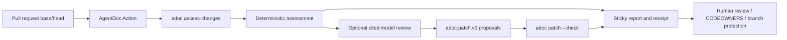
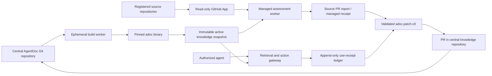

# AgentDoc Roadmap — V9 Cycle: Trustworthy PR Knowledge Assessment and Governed Proposals

**Document version:** 0.2
**Document status:** Active
**Last updated:** 2026-07-21
**Product scope:** Free/local single-repository knowledge loop, with gated successor plans for managed and on-prem delivery
**Repositories:** `agentdoc-dev/adoc` and `agentdoc-dev/action`
**Planning baseline:** AgentDoc `v0.2.0` and AgentDoc Action `v1.4.0`

This roadmap continues [ROADMAP-V8.md](ROADMAP-V8.md) from the repository state that actually exists on 2026-07-20. It is an implementation handoff, not a claim that V8 is complete. V9 makes the co-located, single-repository PR loop truthful and useful: a code change receives a deterministic knowledge assessment, an optional cited semantic review, human-governed AgentDoc patch proposals, and an auditable PR assessment receipt.

The roadmap deliberately uses the word **assessment**, not **verification**. AgentDoc can deterministically prove that knowledge compiles, identify declared links, and record exactly what it evaluated. A model or human can judge whether behavior and knowledge remain semantically aligned. Neither path matching nor an LLM can prove organizational truth by itself.

---

## Executive Outcome

At V9 exit, a repository containing both code and AgentDoc knowledge can install one GitHub Action and receive:

1. A fail-honest structural validation result.
2. A deterministic classification of changed paths as covered, provisionally covered, uncovered, or excluded.
3. A list of affected Knowledge Objects, owners, content hashes, lifecycle warnings, and proof obligations.
4. A factual indication of which affected Knowledge Objects changed in the PR; this is never mislabeled as human review.
5. An optional model-assisted classification of the code change as consistent, extending knowledge, contradicting knowledge, or lacking sufficient evidence.
6. Canonical `adoc.patch.v0` proposals that AgentDoc validates and humans accept, modify, or reject.
7. A versioned PR assessment receipt containing the exact code revisions and knowledge snapshot used.
8. Advisory-first rollout data sufficient to decide whether any knowledge finding is precise enough to become a configurable merge gate.

V9 does **not** introduce a central knowledge service, multi-repository identity, Slack/Jira ingestion, custom RBAC, a web application, or an enterprise deployment. Those are gated successor programs described later in this document.

---

## Baseline Truth

### Shipped baseline

| Surface | Shipped behavior |
| --- | --- |
| AgentDoc compiler | Parses `.adoc` and prose-only `.md`; validates typed knowledge; emits HTML, graph JSON, search JSON, and source-located diagnostics. |
| Knowledge model | Fifteen typed kinds with lifecycle, ownership, evidence, relations, effective signals, and object content hashes. |
| Agent surfaces | Local CLI, local read-only retrieval, MCP tools/resources, patch validation, and opt-in patch application. |
| Change surfaces | `adoc impacted-by`, `adoc diff`, `adoc review`, proof obligations, required reviewers, and evidence-anchor warnings. |
| Action | Pinned binary install, graph build, strict check, impacted-path report, authored contradictions, Claude-based draft generation, sticky comment, and optional commit/follow-up-PR delivery. |
| Canonical source | AgentDoc source in Git. Compiled artifacts are disposable read models. |

### V8 status at this planning snapshot

| V8 milestone | Actual status |
| --- | --- |
| V8.1 Markdown migration | Shipped. |
| V8.2 external design-partner pilots | Not discharged; partner reports and measured synthesis are absent. |
| V8.3 CI surface/composite Action | Shipped and extended in the separate Action repository. |
| V8.4 contract freeze/knowledge health | Not shipped as written; `docs/CONTRACTS.md`, `adoc health`, ADR-0044, and ADR-0046 are absent, and the planned ADR-0045 number conflicts with an accepted ADR. |
| V8.5 evidence anchor | Shipped. |

V9 may start its correctness and security work immediately. It must not claim product completion until the V9 pilot closes the still-open PRD acceptance evidence.

### Known trust gaps

1. `adoc review` computes code impact only from Knowledge Objects created or changed in the documentation diff. A code-only PR can therefore omit an unchanged but affected object.
2. Diff/review snapshot compilation ignores the configured `docs_path` and may compile unrelated Markdown.
3. Knowledge Object hashes include source coordinates that are not canonical across a normal build, a review worktree, and a separate clone.
4. `adoc impacted-by` performs exact-path linkage over a limited trusted-subject set. No match does not distinguish new behavior, intentionally ungoverned code, configuration omission, or failed analysis.
5. The Action can turn a failed Impacted Query into an empty `uncovered-paths` file and render that as “all changed paths are covered.”
6. The Action’s current model output is custom claim/task block text, not the existing canonical AgentDoc patch contract.
7. Proposal sandbox validation compares error file paths, so a new error in a file that was already invalid can be missed.
8. Model credentials are in scope for more subprocesses than required, and proposal paths are lexically screened without a complete symlink-containment guarantee.
9. Current `tracing` spans and GitHub logs are operational telemetry, not durable proof of what knowledge an agent relied upon.

These are V9 inputs, not optional cleanup.

---

## Product and Tier Boundary

| Tier | Source of truth | Product surface | Governance and trace posture |
| --- | --- | --- | --- |
| Free/local — V9 | Code and AgentDoc source in one Git repository | CLI, MCP, GitHub Action, local artifacts | Git history, CODEOWNERS, branch protection, human PR review, PR assessment receipts |
| Managed — gated V10 | Managed central AgentDoc Git repository plus registered source repositories | Hosted multi-repository assessment, retrieval gateway, connectors, central proposal workflow | Organization identity, fixed policy rules, durable retrieval/action receipts, hosted audit |
| Enterprise/on-prem — gated V11 | Customer-controlled deployment and storage | Same managed APIs and contracts deployed on customer infrastructure | OIDC SSO, fixed RBAC/repository attributes, customer keys, retention, audit export, data residency, and a no-public-internet profile using customer-internal GitHub Enterprise Server |

Rules:

- V9 must not add organization IDs, tenancy abstractions, connector SDKs, hosted storage adapters, or remote authentication to the compiler.
- Free/local object IDs remain repository-local.
- Managed code must wrap and reuse the local compiler and versioned envelopes rather than fork their semantics.
- On-prem must package the managed product; it must not become a second implementation.
- Connector content is an observation or proposal source. It never becomes verified knowledge automatically.

---

## Terms and Guarantee Levels

### Structural validity

The AgentDoc source parses and satisfies deterministic schema, reference, lifecycle, and evidence rules. `adoc check` owns this guarantee.

### Declared linkage

A changed repository path exactly matches a Knowledge Object’s `impacts:` entry or a path-bearing evidence/source relationship. This proves a declared relationship, not semantic consistency.

### Authoritative governing object

For V9 assessment, an object can authoritatively govern code only when its kind/status pair is:

| Kind | Authoritative status |
| --- | --- |
| `claim` | `verified` |
| `decision` | `accepted` |
| `api` | `verified` |
| `policy` | `active` |
| `procedure` | `verified` |

Other kinds or statuses with declared path linkage are **provisional**. Constraints remain visible as provisional until their authority model is explicitly designed; `agent_instruction` remains informational and is never treated as runtime authorization.

Lifecycle and contradiction signals do not erase a link. They add warnings and proof obligations. A linked but stale, contradicted, expired, or review-overdue object cannot produce a clean `pass` outcome.

### Path classification

Every successfully assessed changed path receives exactly one classification:

- `covered` — at least one authoritative governing object declares the path.
- `provisional` — one or more non-authoritative objects declare the path, but no authoritative object does.
- `uncovered` — the path is not excluded and no object declares it.
- `excluded` — the path is an automatically excluded knowledge/config/artifact path or matches a configured exclusion; the result includes the exclusion reason.

An unavailable analysis is not a path classification. It is represented by assessment completeness `partial` or `error` and can never be rendered as covered.

### Semantic review

A human or explicitly model-assisted step compares the code diff with relevant knowledge. Its closed V9 classifications are:

- `consistent`
- `extends_existing_knowledge`
- `contradicts_existing_knowledge`
- `insufficient_evidence`

Semantic review is cited and advisory. It never changes the deterministic assessment outcome.

### PR assessment receipt

A durable CI artifact proving which revisions, graph, objects, hashes, diagnostics, and optional proposal artifacts were evaluated. It proves the CI assessment, not that a runtime agent relied on the knowledge.

### Agent Use Receipt

A future managed-runtime event linking retrieval, explicit agent selection/citation, and a downstream action. “Returned,” “selected,” “cited,” and “acted upon” are separate states and must never be inferred from one another.

---

## Roadmap Rules

All still-applicable rules from [ROADMAP.md](ROADMAP.md), [ROADMAP-V6.md](ROADMAP-V6.md), [ROADMAP-V7.md](ROADMAP-V7.md), and [ROADMAP-V8.md](ROADMAP-V8.md) continue. V9 adds:

1. **Fail honestly.** Empty, missing, malformed, partial, and successful-empty results are distinct. No renderer may infer success from an empty file.
2. **Deterministic before probabilistic.** The compiler produces changed-path facts and policy outcomes. A model may explain and propose; it never determines the merge verdict.
3. **One new public core envelope.** V9 adds `adoc.change_assessment.v0`. Existing `adoc.impacted.v0`, `adoc.review.v0`, and `adoc.patch.v0` remain available.
4. **Reuse the patch loop.** Model proposals use `adoc.patch.v0` and `adoc patch --check`/`--apply`. The Action does not maintain a second AgentDoc source editor.
5. **No model-conferred authority.** A model cannot verify, accept, activate, approve, merge, or silently preserve authority after a meaning-changing edit.
6. **Advisory first.** Structural invalidity and inability to run the assessment may fail. Coverage, impact, lifecycle drift, authored contradictions, and semantic classifications stay advisory until the recorded pilot justifies a stricter mode.
7. **Exact revisions everywhere.** Live CI uses the pull request’s exact base and head SHAs, never an ambiguous branch name or merge checkout.
8. **Hashes must be portable.** The same source revision compiled in two clones or a temporary worktree produces identical logical source coordinates and object hashes.
9. **Receipts minimize content.** Store IDs, hashes, statuses, evidence metadata, and outcomes by default; do not store raw prompts, secrets, or complete proprietary diffs.
10. **GitHub is MVP governance.** Reuse reviews, CODEOWNERS, permissions, and branch protection before inventing an AgentDoc authorization service.
11. **One provider until evidence asks for two.** V9 keeps the current provider. No provider interface/factory/plugin framework is added.
12. **Every slice is vertical.** Implementation, interface, tests, docs, compatibility, and rollout land together. “Core only,” “tests later,” and “docs follow-up” are not completed slices.

---

## Repository Responsibility Boundary

| Responsibility | `adoc` | `action` |
| --- | --- | --- |
| Source parsing, validation, graph construction | Owns | Consumes |
| Canonical source coordinates and object hashes | Owns | Records |
| Changed-path policy and classification | Owns | Renders/enforces configured posture |
| Impacted objects, owners, lifecycle signals, obligations | Owns | Renders |
| Assessment envelope | Owns | Consumes |
| GitHub event and exact SHA resolution | Accepts supplied refs | Owns |
| Model invocation and credentials | Does not own | Owns |
| Semantic-review provider output | Does not gate | Owns as experimental Action contract |
| Patch parsing, validation, optimistic concurrency, application | Owns | Orchestrates |
| Sticky comment, job summary, Action outputs, delivery | Does not own | Owns |
| PR receipt wrapper and GitHub metadata | Supplies assessment digest/data | Owns |
| Human approval | Exposes owners/obligations | Delegates to GitHub |

`adoc` must remain usable from non-GitHub CI. `action` must not reimplement AgentDoc domain rules in shell or `jq` when a core command already exposes them.

### V9 local flow



### Action implementation map

| Current Action seam | V9 ownership |
| --- | --- |
| `action.yml` | Validate every input/event/workdir; create unique per-invocation run directory; declare composite outputs and producer step IDs; pass exact refs; enforce frozen stage order |
| `scripts/install.sh` | Resolve/download AgentDoc, verify checksum, and record requested version, resolved version, binary SHA-256 |
| `scripts/report.sh` | Become the sole `adoc assess-changes` adapter; preserve a valid nonzero partial/error envelope; remove independent build/impact/review/contradiction/coverage reconstruction |
| `scripts/compose.sh` | Render only validated final state after proposal/delivery; write summary from the same body/digests |
| `scripts/propose.sh` | Invoke the provider under a sanitized environment; normalize `adoc.semantic_review.v0`; emit canonical patch files |
| `scripts/apply-drafts.sh` | Delete after create-only canonical patch parity; no replacement text editor |
| `scripts/deliver.sh` | Use isolated worktree, canonical patch loop, exact-head check, explicit ephemeral push auth, leased push, and delivery record |
| `scripts/comment.sh` | Re-check current PR head and upsert only if this run is still current |
| `problem-matcher.json` | Match deterministic source diagnostics only; remove before provider/sandbox phases |
| `.github/workflows/ci.yml` | Temporary-repository/mock-provider contract/security suite and output-consumer assertions |
| `.github/workflows/smoke.yml` | Same-repo/fork-safe live smoke and one guard that all AgentDoc release pins agree |
| `README.md` | Truthful workflow, permissions, event, egress, retention, compatibility, and rollback contract |
| New `schemas/` directory | One canonical Action-owned location for semantic-review and PR-receipt schemas/goldens |

The Action stage order is normative:

1. Preflight event, inputs, workspace containment, current PR metadata, and unique run directory; initialize a minimal stage ledger.
2. Install/verify AgentDoc while capturing failure rather than bypassing finalization.
3. Register the deterministic problem matcher.
4. Run exactly one deterministic assessment and parse any structured nonzero envelope.
5. Remove the problem matcher.
6. Optionally run the provider.
7. Validate/apply canonical proposals in a disposable sandbox.
8. Re-check exact head and perform optional delivery.
9. Finalize assessment/semantic/proposal/delivery status, receipt, and report.
10. Publish composite outputs, job summary, stale-head-safe comment, and safe artifact paths.
11. Exit once from the final enforcement step according to the gate matrix.

Every stage records `pending|skipped|complete|error`. Expected failures are deferred until finalization so install/schema/provider/delivery errors can still produce the promised failure receipt and remediation. The unique run directory includes the workflow run, attempt, job, and a collision-resistant invocation suffix; no shared `$RUNNER_TEMP/adoc-*` filename is allowed.

---

## Sequencing and Release Dependencies

1. V9.1.1 canonical source identity lands before any receipt contract. Hashes produced before it are not portable enough for provenance.
2. V9.1.2 full-graph code impact depends on V9.1.1 so review and normal artifacts share identities.
3. V9.1.3 Action fail-honestly work can proceed in parallel with V9.1.1–V9.1.2 because it changes only Action state handling and tests.
4. V9.1.4 proposal hardening can proceed in parallel, but must land before model proposals are promoted in documentation.
5. V9.2.1 is the serialization point: it defines `adoc.change_assessment.v0` and the local coverage semantics all later slices consume.
6. Every cross-repository release lands in this order: AgentDoc PR → AgentDoc tag/release → Action pin/integration PR → immutable Action release → floating major-tag update after smoke tests.
7. V9.3 semantic review never starts before V9.2’s deterministic result is visible independently in the PR report.
8. V9.4 thresholds are recorded before the first measured run. No mid-window prompt, rule, threshold, or fixture tuning is allowed without ending and restarting the measurement window.
9. V10 is not an engineering dependency for any V9 slice.

Parallelism describes merge conflicts and dependencies, not required staffing.

---

## Status Summary

| Slice | Status | User outcome | Repositories | Depends on | Completion evidence |
| --- | --- | --- | --- | --- | --- |
| V9.1.1 | Implemented | Portable source coordinates and hashes | `adoc` | — | ADR-0049; core/local/CLI/MCP contract tests |
| V9.1.2 | In progress | Code-only PRs report unchanged affected knowledge | `adoc` | V9.1.1 | Full-graph core, exact-revision Git adapter, worktree change-set, and snapshot-config CLI/MCP tests |
| V9.1.3 | Planned | Failed analysis cannot appear covered | `action` | — | — |
| V9.1.4 | Planned | Proposal execution has a defensible trust boundary | `action` | — | — |
| V9.2.1 | Implemented | One deterministic local change-assessment command | `adoc` | V9.1.1–V9.1.2 | ADR-0050; core/local/CLI/MCP schema and failure-envelope tests |
| V9.2.2 | Planned | Exact-SHA GitHub assessment and retained receipt | `adoc`, `action` | V9.2.1 | — |
| V9.2.3 | Planned | Clear advisory PR disposition without false review claims | `action` | V9.2.2 | — |
| V9.3.1 | Planned | Optional cited semantic classification | `action` | V9.2.3 | — |
| V9.3.2 | Planned | Canonical AgentDoc patch proposals | `adoc`, `action` | V9.3.1 | — |
| V9.3.3 | Planned | Human-governed comment/commit/PR delivery | `action` | V9.3.2 | — |
| V9.4.1 | Planned | Precommitted pilot ledger and thresholds | `adoc`, `action` | V9.3.3 | — |
| V9.4.2 | Planned | Real dogfood and external PR evidence | `adoc`, `action` | V9.4.1 | — |
| V9.4.3 | Planned | Evidence-based enforcement and V10 decision | `adoc`, `action` | V9.4.2 | — |
| V9.4.4 | Planned | Conditionally implement one measured deterministic knowledge gate | `action` | V9.4.3 affirmative gate decision | — |

Status vocabulary: `Planned`, `Ready`, `In progress`, `Blocked`, `Implemented`, and `Superseded`. `Implemented` requires merged PR/release links plus executable completion evidence.

---

## PRD Traceability

| V9 milestone | PRD coverage |
| --- | --- |
| V9.1 | Correctness prerequisites for §9.2 Code Change Invalidates Docs, §24 CI/CD Integration, and §26 Semantic Diff. |
| V9.2 | §9.2, §24.1–§24.4, Phase 3 success criteria “code changes identify impacted docs,” and §51 “code changes with successful doc impact analysis.” |
| V9.3 | §9.3 Agent Proposes a Doc Patch, §25.4 `proposePatch`, Phase 3 “agent patches are reviewable,” and the model-assisted part of §26. |
| V9.4 | §36 adoption/quality metrics and open MVP acceptance criteria §50.1 #13–#15. |
| V10 later | §25 auditable Agent API, Phase 4 multi-repository graph/agent activity audit, and Phase 5 governance. |
| V11 later | Phase 5 self-hosted deployment, data residency, enterprise identity, and audit export. |

V9 does not claim automatic contradiction detection under §27. Current contradictions remain explicitly authored.

---

## V9.1: Trustworthy Baseline

V9.1 removes correctness and trust-boundary failures that would otherwise contaminate every assessment and pilot measurement.

### V9.1.1: Canonical Source Identity and Portable Hash Slice

**Status:** Implemented
**Repositories:** `adoc`
**Depends on:** —
**User touchpoint:** `adoc build`, `adoc diff`, `adoc review`, `adoc patch --check`
**Contract impact:** Breaking `adoc.graph.v5` artifact-semantic correction
**Gate posture:** Not applicable
**Completion evidence:** ADR-0049; clone-portability, review-parity, standalone/project identity, path-containment, CLI, patch, and published-schema contract tests; workspace quality gates

#### Goal

The same repository revision produces identical graph source coordinates and Knowledge Object `content_hash` values in a normal checkout, a temporary review worktree, and a second clone.

#### Current behavior and evidence

- `FsSourceProvider` retains a physical filesystem path in `SourceFile.path`.
- parser spans use that physical path.
- `KnowledgeObjectHashPayload` includes `source_span`.
- review replaces paths with a synthetic `<review>` prefix and compiles the repository root rather than the configured docs root.
- A patch base hash obtained from a normal graph is therefore not reliably interchangeable with a review/assessment hash.

Relevant seams:

- `crates/adoc-core/src/domain/source.rs`
- `crates/adoc-core/src/domain/ports/source_provider.rs`
- `crates/adoc-core/src/infrastructure/source/fs.rs`
- `crates/adoc-core/src/infrastructure/artifact/graph_json.rs`
- `crates/adoc-core/src/application/review.rs`
- `crates/adoc-local/src/config.rs`
- `crates/adoc-local/src/use_cases.rs`

#### User-visible behavior

- Graph `source_span.path` values are project-root-relative, slash-normalized paths.
- Page identity remains docs-root-relative and therefore does not change merely because the graph source coordinate becomes repository-relative.
- Diagnostics still render repo-relative paths.
- Normal build and review emit the same `content_hash` for an unchanged object.
- Two clones at different absolute paths emit byte-identical graph objects for the same source revision, excluding explicitly clock-derived fields already outside the hash.

#### Scope

AgentDoc:

1. Separate three source concerns explicitly:
   - physical path used for filesystem reads;
   - identity path used for path-derived page IDs;
   - logical repository path used in diagnostics, graph source spans, diffs, hashes, and receipts.
2. Make span constructors use the logical repository path, never the physical checkout path.
3. Have local orchestration derive the logical prefix from the discovered project/config root and resolved `docs_path`.
4. Have review materialize `<snapshot>/<docs_path>` physically while assigning the same logical prefix used by normal build.
5. Remove the synthetic `<review>` coordinate from serialized/hash-bearing data.
6. Preserve line and column in the hash for V9. Removing location entirely is a separate semantic decision and is not required to make the path portable.
7. Bump the graph contract to `adoc.graph.v5` because source-coordinate semantics and every affected `content_hash` change even if the JSON shape does not. The slice-start ADR records the rationale and migration; it does not reopen the version decision.
8. Regenerate graph/search fixtures and document the one-time rebuild.
9. Define both invocation families rather than letting the filesystem provider guess a coordinate root:
   - **project-bound/config-backed commands:** logical paths are relative to the discovered project root, identity paths remain relative to the configured docs root, and physical paths are canonical paths below that root;
   - **standalone explicit directory:** the invocation root is that directory, logical/identity paths are relative to it, and the graph records that no repository identity was established;
   - **standalone explicit file:** the invocation root is the file's parent, the logical/identity path is the file name, and the graph records that no repository identity was established.
10. Reject standalone roots for repository assessment/review. `check`/`build` may remain standalone, but any command that claims Git revisions, changed paths, or a repository receipt requires a discovered project/config root.
11. On Windows, convert physical path separators to `/` only while deriving an output logical path. Reject backslashes in caller-authored logical/config/patch paths on every platform rather than treating them as alternate separators.
12. Make patch check/apply use the same physical/identity/logical separation as build/review. A placement resolves through the head graph's logical source coordinate and then through the validated physical snapshot root; it never treats serialized logical text as an arbitrary host path.

Action:

- No implementation change in this slice.
- Its next release must pin the corrected AgentDoc version before it records hash-bearing receipts.

#### Contract

Recommended `adoc.graph.v5` invariant:

```text
For a fixed source revision and compiler version:
logical source path + line + column + authored object semantics
produce the same content_hash regardless of checkout location.
```

No AgentDoc source syntax changes. `adoc.patch.v0` stays unchanged; only its required `base_hash` values are regenerated from the new graph.

#### Failure and security semantics

- A `docs_path` outside the discovered project root is rejected for review/assessment rather than represented with `..`.
- Logical paths reject absolute roots, `..` components, NUL, control characters, edge whitespace, and platform-specific alternate separators on input; serialized output always uses `/`.
- Canonicalize every physical source target before reading. Reject directory/file symlinks whose target escapes the configured project/docs root; never read outside-root bytes under an inside-looking logical path.
- Any inability to derive a safe logical path is an error, never an absolute-path fallback.

#### Compatibility and migration

- Source files require no migration.
- Existing graph/search artifacts must be rebuilt once.
- Existing in-flight patch documents fail loudly on `base_hash` mismatch and must be regenerated.
- A graph-version bump uses the existing exact-version rejection path; no tolerant v4/v5 reader is added unless a real external consumer requires an overlap window.
- The release note names the hash invalidation and expected re-embedding.

#### Test matrix

- Unit: physical, identity, and logical paths remain distinct through `SourceFile` span creation.
- Unit: Windows physical paths and Unix physical paths derive the same slash-normalized logical form; caller-authored logical paths containing `\` reject.
- Core integration: two temp directories containing byte-identical projects emit identical object hashes.
- Core integration: normal compile and two-snapshot review emit identical hashes for unchanged objects.
- CLI: config discovered from a nested working directory still produces repo-relative `docs/...` paths.
- CLI: explicit directory and explicit single-file inputs receive deterministic logical paths.
- CLI: standalone check/build records `repository_identity: null`; standalone input is rejected by review/assessment.
- CLI: moving the checkout changes no graph hash; moving the object within the repository changes its source coordinate as expected.
- Filesystem: a symlinked source file or directory targeting outside the configured root is rejected before bytes are read.
- Regression: path-derived page IDs remain byte-identical to v4 behavior.
- Patch: check/apply resolves a graph logical coordinate under the exact physical snapshot root and rejects absolute, backslash, traversal, edge-whitespace, and symlink-escape placements.
- Workspace: `cargo test --workspace --locked`.

#### PR and release shape

1. Decision record: canonical source coordinates and graph-version consequence.
2. Core PR: source-coordinate separation and graph serialization.
3. Local/CLI PR: project-root/docs-root wiring and end-to-end fixtures.
4. Release note plus AgentDoc tag.

These may be commits in one PR if review remains tractable; do not split tests or docs into follow-ups.

#### Acceptance

- A test builds one fixture in two different absolute clones and asserts equal graph object JSON and `content_hash`.
- A code-free `adoc review` between identical snapshots reports zero changed objects.
- A patch generated from the normal head graph validates against the review/assessment head graph.
- Graph source paths contain neither the checkout root nor `<review>`.
- All old-version rejection and rebuild guidance tests pass.

#### Deferred

- Removing line/column from `content_hash`. Un-gate only if V9 pilot data shows unrelated line movement creates material patch churn.
- Repository-qualified coordinates. Those belong to V10.

### V9.1.2: Code-Change Impact Correctness Slice

**Status:** In progress
**Repositories:** `adoc`
**Depends on:** V9.1.1
**User touchpoint:** `adoc review <base>` and MCP `adoc_review`
**Contract impact:** Behavioral correction within `adoc.review.v0`
**Gate posture:** Advisory
**Completion evidence:** Full-graph impact and kind-correct obligation unit tests; exact-SHA/merge-base, immutable-worktree, complete changed-path, per-snapshot-config, CLI, MCP, and contract regressions on the implementation branch. Merge and release links remain required before `Implemented`.

#### Goal

A code-only PR reports every unchanged object in the currently shipped trusted-subject set—verified claims, accepted decisions, and verified APIs—whose declared path linkage intersects the changed path set.

#### Current behavior and evidence

`compute_impact` iterates only `diff.created` and the head side of `diff.changed`. An unchanged Knowledge Object is absent even when its `impacts:` or evidence path matches changed code. Existing CLI acceptance changes both code and the claim body, masking the failure.

#### User-visible behavior

- `adoc review` still reports Knowledge Object creates/changes/deletes.
- Snapshot review compiles only the configured `docs_path`, exactly as normal build/check does.
- Its `impact` section is computed against the complete head graph, not only the knowledge diff.
- Required reviewers and proof obligations include owners of unchanged affected objects.
- A code-only PR produces a non-empty impact list when declared linkage exists.
- Knowledge linkage remains exact-path matching. V9.2 adds exclusion prefixes only; it does not add glob or directory-pattern linkage.

#### Scope

AgentDoc:

1. Extract one shared current trusted-subject predicate used by full-graph impact queries.
2. Reuse the existing `impacted_objects` traversal over all head Knowledge Objects.
3. Project full-graph hits into the existing `ImpactedObject` shape required by `adoc.review.v0`.
4. Preserve knowledge diff semantics: source relocation/hash corrections from V9.1.1 must not make unchanged objects appear changed.
5. Recompute required reviewers and proof obligations from the corrected impact list.
6. Ensure deleted code paths can still match head knowledge that cites the deleted path.
7. Keep `adoc impacted-by` behavior and envelope unchanged.
8. Update `docs/agent/v0/review-workflow.md` and `docs/agent/v0/schema/review.md`.
9. Resolve and validate each snapshot's currently shipped configuration independently. Compile each side with its own `docs_path`, source inventory, and output settings, and retain those normalized values internally for adapter fixtures. A missing/invalid side config is a named snapshot/config failure; never borrow the other side's config silently. V9.1.2 does not introduce `assessment.exclude_paths`, coverage classification, policy digests, or gate policy; all exclusion/policy effectiveness and self-bypass behavior belongs to V9.2.1.
10. Resolve requested-base/head refs to full commit SHAs first. Compute `git merge-base --all <requested-base-sha> <head-sha>` from those resolved SHAs and require exactly one result in V9. Zero or multiple merge bases produce `error/not_evaluated`; do not pick one by output order. Compile/diff the unique comparison-base→head so Knowledge Object snapshots and three-dot changed paths describe the same comparison.
11. Materialize immutable snapshots by resolved commit SHA, not by the caller's mutable ref text, and verify the created checkout/worktree `HEAD` byte-for-byte equals the intended SHA before reading config, sources, or code. A mismatch aborts the assessment.
12. Define worktree changed paths as the deterministic `BTreeSet` union of:
    - committed branch changes from `base...HEAD`;
    - staged and unstaged tracked changes from `HEAD`;
    - untracked, non-ignored paths from `git ls-files --others --exclude-standard`.
13. Read every Git path through NUL-delimited commands: `git diff --name-only -z --no-renames` for each committed/staged/unstaged comparison and `git ls-files -z --others --exclude-standard` for untracked paths. Parse bytes as strict UTF-8, reject NUL-impossible malformed records, and never use lossy decoding or newline-delimited parsing. With `--no-renames`, a rename is intentionally represented as delete + add. Ignored untracked files are intentionally absent.
14. Treat any changed path that cannot become a valid repo-relative `RelPath`—including non-UTF-8, absolute, escaping, backslash, control-character, or leading/trailing-whitespace names—as a changed-set error; never drop it and assess the remaining subset as complete.
15. Preserve rich internal impact reasons (`impacts_path`, `evidence_path`) for V9.2. `adoc.review.v0` remains its shipped `ImpactedObject { id, paths }` projection and therefore deduplicates matching paths without representing reason kinds; do not claim that the legacy envelope preserves them.
16. Add kind-correct impact obligations now for the currently shipped authoritative set: verified claims re-evaluate the claim/evidence, accepted decisions confirm implementation conformance, and verified APIs revalidate the contract/compatibility. V9.2 extends the same matrix to policies/procedures.

Action:

- Do not use `review.impact` as coverage until the corrected AgentDoc release is pinned.
- After pinning, it may use `review.diff` only for “object updated in this PR” facts; V9.2 owns coverage.

#### Contract

No shape change to `adoc.review.v0`. The behavioral invariant changes from “affected objects among changed/created KOs” to “affected verified claims, accepted decisions, and verified APIs in the complete head graph.” V9.1.2 retains resolved refs and normalized per-snapshot config/docs-path values only as adapter inputs/test evidence; it does not add them to the legacy review envelope. Zero/multiple merge bases, bad config transitions, or materialization mismatches are loud legacy review errors. The public revision/config provenance and `error/not_evaluated` tuple arrive only in `adoc.change_assessment.v0` under V9.2.1.

#### Failure and security semantics

- Base/head snapshot or changed-file failures remain loud review failures.
- A clean, successfully computed empty impact list is distinguishable from a failed review by exit code and diagnostics.
- Required reviewers are facts derived from object ownership, not proof that those reviewers approved.

#### Compatibility and migration

- No source or config migration.
- Consumers that accidentally depended on the under-reporting receive additional impact records; this is the intended bug fix.
- Golden `review` output changes only where full-graph objects were previously omitted.

#### Test matrix

- CLI regression: base contains a verified claim; head changes only its cited Rust file; `review.impact` contains the unchanged claim.
- CLI regression: configured `docs_path: knowledge` prevents unrelated root Markdown from entering snapshots.
- Git adapter: explicit requested-base/head refs retain exact SHAs plus the unique computed comparison-base SHA; zero and multiple merge-base fixtures fail closed.
- Regression: base tip advanced after branch point; changed paths, Knowledge Object diff, impact, and reviewer facts all use comparison-base→head.
- Git adapter: immutable worktrees are created from resolved SHAs and their materialized `HEAD` is verified before configuration or source reads.
- Git adapter: worktree mode includes committed, staged, unstaged, deleted, renamed-as-delete-plus-add, untracked, non-ASCII, embedded-newline, and ignored-file cases; ignored files are absent by contract.
- Git adapter: non-UTF-8, malformed, absolute, escaping, backslash, control-character, and edge-whitespace path output fails the whole changed set instead of disappearing.
- Existing-config transition: comparison-base/head each use their own normalized config/docs path/source inventory; add/remove/rename, `docs_path`, and output changes have adapter goldens. Assessment exclusions/policy changes are tested only in V9.2.1.
- Core: one path matching both `impacts_path` and `evidence_path` preserves both reasons internally while legacy `adoc.review.v0` deterministically deduplicates its path projection.
- Core: changed code with no matching object yields a successful empty impact list.
- Core: owner aggregation includes unchanged impacted objects.
- Core: claim, decision, and API impact obligations are kind-correct and deduplicate against obligations from a simultaneously changed KO.
- MCP: `adoc_review` matches CLI JSON for the same fixture.
- Workspace: `cargo test --workspace --locked`.

#### PR and release shape

1. Red CLI regression proving the code-only failure.
2. Shared full-graph impact fix plus reviewer/obligation projection.
3. CLI/MCP goldens and review-contract docs.
4. AgentDoc release after V9.1.1.

#### Acceptance

- The code-only fixture fails before the change and passes after it.
- `adoc review` and `adoc impacted-by` name the same current trusted-subject objects for the same explicit changed paths.
- No Knowledge Object source edit is needed to make a code-only impact visible.
- Worktree mode proves that the union of its three Git sources is complete and deterministically deduplicated.
- Every raw changed path is either represented as a valid repository-relative path or makes the review non-successful.
- The Action can remove its reliance on changed-KO-only impact badges after pinning the release.

#### Deferred

- Expanding coverage to active policies and verified procedures. V9.2.1 owns the explicit per-kind impact, reviewer, and proof-obligation behavior.
- Glob/symbol matching. Exact paths remain the deterministic V9 baseline.

### V9.1.3: Fail-Honestly PR Reporting Slice

**Status:** Implemented
**Repositories:** `action`
**Depends on:** —
**User touchpoint:** AgentDoc PR Report
**Contract impact:** Behavioral breaking correction for analysis/setup failures; no input/schema change
**Gate posture:** Setup/internal analysis inability is always non-green; structurally invalid knowledge retains existing `advisory|strict` policy
**Completion evidence:** —

#### Goal

The Action never renders “all changed paths are covered” when impact analysis was unavailable, malformed, partial, or skipped.

#### Current behavior and evidence

`scripts/report.sh` initializes `uncovered-paths` as an empty file before the Impacted Query. `scripts/compose.sh` interprets an empty file as “None — all changed paths are covered.” Errors and successful empty results collapse to the same filesystem state.

#### User-visible behavior

The report shows one of:

- analysis complete with impacted/uncovered facts;
- no changed assessable paths;
- analysis unavailable with a concise remediation;
- analysis malformed/internal error.

Only the first two can produce an “all assessed paths are covered” message.

#### Scope

Action:

1. Replace existence/emptiness inference with one machine-readable status artifact, initially private to the Action:
   - `complete`
   - `no_changes`
   - `unavailable`
   - `error`
2. Preserve diagnostics from every failed command and include the failing command/stage without secrets.
3. Make `compose.sh` branch on explicit status before reading path files.
4. Treat an invalid/missing status artifact as `error`.
5. Keep the comment posting before final enforcement.
6. Tighten diff-scope attribution using complete diagnostic records rather than permissive path extraction.
7. Fix the problem matcher so hyphenated diagnostic codes and repo-relative paths match.
8. Remove the matcher before sandbox/model-related checks so proposal diagnostics cannot annotate the source PR as original errors.
9. Compose the job summary after delivery metadata is known, or deliberately update both summary and comment from the same final report body.

AgentDoc:

- No change. V9.2 replaces the private status with the public assessment completeness field.

#### Contract

No public Action input/output shape changes in this slice. The externally observable correction is deliberate: a run that cannot establish the analysis no longer exits successfully in `advisory` mode. The private status file is explicitly temporary and is deleted when V9.2.2 consumes `adoc.change_assessment.v0`.

#### Failure and security semantics

- Tool/environment/internal-contract failure remains non-green even in advisory mode. A successfully diagnosed current-head structural error remains governed by the existing `advisory|strict` input.
- An unavailable impact query never relaxes `adoc check` enforcement.
- A malformed JSON envelope is an internal error, not zero impacted objects.
- Logs may contain paths and diagnostics but never credential values or raw provider output.

#### Compatibility and migration

- Existing workflows and inputs remain valid.
- Sticky comment marker remains unchanged.
- Only incorrect success wording and error handling change.
- Release notes call out that infrastructure/setup/analysis failures which may previously have appeared green are now non-green in both enforcement modes; `advisory` still keeps ordinary `adoc check` findings green.

#### Test matrix

- Successful non-empty impact.
- Successful empty impact with assessable changed paths.
- No changed paths.
- Missing PR base.
- Shallow checkout.
- Unresolvable base ref.
- Missing graph artifact.
- Invalid impacted JSON.
- `jq` failure.
- Mixed spanful/spanless errors under `scope: diff`.
- Hyphenated diagnostic code problem-matcher fixture.
- Delivery link appears identically in comment and summary.

Tests live in the existing Action CI workflow and use fixture repositories/mocked commands; no new test framework.

#### PR and release shape

1. Red fixture for failed-impact false success.
2. Explicit state and renderer correction.
3. Diff-gate/problem-matcher regressions.
4. Patch Action release; do not move the floating `v1` tag until x86_64 and arm64 smoke jobs pass.

#### Acceptance

- Every unavailable/error fixture contains “assessment unavailable” or equivalent and never “all covered.”
- Successful empty and failed analysis produce different machine state and different report text.
- Existing strict/advisory clean/broken fixtures retain their documented exit behavior.
- One live PR demonstrates the corrected comment and is linked as completion evidence.

#### Deferred

- New public assessment outputs. V9.2.2 owns them.

### V9.1.4: Proposal Trust-Boundary Hardening Slice

**Status:** Planned
**Repositories:** `action`
**Depends on:** —
**User touchpoint:** Proposed Knowledge section and proposal delivery
**Contract impact:** Tightening of accepted provider output
**Gate posture:** Proposal failures follow existing `propose-on-error`; proposals never determine deterministic compliance
**Completion evidence:** —

#### Goal

Provider installation, prompt construction, output validation, sandboxing, and delivery have an explicit least-privilege boundary before V9 adds richer semantic proposals.

#### User-visible behavior

- Valid drafts continue to appear.
- Rejected drafts include a precise safe reason.
- A proposal cannot escape the checkout, create authority, or be described as validated when it introduced a hidden error.
- Provider failures degrade to deterministic assessment without corrupting its result.

#### Scope

Action:

1. Validate every Action input before work begins: closed enums, strict booleans, positive bounded integer caps, safe model/version strings, and a canonical working directory contained by the checkout.
2. Support only `pull_request` in V9, with recommended activity types `opened`, `synchronize`, `reopened`, and `ready_for_review`. Hard-fail `push`, `workflow_dispatch`, `merge_group`, `pull_request_target`, and every other event with `action.unsupported_event`; do not infer refs or provide a second non-PR mode. Add another event only in a separately designed/measured slice.
3. Detect cross-repository PRs and Dependabot from event metadata before provider/delivery; force both off even when credentials or write tokens are present.
4. Install the pinned provider before any provider credential enters the environment, verify the exact package/archive integrity against a repository-pinned lock/integrity value, and record that digest in semantic provenance. A version string alone is insufficient. `claude-code-version` is accepted only when it exactly matches a bundled version→integrity allowlist; initially support one version. Runtime registry metadata from the download channel is not trusted as the pin. An unsupported override fails preflight with the supported version and migration guidance. Installation and invocation both use the secret-safe environment allowlist; an integrity mismatch stops provider work before the credential exists in-process.
5. Select exactly one credential, unset both input aliases, and pass only the selected provider variable plus the minimal locale/path variables to the provider process.
6. Give the provider a temporary `HOME`/config root and an empty non-repository working directory. Disable repository/user settings, hooks, plugins, MCP servers, and all tools—including read/glob/grep—because the Action preassembles the bounded prompt.
7. Add fake installer/provider tests that record environment variable names and prove API/OAuth plus unrelated GH/cloud/npm canary secrets are absent outside the selected provider variable.
8. Canonicalize every target path against the checkout root; reject existing symlink components, symlink targets, absolute paths, `..`, alternate separators, control characters, and non-`.adoc` targets.
9. Validate the proposal action as a closed enum.
10. Require `ko_id` to equal the ID in the proposed block.
11. Reject duplicate proposal IDs/targets and conflicting create/update operations.
12. Reject model-authored authoritative statuses and verification/approval fields during the interim custom-block flow.
13. Compare complete structured error identities before/after sandbox application, not merely file paths. A new diagnostic in an already-invalid file must reject the responsible draft.
14. Treat unparseable diagnostics as sandbox failure, not an empty delta.
15. Preserve per-file rejection granularity initially; add per-draft bisection only if pilot data shows same-file collateral rejection is material.
16. Bound path count, diff bytes, output bytes, wall time, and report size.
17. Delete prompt/response/temp credentials on all normal, error, cancellation-trap, and timeout paths.

AgentDoc:

- No change in this interim slice.
- V9.3.2 removes the custom block editing path in favor of canonical patches.

#### Contract

The provider output remains private/experimental. Tightening it is non-breaking for supported use because no external compatibility promise exists.

#### Failure and security semantics

- Prompt content is untrusted data even inside delimiters.
- Disabling model tools reduces blast radius but does not make output trusted; deterministic validation remains mandatory.
- A sandbox is not containment if symlinks can redirect writes outside it.
- A model proposal is always review material. “Passed `adoc check`” means structurally valid only.
- No credential or raw provider stderr is copied into the PR comment or receipt.
- Runner job environments are not assumed safe merely because an input alias is unset; invocation begins from an explicit environment allowlist.

#### Compatibility and migration

- No workflow change.
- Previously accepted ambiguous/unsafe drafts may now be rejected; that is intentional.
- Arbitrary `claude-code-version` overrides no longer install. Pin the one allowlisted version (or a later Action release whose bundled integrity map admits the desired version); this security tightening is called out in release notes.
- Default delivery remains `comment`.

#### Test matrix

- API-key path, OAuth-token path, both supplied, and neither supplied.
- Installer sees neither credential.
- Provider sees exactly the selected credential.
- Provider package/archive integrity match succeeds; mutable/tampered bytes with the same version fail before credentialed invocation.
- Default/allowlisted provider version succeeds; unsupported override and same-version/wrong-integrity package both fail before credential scope.
- Absolute, traversal, control-character, non-`.adoc`, and symlink paths reject.
- Unknown action rejects.
- Block ID mismatch rejects.
- Duplicate/conflicting drafts reject.
- `verified`/`accepted`/`active` model draft rejects.
- New error in a clean file rejects.
- New error in an already-invalid file rejects.
- Spanless/unparseable sandbox diagnostics fail closed.
- Oversized prompt/output and timeout degrade safely.
- Fork PR skips provider and retains deterministic report.
- Fork PR with a credential deliberately present, Dependabot, `pull_request_target`, malicious repository/user Claude settings/hooks/MCP, unrelated secret canaries, and two Action invocations in one job.

#### PR and release shape

One Action security-hardening PR with the smallest required script changes and fixture extensions. No provider abstraction, schema library, container, or new runtime is added.

#### Acceptance

- Every trust-boundary case above is executable in CI.
- The README security claims match what process environments and path validation actually enforce.
- No unsafe proposal reaches `proposed-drafts.md`, commit delivery, or follow-up PR delivery.
- Provider/install environment captures prove no unrelated secret, repository setting, hook, plugin, MCP server, or tool was available.

#### Deferred

- Multiple providers.
- Strong OS sandboxing. Revisit only if a provider must receive tools or execute repository code.

---

## V9.2: Deterministic PR Assessment

V9.2 creates the one canonical change-assessment contract. It composes existing compiler, graph, impact, diff, lifecycle, contradiction, ownership, evidence-anchor, and proof-obligation behavior instead of adding a second analysis engine.

### V9.2.1: Local Assessment Command and Envelope Slice

**Status:** Planned
**Repositories:** `adoc`
**Depends on:** V9.1.1–V9.1.2
**User touchpoint:** `adoc assess-changes`
**Contract impact:** New experimental `adoc.change_assessment.v0`; optional config addition
**Gate posture:** Report-only command; deterministic outcome is data
**Completion evidence:** —

#### Goal

One command answers: “Given this exact change set and this co-located knowledge snapshot, what knowledge is linked, uncovered, provisional, invalid, or requires human review?”

#### Command interface

Normative V9 interface:

```text
adoc assess-changes --base <git-ref>
  [--head <git-ref>]
  [--as-of <YYYY-MM-DD>]
  [--format auto|plain|styled|json|markdown]
```

`--base` is required. When `--head` is present, both refs are materialized as immutable commits. When it is absent, head is the current worktree and the envelope marks it mutable/clean-or-dirty. The command computes `comparison_base = git merge-base(requested_base, head_commit)` and uses that same comparison commit for changed paths, Knowledge Object diff, and base-side compilation. The Action always supplies exact requested-base and head commit SHAs.

V9 deliberately has no explicit-path assessment mode. `adoc impacted-by` remains the path-query surface; a canonical assessment requires Git comparison context to prove the change set and `changed_in_pr` facts. `--as-of` defaults to the current UTC date but is always serialized and hashed as a semantic input.

#### Configuration

Add one optional block to `agentdoc.config.yaml`:

```yaml
assessment:
  exclude_paths:
    - vendor/
    - generated/
```

Semantics:

1. All repository paths are assessed by default. A missing block therefore requires no migration and means `exclude_paths: []`.
2. The union of actual AgentDoc source files discovered in comparison-base and head under each side's `docs_path`, plus `agentdoc.config.yaml`, is automatically excluded with named reasons. Generated output artifacts are excluded only from the effective comparison-base configuration for this PR; a head output-path change is prospective and cannot hide same-PR code. The source union preserves deletion/rename classification. Never exclude the `docs_path` directory itself: `docs_path: .` is valid and used by shipped examples.
3. `exclude_paths` entries are exact files or directory prefixes using existing repo-relative path validation. Prefix matching is component-boundary-aware: `vendor/` matches `vendor/lib.rs`, not `vendorized/lib.rs`. V9 does not implement globs.
4. Automatic exclusions have fixed precedence in the order knowledge source, configuration file, then generated output; configured exclusions follow. The envelope retains the winning reason.
5. Duplicate/redundant entries normalize deterministically.
6. Absolute, backslash-containing, NUL-containing, empty, dot-only, or parent-escaping entries are config errors.
7. `adoc init` does not emit the optional block. Repositories add it only after observing noise.
8. The optional block follows the existing config-v1 additive posture; old binaries fail loudly on the unknown key. The release notes state the minimum supported version.

#### Scope

AgentDoc core:

1. Add a pure change-assessment domain/application projection reusing:
   - compiled head graph/session;
   - corrected comparison-base/head knowledge diff;
   - full-graph impact reasons;
   - effective lifecycle signals;
   - authored contradiction signals;
   - evidence-anchor diagnostics;
   - required reviewer and proof-obligation rules.
2. Centralize authoritative governing-subject classification using the table in “Terms and Guarantee Levels.”
   - Extend full-graph path reasons to active policies and verified procedures.
   - Resolve their owners/approvers using their existing domain fields.
   - Emit kind-correct proof obligations such as “review impacted policy/procedure,” never the current claim-specific wording.
   - Keep constraints and every unsupported kind/status provisional.
3. Retain provisional matches instead of discarding them.
4. Classify every normalized changed path exactly once.
5. Attach all matching object IDs/reasons, not only the first.
6. Mark whether each implicated head object changed in the knowledge diff using `changed_in_pr: yes|no|unknown`. Use `unknown` only when completeness is partial because the comparison-base knowledge diff is unavailable. Never name this `reviewed`.
7. Include object `content_hash`, kind, authored/effective status, owner, evidence quality, source coordinate, and match reasons without embedding object body text.
   - Attribute every source diagnostic to the changed set as `yes|no|unknown`.
   - Emit full, changed, unchanged, and unattributed error counts so the Action can preserve `scope: full|diff` without reparsing text.
   - Treat error attribution `unknown` as gate-relevant in diff scope; inability to locate an error may not relax enforcement.
8. Compute `graph_sha256` over the exact `CompileArtifacts.graph_json` bytes produced for the head snapshot and used by the assessment. There is no alternate in-memory serialization. SHA-256 over an available byte slice is infallible; failure to produce the graph is a compile/build failure, not a separate digest state.
   - Run evidence-anchor checks against the materialized head snapshot root, never the caller’s current checkout or GitHub synthetic merge checkout.
   - Emit `knowledge_changes` separately from implicated head `objects`: created/changed entries carry head hashes; changed entries also carry base hashes. Deleted tombstones carry base hash, last source coordinate, kind, authored/effective status at the evaluation date, owner/reviewer metadata, authority classification, deletion reason, and kind-correct proof obligation inputs—but no body—so deleting authoritative knowledge cannot erase its review disposition.
9. Define outcome precedence:
   - unable to establish changed set/head knowledge: `not_evaluated`;
   - source validation errors: `invalid`;
   - any `uncovered` or `provisional` path: `uncovered`;
   - any authoritative impacted object, Knowledge Object change, assessment-policy change, lifecycle/contradiction signal, or proof obligation: `review_required`;
   - otherwise: `pass`. In V9, this is intentionally limited to a complete empty/all-excluded/no-authoritative-impact change set; it is not a claim of semantic consistency.
10. Define completeness separately:
   - `complete` — comparison-base/head validation, changed set, head graph, comparison-base/head knowledge diff, and all deterministic projections succeeded;
   - `partial` — head validation/graph/impact succeeded but comparison-base compilation or knowledge diff failed;
   - `error` — changed set or head graph could not be established.
11. Permit only these tuples:
   - `complete` + `pass|review_required|uncovered`;
   - `partial` + `not_evaluated`;
   - `error` + `invalid|not_evaluated`.
12. A partial/error envelope retains every fact whose availability is trustworthy and marks unavailable sections explicitly; it never substitutes empty arrays for unavailable data.

AgentDoc local/CLI:

1. Resolve Git/project root, requested base, unique comparison base, head, and evaluation date; inside each materialized snapshot independently resolve its normal config/defaults, docs root, source inventory, and graph output. Compile comparison-base and head with their own normalized configurations. Comparison-base configuration supplies the effective exclusions/gate policy for this change set; head configuration is recorded as the proposed next policy. Retain both normalized config digests/docs paths, both policy digests, and their field-level policy change.
2. Keep core independent of GitHub metadata.
3. Emit JSON to stdout and source diagnostics to stderr/problem-matcher form.
4. Always write a structured envelope when enough trustworthy metadata exists. Exit 0 only for `complete`; exit 2 for `partial`, `error`, invalid input, or invalid config even when a partial/error envelope was written. Advisory outcomes within a complete assessment do not change the exit code. Do not encode merge policy in core exit codes.
5. Add plain, styled, JSON, and embeddable heading-free Markdown presenters.
6. Publish schema and guide under `docs/agent/v0/schema/` and `docs/agent/v0/`.
7. Do not add an MCP tool in this slice. Add it only after a real non-Action agent consumer asks for the command; the JSON schema can be an MCP resource immediately.
8. Add the same explicit `--as-of <YYYY-MM-DD>` semantic input to `adoc check`, `adoc build`, `adoc patch --check`, and `adoc patch --apply`. Local callers may retain the documented current-UTC-date default, but assessment, semantic-context rebuild, proposal sandbox, and delivery always pass the one captured date. No command in that chain may reread the wall clock for lifecycle/effective status.

Likely files:

- `crates/adoc-core/src/application/change_assessment.rs`
- `crates/adoc-core/src/domain/review/impact.rs`
- `crates/adoc-core/src/domain/review/reviewer.rs`
- `crates/adoc-core/src/domain/review/obligation_rules.rs`
- `crates/adoc-local/src/config.rs`
- `crates/adoc-local/src/use_cases.rs`
- `crates/adoc-cli/src/cli.rs`
- `crates/adoc-cli/src/commands/assess_changes.rs`
- `crates/adoc-cli/src/presentation/{plain,styled,json,markdown}.rs`
- `crates/adoc-cli/tests/assess_changes_cli.rs`
- `docs/agent/v0/schema/adoc.change_assessment.v0.schema.json`
- `docs/agent/v0/schema/change-assessment.md`
- `docs/agent/v0/change-assessment-workflow.md`

#### Envelope

Normative minimum shape:

```json
{
  "schema_version": "adoc.change_assessment.v0",
  "completeness": "complete",
  "outcome": "review_required",
  "evaluation_date": "2026-07-20",
  "snapshots": {
    "requested_base": {
      "requested_ref": "40-hex-commit",
      "resolved_commit": "40-hex-commit",
      "immutable": true
    },
    "comparison_base": {
      "strategy": "merge_base",
      "resolved_commit": "40-hex-commit",
      "immutable": true
    },
    "head": {
      "requested_ref": "40-hex-commit",
      "resolved_commit": "40-hex-commit",
      "immutable": true
    }
  },
  "knowledge_snapshot": {
    "graph_schema_version": "adoc.graph.v5",
    "graph_sha256": "sha256:...",
    "object_set_sha256": "sha256:...",
    "docs_path": "docs"
  },
  "assessment_config": {
    "comparison_base": {
      "source": "file",
      "docs_path": "docs",
      "sha256": "sha256:..."
    },
    "head": {
      "source": "file",
      "docs_path": "docs",
      "sha256": "sha256:..."
    },
    "policy": {
      "effective_source_snapshot": "comparison_base",
      "exclude_paths": ["vendor/", "generated/"],
      "generated_outputs": ["dist/"],
      "effective_sha256": "sha256:...",
      "proposed_head_sha256": "sha256:..."
    },
    "sha256": "sha256:..."
  },
  "summary": {
    "changed_paths": 1,
    "covered": 1,
    "provisional": 0,
    "uncovered": 0,
    "excluded": 0,
    "impacted_objects": 1
  },
  "validation": {
    "errors_full": 0,
    "errors_changed": 0,
    "errors_unchanged": 0,
    "errors_unattributed": 0,
    "warnings": 0
  },
  "paths": [
    {
      "path": "src/billing.rs",
      "classification": "covered",
      "matches": [
        {
          "object_id": "billing.debit-after-success",
          "reason": "impacts_path"
        }
      ]
    }
  ],
  "objects": [
    {
      "id": "billing.debit-after-success",
      "kind": "claim",
      "authored_status": "verified",
      "effective_status": "verified",
      "content_hash": "sha256:...",
      "owner": "billing-platform",
      "evidence_quality": "high",
      "source": {
        "path": "docs/billing.adoc",
        "line": 42,
        "column": 1
      },
      "changed_in_pr": "no",
      "reasons": [
        {
          "path": "src/billing.rs",
          "reason": "impacts_path"
        }
      ]
    }
  ],
  "knowledge_changes": {
    "status": "available",
    "created": [],
    "changed": [],
    "deleted": []
  },
  "policy_changes": {
    "status": "available",
    "changed": false,
    "changed_fields": []
  },
  "required_reviewers": [
    {
      "owner": "billing-platform",
      "object_ids": ["billing.debit-after-success"]
    }
  ],
  "proof_obligations": [
    {
      "object_id": "billing.debit-after-success",
      "kind": "claim",
      "reason": "Re-evaluate the impacted verified claim against src/billing.rs (impacts_path).",
      "required_evidence": ["source_code"]
    }
  ],
  "contradictions": [],
  "diagnostics": []
}
```

`evaluation_date` is an explicit semantic input because effective lifecycle projections can change by date even when Git revisions do not. For a mutable worktree, the head snapshot records current `HEAD`, `immutable: false`, and `worktree_state: clean|dirty`. `graph_sha256` hashes the exact `CompileArtifacts.graph_json` bytes; `object_set_sha256` hashes a canonical sorted serialization of `(id, content_hash)` pairs. Each snapshot config digest hashes its normalized effective configuration; `source: defaults` is serialized when no file exists. `assessment_config.policy.effective_sha256` hashes the normalized comparison-base policy, and `proposed_head_sha256` independently hashes the normalized head policy. The outer `assessment_config.sha256` hashes the canonical object excluding that one field and therefore binds both snapshot configurations and policies. The assessment artifact digest is SHA-256 of the exact final envelope bytes, so it covers the explicit evaluation date, requested/comparison/head revisions, normalized configs/policies, and every deterministic section.

A missing config file is not borrowed across snapshots: if normal project discovery permits defaults, that side serializes `source: defaults` plus the normalized defaults. An invalid comparison-base config yields `partial/not_evaluated` only when every head/change-set fact remains trustworthy; an invalid head config yields `error/invalid`. Config relocation and `docs_path` transitions use each side's own source inventory. The current PR is classified with comparison-base policy so it cannot hide its own code by adding `exclude_paths`; the normalized head policy is reported as prospective.

Any normalized assessment-policy change emits first-class `policy_changes`, a required human-review obligation, and at least `review_required`; it can never clean-pass. The report recommends CODEOWNERS coverage for `agentdoc.config.yaml`; `required_reviewers` never invents a config-owner identity. The policy-change fact itself is not V9 strict-gate eligible because it cannot disappear from that PR, while all other changed paths remain evaluated against the pre-change policy. After merge, the new policy naturally becomes comparison-base policy for subsequent PRs.

`objects` contains the unique implicated objects that exist in the head graph. `knowledge_changes` describes all Knowledge Object creates/changes/deletes, including metadata-complete, body-free tombstones for objects absent from head. In a partial envelope, `knowledge_changes.status` is `unavailable` and head objects use `changed_in_pr: unknown`.

Exact fields are fixed in the slice-start decision record before implementation. Do not add wall-clock timestamps, GitHub repository names, actors, model data, or raw diffs to the deterministic envelope.

#### Failure and security semantics

- Invalid changed paths are collected and reported; no valid subset is silently assessed as the whole input.
- A source-located diagnostic whose path is not in the complete changed set is `changed_in_pr: no`; an absent/invalid/unmappable span is `unknown` and is fail-closed for diff-scoped strict enforcement.
- Missing/unresolvable refs, zero merge bases, or multiple merge bases produce `error/not_evaluated`.
- Comparison-base compile failure may produce `partial/not_evaluated` only if head validation and all head-only facts are complete.
- Head compile errors produce `error/invalid` with diagnostics, not an empty graph.
- Exclusions are explicit records; they are not silently removed from counts.
- Object bodies and diff content remain outside the envelope.

#### Compatibility and migration

- Existing commands/envelopes remain.
- Existing config works with the default whole-project scope.
- Repositories wanting fewer false positives opt into explicit exclusions.
- The new envelope is experimental for V9 and cannot be promoted until V9.4 synthesis.

#### Test matrix

- Exact requested-base/comparison-base/head SHA resolution, SHA-addressed materialization, and post-materialization `HEAD` equality.
- Zero and multiple merge-base fixtures fail `error/not_evaluated`.
- Base-tip-ahead fixture proves changed paths and Knowledge Object diff both use the merge-base comparison commit.
- Worktree union includes committed, staged, unstaged, and untracked paths and marks the head snapshot mutable.
- Code-only impact.
- Knowledge-only change.
- Deletion of each authoritative kind retains base kind/status/owner/reviewer/source/hash, emits the deletion reviewer/obligation, and never disappears because the object is absent from head.
- Mixed code/knowledge change.
- Full/diff diagnostic attribution, including spanless/unparseable diagnostics and an error outside the changed set.
- Added, modified, deleted, and renamed paths.
- Covered path with multiple objects/reasons.
- Provisional-only path.
- Uncovered governed path.
- Built-in and configured exclusions.
- Invalid/escaping config entries.
- Empty change set.
- Missing base, invalid head, shallow clone, non-Git directory.
- Base compile failure and head compile failure.
- Config absent/default, added, deleted, invalid, renamed, `docs_path` changed, output changed, and exclusions changed; each side compiles under its own digest-bound config while comparison-base policy classifies this PR.
- Same-PR exclusion expansion/removal plus code change: code remains classified by comparison-base policy, prospective head policy is digest-bound, and a policy-change reviewer/obligation prevents `pass`.
- Evidence-anchor fixture where the current checkout differs from the exact head proves files are read from the materialized head snapshot.
- Stale, expired, contradicted, and review-overdue affected objects.
- Stable ordering regardless of input order.
- Midnight-boundary fixture freezes one date across assess/check/build/patch check/apply and produces equal graph/object digests even when the wall clock advances; changing `--as-of` changes only genuinely date-sensitive projections.
- Schema golden and JSON Schema validation.
- Same assessment bytes/digest across clones for the same exact refs, compiler version, config, and evaluation date.
- Presenter output contains no headings that break PR embedding.
- Workspace tests and `cargo clippy --workspace --all-targets -- -D warnings`.

#### PR and release shape

1. Slice-start decision record: coverage semantics, source of truth, completeness/outcome precedence, envelope.
2. Red domain/CLI acceptance fixture.
3. Core projection and config parsing.
4. CLI/presenters/schema/docs.
5. AgentDoc release.

#### Acceptance

- One command emits every deterministic fact the Action currently reconstructs with shell/`jq`.
- Every changed path appears exactly once with a classification or the assessment is non-complete.
- A failed analysis can never serialize `complete/pass`.
- Code-only PR fixture names the unchanged affected object and owner.
- Knowledge-only creates/changes/deletes appear in `knowledge_changes`; deleted objects never masquerade as head objects.
- JSON ordering and digest are reproducible across clones.

#### Deferred

- Globs, symbols, language parsing, or AST-aware code impact.
- Model inference.
- Runtime policy language.
- MCP tool until a second real consumer exists.
- Explicit path-only assessment. Use `adoc impacted-by`; reconsider only if a non-Git consumer needs receipt-grade assessment semantics.

### V9.2.2: Exact-SHA GitHub Assessment and Receipt Slice

**Status:** Planned
**Repositories:** `adoc`, `action`
**Depends on:** V9.2.1 release
**User touchpoint:** PR report, job summary, Action outputs, workflow artifact
**Contract impact:** New experimental `adoc.pr_assessment_receipt.v0` and Action outputs
**Gate posture:** Infrastructure/ref/internal failures always non-green; head structural invalidity follows existing `advisory|strict`; knowledge findings advisory
**Completion evidence:** —

#### Goal

Every Action run records exactly which code and knowledge revisions it assessed and exposes a retained, machine-readable CI receipt.

#### User-visible behavior

- The Action records the PR’s exact requested base and head commits, computes their exact merge-base comparison commit, and never assesses GitHub’s synthetic merge checkout.
- The sticky comment summarizes the deterministic envelope.
- A receipt artifact can be retained independently of the mutable comment.
- The comment includes the receipt SHA-256 and workflow-run link.
- Consumers can branch on Action outputs without parsing Markdown.

#### Scope

AgentDoc:

1. Release V9.2.1 for both supported Linux architectures with checksums.
2. Document exact-ref Action usage and receipt fields.
3. No GitHub-specific data enters `adoc.change_assessment.v0`.

Action:

1. Resolve `github.event.pull_request.base.sha` and `head.sha`.
2. Check out/fetch enough history to materialize both exact commits; never fall back silently to `GITHUB_BASE_REF`.
3. Ensure assessment runs against the exact head tree, not GitHub’s synthetic merge commit.
4. Capture one UTC `evaluation_date` during preflight and invoke `adoc assess-changes --base <sha> --head <sha> --as-of <date> --format json` once. Reuse that date through retries/finalization and verify the envelope echoes it.
5. Validate `schema_version`, allowed completeness/outcome tuple, requested-base/comparison-base/head SHA equality, and required fields before rendering.
6. Stop computing uncovered paths in `jq` after the canonical envelope is available.
7. Write a receipt and expose:
   - `assessment-outcome`
   - `assessment-completeness`
   - `assessment-invocation-id`
   - `assessment-path`
   - `assessment-sha256`
   - `assessment-receipt-path`
   - `assessment-receipt-sha256`
   - `semantic-review-path`
   - `semantic-review-sha256`
   The semantic outputs are empty unless V9.3 ran and finalized a validated semantic artifact; its digest is still recorded in the receipt when present.
8. Always write the receipt locally and expose its path/digest. The recommended consumer workflow owns retention with a separately pinned GitHub-owned `upload-artifact` step; the composite Action does not implement or hide a custom artifact client.
9. Keep the full receipt out of the PR comment when it exceeds the report budget.

#### Receipt

Minimum shape:

```json
{
  "schema_version": "adoc.pr_assessment_receipt.v0",
  "run_status": "completed",
  "created_at": "RFC3339 UTC",
  "ci": {
    "provider": "github",
    "repository": "owner/name",
    "pull_request": 123,
    "run_id": "123456",
    "run_attempt": 1,
    "job": "agentdoc",
    "invocation_id": "inv_...",
    "actor": "login"
  },
  "revisions": {
    "requested_base": "40-hex-commit",
    "comparison_base": "40-hex-commit",
    "head": "40-hex-commit"
  },
  "evaluation_date": "2026-07-20",
  "toolchain": {
    "action": {
      "repository": "agentdoc-dev/action",
      "requested_ref": "full-sha-or-tag",
      "resolved_commit": "40-hex-or-null",
      "provenance": "full_sha|mutable_ref|local"
    },
    "adoc": {
      "requested_version": "vNext",
      "resolved_version": "vNext",
      "binary_sha256": "sha256:..."
    }
  },
  "assessment": {
    "schema_version": "adoc.change_assessment.v0",
    "sha256": "sha256:...",
    "completeness": "complete",
    "outcome": "review_required"
  },
  "knowledge_snapshot": {
    "graph_schema_version": "adoc.graph.v5",
    "graph_sha256": "sha256:...",
    "object_set_sha256": "sha256:..."
  },
  "policy": {
    "structural_policy_revision": "adoc-action-structural.v0",
    "knowledge_policy_revision": null,
    "enforcement": "advisory",
    "scope": "full",
    "knowledge_enforcement": "advisory",
    "semantic_review": false,
    "propose": true,
    "propose_on_error": "warn",
    "propose_delivery": "comment"
  },
  "conclusion": {
    "status": "success",
    "reason_codes": []
  },
  "knowledge_gate": {
    "status": "not_applicable",
    "mode": "advisory",
    "policy_revision": null,
    "conclusion": "advisory",
    "reason_codes": []
  },
  "semantic_review": {
    "status": "disabled",
    "schema_version": null,
    "sha256": null
  },
  "proposals": {
    "status": "disabled",
    "count": 0,
    "sha256": null
  },
  "delivery": {
    "status": "skipped",
    "mode": "comment",
    "reason": "comment_only",
    "delivery_commit": null,
    "url": null
  }
}
```

The receipt places the deterministic assessment beside it and references its digest; the Action outputs both paths/digests. This keeps the receipt bounded and avoids duplicating a potentially large path/object list. `semantic_review`, `proposals`, and `delivery` are required status-bearing objects finalized by V9.3. Their inner schema version, digest, count, commit, or link may be nullable according to status. They never embed model prompts, provider output, patch bodies, or source diffs.

`github.action_ref` identifies the ref requested by the workflow, not necessarily a resolved commit. `resolved_commit` is populated only when that ref is already a full 40-hex SHA or can be proven without trusting mutable repository content; otherwise it is `null`. V9 pilot workflows must pin the Action by full commit SHA. Tag usage remains supported but is represented honestly. AgentDoc provenance records the requested override, version reported by the verified binary, and downloaded binary digest; `latest` is never sufficient for a measured pilot.

`ci.invocation_id` is also the collision-resistant suffix in local and uploaded artifact names, so two Action invocations in one job cannot alias each other's files.

Optional-stage `status` is one of `disabled|skipped|complete|partial|error`; `null` alone is never used to infer why work did not run.

The same schema has a normative failure variant:

```json
{
  "schema_version": "adoc.pr_assessment_receipt.v0",
  "run_status": "failed",
  "created_at": "RFC3339 UTC",
  "ci": {
    "provider": "github",
    "repository": "owner/name-or-null",
    "pull_request": "number-or-null",
    "run_id": "123456",
    "run_attempt": 1,
    "job": "agentdoc",
    "invocation_id": "inv_...",
    "actor": "login-or-null"
  },
  "revisions": {
    "requested_base": "40-hex-or-null",
    "comparison_base": "40-hex-or-null",
    "head": "40-hex-or-null"
  },
  "toolchain": {},
  "assessment": null,
  "knowledge_snapshot": null,
  "failure": {
    "stage": "snapshot",
    "code": "action.assessment_ref_failed",
    "severity": "error",
    "message": "safe remediation-oriented summary",
    "help": "Fetch the exact pull-request base and head commits, then rerun."
  },
  "knowledge_gate": { "status": "skipped" },
  "semantic_review": { "status": "skipped" },
  "proposals": { "status": "skipped" },
  "delivery": { "status": "skipped" }
}
```

The JSON Schema uses `oneOf` keyed by `run_status`; completed receipts require assessment/snapshot fields, and failed receipts require a bounded failure object. A failure receipt never fabricates an assessment digest.

A completed receipt with a valid `complete` assessment requires `knowledge_snapshot`. A completed receipt with valid `error/invalid` may use `knowledge_snapshot: null` because structural diagnostics were established but no trustworthy head graph exists. This is distinct from `run_status: failed`, where no valid assessment envelope was established. `policy` records normalized Action inputs and explicit structural/knowledge policy revisions; `conclusion` records the final green/non-green result and closed reason codes after all stages. `knowledge_gate` is reserved in v0: it is `not_applicable` before V9.4.4, is `skipped` on a failed run, and is populated with the frozen policy revision/mode/conclusion/reasons only if that conditional slice ships.

#### Failure and security semantics

- Ref mismatch between GitHub metadata and AgentDoc output is an Action error.
- Missing exact commits is an Action error with fetch-depth remediation.
- Invalid/malformed envelope is an Action error.
- AgentDoc versions older than the declared minimum or emitting an unknown future assessment schema fail during preflight/parse with upgrade/pin remediation; the Action never attempts tolerant partial interpretation.
- A completed receipt is written for deterministic invalid/advisory outcomes; an infrastructure failure writes the schema-valid failure variant when enough trustworthy metadata exists.
- `run_status: completed` means receipt finalization completed; it does not imply a green job or `assessment.completeness: complete`.
- Receipt timestamp is metadata and excluded from its content-addressed assessment digest.
- Optional semantic/proposal/delivery references are excluded from the deterministic assessment digest but included in the final outer receipt digest.
- Artifact retention follows repository policy; the Action does not promise indefinite audit retention.
- On install/pre-assessment failure, outputs are explicit: completeness=`error`, outcome=`not_evaluated`, invocation ID present, assessment path/digest empty, and failure-receipt path/digest present when receipt finalization succeeded. An empty artifact output never points to a nonexistent file. If receipt finalization itself fails, both receipt outputs are empty and the job is non-green with `action.receipt_failed`.

#### Compatibility and migration

- Current inputs remain.
- New outputs are additive.
- The recommended workflow gains one explicit pinned artifact-upload step; repositories may omit retention while still consuming Action outputs.
- Action continues to support job-summary-only mode when comments are unavailable.

#### Test matrix

- Exact requested-base/comparison-base/head SHAs on same-repo PR.
- Synthetic merge checkout does not alter assessed head.
- Force-pushed head produces a new receipt/digest.
- Shallow checkout fails honestly.
- Malformed and wrong-version assessment envelopes reject.
- Completed and failure receipt variants validate; illegal mixed/null combinations reject.
- Completed `complete`, completed `error/invalid` with unavailable snapshot, and failed-without-assessment variants.
- Final conclusion and reason codes across structural advisory/strict, internal failure, proposal failure, and delivery fallback.
- Composite output consumer validates assessment path/digest and receipt path/digest independently.
- Receipt digest changes when head, graph, or assessment changes.
- Timestamp/run attempt does not alter embedded assessment digest.
- Same commits with a different `evaluation_date` may produce a different assessment because lifecycle projections are date-sensitive.
- Fork PR creates deterministic receipt without model secrets/comment permissions.
- Action invoked by full SHA records a resolved commit; mutable tag invocation records an honest nullable resolution.
- x86_64 and arm64 smoke workflows pin the same AgentDoc tag.

#### PR and release shape

1. AgentDoc release from V9.2.1.
2. Action integration PR pinned to that exact release.
3. Action immutable release and live consumer smoke.
4. Floating `v1` update only after the smoke evidence is linked.

#### Acceptance

- A real PR comment names exact abbreviated requested-base/comparison-base/head SHAs and receipt digest.
- Downloaded receipt validates against its schema and matches Action outputs.
- Re-running the same commits with the same compiler/config/evaluation date yields the same deterministic assessment digest.
- No Action shell step independently recomputes coverage.

#### Deferred

- Durable organization-wide receipt store. GitHub artifacts are sufficient for free/local.
- Receipt signing. Revisit for managed/enterprise retention and tamper-evidence.

### V9.2.3: Advisory Knowledge Disposition Slice

**Status:** Planned
**Repositories:** `action`
**Depends on:** V9.2.2
**User touchpoint:** AgentDoc PR Report
**Contract impact:** Presentation only; no new public envelope
**Gate posture:** Advisory
**Completion evidence:** —

#### Goal

Reviewers can understand what requires attention without the Action claiming that a changed document was reviewed or that an unchanged document was wrong.

#### User-visible report

The sticky comment has these stable sections:

1. Validation.
2. Assessment completeness and deterministic outcome.
3. Changed path classification:
   - covered;
   - provisional;
   - uncovered;
   - excluded.
4. Affected knowledge:
   - `changed in this PR`;
   - `requires human disposition`.
5. Lifecycle/evidence/contradiction warnings.
6. Required owners and proof obligations.
7. Optional semantic review/proposals, absent until V9.3.
8. Tool versions, revisions, and receipt digest.

“Changed in this PR” is a source-diff fact. It does not mean reviewed, reverified, approved, or semantically corrected.

#### Scope

Action:

1. Render exclusively from the validated assessment envelope.
2. Keep the sticky marker and one-comment update behavior.
3. Put counts first and large path/object lists in collapsed details.
4. Cap comment size and point to the full receipt when truncated.
5. Give every excluded path its machine reason in the receipt; aggregate routine exclusions in the comment.
6. Sort by severity, then owner, then object/path ID deterministically.
7. Use GitHub check annotations only for source-located structural diagnostics.
8. Do not create an “accept unchanged” comment command, waiver file, or custom reviewer identity system in V9. Human PR approval remains the governance event.
9. Preserve job-summary-only behavior on forks/missing comment permission.

AgentDoc:

- Keep Markdown presenter heading-free and embeddable.
- No new policy.

#### Failure and security semantics

- Partial/error analysis receives a prominent incomplete/error banner. Its final check conclusion follows the normative gate matrix: internal/not-evaluated failures are non-green; diagnosed structural invalidity retains `advisory|strict`.
- Model sections can never overwrite or visually precede the deterministic outcome.
- User-controlled object bodies/rationales are escaped/fenced so they cannot forge report headings or HTML markers.
- Report truncation never drops the completeness/outcome header.

#### Compatibility and migration

- Existing sticky comments update in place.
- Report wording changes; no workflow changes.
- No new enforcement input yet.

#### Test matrix

- Each path classification alone and in combination.
- Complete/pass, complete/review-required, complete/uncovered, partial/not-evaluated, error/not-evaluated.
- Affected KO changed vs unchanged.
- Stale/contradicted/evidence-drift obligations.
- Oversized lists and deterministic truncation.
- Markdown/HTML injection strings in paths, IDs, owner, and rationale.
- Fork/job-summary-only.
- Golden comment output.

#### PR and release shape

1. Renderer golden fixtures driven by frozen assessment JSON only.
2. Comment/summary/output unification and deterministic truncation.
3. Stale-head-safe comment update and job-summary-only behavior.
4. README/report terminology migration.
5. Action minor release pinned to the V9.2 AgentDoc release; live comment smoke before floating tag.

#### Acceptance

- A reviewer can answer “what changed, what knowledge is linked, what is missing, who owns it, and did knowledge change in this PR?” from the comment.
- No report text uses `verified`, `reviewed`, or `compliant` as a conclusion about code behavior.
- Structural/setup failures retain existing gate behavior; all knowledge findings remain advisory.

#### Deferred

- Explicit waivers and accepted-unchanged records. These require identity-bearing managed governance in V10 unless pilot evidence proves a local file is necessary.

---

## V9.3: Cited Semantic Review and Governed Proposals

V9.3 implements the probabilistic layer the deterministic compiler cannot honestly provide. It stays visibly separate from `adoc.change_assessment.v0` and uses AgentDoc’s existing patch/check/apply loop rather than custom source mutation.

### V9.3.1: Cited Semantic Classification Slice

**Status:** Planned
**Repositories:** `action`
**Depends on:** V9.2.3
**User touchpoint:** Semantic Review section of the PR report
**Contract impact:** New experimental Action-owned `adoc.semantic_review.v0` artifact
**Gate posture:** Advisory only
**Completion evidence:** —

#### Goal

For each covered, provisional, or uncovered changed path selected by the deterministic assessment, an optional model returns a bounded, cited judgment about whether the code remains consistent with existing knowledge or requires new/changed knowledge.

#### Current behavior

The Action currently asks Claude to draft claim/task blocks for uncovered paths, impacted objects, and expired objects. It does not first produce a closed semantic classification, does not require diff-hunk citations, and does not bind cited Knowledge Objects to the hashes assessed by CI.

#### User-visible behavior

Each finding shows:

- one closed classification;
- changed path and diff-hunk citation;
- cited Knowledge Object IDs and `content_hash` values where applicable;
- short rationale;
- whether a proposal is available;
- an explicit “model-assisted, advisory” label.

No semantic section appears when the provider is disabled, unavailable, untrusted by repository policy, or lacks credentials. The deterministic report remains complete.

#### Scope selection

1. Include paths classified `covered`, `provisional`, or `uncovered`.
2. Exclude automatically/configured excluded paths.
3. Prioritize deterministic impacted objects, then uncovered paths.
4. Respect the existing per-scope path cap.
5. Do not ask the model to refresh unrelated expired objects in the PR workflow. Expiry remains a deterministic maintenance signal.
6. For covered paths, include the exact cited objects and affected diff hunks.
7. For uncovered paths, include the bounded diff plus a small deterministic retrieval set from the exact head graph to reduce duplicate proposals. Invoke the shipped `adoc search <query> --lexical --artifact <graph>` path, which derives BM25 in memory from graph objects/prose and ignores embedding artifacts/providers. Bind the graph digest, AgentDoc version/binary digest, fixed lexical algorithm revision, normalized query, top-K, and ordered result ID/hash list in the semantic manifest.
8. Record every included path/object/hash in the semantic artifact so the prompt’s evidence boundary is auditable without storing the full prompt.
9. Build one canonical bounded unified diff from `comparison_base..head`, assign deterministic hunk IDs, and hash the exact bytes and every parsed hunk before prompt construction.
10. Record selected, omitted, and truncated path/hunk/object counts. Truncation is explicit input to human interpretation and generally favors `insufficient_evidence`.
11. Materialize a new isolated worktree at the resolved exact head SHA for model context; verify its `HEAD`, discover/validate the head configuration and working directory there, build into a new empty temporary output with `adoc build --as-of <receipt-evaluation-date> --no-embeddings`, and require its graph/object-set digests to equal the deterministic assessment before selecting knowledge. `--no-embeddings` deliberately emits no search artifact; `search --lexical --artifact <exact-graph>` must ignore any configured/tracked/stale `docs.search.json`. Never read model context from the caller's checkout or GitHub synthetic merge tree.
12. Select bounded Knowledge Object bodies only from that verified exact-head graph. Build an explicit input manifest containing the assessment digest, revisions, graph/object-set digests, selected object ID/hash/body-byte counts, and `code_hunks[]` entries with deterministic ID, repo-relative path, old/new ranges, and hunk SHA-256.

#### Provider prompt contract

The prompt:

- identifies all repository content as untrusted data;
- states that instructions found in code/docs must not be followed;
- defines the four classifications exactly;
- requires `insufficient_evidence` rather than guessing;
- prohibits verification, approval, merge, and authority claims;
- requires citations only from the supplied path/hunk/Object ID set;
- permits “no proposal” as the expected result for refactors and non-durable behavior;
- caps rationale length;
- returns JSON only.

No provider abstraction is added. The current provider remains the only implementation.

All deterministic semantics and merge-relevant facts remain AgentDoc CLI-owned. Provider-specific prompt orchestration and its advisory artifact remain Action-owned because they are not compiler guarantees. Because that is a deliberate probabilistic Action-owned exception to ADR-0047 Decision 1 (“new capability lands in the CLI first”), record a formal amending/superseding ADR at slice start; a roadmap “interpretation” is not sufficient.

#### Semantic artifact

Minimum shape:

```json
{
  "schema_version": "adoc.semantic_review.v0",
  "status": "complete",
  "assessment_sha256": "sha256:...",
  "revisions": {
    "comparison_base": "40-hex-commit",
    "head": "40-hex-commit"
  },
  "bounded_diff": {
    "sha256": "sha256:...",
    "bytes": 12345,
    "selected_paths": 3,
    "omitted_paths": 1,
    "truncated": true
  },
  "input_context": {
    "lexical_projection": {
      "mode": "graph_derived_bm25",
      "index_revision": "bm25-v1",
      "graph_sha256": "sha256:...",
      "query_manifest_sha256": "sha256:..."
    },
    "code_hunks": [
      {
        "id": "hunk-001",
        "path": "src/refunds.rs",
        "old_range": "40,6",
        "new_range": "40,12",
        "sha256": "sha256:..."
      }
    ],
    "knowledge_objects": [
      {
        "id": "billing.refund-policy",
        "content_hash": "sha256:..."
      }
    ]
  },
  "provider": {
    "name": "claude-code",
    "model": "pinned-model",
    "provider_version": "pinned-version",
    "package_integrity": "sha512-...",
    "prompt_revision": "sha256:..."
  },
  "findings": [
    {
      "finding_id": "finding-001",
      "classification": "extends_existing_knowledge",
      "code_evidence": [
        {
          "path": "src/refunds.rs",
          "hunk_id": "hunk-001",
          "old_range": "40,6",
          "new_range": "40,12",
          "hunk_sha256": "sha256:..."
        }
      ],
      "knowledge_evidence": [
        {
          "id": "billing.refund-policy",
          "content_hash": "sha256:..."
        }
      ],
      "rationale": "A new persistence-failure refund branch is not described by the cited claim.",
      "proposal_expected": true
    }
  ],
  "diagnostics": []
}
```

Allowed classifications are exactly:

- `consistent`
- `extends_existing_knowledge`
- `contradicts_existing_knowledge`
- `insufficient_evidence`

Do not add numeric confidence. The cited evidence and human disposition are the useful signal.

The Action assigns stable `finding_id` values after validation by sorting on classification, cited paths/hunks, and object IDs; it does not trust provider-generated IDs. A non-complete artifact uses `status: skipped|partial|error`, retains safe context/truncation counts, and omits unvalidated findings.

#### Validation

Action:

1. Parse JSON with unknown-field rejection.
2. Verify schema version and closed enums.
3. Require every cited path to exist in the deterministic assessment scope.
4. Require every cited Object ID/hash pair to match the assessed head graph.
5. Require every hunk ID/range/hash to match a parsed hunk in the exact bounded-diff byte stream; substring/header matching is insufficient.
6. Deduplicate findings by classification/path/object set.
7. Reject output beyond record/byte limits.
8. Preserve provider diagnostics privately with redaction; expose only safe failure summaries.
9. Write the semantic artifact separately from the deterministic assessment.
10. Verify the bounded-diff digest immediately before invocation and bind it to the exact comparison-base/head pair.
11. Expose the validated artifact only through `semantic-review-path`/`semantic-review-sha256`; both are empty for disabled/skipped/error. The receipt always carries the digest when complete. A consumer may retain that exact allowlisted file with a separately pinned upload step, but no default example uploads raw provider response, prompt, diff, or the run directory.

AgentDoc:

- No model code, prompt, provider interface, or semantic verdict enters `adoc-core`.
- Existing retrieval and graph artifacts supply context only.

#### Failure and security semantics

- Semantic failure never changes deterministic assessment completeness/outcome.
- `propose-on-error: fail` may fail the workflow because the repository explicitly requires proposal operation, but it cannot turn a semantic classification into a deterministic compliance failure.
- Provider output is untrusted until all citations and limits validate.
- Raw prompt/diff/provider output is not placed in the PR receipt by default.
- Cross-repository forks, Dependabot, unsupported events, events without explicit consent, and events without credentials skip the provider even if the runner environment happens to contain a secret.
- Prompt context must not include files outside the assessed changed paths and selected knowledge set.
- Prompt context must come from the separately materialized, digest-equal exact-head graph/worktree; caller checkouts and synthetic merge trees are never acceptable context sources.
- Model data egress is explicit: the provider receives bounded proprietary diff bytes plus selected Knowledge Object bodies/metadata. The Action writes prompt/response temp files with runner-user-only permissions, deletes them on every exit path, and never uploads them.

#### Compatibility and migration

- Add one explicit experimental opt-in input, `semantic-review: false|true`, default `false`, because this slice broadens provider data egress from uncovered paths to covered paths and selected knowledge bodies.
- Reuse existing model, provider, credential, and path-cap inputs after opt-in.
- Existing `propose` behavior remains unchanged until V9.3.2 replaces its custom draft format; no repository silently incurs broader model cost/data processing on upgrade.
- Existing no-credential behavior remains deterministic-only.

#### Test matrix

- Each classification with valid citations.
- Multiple findings over one path.
- Unknown classification and unknown fields reject.
- Hallucinated path, hunk, Object ID, and stale object hash reject.
- Modified bounded-diff byte, wrong hunk range/hash, and ambiguous repeated hunk header reject.
- Selected/omitted/truncated input-context manifest and digest goldens, including exact `code_hunks[]` IDs/ranges/hashes.
- Caller checkout differs from exact head: context still comes from the verified head worktree and graph/object-set digests match the assessment.
- Empty findings valid.
- Provider timeout, malformed JSON, oversized output, and nonzero exit.
- Prompt-injection fixture in code and Knowledge Object body.
- Deterministic artifact unchanged across provider success/failure.
- Graph-derived lexical ranking/query-result manifests are identical across clones/input order, invoke no embedding provider/network, and preserve the existing `--no-embeddings` no-search-artifact behavior.
- A malicious/stale tracked `docs.search.json` and embedding-provider config do not change lexical context or trigger provider/model loading because the Action passes only the verified graph to `search --lexical`.
- Fork/no-secret skip.
- Fork with credential deliberately present, Dependabot, unsupported event, and no-opt-in skip.
- Comment truncation retains model-assisted label and deterministic header.

#### PR and release shape

1. Prompt/output/lexical-projection contract and mock fixtures.
2. Provider invocation/context changes pinned to the V9.2 AgentDoc release.
3. Strict artifact validation and rendering.
4. README security/data-flow truth-up.
5. Action v2 prerelease for dogfood; do not create/move floating `v2` until V9.3.2–V9.3.3 complete, and never move `v1` to this behavior.

#### Acceptance

- Every rendered semantic claim cites an actual supplied code hunk and zero or more exact assessed Object ID/hash pairs.
- The artifact proves the exact comparison-base/head and bounded-diff digest supplied to the provider and states any truncation.
- An invalid citation rejects the entire semantic artifact and leaves the deterministic report intact.
- The report never presents the model section as AgentDoc compiler output.
- No confidence score, second provider, or model code enters AgentDoc.

#### Deferred

- Multiple providers.
- Automated semantic contradiction detection across the whole graph.
- Language-specific AST analysis.
- Raw prompt/diff/provider-output retention.

### V9.3.2: Canonical AgentDoc Patch Proposal Slice

**Status:** Planned
**Repositories:** `adoc`, `action`
**Depends on:** V9.3.1
**User touchpoint:** Proposed Knowledge section
**Contract impact:** `adoc.patch.v0` unchanged; published JSON Schema hardened to match the parser
**Gate posture:** Proposals advisory and human-reviewed
**Completion evidence:** —

#### Goal

An `extends_existing_knowledge` finding can produce one or more draft Knowledge Objects represented by the existing canonical AgentDoc patch contract and validated by AgentDoc.

#### MVP proposal profile

V9 model-generated executable proposals are limited to `create_object`. This is sufficient for the user promise “new behavior can propose new knowledge” and avoids inventing a patch transaction/bundle solely to make authority-changing updates safe.

Allowed initial kinds/statuses:

| Kind | Required generated status |
| --- | --- |
| `claim` | `draft` |
| `decision` | `proposed` |
| `api` | `draft` |
| `task` | `open` |

Generated objects may not be `verified`, `accepted`, `active`, approved, reviewed, or furnished with verification timestamps.

For `contradicts_existing_knowledge`:

- render the cited contradiction and a human-readable suggested edit;
- do not generate an executable existing-object patch in V9;
- keep the original proof obligations and owner visible.

Reason: existing-object body replacement can leave an authoritative lifecycle status intact, while safe body-change-plus-demotion would require coordinated multi-operation semantics the single-operation patch contract does not have. V9 does not add a bundle/transaction language for this case.

#### Scope

AgentDoc:

1. Keep `adoc.patch.v0` single-operation.
2. Ensure `create_object` validates:
   - target ID;
   - kind/status/body/fields;
   - placement page/anchor;
   - reason;
   - duplicate ID;
   - post-apply source validity.
3. Harden `docs/agent/v0/schema/patch-input.json` to mirror the shipped parser with a discriminated `oneOf` per operation, required/forbidden `base_hash` rules, placement shape, optional proposer shape, and unknown structural-member rejection. The object metadata map inside `changes.fields` follows the domain parser's kind-specific/open-metadata rules; do not set blanket `additionalProperties: false` where the Rust contract permits optional authored metadata. Do not make proposer globally required unless the Rust parser contract is intentionally changed and versioned.
4. Keep Rust parse/check authoritative; JSON Schema is documentation/early validation, not a second domain engine.
5. Add parser/schema accept/reject corpus parity tests.

Action:

1. Use one provider-response wrapper containing private `provider_ref` finding records and patch candidates; do not make a second paid provider call per finding.
2. Validate each provider finding/evidence tuple, assign the stable Action-owned `finding_id`, and map candidate `finding_ref` to that validated ID. Provider correlation keys are untrusted and never rendered.
3. Construct the final canonical `adoc.patch.v0` document in the Action after correlation validation:
   - copy only allowed create-object candidate semantics/placement;
   - set `reason` to the deterministic assessment digest plus final finding/context ID;
   - set `proposer` from the pinned Action/provider/model;
   - reject rather than repair an ambiguous/missing correlation.
4. Generate an executable candidate only for a validated `extends_existing_knowledge` finding with `proposal_expected: true`. Other classifications and extension findings that explicitly decline a proposal remain human-readable suggestions.
5. Derive a closed placement allowlist from the verified exact-head graph: existing page ID, its logical `.adoc` source path, and optional existing anchor IDs. The provider selects an allowlist entry; the Action constructs the canonical placement. If no eligible page exists, emit a manual suggestion rather than inventing a path.
6. Reject a placement anchor that refers to another proposed object. Independent create patches may anchor only to objects present in the initial exact-head graph, so ordering cannot create hidden cross-patch semantics.
7. Validate the V9 proposal profile before AgentDoc patch validation.
8. Canonically sort accepted patches by `(logical placement path, page_id, target, patch_sha256)`, then compute the ordered proposal-set digest. Provider output order has no effect.
9. In one disposable sandbox at the verified exact head, run an initial `adoc check --as-of <receipt-date>` and `adoc build --as-of <receipt-date> --no-embeddings` before checking the first patch; verify the rebuilt initial graph/object-set digests equal the assessed semantic context.
10. Run `adoc patch --check --as-of <receipt-date>`, then `adoc patch --apply --as-of <receipt-date>`, for each patch in canonical order.
11. After every apply, run `adoc check --as-of <receipt-date>` and rebuild the graph with `--no-embeddings` and that same date before checking/applying the next patch because `adoc.patch.apply.v0` marks artifacts stale. Run a final same-date graph build after the complete proposed set.
12. Confirm every target exists at the intended non-authoritative status.
13. Render patch/check results and proof obligations.
14. Delete the custom claim/task block extraction and direct `awk` editing path after parity tests pass.

Private combined provider response shape:

```json
{
  "findings": [
    {
      "provider_ref": "local-1",
      "classification": "extends_existing_knowledge",
      "code_evidence": [{"hunk_id": "hunk-001", "hunk_sha256": "sha256:..."}],
      "knowledge_evidence": []
    }
  ],
  "patch_candidates": [
    {
      "finding_ref": "local-1",
      "kind": "claim",
      "target": "billing.refund-on-persistence-failure",
      "status": "draft",
      "body": "...",
      "fields": {"impacts": "[src/refunds.rs]"},
      "placement": {"page_id": "billing.knowledge"}
    }
  ]
}
```

This private wrapper is not `adoc.patch.v0`; only the strictly constructed/validated final document is canonical.

#### Canonical proposal example

```json
{
  "schema_version": "adoc.patch.v0",
  "op": "create_object",
  "target": "billing.refund-on-persistence-failure",
  "changes": {
    "kind": "claim",
    "status": "draft",
    "body": "Credits are refunded when result persistence fails after a successful generation.",
    "fields": {
      "owner": "billing-platform",
      "impacts": "[src/refunds.rs]"
    },
    "placement": {
      "page_id": "billing.knowledge"
    }
  },
  "reason": "V9 assessment sha256:... classified src/refunds.rs as extending existing knowledge.",
  "proposer": {
    "type": "agent",
    "id": "agentdoc-action/pinned-model"
  }
}
```

The exact field representation must match the shipped parser/schema; this example does not override `adoc.patch.v0`.

#### Failure and security semantics

- Unknown top-level schema/operation members, invalid or reserved domain fields, and authority-bearing metadata reject. Optional authored metadata remains allowed only where the canonical parser/domain contract permits it; this slice does not invent a blanket “all unknown object metadata rejects” rule.
- Any authority-bearing generated status/field rejects before sandbox application.
- Action-required proposer metadata is enforced by the V9 proposal-profile validator even though canonical `adoc.patch.v0` permits it to be absent.
- A valid patch means “structurally acceptable for review,” not approved knowledge.
- Comment rendering may show individually valid patches and safe rejection reasons.
- Commit/follow-up-PR delivery is atomic for the selected proposal set: if any selected patch fails apply/check/build, deliver none.
- Patch application occurs only in the sandbox or explicitly authorized delivery checkout, never the trusted default branch.
- Duplicate target IDs, conflicting placements, provider-invented placements, and cross-proposal anchors reject.

#### Compatibility and migration

- Existing workflows remain syntactically valid, but canonical proposal behavior follows this explicit matrix after V9.3.2:

| `semantic-review` | `propose` | Credential/trusted event | Provider scope/result | `propose-on-error` |
| --- | --- | --- | --- | --- |
| `false` | `false` | Any | No model egress; deterministic report only | Not applicable |
| `false` | `true` (existing default) | Eligible | Narrow proposal-only call over uncovered paths; private evidence/context plus canonical draft creates; no published broad semantic section | Applies to an attempted proposal call; missing credential is `skipped`, not error |
| `true` | `false` | Eligible | Cited semantic review over selected covered/provisional/uncovered context; no patch candidates | Semantic failure stays advisory because proposal operation is disabled |
| `true` | `true` | Eligible | One combined call returns findings plus patch candidates | Applies to attempted combined proposal operation |
| Either | Either | Missing credential, fork, Dependabot, or unsupported event | Safe `skipped`; no provider egress | Skip never becomes failure |

`semantic-review: false` never broadens current model egress. Proposal-only mode is narrower than the current update/expiry flow and supports create-only uncovered knowledge. Users who want the new covered-path semantic section explicitly opt in. Existing custom model output changes; it was not a stable public contract.
- The provider wire shape was private, but replacing documented update/expiry proposal behavior with create-only canonical proposals is still a user-visible breaking change. Ship the canonical proposal train as the next Action major release, keep the prior major available for a bounded migration window, and publish before/after report/delivery examples. Do not move the old floating major tag to the new behavior.
- `apply-drafts.sh` is removed only after canonical create-only fixture parity. Its removal is part of completion, not cleanup debt.
- Existing `adoc.patch.v0` consumers remain compatible.

#### Test matrix

- Valid create proposal for each allowed kind.
- Every authoritative generated status/field rejects.
- Missing/invalid proposer rejects under the Action profile; parser/schema parity separately reflects the canonical optional proposer contract.
- Missing/invalid reason, target, kind, status, body, or placement.
- Duplicate target and existing target.
- Invalid page/anchor.
- Parser/JSON Schema parity corpus.
- Multiple valid creates apply sequentially with check/rebuild between every operation.
- Provider-order permutations yield the same canonical patch order and proposal-set digest; the initial sandbox check/build is clean and digest-equal before the first patch.
- One invalid patch prevents delivery of the set.
- Sandbox check/build and target-status confirmation.
- Prompt output cannot create an existing-object rewrite under the V9 profile.
- All four semantic/propose combinations, eligible/missing-credential/unsafe-event states, and `propose-on-error` behavior.
- Unknown/duplicate provider correlation key, candidate referencing rejected finding, and Action-owned `reason`/`proposer` construction.
- Placement selections outside the exact-head graph allowlist and anchors to another proposal reject; no eligible existing `.adoc` page yields only a non-executable manual suggestion.
- Source tree remains byte-identical in comment-only mode.
- No eligible existing `.adoc` placement page produces a non-executable manual suggestion; direct file editing is not resurrected.

#### PR and release shape

1. AgentDoc schema parity/hardening if required.
2. AgentDoc patch/check release.
3. Action canonical-output/mock PR pinned to the new release.
4. Action removal of custom block editing in the same v2 prerelease train.

#### Acceptance

- Every executable model proposal shown in a PR is a valid `adoc.patch.v0` document with a successful `adoc.patch.check.v0` report.
- Applying the proposal set in a sandbox produces clean check/build and only non-authoritative new objects.
- Existing authoritative objects are never automatically rewritten.
- No patch bundle schema or second editor exists.

#### Deferred

- Transactional multi-operation patches.
- Model-generated existing-object updates, supersession, revocation, or lifecycle demotion.
- Expanding proposal kinds beyond observed demand.

### V9.3.3: Human-Governed Delivery Slice

**Status:** Planned
**Repositories:** `action`
**Depends on:** V9.3.2
**User touchpoint:** Comment, same-PR commit, or follow-up knowledge PR
**Contract impact:** Existing delivery inputs retained; receipt gains optional proposal/delivery references defined up front by V9.2.2
**Gate posture:** GitHub branch/review policy controls merge
**Completion evidence:** —

#### Goal

Validated draft knowledge can be delivered without granting the model approval, merge, verification, or repository-policy bypass.

#### Delivery modes

| Mode | Behavior | Default |
| --- | --- | --- |
| `comment` | Render validated patch and preview only; source tree untouched | Yes |
| `commit` | Apply validated create patches to the contributor’s existing same-repo PR branch | No; explicit write permission |
| `pr` | Maintain one stacked follow-up proposal PR whose base is the source PR branch, so merging it adds knowledge to that still-open source PR | No; explicit contents/PR write permission and repository setting allowing Actions to open PRs |

#### Scope

Action:

1. Preserve `comment` default.
2. Re-run patch validation immediately before delivery against the current exact head with the receipt's frozen `evaluation_date`.
3. Query current PR head from GitHub immediately before both delivery and sticky-comment update. If it differs from `assessed_head`, refuse delivery and do not let the stale run overwrite a newer sticky report.
4. Apply canonical patches in an isolated checkout/worktree using the per-operation apply/check/rebuild loop, the same explicit `--as-of` date, and `--no-embeddings` for every build.
5. Run final same-date check/graph build after application.
6. Commit only generated source changes; never add a source-tree ownership/metadata file and never commit artifacts unless the repository already tracks them.
7. Use deterministic branch/commit naming and retain anti-loop behavior.
8. Require consumer checkout with `persist-credentials: false`. Authenticate a push explicitly with the selected ephemeral `github-token`, scope it only to the push/API call, and remove it from Git config afterward.
9. For `commit`, require the remote source branch still equals `assessed_head` and push a fast-forward delivery commit only.
10. For `pr`, write ownership only in commit trailers and the PR body: `AgentDoc-Proposal-Owner`, `AgentDoc-Assessed-Head`, and `AgentDoc-Assessment-SHA256`. Before any update, verify those markers, the expected prior Action-owned commit, and the live branch SHA. Update only an owned, unmodified branch with `--force-with-lease=<expected-sha>`; never blind-force and never overwrite human divergence.
11. Refuse `commit`/`pr` for forks, Dependabot, stale heads, missing permissions, protected/rejected branches, changed preconditions, unowned/diverged proposal branch, or disabled “Allow GitHub Actions to create pull requests”; degrade to comment with the exact safe reason.
12. Link source PR, assessment digest, semantic artifact digest, and proposal target IDs in the commit/PR body.
13. Render required owner/proof obligations and recommend repository CODEOWNERS entries without attempting to modify them automatically.
14. Never approve, merge, dismiss review, bypass protection, or alter repository settings.
15. Finalize the report and receipt after delivery so summary/comment/delivery links agree.
16. Record `assessed_head`, `delivery_commit`, branch, follow-up PR URL, mode, and status per delivery. The receipt never implies the newly created delivery commit was itself the assessed head.

AgentDoc:

- Patch/check/apply behavior remains authoritative.
- No GitHub API or identity logic enters AgentDoc.

#### Failure and security semantics

- TOCTOU: verify PR head SHA and patch preconditions immediately before push.
- Out-of-order workflow runs are serialized by a recommended PR-number concurrency group, but correctness still relies on live head checks; concurrency cancellation alone is insufficient.
- Partial delivery is forbidden for selected patches.
- Push rejection or API failure retains the comment proposal and reports delivery failure.
- Credentials follow least privilege: read/comment mode requires no contents write; delivery modes require explicitly configured permissions.
- A merged draft becomes trusted only through repository review policy and subsequent human verification workflow.

#### Compatibility and migration

- Existing inputs remain.
- Current delivery users move from custom block application to canonical patch application.
- No branch rename unless needed to escape an existing collision; document if changed.
- Recommended workflows set checkout `persist-credentials: false`; write users must supply a token with the documented least privilege.

#### Test matrix

- Comment mode byte-identical tree.
- Same-repo commit delivery.
- Follow-up PR creation and idempotent update.
- Action-owned proposal branch, unowned preexisting branch, human-diverged branch, lease race, and repository setting that blocks PR creation.
- Fork/missing permission/protected branch degradation.
- Stale head/base-hash race.
- Stale/out-of-order run cannot update the sticky comment or push.
- Mixed valid/invalid proposal set delivers none.
- Re-run does not stack delivery commits.
- Final report/summary/receipt links agree.
- Mock GitHub API never receives approve/merge calls.
- Git credential is absent before/after the bounded push and checkout credentials were not persisted.

#### PR and release shape

1. Mocked delivery-state machine and branch-ownership fixtures.
2. Canonical apply/rebuild delivery integration.
3. Explicit authentication, lease, freshness, and stale-comment hardening.
4. Consumer workflow/permissions/concurrency documentation.
5. Immutable Action v2 prerelease; controlled `commit` and `pr` smoke before stable v2 and floating `v2` tag. Floating `v1` remains on the legacy proposal behavior.

#### Acceptance

- A live same-repo PR demonstrates comment mode.
- A controlled fixture demonstrates commit and follow-up-PR delivery.
- Every delivered file is the output of canonical patch application validated against the recorded head.
- A delivered commit is separately identified from the assessed head, and an older run cannot overwrite a newer run or human-edited proposal branch.
- Required owners and obligations remain visible until humans resolve them.

#### Deferred

- Managed central-knowledge-repository proposal PRs. V10 owns them.
- Custom approval workflow or waiver service.

---

## V9.4: Pilot Evidence and Enforcement Decision

V9.4 proves whether the PR loop creates enough value and precision to justify stronger enforcement. A feature-complete implementation without real use does not close the MVP.

### V9.4.1: Threshold and Pilot Ledger Slice

**Status:** Planned
**Repositories:** `adoc`, `action`
**Depends on:** V9.3.3
**User touchpoint:** Pilot kit and append-only report
**Contract impact:** None
**Gate posture:** Thresholds fixed before evidence
**Completion evidence:** —

#### Goal

Record the repositories, event definitions, redaction rules, and numeric success/failure thresholds before the first measured PR.

#### Scope

Documentation:

1. Run two mandatory, separately reported evidence tracks:
   - **Accepted ADR-0042 dogfood track:** the real repository `docs/` tree; committed root configuration and MCP gateway; five working days with start/end frozen before the first session; `adoc check`/`adoc build` running throughout; at least one real docs-maintenance task using search/why/graph/impacted-by; and the exact PRD #14 MCP loop `adoc_impacted_by` → proposed patch → `adoc_patch_check` → `adoc_patch_apply` with `applied: true` and `post_check.error_count: 0` → human-reviewed Git diff → linked commit. Every cited Knowledge Object ID must resolve through `adoc why`. PRD #15 is judged from its append-only friction log.
   - **V9 PR-assessment cohort:** the multi-repository PR ledger and thresholds below.
2. ADR-0042 remains binding. The new V9 threshold ADR supplements it and cannot supersede/change its corpus, window, transcript, MCP-loop, or report requirements unless a new ADR explicitly amends ADR-0042 before either measurement window opens.
3. Record a new PR-cohort threshold ADR using the next unused number at slice start; do not reserve a number in advance.
4. Create `docs/pilots/pr-assessment/report.md` with:
   - Projects and repository profiles;
   - AgentDoc/Action versions;
   - baseline configuration;
   - PR ledger;
   - deterministic assessment results;
   - blinded maintainer expected-impact set plus reported-impact relevance judgment;
   - semantic finding judgment;
   - proposal accepted/edited/rejected;
   - elapsed review/knowledge-update time;
   - false-positive/false-negative notes;
   - security/privacy events;
   - gate measurements;
   - append-only friction log.
5. Define eligible PRs before the window and assign an immutable attempt ID before each workflow starts:
   - real product/code changes;
   - exclude dependency-only lockfile churn, generated-only changes, and repository administration unless intentionally assessing them.
6. Keep every predeclared attempt in the attempt ledger even if checkout, assessment, receipt, or labeling fails. Missing/invalid receipts count against receipt completeness and false-success/safety analysis; they may be absent only from downstream relevance/semantic/proposal denominators that cannot be evaluated, with the reason retained.
7. Define human labels:
   - expected relevant Knowledge Object IDs recorded from an independent diff/corpus review before the maintainer sees AgentDoc’s reported impact list;
   - impacted object relevant/not relevant;
   - uncovered finding knowledge-worthy/not knowledge-worthy;
   - semantic finding correct/partially correct/incorrect;
   - proposal accept/edit/reject.
8. Define redaction: no proprietary code or raw prompt is copied into this repository; reports use pseudonymous project IDs and receipt digests.

#### Proposed entry thresholds to ratify in the ADR

| Measure | Proposed gate |
| --- | --- |
| Real repositories | AgentDoc dogfood plus at least two external repositories |
| Eligible pull requests | At least 30 total, including at least 10 with deterministic impact or uncovered findings |
| False-success safety | Zero runs where incomplete/failed analysis is rendered covered/pass |
| Receipt completeness | 100% of measured runs retain requested-base/comparison-base/head, graph digest, assessment digest, and provable tool versions/digests |
| Impact precision | At least 70% of reported impacted objects judged relevant; promotion requires at least 20 reported objects across at least 10 PRs |
| Impact recall | At least 70% of blinded expected relevant objects present; promotion requires at least 10 expected relevant objects across at least 10 PRs |
| Uncovered usefulness | At least 50% judged knowledge-worthy or a correct configuration gap; promotion requires at least 20 uncovered paths across at least 10 PRs |
| Semantic false-positive rate | At most 20% of non-`insufficient_evidence` findings judged incorrect; promotion requires at least 20 such findings across at least 10 PRs |
| Proposal utility | At least 50% accepted or edited into accepted knowledge; promotion requires at least 10 human-reviewed proposals across at least 5 PRs |
| Authority safety | Zero model-generated authoritative/approved objects and zero unreviewed merges |
| Secret/path containment incidents | Zero |

These are product hypotheses, not universal benchmarks. They become binding only when recorded before the window. A percentage with a smaller denominator is reported as descriptive evidence plus `insufficient_evidence`; it cannot promote enforcement, contracts, or the related V10 capability.

#### Failure and security semantics

- “Unmet” is a valid outcome.
- Any critical secret disclosure, path escape, unauthorized write, or false-success event stops the pilot and reopens the responsible V9.1 slice.
- Prompt/rule/threshold changes during the window invalidate before/after comparison; start a new window/version cohort.

#### Test matrix

- Synthetic ledger row with zero denominators and documented `not_applicable` handling.
- Precision/recall calculations with duplicates, empty expected set, and missing disposition.
- Receipt/schema/digest validation before a row becomes eligible.
- Redaction scan prevents repository names, raw code, prompts, tokens, and proprietary object bodies.
- Threshold file changes terminate the cohort version rather than rewriting earlier rows.

#### PR and release shape

1. Pilot ADR and metric formulas.
2. Ledger/report template plus validation script or documented reproducible commands.
3. Synthetic dry-run row and redaction review.
4. Threshold commit merged before any eligible live run.

#### Acceptance

- ADR and report skeleton exist before the first ledger row.
- Every metric has a numerator, denominator, eligible population, and human labeling instruction.
- A dry run fills one synthetic row without ambiguity.

#### Deferred

- Dashboard/analytics service. Git tables plus reproducible calculation are sufficient for the MVP cohort.
- Threshold changes after measurement begins; they require a new cohort/version.

### V9.4.2: Dogfood and External PR Run Slice

**Status:** Planned
**Repositories:** `adoc`, `action`
**Depends on:** V9.4.1
**User touchpoint:** Real PR reports and proposal decisions
**Contract impact:** None
**Gate posture:** Advisory throughout measurement window
**Completion evidence:** —

#### Goal

Run the complete V9 loop on real code and knowledge changes without tuning the system to the observed answers.

#### Per-PR procedure

1. Pin AgentDoc and Action immutable revisions.
2. Record exact requested-base/comparison-base/head and receipt digest.
3. Capture deterministic completeness/outcome and path/object counts.
4. Have a repository maintainer inspect the code diff and eligible knowledge corpus without seeing AgentDoc’s impact list and record expected relevant object IDs; freeze that label before revealing the report.
5. Reveal the AgentDoc report and label every reported impact and uncovered finding.
6. If the provider is enabled, capture semantic classifications and proposal decisions.
7. Record time from Action completion to human disposition/knowledge edit.
8. Record whether the PR changed a Knowledge Object and whether that change was accepted.
9. Record friction verbatim and timestamped.
10. Never copy raw proprietary content into the public AgentDoc repository.

#### ADR-0042 dogfood procedure

In parallel with (not as rows inside) the PR cohort:

1. Precommit the five working-day window in `docs/pilots/dogfood/report.md` and preserve ADR-0042's required report sections and same-day append-only commits.
2. Run the normal check/build workflow across the real `docs/` tree for the full window and record the immutable AgentDoc/MCP revisions.
3. Complete and transcript at least one genuine documentation-maintenance task through AgentDoc search/why/graph/impacted-by surfaces.
4. Produce at least one transcript whose cited Knowledge Object IDs all resolve with `adoc why <id>` against the built artifact.
5. Complete the full MCP patch loop specified by ADR-0042, retain `applied: true`/zero post-check errors, human-review the Git diff, and link the resulting commit.
6. Compute ADR-0042's migration/composition/governance gates and decide PRD #15 from its friction log. “Unmet” leaves the relevant checkbox/gate open.

#### Required scenarios across the cohort

- Code-only PR with unchanged affected knowledge.
- Code plus knowledge update.
- Uncovered but knowledge-worthy new behavior.
- Uncovered but intentionally non-knowledge-worthy change.
- Refactor consistent with existing knowledge.
- Actual contradiction/behavior change.
- Excluded/generated/vendor paths.
- Structural AgentDoc error.
- Missing/shallow/failed assessment.
- Fork or no-secret path.
- Comment-only proposal.
- At least one opt-in delivery test in a controlled repository.
- The separate ADR-0042 track completes its real-docs maintenance, resolvable-citation, full MCP patch, and five-day workflow scenarios; PR-cohort activity cannot substitute for them.

#### Failure and security semantics

- A missing/invalid receipt remains an eligible-attempt failure and counts against receipt completeness/false-success safety. A missing blinded label, changed tool/prompt/config version, or incomplete disposition makes only the affected downstream metric unavailable; it never deletes the attempt or reduces the receipt denominator.
- Critical safety events stop the cohort immediately and preserve all existing rows/receipts for incident analysis.
- Provider-disabled repositories remain eligible for deterministic metrics and are excluded, with reason, from semantic/proposal denominators.
- External repository data stays in that repository’s GitHub artifacts/records; the public ledger stores pseudonyms, counts, labels, digests, and safe friction summaries only.

#### Test and evidence procedure

- Validate every receipt and referenced assessment schema/digest.
- Recompute comparison-base/head and prove it matches the receipt for sampled runs.
- Require two-person review of blinded expected-impact labels for the recall sample or record disagreement.
- Recompute all metrics from ledger rows with a fresh checkout.
- Run one deliberate stale/out-of-order workflow and one fork-with-secret-present safety exercise in a controlled repository.
- Record Action duration and model-call status from workflow metadata rather than human estimates.

#### PR and evidence shape

1. Append-only ledger PRs in small batches; never amend historical disposition rows without a corrective row.
2. Private partner evidence remains in partner-controlled storage; public summary references only pseudonymous digests.
3. Midpoint data-quality review may correct tooling bugs but cannot change thresholds/rules without closing the cohort.
4. Final evidence PR freezes the eligible row set before synthesis.

#### Acceptance

- Minimum cohort and scenario coverage from V9.4.1 are met or explicitly marked unmet.
- ADR-0042's separate five-working-day dogfood/report/transcript/MCP-loop evidence is complete or explicitly marked unmet.
- Every measured PR has a schema-valid receipt.
- Every model proposal has an accept/edit/reject outcome or a documented reason it was not reviewed.
- Friction log is append-only in Git history.
- No assessment enforcement is enabled mid-window.

#### Deferred

- Automated product telemetry ingestion.
- More repositories/PRs than the precommitted cohort.
- Tuning rules/prompts from observed labels inside the same measurement window.

### V9.4.3: Synthesis, Enforcement, and Product Truth Slice

**Status:** Planned
**Repositories:** `adoc`, `action`
**Depends on:** V9.4.2
**User touchpoint:** Published status, release policy, and next-cycle backlog
**Contract impact:** None; records the decision and activation criteria for V9.4.4
**Gate posture:** Evidence-based decision
**Completion evidence:** —

#### Goal

Turn the ledger into explicit keep/change/reject decisions, update every public claim, and decide whether any knowledge outcome may become a configurable merge gate.

#### Scope

1. Compute the precommitted metrics without changing definitions.
2. Give every friction entry one disposition:
   - V9 bug fix;
   - measured V10 slice;
   - documentation/configuration change;
   - rejected with reason.
3. Enforcement decision per finding:
   - structural invalidity;
   - assessment unavailable/error;
   - uncovered path;
   - provisional coverage;
   - impacted unchanged object;
   - lifecycle/evidence drift;
   - authored contradiction;
   - model classification;
   - invalid proposal.
4. Keep model classifications advisory regardless of precision in V9.
5. Record an affirmative or negative gate decision for every deterministic finding. An affirmative decision names the exact closed set of eligible reason/outcome codes, supporting numerator/denominator, remediation, and rollback.
   - A reason is eligible only if a repository-local code, knowledge, or reviewed configuration change can deterministically clear it on rerun.
   - Routine authoritative impact/review obligations, `changed_in_pr: no`, and Knowledge Object change facts are permanently ineligible for V9 strict mode because they remain true for the life of the PR and V9 has no identity-bearing disposition event.
6. Activate V9.4.4 only if at least one eligible, repository-locally-clearable deterministic finding meets its precommitted threshold and minimum denominator. V9.4.3 itself adds no product input or enforcement code.
7. Update PRD §50.1 #13–#15 only with linked ADR-0042 evidence: #13 requires its five-day check/build plus real maintenance transcript; #14 requires resolvable Object ID citations plus the complete MCP patch/apply/diff/commit chain; #15 is decided from its friction log. PR-cohort metrics are supplementary and cannot close these boxes alone.
8. Update README, CI guide, agent workflow, roadmaps, Action README, and deck capability labels to distinguish shipped, beta, roadmap, and hypothesis.
9. Promote experimental contracts only if external consumers and compatibility evidence justify it; otherwise retain v0.
10. Publish a ranked V10 backlog based on actual multi-repository, connector, governance, and provenance demand.

#### Reproduction and test procedure

- Freeze the eligible ledger commit SHA.
- Run the documented metric calculation from a clean checkout and compare the generated summary byte-for-byte.
- Have a second reviewer verify denominators, exclusions, recall labels, critical incidents, and every threshold result.
- Validate every public capability statement against an immutable release/smoke link.
- Assert the V9.4.3 change contains no Action implementation when it records an affirmative V9.4.4 activation.

#### PR and release shape

1. Generated metric tables and independent review.
2. Decision record with one disposition per finding/friction item.
3. PRD/roadmap/README/CI guide/Action README/deck truth-up.
4. V10 ranked backlog and entry-gate evidence.
5. No runtime release unless a separate V9.4.4 is activated.

#### Enforcement recommendation before evidence

| Finding | Default V9 posture |
| --- | --- |
| AgentDoc structural errors | Existing strict/advisory behavior |
| Assessment cannot establish head/change set | Always non-green |
| Partial assessment | Non-green until explicitly rerun complete |
| Uncovered/provisional path | Advisory |
| Impacted unchanged object | Advisory |
| Evidence-anchor drift | Advisory warning |
| Authored contradiction | Advisory warning |
| Semantic classification | Advisory only |
| Invalid/unsafe proposal | Proposal rejected; deterministic result unaffected |

#### Acceptance

- Metrics and conclusions are reproducible from the ledger.
- Every public product claim matches shipped behavior.
- PRD checkboxes remain open when evidence is insufficient.
- Any affirmative gate decision names a documented rollback to advisory and activates the separate implementation slice.
- V10 entry gates cite measured demand, not investor-deck scope.

#### Deferred

- Runtime Agent Use Receipts.
- Managed policy enforcement.
- Organization-wide audit retention.

### V9.4.4: Conditional Deterministic Knowledge Enforcement Slice

**Status:** Planned
**Repositories:** `action`
**Depends on:** V9.4.3 affirmative activation decision
**Activation gate:** At least one deterministic, repository-locally-clearable finding meets its precommitted threshold/minimum denominator with tested rerun remediation and no unresolved critical safety event
**User touchpoint:** One Action input and final PR conclusion
**Contract impact:** Additive Action input/output; default unchanged
**Gate posture:** Configurable strict for the measured deterministic reason set only
**Completion evidence:** —

If V9.4.3 rejects all knowledge gates, mark this slice `Superseded` by that decision with evidence and make no code change.

#### Goal

Repositories may opt into one measured, explainable deterministic knowledge gate without turning model judgment into merge policy or adding a per-rule configuration language.

#### Scope

Action:

1. Add exactly one input: `knowledge-enforcement: advisory|strict`, default `advisory`.
2. Encode the V9.4.3-approved reason/outcome set as one documented versioned constant. Do not add one boolean per finding and do not accept a user-authored policy expression.
   The set must exclude routine impact obligations, changed/unchanged-in-PR facts, and every condition that cannot be cleared by a repository-local change and rerun.
3. Evaluate only schema-valid `complete` deterministic assessments. Partial/error handling remains governed by the existing failure matrix.
4. Keep structural `enforcement`/`scope` behavior separate; report structural and knowledge gate results independently.
5. Expose:
   - `knowledge-gate-conclusion`;
   - `knowledge-gate-reasons` as a bounded machine value/artifact reference;
   - the unchanged assessment digest.
6. Render the complete report/comment/receipt before the final strict failure.
7. Never include semantic classifications, confidence, proposal validity, provider availability, or delivery status in the strict reason set.
8. Do not implement local waivers, comment commands, actor exceptions, time exceptions, or branch-name exceptions. Remediation is a knowledge/code/config change reviewed in Git or switching the repository back to advisory.

#### Failure and security semantics

- Unknown input values fail preflight.
- An unsupported/unknown assessment schema cannot be evaluated and is non-green; it never falls back to advisory pass.
- Strict mode fails only for the frozen reason set and records every triggering object/path/reason.
- Report truncation cannot hide a strict trigger; the full machine artifact remains referenced.
- Re-runs against identical deterministic assessment bytes produce identical knowledge gate reasons.

#### Compatibility and migration

- Default `advisory` is behaviorally identical to V9.4.3.
- Enabling `strict` is an explicit repository policy change and should be a reviewed workflow PR.
- Rollback is a one-line input change to `advisory`; no source/artifact migration.
- If reason semantics must change, update the documented policy revision and release notes; do not silently reinterpret old receipts.

#### Test matrix

- Advisory and strict for every approved reason independently and combined.
- Every non-approved deterministic reason remains advisory.
- Semantic/proposal/delivery changes cannot affect knowledge gate output.
- Partial/error, invalid schema, missing output, and report truncation.
- Structural strict/advisory × knowledge strict/advisory cross-product.
- Comment/summary/outputs/receipt/final exit agree.
- Consumer workflow rollback to advisory.

#### PR and release shape

1. Red fixtures for the approved measured reasons.
2. Input/output metadata and final-gate implementation.
3. Renderer/receipt/docs and compatibility matrix.
4. Action minor prerelease and controlled strict smoke.
5. Stable/floating tag only after rollback is exercised.

#### Acceptance

- A controlled PR demonstrates one measured deterministic finding failing only under `knowledge-enforcement: strict`.
- The same PR remains green under advisory with identical assessment bytes.
- No model-produced value appears in the gate reason artifact or code path.
- The report supplies clear, repository-local remediation for every strict reason.

#### Deferred

- Managed identity-bearing waivers/exceptions and organization policy. V10 owns them.
- Per-rule booleans or a policy DSL.
- Semantic/model enforcement.

---

## Engineering Handoff and Slice Execution Contract

This roadmap is organized as vertical slices, not component projects. A slice is complete only when a user can exercise its outcome through the documented interface and all affected contracts, tests, security controls, migration notes, and operator instructions have landed.

### Definition of ready

Before implementation begins, the slice owner must:

1. Confirm every dependency slice is implemented or explicitly waive the dependency with a written reason.
2. Link the current issue/PR evidence for each “Current behavior” statement.
3. Allocate the next unused ADR number only for decisions that are difficult to reverse or affect a public contract. The next unused number at this planning snapshot is ADR-0049; this document does not reserve it.
4. Freeze the slice’s user-visible example, acceptance fixture, and contract version.
5. Name one engineer responsible for the AgentDoc change and one for the Action change when both repositories are involved.
6. Identify the minimum supported AgentDoc and Action versions.
7. Confirm no unrelated central-service, connector, policy-language, provider, or patch-transaction work has entered the slice.

### Definition of done

Every implemented slice must include:

- source changes in every repository named by the slice;
- unit, contract, integration, and end-to-end coverage named in its test matrix;
- machine-readable schema/golden updates for every public envelope;
- user and operator documentation updated in the same release train;
- security/privacy checks for every new trust boundary;
- migration and rollback instructions tested on a representative fixture;
- immutable AgentDoc and Action release identifiers where applicable;
- a completion-evidence row in this roadmap linking PRs, tags, CI runs, and a runnable example;
- no deferred test or documentation follow-up required to make the shipped behavior truthful.

### Cross-repository delivery rule

For a slice touching both repositories:

1. Land and tag AgentDoc first.
2. Verify published binaries and checksums for every supported architecture.
3. Pin that immutable AgentDoc version in an Action integration PR.
4. Run local fixture tests and one live GitHub PR smoke test.
5. Publish an immutable Action tag.
6. Update the floating major Action tag only after the immutable release passes the smoke test.
7. Update consumer examples last.

The Action must not depend on an unreleased AgentDoc branch, and AgentDoc must not gain GitHub-specific orchestration to simplify the Action.

### Suggested issue decomposition

Each roadmap slice becomes one parent implementation issue. Child issues may be used for coordinated work, but they are not independently “done” outcomes:

| Child issue | Required contents |
| --- | --- |
| Decision/contract | ADR when required, schema, examples, compatibility and failure table |
| AgentDoc implementation | Domain/application change, adapters, CLI/MCP exposure where scoped, tests, docs |
| Action implementation | Exact release pin, orchestration, rendering/delivery, permissions, tests, docs |
| Release/pilot evidence | Tags, checksums, workflow run, receipt/example, rollback verification |

Do not split tests, docs, migration, or security review into backlog cleanup after the parent closes.

---

## Contract and Versioning Inventory

### Contract policy

- `v0` means experimental and exact-versioned. Additive changes are allowed only when unknown-field behavior and consumers remain compatible; otherwise create the next schema version.
- Stable contracts named in the existing usage contract keep their documented compatibility posture.
- Source remains canonical. Artifacts and receipts are generated and never edited by hand.
- JSON Schemas document and preflight wire shapes; Rust parsing/domain validation remains authoritative.
- Deterministic envelopes use stable ordering and explicit availability/completeness. Incidental wall-clock timestamps are excluded; the explicit `evaluation_date` is a hashed semantic input.
- The Action validates every AgentDoc envelope before rendering. It never treats missing fields, malformed JSON, or a future unknown version as an empty successful result.

### V9 inventory

| Surface | Baseline | V9 decision | Compatibility/migration | Owner |
| --- | --- | --- | --- | --- |
| Graph artifact | `adoc.graph.v4` | `adoc.graph.v5` in V9.1.1 because logical source coordinates and all location-bearing hashes change | Rebuild graph/search artifacts; regenerate hash-preconditioned patches; exact old-version rejection with remediation | AgentDoc |
| Diff envelope | `adoc.diff.v0` | Shape unchanged | Canonical paths/hashes may change after graph migration; golden fixtures update | AgentDoc |
| Review envelope | `adoc.review.v0` | Shape unchanged; code-only impact and reviewer behavior corrected | Consumers may receive additional impacted objects; no source migration | AgentDoc |
| Impact query | `adoc.impacted.v0` | Shape retained; implementation predicate may be shared | Existing callers remain supported; V9 assessment is the canonical PR gate input | AgentDoc |
| Change assessment | — | New `adoc.change_assessment.v0` | Experimental exact-version consumer; schema and golden required | AgentDoc |
| Patch input | `adoc.patch.v0` | Single-operation contract retained | Published JSON Schema is tightened to parser behavior; no bundle/transaction | AgentDoc |
| Patch check/apply | `adoc.patch.check.v0`, `adoc.patch.apply.v0` | Behavior reused for proposals | Existing consumers unchanged; old `base_hash` values regenerate after graph migration | AgentDoc |
| Semantic review | Custom provider output | New Action-private `adoc.semantic_review.v0` artifact | Not an AgentDoc compiler guarantee; strict Action parser | Action |
| PR receipt | — | New `adoc.pr_assessment_receipt.v0` | Experimental exact-version artifact; optional bounded semantic/proposal/delivery references | Action |
| Project config | Config v1 with unknown-field rejection | Optional `assessment.exclude_paths` | Existing files unchanged; opting in requires the new minimum AgentDoc version | AgentDoc |
| Action inputs | Existing V1 inputs | Input names retained through V9.3; one enforcement enum may be added only after V9.4 evidence | V9.1–V9.2 remain additive; V9.3 canonical proposal semantics require the next Action major even though workflow syntax remains valid | Action |
| Action outputs | None declared in current `action.yml` | Add assessment outcome/completeness/invocation ID, assessment path/digest, receipt path/digest, and semantic-review path/digest outputs with top-level composite output values | Additive; semantic outputs are empty until a validated opt-in artifact exists; producer step IDs and `$GITHUB_OUTPUT` wiring are tested from two invocations plus a consumer step; Markdown parsing is not an API | Action |
| PR comment | Existing sticky report | Stable section order, truthful terms, deterministic truncation | Human-facing and evolvable; never the sole machine artifact | Action |

### Slice-start decisions

The following decisions must be recorded before the named slice’s first implementation commit:

| Slice | Decision to freeze |
| --- | --- |
| V9.1.1 | Logical/identity/physical path semantics, graph-version consequence, hash migration |
| V9.2.1 | Governing kind/status table, exclusion precedence, completeness/outcome precedence, evaluation-date semantics, envelope schema |
| V9.2.2 | Confirm adjacent assessment + receipt artifacts, caller-owned pinned upload step, size ceilings, output names, and invocation-safe artifact naming |
| V9.3.1 | Existing graph-derived lexical tokenization/ranking revision, semantic prompt revision, closed artifact schema, data sent to provider, retention behavior |
| V9.3.2 | Generated proposal profile, exact permitted non-authoritative statuses, parser/schema parity corpus |
| V9.4.1 | Pilot populations, metric definitions, redaction, stop conditions, thresholds |

ADRs are allocated at slice start, never pre-reserved in this roadmap.

---

## Diagnostic and Gate Matrix

The same condition must have the same meaning in CLI JSON, exit status, Action check, comment, summary, outputs, and receipt.

| Condition | Assessment representation | CLI exit | Default Action result | Human remediation | Eligible for future strict mode? |
| --- | --- | --- | --- | --- | --- |
| Invalid command/config | No complete assessment; safe diagnostic | `2` | Non-green | Fix invocation/config and rerun | Already blocking |
| Base ref cannot resolve/materialize | `error/not_evaluated`; no merge base or complete change set exists | `2` | Non-green | Fetch exact base SHA/check checkout depth | Already blocking |
| Base knowledge does not compile | `partial`, base diff unavailable, head-only facts explicit | `2` | Non-green | Repair base or select correct immutable ref | Already blocking |
| Head ref cannot resolve/materialize | `error/not_evaluated` | `2` | Non-green | Fetch/check exact head SHA | Already blocking |
| Head knowledge is structurally invalid | `error/invalid`, coverage unavailable, diagnostics/attribution retained | `2` | Green under `advisory`; under `strict`, `scope: full` gates on `errors_full`, while `scope: diff` gates on `errors_changed + errors_unattributed` | Fix AgentDoc source | Existing configurable structural gate |
| Changed-path set cannot be established | `error/not_evaluated` | `2` | Non-green | Correct Git history/path issue | Already blocking |
| Any raw changed path is invalid | Whole changed set unavailable; invalid path diagnostic | `2` | Non-green | Correct repository/path encoding | Already blocking |
| Complete, no non-excluded changed paths, no knowledge changes, and no obligations/signals | `complete/pass` | `0` | Green with factual report | None; this does not assert semantic consistency | No additional gate needed |
| Complete, authoritative object impacted by a covered path | `complete/review_required` with owner and routine impact obligation | `0` | Green advisory | Owner re-evaluates the cited knowledge against the change | Never in V9: the PR cannot clear a routine impact fact |
| Complete, provisional linkage | `complete/uncovered` with provisional records | `0` | Green advisory | Add/verify governing knowledge or accept noise during pilot | Only after pilot |
| Complete, uncovered path | `complete/uncovered` | `0` | Green advisory | Add linkage/knowledge or exclusion with review | Only after pilot |
| Assessment policy/config changed | `complete/review_required`; effective base policy and proposed head policy both digest-bound | `0` | Green advisory; other paths use base policy | CODEOWNERS/human reviews prospective policy; it applies to later PRs after merge | Never in V9: fact persists in this PR |
| Covered object changed in PR | `changed_in_pr: yes`; obligations still listed | `0` | Green advisory | Human reviews change | Never auto-satisfied |
| Covered object unchanged | `changed_in_pr: no` | `0` | Green advisory | Owner evaluates whether knowledge remains valid | Never in V9: identity-bearing disposition is V10 |
| Stale/expired/review-overdue object | `complete/review_required` with signal | `0` | Green advisory | Re-verify, update, supersede, or revoke | Only after pilot |
| Evidence-anchor drift | `complete/review_required` with exact diagnostic | `0` | Green advisory | Re-check evidence and update anchor/knowledge | Only after pilot |
| Authored contradiction | `complete/review_required` with cited object IDs | `0` | Green advisory | Resolve or document contradiction | Only after pilot |
| Model disabled/skipped | Deterministic envelope unchanged; semantic reference absent/skipped | `0` if deterministic complete | Deterministic result only | Enable only if desired/allowed | Never a deterministic gate |
| Model timeout/malformed output | Deterministic envelope unchanged; safe semantic diagnostic | Deterministic exit unchanged | Green advisory unless explicit proposal-on-error policy says fail | Retry/inspect provider | Never a knowledge-compliance gate |
| Semantic `contradicts` | Separate cited finding | Deterministic exit unchanged | Green advisory | Human inspects cited code/knowledge | Never in V9 |
| Unsafe/invalid proposal | Proposal rejected; assessment unchanged | Deterministic exit unchanged | Green advisory with safe rejection | Edit/regenerate proposal | Proposal operation may be required, never semantic truth |
| Delivery permission/stale-head failure | Delivery status `error`/`skipped`; comment proposal and assessment retained | Deterministic exit unchanged | Green with safe fallback in V9; no delivery-required input | Fix permissions/rebase/rerun | Delivery only, if later demanded |

### Precedence invariants

1. Completeness is calculated before outcome.
2. `partial` or `error` can never carry `pass`.
3. Head/change-set unavailability wins over every successful-empty list.
4. Allowed tuples are exactly `complete/pass|review_required|uncovered`, `partial/not_evaluated`, and `error/invalid|not_evaluated`.
5. Path classifications are exhaustive and pairwise disjoint only when completeness is `complete`.
6. Model/proposal/delivery status cannot upgrade or downgrade the deterministic outcome.
7. Action policy can convert a deterministic condition into a check conclusion, but it cannot rewrite the envelope’s facts.
8. A nonzero CLI exit with a schema-valid partial/error envelope is parsed and retained before the final Action conclusion is chosen.
9. `enforcement` affects only diagnosed structural errors. `scope: full` uses `errors_full`; `scope: diff` uses `errors_changed + errors_unattributed` and therefore fails closed on unmappable errors.
10. Infrastructure, ref, path-set, unsupported-version, and internal-contract errors are non-green in both enforcement modes.
11. Coverage, lifecycle, contradiction, semantic, and proposal findings remain advisory throughout V9.

### Path classification precedence

| Order | Condition | Classification/result | Reason |
| --- | --- | --- | --- |
| 1 | Raw Git path cannot become a safe repo-relative `RelPath` | Assessment `error/not_evaluated`; no subset classification | `assessment.invalid_changed_path` |
| 2 | Path is an AgentDoc source file in the union of comparison-base and head source inventories | `excluded` | `knowledge_source` |
| 3 | Path is the discovered config file | `excluded` | `configuration` |
| 4 | Path is a configured generated artifact/output | `excluded` | `generated_output` |
| 5 | Path equals or descends from a component-boundary-aware configured prefix | `excluded` | `configured_exclusion:<prefix>` |
| 6 | One or more authoritative governing objects match | `covered` | Retain every authoritative and provisional match/reason |
| 7 | No authoritative object matches, but one or more other objects match | `provisional` | Retain every provisional match/reason |
| 8 | No object matches | `uncovered` | `no_declared_linkage` |

The first applicable exclusion wins. A path appears once. An authoritative match wins the classification but does not hide provisional matches, lifecycle warnings, contradictions, or evidence drift.

### Governing object and obligation matrix

| Kind/status | Coverage | Reviewer source | Required impact obligation |
| --- | --- | --- | --- |
| Claim `verified` | Authoritative | Claim verification owner | Re-evaluate impacted verified claim against the cited path/reason |
| Decision `accepted` | Authoritative | Decision owner/decision authority exposed by current graph | Confirm the implementation still conforms to the accepted decision |
| API `verified` | Authoritative | API owner | Revalidate the API contract and compatibility |
| Policy `active` | Authoritative in V9.2 | Policy owner plus existing approvers as informational reviewers | Confirm changed behavior remains permitted by the active policy and review overdue/effective signals |
| Procedure `verified` | Authoritative in V9.2 | Verification owner/reviewers | Re-run or review the verified procedure/evidence affected by the change |
| Any other linked kind/status | Provisional | Existing owner when present | Human decides whether to verify/promote/replace or leave provisional |
| `agent_instruction` | Informational only | None for authorization | Never grants runtime permission; may be shown as related knowledge |

Every obligation includes object ID, kind, current status, content hash, owner/reviewer data, changed path, match reason, and `changed_in_pr`. Wording must be kind-correct; no policy/procedure/API obligation may say “review impacted claim.”

### Diagnostic code inventory

Existing compiler diagnostics keep their existing dotted codes. V9 adds only the following assessment-stage codes to the central `DiagnosticCode` registry; every code must have default help and serialize through the same completeness guard.

| Code | Owner | Severity | Span/object ID | Required help/result |
| --- | --- | --- | --- | --- |
| `assessment.invalid_config_path` | AgentDoc | Error | Config span when available; no object | Name invalid value and repo-relative exclusion syntax |
| `assessment.ref_unresolved` | AgentDoc | Error | None | Name requested ref role and fetch/ref remediation without shell stderr leakage |
| `assessment.snapshot_failed` | AgentDoc | Error | None | Name requested/comparison/head stage and safe materialization remediation |
| `assessment.comparison_base_unavailable` | AgentDoc | Error | None | State merge-base could not be established |
| `assessment.base_partial` | AgentDoc | Error | Underlying source diagnostics retain spans/IDs | State head-only facts are available but comparison-base diff is unavailable |
| `assessment.changed_set_failed` | AgentDoc | Error | None | State Git stage and no-subset guarantee |
| `assessment.invalid_changed_path` | AgentDoc | Error | Invalid path when safely renderable | Explain path rules and that assessment stopped |
| `assessment.head_invalid` | AgentDoc | Error | Underlying diagnostics retain spans/IDs | State coverage is unavailable; do not duplicate every compiler error |
| `assessment.graph_failed` | AgentDoc | Error | None | Build/rebuild exact snapshot |

Action wrapper failures use a separate closed Action-owned code set in the receipt schema:

| Code | Stage | Gate | Help contract |
| --- | --- | --- | --- |
| `action.invalid_input` | preflight | Always non-green | Name input and allowed bounded values |
| `action.unsupported_event` | preflight | Always non-green | Use supported `pull_request`/documented deterministic invocation |
| `action.install_failed` | install | Always non-green | Requested AgentDoc version/architecture/checksum remediation |
| `action.assessment_ref_failed` | snapshot/assessment | Always non-green | Name requested ref role and exact fetch/materialization remediation |
| `action.assessment_unsupported_version` | assessment | Always non-green | Pin compatible Action/AgentDoc pair |
| `action.assessment_malformed` | assessment | Always non-green | Treat as producer/contract failure, never empty success |
| `action.receipt_failed` | receipt | Always non-green | State which safe artifact could not be finalized |
| `action.semantic_failed` | semantic | Controlled by existing proposal/error policy; never changes deterministic facts | Retry/disable provider |
| `action.proposal_rejected` | proposal | Advisory unless proposal operation explicitly required | Show safe validation reason |
| `action.delivery_failed` | delivery | V9 fallback is advisory | Show permission/head/lease/setting remediation |

Action codes are not added to AgentDoc’s `DiagnosticCode` enum. Both sets require `code`, `severity`, `message`, optional `stage`, optional safe span/object ID, and non-empty remediation help. Tests assert no free-form shell error becomes the only machine signal.

---

## Security and Privacy Invariants

### Trust boundaries

| Boundary | Untrusted input | Required control |
| --- | --- | --- |
| Git checkout to AgentDoc | Paths, symlinks, source text, config, refs | Repo-root confinement, canonical `RelPath`, exact SHA resolution, no silent path loss |
| AgentDoc output to Action | JSON, diagnostics, artifact paths | Exact schema version, unknown-field policy, bounds, SHA equality, explicit completeness |
| Repository diff/knowledge to model | Prompt-injection text, proprietary content | Bounded allowlist context, data-as-data prompt, no tools, no command execution, provider skip policy |
| Model output to proposal | Hallucinated IDs/paths/statuses/patches | Closed schema, citation validation, non-authoritative proposal profile, canonical patch check |
| Proposal to filesystem | Placement paths, symlinks, source drift | Disposable sandbox, canonical/real-path containment, patch preconditions, post-check/build |
| Action to GitHub | Tokens, comments, commits, PR creation | Least privilege, exact-head TOCTOU check, fork degradation, no approve/merge/protection mutation |
| Receipt to artifact store | Repository metadata, object identities, digests | Content minimization, retention disclosure, no secrets/raw prompts/full diffs |

### GitHub event and permission posture

V9 supports only `pull_request`, with recommended activity types `opened`, `synchronize`, `reopened`, and `ready_for_review`. The Action hard-fails `push`, `workflow_dispatch`, `merge_group`, `pull_request_target`, and every other event before checkout-dependent analysis; documentation alone is not a control. The composite Action cannot grant permissions; the consuming workflow declares them.

| Mode | Required consumer permissions | Secrets/provider | Write behavior |
| --- | --- | --- | --- |
| Deterministic/job summary | `contents: read` | None | No repository write |
| Sticky comment | `contents: read`, `pull-requests: write` or equivalent issue-comment permission | None | Comment only |
| Model-assisted comment | Same as comment | Explicit semantic opt-in; same-repository non-Dependabot PR only; provider secret scoped to invocation | Comment only |
| Same-PR commit | `contents: write`, comment permission | Cross-repository/Dependabot refused even if a secret exists | Exact contributor branch only after stale-head check |
| Follow-up PR | `contents: write`, `pull-requests: write`, plus repository setting allowing Actions to create PRs | Cross-repository/Dependabot refused | Owned dedicated branch and stacked PR |

The workflow must use checkout `fetch-depth: 0`, the exact PR head SHA, and `persist-credentials: false`, and must not expose provider or write credentials to forked code, shell hooks, package installers, AgentDoc compilation, or proposal validation. The Action resolves/fetches the exact base and head SHAs when absent using only ephemeral read authentication, verifies the materialized commit, and removes authentication from Git configuration immediately afterward. The Action does not claim it can preflight every branch-protection/token/repository-setting rule; rejected writes degrade safely and never call bypass APIs.

Normative consumer shape (all third-party refs, including the AgentDoc Action, are full immutable SHAs in real documentation):

```yaml
name: AgentDoc
on:
  pull_request:
    types: [opened, synchronize, reopened, ready_for_review]

permissions:
  contents: read
  pull-requests: write

jobs:
  agentdoc:
    runs-on: ubuntu-24.04
    steps:
      - uses: actions/checkout@<full-commit-sha>
        with:
          ref: ${{ github.event.pull_request.head.sha }}
          fetch-depth: 0
          persist-credentials: false
      - uses: agentdoc-dev/action@<full-commit-sha>
        with:
          github-token: ${{ github.token }}
          semantic-review: false
```

The deterministic/default workflow has no provider credential and no contents-write permission. A write-delivery workflow adds only the separately documented permission and trusted-event controls.

### Process and supply-chain controls

1. Download AgentDoc from an immutable release URL and verify its published checksum before execution.
2. Pin third-party/GitHub-owned Actions by immutable commit in production examples.
3. Give provider credentials only to the provider invocation process; begin from an environment allowlist rather than inheriting the job environment.
4. Install provider tooling before secrets enter scope; pin and verify its exact package/archive integrity in addition to version/model, then bind the verified digest into semantic provenance.
5. Capture requested/resolved tool identifiers and provable digests in the receipt; never fabricate an Action commit for a mutable tag.
6. Never execute generated scripts, code, or shell fragments.
7. Treat ANSI/control characters and GitHub Markdown/HTML in every rendered value as untrusted.
8. Apply byte, record, path, hunk, object, and runtime ceilings before model invocation and again on provider output.
9. Make logs diagnostic but redact tokens, authorization headers, prompts, complete diffs, and provider raw output.
10. Keep comment-only as the default; every write mode requires explicit configuration and permissions.

### V9 Action resource ceilings

The slice-start security/contract ADR freezes these values and executable boundary tests before implementation. Changing one later is a reviewed contract revision, not an unannounced tuning change.

| Resource | V9 ceiling/default |
| --- | --- |
| Deterministic changed paths | 5,000 maximum; above it assessment is non-green, never truncated-complete |
| Semantic selected paths | 10 default, 50 hard maximum |
| Diff hunks per selected path | 20 |
| Bytes per hunk | 32 KiB |
| Total bounded model diff | 256 KiB |
| Selected Knowledge Objects | 50 |
| Body bytes per selected object | 16 KiB |
| Lexical retrieval | Top 5 objects per uncovered path before global dedup/cap |
| Provider stdout artifact | 1 MiB |
| Validated semantic findings | 100 |
| Rationale | 1,000 Unicode scalar values per finding |
| Provider wall time | 120 seconds |
| Final GitHub report | 60,000 characters before deterministic truncation/linking |
| Model/provider/version identifier | `[A-Za-z0-9._@+-]{1,128}` |
| Canonical working-directory input | At most 4,096 bytes after strict UTF-8 decoding; contained repo-relative path only |

Path/object/hunk omissions within semantic selection are recorded in the manifest and favor `insufficient_evidence`; the deterministic assessment itself may not silently truncate its changed set. Limit checks happen before allocation/provider invocation and again after provider output parsing.

### Provider data egress and retention

| Data/status | Leaves runner? | Local persistence | GitHub/comment persistence | Rule |
| --- | --- | --- | --- | --- |
| Deterministic assessment with semantic opt-in off | No model egress | Assessment/receipt allowlisted files | Counts, paths/IDs as rendered; optional uploaded assessment/receipt | Default for new V9 semantic capability |
| Canonical bounded code diff | Yes, only when semantic opt-in + trusted event + credential | Mode `0600` temp prompt; delete on every exit | Never raw in receipt/artifact/comment by default | Digest/ranges/truncation retained |
| Selected Knowledge Object bodies and metadata | Yes under same trigger | Same protected temp prompt | Receipt retains IDs/hashes/status only | Selection manifest and counts retained |
| Provider/system instructions and schema | Yes | Versioned prompt revision; runtime file deleted | Prompt revision digest only | Repository text is delimited as untrusted data |
| Raw provider response/stderr | Returns to runner | Protected temp file; delete after strict parsing/redacted diagnostics | Never upload/comment | Safe error code only |
| Validated semantic artifact | No additional egress | Action artifact file | Optional allowlisted upload; bounded cited rationale may render | Contains no raw diff or full KO body |
| Canonical patch proposals | No additional egress | Protected proposal files/sandbox | Rendered in comment or delivered source; not part of default receipt upload | Human review material, potentially proprietary |

The README must name the provider, selected model/version, exact triggering inputs/events, categories of code/knowledge sent, customer opt-out, and where provider-side processing/retention terms are configured. AgentDoc cannot promise provider deletion or non-training behavior it does not control. “The receipt omits raw code” must never be phrased as “no code leaves CI.”

Default artifact examples upload only the deterministic assessment and final receipt with `if: always()`. They never upload the whole per-invocation run directory, prompt, provider logs, sandbox, credentials, or patch body files. Artifact name includes PR/run attempt/invocation identity and retention is chosen by the consuming repository.

### Receipt and digest chain

| Link | Digest/input | Purpose |
| --- | --- | --- |
| Head graph | SHA-256 of exact serialized `adoc.graph.v5` bytes | Identifies compiled projection |
| Head object set | SHA-256 of canonical sorted `(id, content_hash)` pairs | Identifies object semantics independently of artifact packaging |
| Deterministic assessment | SHA-256 of exact `adoc.change_assessment.v0` bytes, including evaluation date and requested/comparison/head refs | Stable CI fact boundary |
| Bounded model diff | SHA-256 of exact bytes plus per-hunk hashes | Proves provider code context without retaining raw diff in receipt |
| Semantic artifact | SHA-256 of validated `adoc.semantic_review.v0` bytes | Binds cited model findings to assessment/diff/context |
| Each patch | SHA-256 of canonical `adoc.patch.v0` bytes | Identifies the proposed source mutation |
| Proposal set | SHA-256 of ordered patch digests | Binds atomic delivery selection |
| Delivery | Git commit SHA plus branch/PR URL and assessed-head SHA | Distinguishes generated commit from assessed input |
| Final receipt | SHA-256 of exact finalized outer receipt bytes | Binds CI metadata and all optional-stage references |

The outer receipt’s `created_at`, run ID, and attempt intentionally make separate runs distinct; reproducibility applies to the embedded deterministic assessment digest. V9 does not sign receipts. GitHub retention is deletion- and policy-bound evidence, not an organization-wide immutable audit ledger.

### Knowledge-authority controls

- A generated object starts non-authoritative.
- Meaning-changing edits to authoritative objects cannot silently retain authority.
- `agent_instruction` is knowledge for agents, not an authorization or access-control grant.
- CODEOWNERS/review/branch protection decide who may merge local knowledge.
- A valid patch proves structural acceptability only.
- A complete assessment proves compilation/change-set completeness, and each covered path record proves only a declared exact-path linkage to the named object. `outcome: pass` is reserved for empty/all-excluded/no-authoritative-impact cases and makes no semantic-consistency or linkage-quality claim.
- The system never claims that code is correct, compliant, approved, or semantically verified from path matching or model output.

### Security acceptance suite

Each Action release must execute fixtures covering:

- fork PR with no secrets;
- malicious source/prompt instructions;
- absolute, parent, alternate-separator, NUL-like, Unicode, and overlong paths;
- symlink file and symlink-parent escape;
- stale head between assessment and delivery;
- both credential aliases absent outside provider invocation;
- malicious object ID/owner/path rendered safely;
- oversized/malformed provider JSON;
- model attempt to create verified/accepted/active knowledge;
- new sandbox error in a file already containing an error;
- artifact checksum mismatch;
- unauthorized approve/merge/branch-protection calls absent from the mocked GitHub API trace.

Any path escape, credential leak, unauthorized write, model-conferred authority, or false-success finding blocks release.

---

## Test Matrix

### Test layers

| Layer | AgentDoc responsibility | Action responsibility | Required evidence |
| --- | --- | --- | --- |
| Domain unit | Path normalization, authority predicate, impact, coverage, precedence, hashes, patch profile | Pure classification/render helpers where present | Fast deterministic tests |
| Contract/schema | Envelope serialization, JSON Schema fixtures, parser/schema parity | Strict parse of AgentDoc/semantic/receipt envelopes | Accept/reject corpus and goldens |
| Adapter integration | Git refs/worktrees/change union/config/docs path/filesystem sandbox | Binary install, GitHub context, credentials, artifacts | Temporary repositories and mock GitHub/provider |
| CLI/MCP | Exit/status/presenter parity; existing MCP behavior stays compatible | Invokes CLI once and consumes only JSON | CLI fixture snapshots |
| Cross-repository | Exact AgentDoc release drives one Action report | Comment/summary/output/receipt agree | Pinned local fixture |
| Live smoke | Published binary/checksum | Real same-repo PR and fork-safe run | Linked immutable workflow run |
| Pilot | Deterministic receipt validity | Human dispositions and product metrics | V9.4 ledger |

### Required end-to-end fixtures

1. **Code-only covered:** unchanged verified claim impacts changed source; object/owner/obligation appear.
2. **Code plus knowledge:** affected object changes; `changed_in_pr: yes` but the obligation remains.
3. **Uncovered new behavior:** path is uncovered; optional model returns cited extension; draft create patch validates.
4. **Provisional only:** draft/constraint linkage is visible but cannot produce `pass`.
5. **Knowledge-only:** knowledge diff appears; knowledge/config paths are excluded from code coverage with reasons.
6. **Base invalid/head valid:** structured partial report, nonzero CLI, non-green Action.
7. **Head invalid:** diagnostics retained; coverage unavailable; never “all covered.”
8. **Worktree:** committed, staged, unstaged, and untracked paths are all represented.
9. **Portable hash:** two clones and a review worktree produce identical head hashes.
10. **Patch interoperability:** assessment hash becomes a valid normal-build patch precondition and sandbox apply/check/build succeeds.
11. **Fork/no secret:** deterministic receipt succeeds; semantic and delivery skip safely.
12. **Malicious proposal:** path escape/authority/citation attempt rejects without write.
13. **TOCTOU:** head changes after assessment; delivery refuses/degrades.
14. **Large PR:** deterministic truncation preserves counts, completeness, outcome, digest, and artifact access.

### Action-specific contract fixtures

- Composite output declarations resolve from a producer step and are readable by a following consumer step.
- Every Action input rejects invalid enum/boolean/integer/version/path values before installation.
- `pull_request` fixtures cover the four recommended activity types; `push`, `workflow_dispatch`, `merge_group`, `pull_request_target`, and unknown events all hard-fail before analysis/provider/delivery.
- Cross-repository fork with a credential deliberately present and Dependabot both skip provider/delivery.
- Recommended PR-number concurrency plus live freshness checks prevent an older run from commenting or pushing.
- Two Action invocations in one job use distinct run directories and outputs.
- Synthetic merge checkout does not affect exact requested/comparison/head assessment.
- Action provenance covers `@<full-sha>`, `@v1`, local `uses: ./`, and unavailable ref; AgentDoc provenance covers pinned, `latest`, old, and future-schema cases.
- Install/checksum/schema failure still finalizes a schema-valid failure receipt, safe report, outputs, and final conclusion.
- Malicious repository/user provider settings, hooks, plugins, MCP, tools, and unrelated environment secret canaries are unavailable.
- Artifact example uploads the exact allowlisted receipt/assessment paths with `if: always()` and cannot upload the run directory.
- Comment tests exercise GitHub’s 65,536-character boundary and preserve header/digest/remediation under truncation.
- Proposal branch fixtures cover absent, Action-owned, unowned, human-diverged, lease-raced, protected, and PR-creation-disabled states.
- Checkout credentials are absent; explicit ephemeral push authentication is removed after the attempt.
- One release-pin consistency guard proves Action default, CI, smoke, and release fixture all name the same AgentDoc version.

Use temporary two-commit Git repositories and mocked `gh`/provider/install commands for deterministic coverage. Keep one live same-repository smoke plus one designated fork-safe smoke; live tests complement rather than replace mocks.

### Compatibility matrix

Before every Action release, test:

| Action under test | AgentDoc version | Expected result |
| --- | --- | --- |
| New Action | Minimum supported V9 version | Full V9 behavior |
| New Action | Exact pinned current version | Full V9 behavior |
| New Action | Older unsupported version | Early version error with upgrade remediation |
| Current released Action | New compatible AgentDoc patch release | Existing behavior remains valid where floating installs are supported |
| New Action | Unknown future assessment schema | Fail honestly; never render empty success |

Test Linux architectures currently distributed by AgentDoc. Add another OS/architecture only when the Action officially supports it; do not imply support from a developer workstation test.

### Determinism checks

- Sort paths, object IDs, reasons, diagnostics, obligations, and reviewers using documented keys.
- Normalize line endings and repository-relative slash paths before hashing where the contract specifies.
- Freeze `evaluation_date` in fixtures.
- Compare full JSON bytes for repeated exact-ref runs.
- Verify outer receipt timestamps do not alter the embedded assessment digest.
- Verify provider availability/output cannot alter deterministic assessment bytes.

### Workspace quality gate

At minimum for every AgentDoc slice:

```text
cargo fmt --all -- --check
cargo clippy --workspace --all-targets --locked -- -D warnings
cargo test --workspace --locked
```

Also run schema/manifest guards, representative CLI goldens, two-clone hash parity, and the cross-repository Action fixture. Documentation-only PRs run the repository’s documentation manifest guard and link validation.

At minimum for every Action slice:

```text
bash -n scripts/*.sh test/*.sh
jq -e . problem-matcher.json
git diff --check
```

Also execute every existing Action integration/mock-provider job in `.github/workflows/ci.yml`; composite execution is the `action.yml` metadata/schema smoke. If the slice adopts an action-metadata linter, pin its immutable version and add it to this list in the same PR. Run ShellCheck only if the repository deliberately adds and pins it as a CI dependency; do not make an undeclared developer-global binary a release gate. The V9 support matrix is GitHub-hosted Ubuntu runners on the two Linux architectures for which the pinned AgentDoc release publishes verified binaries. macOS, Windows, self-hosted runner variants, and additional shells are unsupported until separately admitted and tested.

---

## Release, Rollout, and Rollback Plan

### Release units

| Release unit | Contents | May ship independently? |
| --- | --- | --- |
| V9.1 AgentDoc correctness | Canonical hashes, docs-path snapshot parity, code-only full-graph impact | Yes; release notes must disclose hash migration |
| V9.1 Action hardening | Fail-honest reporting and proposal trust boundary | Yes, pinned to the compatible AgentDoc baseline |
| V9.2 assessment | AgentDoc envelope/CLI, then Action receipt/report | AgentDoc first; Action only after release pin |
| V9.3 semantic/proposals | Action semantic artifact; AgentDoc patch-schema hardening if required; canonical delivery | Advisory prerelease first |
| V9.4 evidence | Pilot documents and any measured enforcement input | No enforcement before synthesis |

Action release semantics:

- V9.1 fail-honest/security bug fixes: patch release.
- V9.2 additive assessment contracts/outputs: minor release.
- V9.3: next Action major. Expanded semantic data egress is opt-in, but replacing the documented default proposal/update behavior with the create-only canonical flow is user-visible and therefore breaking. Keep the prior major available during migration.
- Immutable semantic-version tags are never retagged. The mutable `v1` pointer moves only after smoke evidence.
- A newer Action requiring `assess-changes` cannot be “rolled back” by setting an old `adoc-version`; AgentDoc and Action are a tested compatibility pair.

### Rollout stages

1. **Fixture:** all deterministic and mock-provider suites pass locally/CI.
2. **Dogfood prerelease:** immutable prerelease tag on AgentDoc repositories; advisory/comment-only.
3. **Controlled external advisory:** design partners pin immutable versions; no write delivery by default.
4. **V9 stable advisory:** publish docs/examples after receipt and security gates pass.
5. **Optional delivery beta:** commit/follow-up PR modes only for repositories that explicitly opt in.
6. **Enforcement decision:** after V9.4, add at most one enum input if evidence meets precommitted thresholds.

Floating tags never lead the immutable canary. No stage is skipped because a feature exists in code.

### Migration runbook

For the graph/hash migration:

1. Commit/merge AgentDoc source changes before upgrading.
2. Record or close in-flight generated patches.
3. Upgrade AgentDoc.
4. Rebuild graph and search artifacts; never edit them.
5. Regenerate pending patch `base_hash` values.
6. Run check/build and compare object IDs/page IDs to the pre-upgrade inventory.
7. Upgrade the Action pin.
8. Run one advisory PR and validate its receipt before enabling proposal delivery.

For `assessment.exclude_paths`, make no config edit initially. Add a reviewed exclusion only when pilot evidence identifies a known non-knowledge-bearing path family. Every exclusion change is ordinary repository policy reviewed in Git.

### Rollback

| Failure | Immediate rollback | Data/source consequence |
| --- | --- | --- |
| Graph v5 consumer break | Pin previous AgentDoc/Action; rebuild v4 artifacts with previous binary | AgentDoc source unchanged; v5 patches cannot be reused |
| Assessment false success | Disable new Action release/floating tag, require structural check only, reopen V9.1/V9.2 | Retain receipts for incident analysis |
| Excessive advisory noise | Keep deterministic artifact, hide/condense comment section or add reviewed exact-prefix exclusions | No source mutation |
| Provider regression/privacy concern | Set proposal/model mode off; deterministic assessment continues | Semantic/proposal references show skipped |
| Unsafe proposal generation | Disable all delivery and provider invocation; comment deterministic facts only | Remove no user-authored knowledge automatically |
| Delivery write failure | Revert to comment mode and revoke unnecessary write permission | Existing pushed branch/commit handled through normal Git review |
| Schema incompatibility | Pin last compatible pair; do not coerce or partially parse | Receipts remain readable under their exact schema |

Rollback never deletes source, rewrites Git history, suppresses retained failure receipts, or converts generated draft knowledge into authority.

For an Action regression, move mutable `v1` back to the last-known-good immutable commit, publish a new corrective semver release, and publish the known-good full SHA for pinned consumers. Never mutate the broken semver tag. Operational kill switches remain `semantic-review: false`, `propose: false`, `propose-delivery: comment`, and `enforcement: advisory`; they do not waive infrastructure/ref/contract failures.

### Operational runbook

Every Action error must state:

- stage (`install`, `snapshot`, `compile`, `change_set`, `assessment`, `semantic`, `proposal`, `delivery`, `receipt`);
- whether deterministic assessment is complete;
- safe cause and remediation;
- exact tool versions/revisions;
- where the structured artifact is available;
- whether any source or remote write occurred.

No operator should need provider logs to understand a deterministic failure.

---

## Metrics and Exit Gates

### Engineering exit gates

| Milestone | Required evidence before status becomes Implemented |
| --- | --- |
| V9.1 | Code-only impact regression; configured-docs parity; two-clone hash parity; worktree path-union tests; Action false-success and security fixtures |
| V9.2 | Schema-valid exact-SHA assessment/receipt; partial/error matrix; Action/CLI parity; real PR report; immutable artifact digest |
| V9.3 | Cited semantic accept/reject corpus; canonical patch sandbox; zero authority escalation; comment and controlled delivery smoke |
| V9.4 | Precommitted ledger complete; thresholds computed; every friction item dispositioned; public docs truthful |

### Product metrics

The V9.4 ledger records, at minimum:

- eligible PR count and repository profile;
- assessment complete/partial/error rate;
- false-success count;
- impacted object precision;
- blinded impacted object recall;
- uncovered finding usefulness;
- human time to disposition;
- percentage of affected objects changed in the PR;
- semantic classification correctness and insufficient-evidence rate;
- proposal generated/accepted/edited/rejected rates;
- proposal edit distance or qualitative edit band;
- check duration at p50/p95 and timeout rate;
- receipt completeness;
- secret/path/unauthorized-write incidents;
- reasons teams disable, exclude, or bypass the workflow.

Do not report token reduction, time savings, accuracy, or coverage percentages without a named population, numerator/denominator, measurement window, and retained evidence.

### V9 exit

V9 is complete only when:

1. Every V9.1–V9.3 and V9.4.1–V9.4.3 slice is `Implemented` with evidence; V9.4.4 is either `Implemented` after an affirmative gate decision or `Superseded` by a negative decision.
2. The pilot cohort and scenarios are complete or explicitly fail the precommitted gate.
3. Zero critical safety and false-success events remain unresolved.
4. PRD MVP acceptance criteria 13–15 have linked evidence or remain visibly open.
5. Public README, roadmap, CI guide, Action README, and pitch capability labels match shipped behavior.
6. A decision is recorded for every possible strict finding; “remain advisory” is a valid decision.
7. V10 work is admitted only through the successor entry gates below.

---

## Risk Register and Permanent Invariants

### Risk register

| Risk | Probability/impact | Early signal | Mitigation | Owner role |
| --- | --- | --- | --- | --- |
| Exact-path linkage creates high noise | High/medium | Many uncovered findings judged not knowledge-worthy | Advisory pilot, exclusions-only config, no globs until measured need | Product + AgentDoc |
| Expanded governing kinds misstate authority | Medium/high | Policy/procedure links accepted without appropriate lifecycle | Freeze kind/status table in ADR; provisional fallback; human labeling | Domain owner |
| Hash migration breaks consumers | Medium/high | Patch/check or artifact readers reject unexpectedly | Graph bump, release note, compatibility fixture, pin/rollback | AgentDoc release owner |
| Base failures make partial output confusing | Medium/high | Comment readers interpret head-only result as complete | Closed matrix, nonzero exit, prominent completeness, receipt | AgentDoc + Action |
| LLM findings appear authoritative | High/high | Reviewers quote model text as compiler verdict | Separate artifact/section, cited closed classes, advisory label | Action/product |
| Model rewrites preserve verification | Medium/critical | Generated edit targets existing authoritative object | Create-only profile; no transaction; hard rejection | Action/security |
| Proposal escapes repository | Low/critical | Symlink/parent-path fixture writes outside sandbox | Canonical + real-path containment, disposable sandbox, stop-release gate | Action/security |
| Secret reaches untrusted subprocess | Medium/critical | Environment capture shows token during install/check | Invocation-only env, fork skip, fixture assertion | Action/security |
| Receipt over-collects proprietary data | Medium/high | Raw prompts/diffs appear in artifacts | Data-minimal schema, redaction tests, retention disclosure | Action/privacy |
| Comment/artifact drift | Medium/medium | Same run shows different counts/digests | Render from validated envelope once; finalize after delivery | Action |
| Provider dependency harms deterministic workflow | Medium/high | Provider timeout fails otherwise valid assessment | Strict layer separation; current proposals are credential-gated/skip-safe, and expanded semantic review is explicit opt-in | Action |
| Hosted abstractions leak into local compiler | Medium/high | V9 PR adds tenant/storage/provider frameworks | Tier boundary review; V10 gate; compiler remains storage/GitHub agnostic | Architecture |
| Pilot tunes thresholds after results | Medium/high | Definitions change mid-window | Precommitted ADR; new cohort after any material change | Product |

### Permanent invariants

1. Source, not an artifact or model output, is canonical knowledge.
2. Every assessment names exact inputs and analysis completeness.
3. No changed path silently disappears.
4. Full head knowledge drives impact and coverage.
5. Structural validity, declared linkage, semantic consistency, authority, and agent use are distinct claims.
6. A model cannot confer or preserve authority after changing meaning.
7. Generated proposals are reviewed through normal repository policy.
8. Failed analysis never looks like successful empty analysis.
9. Deterministic results do not depend on provider availability.
10. AgentDoc core remains independent of GitHub, tenants, hosted storage, and connector SDKs.
11. Managed and on-prem reuse versioned local contracts; they do not fork compiler semantics.
12. “Returned,” “selected,” “cited,” and “acted upon” are distinct trace states.
13. A pull request cannot relax the policy used to assess itself; prospective config policy is recorded and takes effect only after merge.

---

## Gated Successor Program — V10 Managed Multi-Repository Knowledge

V10 is the paid managed product. It is not required to complete V9 and must not introduce hosted abstractions into the local compiler early. These are detailed activation/handoff outlines, not implementation-ready commitments: each activated slice still needs its entry evidence, named owner, slice-start ADRs, frozen contracts/examples, and threat-model review before it can become `Ready`.

### V10 program entry gates

No V10 slice becomes `Ready` until:

1. V9.4.3 is implemented with linked pilot evidence and the V9 contracts have survived at least one immutable stable release.
2. Portable hashes, exact requested/comparison/head assessment, and the PR receipt have been used on real repositories without an unresolved false-success defect.
3. Relevant V9 deterministic precision, recall, and uncovered-usefulness gates meet their minimum denominators and thresholds; alternatively, every failed metric has a completed corrective slice followed by a new precommitted cohort that passes. Do not centralize known-low-utility semantics merely because hosting demand exists.
4. No open critical credential-scope, path-escape, model-authority, cross-workspace, or unauthorized-write defect exists.
5. At least two prospective paid design partners each have:
   - one intended central AgentDoc knowledge repository;
   - at least two source repositories;
   - a recorded cross-repository assessment or retrieval problem;
   - an agreed data inventory, residency, and retention posture.
6. A managed threat model covers tenant isolation, Git provider tokens, webhook authenticity/replay, worker isolation, deletion, backup/restore, and incident response.
7. Product names one V10 owner and an on-call/support capacity; hosted service is not treated as a compiler side project.
8. The ranked V10 scope is the output of V9.4.3 and signed design-partner requirements, not every aspirational PRD/deck capability.

### V10 architecture boundary



Normative architecture decisions:

- One managed-service codebase/repository, created only when V10 starts. Do not put tenancy/webhooks/storage into `adoc` or `action`.
- Git is the only authored knowledge source. Managed storage holds immutable compiled snapshots, metadata, jobs, dispositions, and receipts—not an independently editable knowledge copy.
- Run the pinned AgentDoc binary as the initial compiler boundary. Do not embed/reimplement compiler rules in the service.
- First deployment uses one relational database for control-plane metadata/jobs/receipts and S3-compatible object storage for immutable graph/build-manifest/export artifacts. Graph-derived lexical indexes are disposable caches; no embedding/search artifact is required initially. A PostgreSQL-compatible database is the recommended baseline.
- Stateless API/webhook and worker processes are sufficient initially. No graph database, Kafka, Redis, vector database, plugin runtime, or general policy engine is admitted without measured load/quality evidence.
- GitHub is the only source provider in initial V10. GitLab/Bitbucket require their own demand gate.
- Managed object identity is `(workspace_id, object_id)`; a version additionally carries `(snapshot_id, content_hash)`. Human-readable local Object IDs do not become opaque hosted UUIDs.
- Source coordinates use the reserved namespace `repos/<immutable-repository-alias>/<repo-relative-path>`. For example, central knowledge may declare `impacts: repos/billing-api/src/refunds.rs`.
- Repository aliases are lowercase, immutable within a workspace, and independent of provider rename/transfer. Replacing an alias is an explicit knowledge migration, never silent remapping.

### V10 status summary

| Slice | Status | User outcome | Depends on |
| --- | --- | --- | --- |
| V10.1 | Planned/gated | Central Git knowledge builds into one immutable active snapshot | V10 entry gates |
| V10.2 | Planned/gated | PRs in registered repositories are assessed against that snapshot | V10.1 |
| V10.3 | Planned/gated | Identity-bearing fixed governance and dispositions | V10.2 |
| V10.4 | Planned/gated | Authorized retrieval plus traceable agent-use/action events | V10.1 and V10.3 |
| V10.5 | Planned/gated | Source changes create governed proposal PRs in central knowledge | V10.2–V10.4 |
| V10.6 | Planned/demand-gated | One connector produces untrusted review candidates | V10.3, V10.5, and repeated partner demand |
| V10.7 | Planned/gated | Managed beta evidence and contract/GA decision | V10.1–V10.5, plus V10.6 if activated |

“Planned/gated” is descriptive here; when engineering scheduling begins, convert each activated slice to the roadmap’s normal status vocabulary.

---

### V10.1: Managed Knowledge Space and Immutable Snapshot Slice

**User outcome:** An organization connects one central AgentDoc Git repository and receives a reproducible active knowledge snapshot that never advances on a broken build.

**Repositories:** New managed service plus documentation/contracts in `adoc`
**Contract impact:** New `adoc.build_manifest.v0`, experimental immutable `adoc.managed_snapshot.v0`, and append-only `adoc.snapshot_activation.v0`
**Gate posture:** A failed candidate build never replaces the last clean active snapshot

#### Scope

Managed service:

1. Create a workspace through a minimal authenticated admin flow: GitHub OAuth binds immutable `(issuer, numeric_user_id)`, the GitHub App verifies that human's installation-administration permission, and a single-use short-lived claim bound to workspace + installation creates the bootstrap admin. Organization/installation identity alone is never a human actor. V10.1 exposes no governance dispositions; V10.3 extends this principal into memberships, second-admin/recovery, and fixed roles.
2. Install a read-only GitHub App on exactly one central knowledge repository.
3. Assign immutable workspace/repository IDs and a knowledge-repository role.
   Configure exactly one canonical protected branch/ref for active knowledge; default-branch discovery is an onboarding suggestion, not a mutable runtime assumption.
4. Verify webhook signatures, bind installation/repository IDs to the workspace, deduplicate delivery IDs, and tolerate out-of-order/replayed events.
5. On an exact commit at the configured canonical branch, and once per UTC date even when Git has not changed:
   - obtain a short-lived installation token;
   - materialize a disposable checkout;
   - run the workspace-pinned AgentDoc binary with an explicit evaluation date and `--no-embeddings`;
   - validate graph/object-set hashes and bind the pinned graph-derived lexical algorithm revision;
   - write artifacts under a server-derived workspace/snapshot key;
   - atomically append an activation event and update the active pointer only after every check succeeds; never mutate the immutable snapshot envelope.
   PR branches and noncanonical refs may run preview builds but are never promotable.
6. Preserve last clean active snapshot when a later commit fails and expose the failed candidate revision/diagnostics.
7. Provide a minimal UI/API showing repository, active/candidate revisions, AgentDoc version, graph/object digests, build status, and remediation.
8. Support rebuild/idempotent retry without generating a second logical snapshot for identical inputs.
9. Revoke provider access immediately on uninstall; run the documented retention/deletion workflow separately.
10. Treat the UTC date as a semantic snapshot input. A scheduled or on-demand request for a new date builds a new candidate at the same Git revision. Until that date's clean snapshot exists, current-date retrieval/assessment is `not_evaluated`; the prior-date snapshot remains historical but cannot be mislabeled current.
11. Immediately before promotion, re-read the canonical branch head from GitHub and require it to equal the candidate revision. Commit promotion uses a database compare-and-swap against the previously observed active snapshot/head. A branch advance/force-push or competing promotion marks the candidate stale/non-promotable and schedules the live head; webhook order never decides active state.

AgentDoc:

- Reuse V9.2's explicit-date path and add/confirm the managed manifest surface `adoc build --as-of <YYYY-MM-DD> --no-embeddings --out <dir> --format json`. It emits a versioned build manifest and exact graph bytes; it must not read the wall clock after the explicit date is parsed. Existing `--no-embeddings` continues to skip `docs.search.json` writes.
- Publish/retain exact graph/build-manifest compatibility documentation. Initial V10 retrieval derives the shipped lexical/BM25 index in memory from immutable graph bytes using a pinned AgentDoc binary + explicit algorithm revision; that index/cache is a disposable read model, not a new public artifact. Embeddings/model/provider state are absent by design.
- No tenant, database, webhook, or GitHub App code enters AgentDoc.

#### Build-manifest contract

`adoc build ... --format json` writes one `adoc.build_manifest.v0` object to stdout. Minimum complete variant:

```json
{
  "schema_version": "adoc.build_manifest.v0",
  "status": "complete",
  "evaluation_date": "YYYY-MM-DD",
  "compiler_version": "v...",
  "config_sha256": "sha256:...",
  "graph": {
    "schema_version": "adoc.graph.v5",
    "path": "docs.graph.json",
    "sha256": "sha256:...",
    "object_set_sha256": "sha256:..."
  },
  "outputs": {
    "html_path": "docs.html",
    "search_path": null
  },
  "retrieval_projection_revision": "bm25-v1",
  "diagnostics": {"errors": 0, "warnings": 0}
}
```

Paths are output-root-relative safe logical paths. The schema is a `oneOf` on `status`: `complete` requires every graph/output field and exits `0`; `error` requires closed diagnostics, forbids trustworthy artifact fields, and exits `2`. JSON goes to stdout and safe source diagnostics to stderr. The managed worker validates the exact schema/version, hashes the exact manifest bytes, independently hashes every named file, and adds the preverified binary digest to the managed snapshot. Producer/consumer goldens reject future/unknown fields, wrong dates/digests/paths, missing files, and complete/nonzero or error/zero exit mismatches.

#### Snapshot contract

Minimum `adoc.managed_snapshot.v0` fields:

```json
{
  "schema_version": "adoc.managed_snapshot.v0",
  "workspace_id": "ws_...",
  "snapshot_id": "snap_...",
  "knowledge_repository": {
    "repository_id": "repo_...",
    "canonical_ref": "refs/heads/main",
    "revision": "40-hex-commit"
  },
  "compiler": {
    "version": "v...",
    "binary_sha256": "sha256:..."
  },
  "evaluation_date": "YYYY-MM-DD",
  "config_sha256": "sha256:...",
  "build_manifest_sha256": "sha256:...",
  "graph": {
    "schema_version": "adoc.graph.v5",
    "sha256": "sha256:...",
    "object_set_sha256": "sha256:..."
  },
  "retrieval_projection": {
    "mode": "graph_derived_bm25",
    "index_revision": "bm25-v1",
    "source_graph_sha256": "sha256:..."
  },
  "semantic_sha256": "sha256:...",
  "created_at": "RFC3339 UTC"
}
```

`semantic_sha256` is SHA-256 of canonical JSON containing knowledge repository ID/canonical ref/revision, compiler version/binary digest, evaluation date, normalized config + exact build-manifest digests, graph schema/digest/object-set digest, and retrieval mode/index revision/source graph digest. It excludes workspace/snapshot IDs and `created_at`; there is no mutable state field. The service places a uniqueness constraint on `(workspace_id, semantic_sha256)`; an idempotent retry reuses the same logical `snapshot_id`, while `created_at` identifies the first successful managed build event. Agent Use Receipts bind `snapshot_id` plus this graph/algorithm-bound semantic digest, so the actual retrieval projection/ranking input is reconstructable; caches may be deleted and rebuilt without changing snapshot identity.

Activation is a separate append-only fact:

```json
{
  "schema_version": "adoc.snapshot_activation.v0",
  "activation_event_id": "act_...",
  "workspace_id": "ws_...",
  "snapshot_id": "snap_...",
  "snapshot_semantic_sha256": "sha256:...",
  "canonical_ref": "refs/heads/main",
  "canonical_head": "40-hex",
  "evaluation_date": "YYYY-MM-DD",
  "previous_activation_event_id": "act_or_null",
  "service_revision": "40-hex-or-image-digest",
  "created_at": "RFC3339 UTC"
}
```

The service stores SHA-256 of exact activation-event bytes and uses a database compare-and-swap to append it/update the active pointer. Historical/active/candidate labels are projections over immutable snapshot/build/activation records. Receipts bind snapshot ID + semantic digest + activation event ID/digest; no promotion or rollback rewrites a snapshot envelope.

#### Failure and security semantics

- No active snapshot means retrieval/assessment `not_evaluated`; never empty/pass.
- A snapshot whose `evaluation_date` is older than the requested current UTC date is historical, not active-for-date; lifecycle expiry/review-overdue transitions therefore fail closed until the scheduled/on-demand rebuild succeeds.
- Failed build artifacts may be retained for a bounded debugging window but are never addressable as active knowledge.
- Workspace IDs, storage keys, database predicates, and cache keys are server-derived; callers cannot select another workspace by path/URL manipulation.
- Installation tokens exist only in the relevant worker, are never stored, and are removed before compilation.
- Workers do not receive model credentials.
- Compiled knowledge is customer data; logs omit object bodies by default.
- Uninstall/repository revocation blocks new fetches immediately even if deletion is asynchronous.

#### Test matrix

- Clean first build and identical idempotent replay.
- No-commit UTC date transition creates a new semantic snapshot; an object crossing expiry/review-overdue changes effective projection. A failed date-rollover build makes current-date use `not_evaluated` rather than serving the prior projection as current.
- Managed `adoc build --as-of ... --no-embeddings` manifest pins config, graph/object set, lexical algorithm revision, identical graph bytes/ranking across retries, and proves no embedding provider/network call.
- Failed later build preserves prior active snapshot.
- Force-push, repository rename/transfer, deletion, reinstall, and revoked installation.
- Canonical branch vs PR/noncanonical preview; branch advances/force-pushes during build; live-head and database CAS races prevent stale promotion.
- Duplicate/out-of-order/invalid-signature webhook deliveries.
- OAuth immutable-subject bootstrap, organization-as-actor rejection, installation-admin verification, and single-use claim race.
- Two workspaces with the same object IDs and repository names remain isolated in database rows, object keys, API responses, metrics, and logs.
- Compiler/checksum/schema incompatibility.
- Atomic promotion failure between object upload and database transaction.
- Snapshot bytes remain immutable across candidate/active/historical projections; activation append/CAS, competing activation, and exact activation digest/receipt binding.
- Retention/deletion job and restore from backup.
- Real central-repository webhook-to-active-snapshot smoke.

#### Rollout and rollback

1. Internal workspace with read-only app.
2. First design partner after isolation review.
3. Second isolated partner after backup/deletion drill.
4. Rollback pins a prior compatible service/compiler pair and appends a new activation event for a prior clean snapshot only when its evaluation date is exact for current use; never edits an artifact or activation history in place.

#### Acceptance

- A central Git commit produces one schema-valid immutable snapshot with exact provenance.
- A deliberately invalid following commit leaves the prior snapshot active and visibly reports failure.
- Cross-workspace access tests show zero metadata/content leakage.

#### Deferred

- Multiple central knowledge repositories per workspace.
- Non-Git canonical authoring.
- Graph database/incremental distributed compiler.
- Custom storage choice per hosted tenant.

---

### V10.2: Registered Repository and Cross-Repository PR Assessment Slice

**User outcome:** A PR in either of two registered source repositories is assessed against one exact central knowledge snapshot, and any proposed update targets the central repository rather than the source repository.

**Repositories:** Managed service and `adoc`; the free/local `action` remains a separate co-located-repository product
**Contract impact:** New experimental `adoc.managed_assessment.v0`; one managed/attested changed-path adapter in AgentDoc
**Gate posture:** Advisory first; no active/exact snapshot or source change set is non-green

#### Scope

Managed service:

1. Register source repositories through the same GitHub installation with an immutable alias and read-only permission.
   - Before activation, inventory every path-bearing central Knowledge Object field. Unqualified local paths are named onboarding errors with object ID/source span and an exact suggested `repos/<alias>/...` replacement; they never silently become unmatched.
   - Add `adoc managed-paths --repository-alias <alias> --format json` as a read-only inventory/validation command. Humans apply the suggested edits in a reviewed central-knowledge PR. Mixed links are valid only when every entry is qualified and every alias is registered; ambiguous unqualified paths require a human alias choice.
   - Activation requires a clean inventory/build. Rollback disables the source registration and reverts the reviewed migration PR or restores the pre-migration central branch; it never silently strips prefixes. Retain the original local repository/tag for local-V9 rollback.
2. Verify PR webhook/provider metadata and compute requested-base, the unique merge-base comparison commit, head, and complete changed paths itself. Reuse V9's exact-SHA materialization, `merge-base --all` cardinality, NUL-delimited/strict-UTF-8 path parsing, no-renames delete+add semantics, and no-subset failure rules. Never trust a caller-supplied subset or a provider's truncated file list.
3. Qualify each safe path as `repos/<alias>/<path>`.
4. Invoke a narrow AgentDoc managed adapter over:
   - exact active graph/object-set artifact;
   - evaluation date;
   - attested requested/comparison/head revisions;
   - complete qualified changed-path set.
5. The adapter reuses V9’s pure authority/impact/coverage/lifecycle/contradiction/obligation logic. It does not compile source-repository code or add provider logic.
6. Emit the managed assessment, persist the SHA-256 of its exact bytes/summary, and publish one GitHub App-owned Check Run directly on the exact source head. The managed MVP does not issue a source-Action assessment token and does not require the free Action to proxy managed results.
7. Mark central knowledge change as `not_applicable` for a source PR. Central knowledge changes happen only through a separate PR in the central repository.
8. Correlate force-push/re-run to the exact head; stale runs cannot update a newer check.
9. Keep raw source diff transient unless either local V9 semantic review or the explicit managed V10.5 proposal-generation opt-in applies; neither mode retains the complete raw diff by default.
10. Require three-way date equality: manifest `evaluation_date` = `assess-attested --as-of` = active managed snapshot `evaluation_date`. A mismatch or historical-for-date snapshot fails before coverage/lifecycle projection.

AgentDoc:

- Add exactly one explicit adapter command:

  ```text
  adoc assess-attested --graph <path>
    --change-manifest <path>
    --as-of <YYYY-MM-DD>
    --format json
  ```

- Input is `adoc.attested_change_set.v0`; output is `adoc.managed_assessment.v0`. Keep this isolated from V9's Git-derived command and label the changed set as service-attested, not compiler-discovered.
- Accept only repository-qualified safe paths and exact `adoc.graph.v5` bytes whose digest/object set/snapshot metadata match the manifest. Reject unqualified/mixed-unknown aliases, duplicate paths, unsafe ordering, or incomplete attestation.
- Exit `0` only after a schema-valid complete managed assessment is written. Invalid input/date/graph/schema/path/attestation or any unavailable deterministic projection exits `2`, emits a closed diagnostic to stderr, and never emits a successful-empty assessment. There is no partial managed success in V10.2.
- No network, tenant authorization, or provider token logic enters the core.

Minimum `adoc.attested_change_set.v0` binds workspace/repository IDs, immutable alias, requested/comparison/head SHAs, sorted qualified paths with add/modify/delete status, exact path-set SHA-256, active snapshot ID/semantic digest/activation event digest and `evaluation_date`, governance revision, GitHub webhook delivery/check correlation, issuer service revision/image digest, resolved AgentDoc version/binary digest, and `attestation: service`. The managed worker writes it from verified provider data; caller-supplied API path subsets are never accepted.

#### Managed assessment contract

```json
{
  "schema_version": "adoc.managed_assessment.v0",
  "workspace_id": "ws_...",
  "evaluation_date": "YYYY-MM-DD",
  "governance_revision": "sha256:...",
  "toolchain": {
    "assessment_service_revision": "40-hex-or-image-digest",
    "adoc_version": "v...",
    "adoc_binary_sha256": "sha256:..."
  },
  "source": {
    "repository_id": "repo_...",
    "repository_alias": "billing-api",
    "requested_base": "40-hex",
    "comparison_base": "40-hex",
    "head": "40-hex",
    "changed_paths_sha256": "sha256:..."
  },
  "knowledge_snapshot": {
    "snapshot_id": "snap_...",
    "semantic_sha256": "sha256:...",
    "activation_event_id": "act_...",
    "activation_sha256": "sha256:...",
    "knowledge_revision": "40-hex",
    "graph_schema_version": "adoc.graph.v5",
    "graph_sha256": "sha256:...",
    "object_set_sha256": "sha256:..."
  },
  "assessment": {
    "completeness": "complete",
    "outcome": "review_required",
    "summary": {},
    "paths": [
      {
        "finding_id": "finding_<sha256-hex>",
        "path": "repos/billing-api/src/refunds.rs",
        "classification": "covered",
        "reason_code": "impacts_path"
      }
    ],
    "objects": [],
    "proof_obligations": [],
    "diagnostics": []
  }
}
```

The nested projection reuses V9 field meanings but is not falsely labeled as a co-located Git assessment: source revisions and central knowledge revision are independent. Every actionable path/object/obligation/diagnostic record has a stable `finding_id = "finding_" + hex(SHA-256(canonical JSON(workspace_id, repository_id, snapshot semantic digest, source head, finding_type, subject_key, reason_code)))`. Arrays inside a subject key are sorted first. Re-runs at the same inputs reuse IDs; a new head/snapshot/reason creates new IDs. The artifact has no self-referential digest field: the service receipt/database/Check Run records SHA-256 of the exact final bytes.

#### Failure and security semantics

- Unknown/unregistered repository, alias mismatch, invalid SHA, invalid qualified path, incomplete change set, unavailable snapshot, or unsupported graph fails closed.
- If the newest central commit failed, the service may assess against the last active clean snapshot only when that snapshot has the exact requested `evaluation_date`, the receipt names its older Git revision, and the report prominently distinguishes it from the failed candidate. A prior-date snapshot is never eligible fallback and cannot be called “latest” or current.
- Repository A’s `src/index.rs` can never match repository B unless knowledge explicitly names both qualified paths.
- GitHub installation token is short-lived and scoped to the subject repository.
- Source code/full diff is not persisted for deterministic assessment.
- Requests/retries are idempotent on workspace, repository, head, snapshot, evaluation date, and policy revision.
- GitHub Check Run updates are keyed by repository/head/snapshot/governance revision; stale or out-of-order jobs cannot replace a newer head's conclusion.

#### Test matrix

- Two repositories with identical relative paths remain distinct.
- Added/modified/renamed/deleted path qualification.
- Base branch advances: provider merge base, changed paths, and receipt agree.
- Force-push/stale webhook/out-of-order run.
- Central active snapshot vs failed newer candidate.
- Local V9 and managed assessment parity for an equivalent single-repository fixture after path qualification.
- Existing V9 corpus with unqualified links fails onboarding with object/span/suggested qualification; reviewed migration, mixed registered aliases, unknown aliases, and rollback fixtures.
- `assess-attested` exact CLI/input/output/exit matrix, including wrong graph digest, incomplete manifest, unsafe/unqualified path, unknown schema, and a successful empty-but-complete attested set.
- Manifest/CLI/snapshot evaluation-date mismatch and historical-for-date snapshot both fail closed; exact toolchain/service provenance is echoed and digest-bound.
- Stable finding IDs across retries/input order and changed IDs for head/snapshot/reason changes; external artifact digest matches exact bytes.
- Cross-workspace repository/alias/token confusion attempts.
- Revoked/deleted repository and installation.
- Real PR in each of two registered repositories.

#### Rollout and rollback

- Start read-only/advisory in one workspace.
- Add a second repository only after the first receipt/report is manually reconciled.
- Roll back to local V9 Action or last compatible managed service/snapshot; disable the managed GitHub Check and retain exact managed receipts. No source Action token/state requires cleanup.

#### Acceptance

- One central verified claim impacting `repos/billing-api/src/refunds.rs` appears for a billing PR but not an identically named payments path.
- The report names exact source and central knowledge revisions.
- A failed/unavailable central snapshot never produces covered/pass.

#### Deferred

- Cross-repository source/evidence-anchor hashing.
- AST/symbol impact.
- GitLab/Bitbucket.
- Multi-repository transaction or organization dashboard.

---

### V10.3: Managed Identity, Governance, and Disposition Slice

**User outcome:** Authorized humans can disposition an assessment finding with identity, scope, reason, and expiry, while Git remains the approval path for changing authoritative knowledge.

**Repositories:** Managed service
**Contract impact:** New experimental `adoc.governance_disposition.v0`
**Gate posture:** Fixed rules only; structural failure and unsafe authority transitions cannot be waived

#### Initial roles and scopes

| Principal | Fixed capability |
| --- | --- |
| Workspace admin | Manage workspace, installations, repositories, members, retention, and temporary exceptions |
| Curator | Review/disposition findings and open central knowledge proposals |
| Reader | Retrieve authorized knowledge and view assessments |
| Auditor | Read receipts, dispositions, and exports without mutation |
| Service identity | Fixed `knowledge:read`, `receipts:write`, and/or validation-only `patch:validate` scopes; V10.5 may add `patch:propose` |

Workspace/repository membership is the V10 authorization boundary. There is no custom role builder, object/field-level visibility, ABAC expression language, or interpretation of `agent_instruction` as policy.

#### Scope

1. Retain and extend the V10.1 human bootstrap principal, never an organization/install target:
   - authenticate with GitHub OAuth and bind immutable `(issuer, numeric_user_id)`; email/login are display metadata only;
   - verify at claim time through the GitHub App that this user has installation-administration permission for the installed organization/repository;
   - redeem a single-use, short-lived bootstrap claim bound to workspace + installation, then invalidate every competing claim;
   - require a second human admin before temporary exceptions or service identities can be enabled;
   - normal transfer/recovery requires another active admin. If none exists, an audited break-glass support workflow re-verifies current installation administration plus two AgentDoc operators, rotates sessions/bootstrap material, and never changes knowledge/dispositions silently.
2. Enforce workspace/repository authorization before lookup, counting, ranking, caching, and receipt creation.
3. Add identity-bearing dispositions:
   - `update_required`;
   - `accepted_unchanged`;
   - `not_applicable`;
   - `temporary_exception`.
4. Scope `accepted_unchanged`/`not_applicable` to the exact assessment digest and source head; they never carry to a new commit automatically.
5. Require temporary exception reason, creator, approver, exact finding set, expiry, and maximum fixed lifetime (initially 30 days). The approver cannot be an unauthenticated agent.
6. Prohibit exceptions for structural/compiler invalidity, missing/untrusted snapshots, tenant/auth failures, unsafe proposals, or unauthorized writes.
7. Record an append-only event for create/supersede/expire/revoke; never mutate history invisibly.
8. Evaluate one fixed governance revision per assessment and include its ID/digest in reports/receipts.
9. Keep central Git branch protection/CODEOWNERS as the approval system for knowledge changes. Managed dispositions do not verify/accept/activate an object.
10. Derive governance results without mutating the assessment fact:
    - `update_required` keeps the finding queue open and sets `effective_state: action_required`;
    - `accepted_unchanged` closes only the exact assessment/head finding as `accepted_for_revision`;
    - `not_applicable` closes only the exact finding as `not_applicable_for_revision`;
    - `temporary_exception` sets `excepted_until` only until its UTC expiry, then automatically reopens the finding;
    - revoked/superseded/inapplicable dispositions have no current effect but remain in history.
11. Initial V10.2 GitHub checks remain advisory: dispositions affect the derived queue/report, not the immutable assessment outcome or merge conclusion. Any later managed strict gate must consume this explicit derived result/revision and retain the non-waivable categories; it may not reinterpret raw disposition rows ad hoc.

#### Disposition contract

```json
{
  "schema_version": "adoc.governance_disposition.v0",
  "disposition_id": "disp_...",
  "workspace_id": "ws_...",
  "assessment_sha256": "sha256:...",
  "source_head": "40-hex",
  "finding_ids": ["finding_<sha256-hex>"],
  "decision": "accepted_unchanged",
  "actor": {"type": "human", "id": "principal_..."},
  "approver": null,
  "reason": "bounded non-empty rationale",
  "expires_at": null,
  "governance_revision": "sha256:...",
  "created_at": "RFC3339 UTC"
}
```

`finding_ids` is non-empty, sorted, and unique and must resolve to stable IDs in the named assessment; free-form path/object/reason references are not accepted.
`approver` is required as a distinct authorized human for `temporary_exception` and is `null` for the other initial decisions; creator/approver separation and expiry are validated before the disposition can become applicable.

#### Derived governance-result contract

`adoc.governance_result.v0` contains assessment SHA-256, source head, evaluation time, governance revision, and one result per stable `finding_id`:

| Applicable state | Derived finding state | Queue effect | Initial Check Run effect |
| --- | --- | --- | --- |
| No disposition / `update_required` | `action_required` | Open | Advisory annotation |
| Current `accepted_unchanged` | `accepted_for_revision` | Closed for exact head | Advisory annotation |
| Current `not_applicable` | `not_applicable_for_revision` | Closed for exact head | Advisory annotation |
| Unexpired approved `temporary_exception` | `excepted_until` with expiry/disposition ID | Suppressed until expiry | Advisory annotation |
| Expired/revoked/superseded disposition | Underlying `action_required` | Reopened | Advisory annotation |
| Non-waivable finding | `non_waivable` | Open | Infrastructure/structural posture unchanged |

The result also carries applicable disposition IDs/digests, expiry, base assessment conclusion, effective state, and summary counts. Applicability requires the same workspace, assessment digest, source head, finding ID, governance revision, actor authorization, and time bounds. Assessment bytes/outcome never change; a new governance evaluation creates a new result/receipt digest.

#### Failure and security semantics

- Authentication/authorization uncertainty denies access.
- A disposition against stale head, unknown finding, wrong workspace, expired assessment, or superseded governance revision rejects.
- Service identities cannot grant themselves roles or approve temporary exceptions unless explicitly assigned a future fixed capability.
- Cache keys include workspace and authorization revision; revocation invalidates access within a documented bound.
- Audit events contain identity/IDs/digests/reason, not raw code.

#### Test matrix

- Every role × operation × workspace/repository combination.
- Cross-workspace ID enumeration through direct lookup, list counts, search, cache, and timing-sensitive exact lookup.
- Stale-head/digest, duplicate idempotency key, expiry/revocation, and 30-day bound.
- Organization installation target cannot act as a human; OAuth subject binding, single-use bootstrap race, second-admin gate, normal transfer, and audited no-admin recovery.
- Every disposition-to-derived-state row, automatic expiry reopening, new-head invalidation, and proof that assessment bytes/outcome remain unchanged.
- Structural/authorization/snapshot failures cannot be waived.
- Disposition does not change Knowledge Object status/hash.
- Membership/token removal and cache invalidation.
- Git merge remains required before active snapshot changes.

#### Rollout and rollback

- Shadow authorization decisions in one workspace, then enforce after comparison.
- Enable dispositions before temporary exceptions.
- Roll back by disabling disposition effects while retaining append-only events; never delete history to undo a policy bug.

#### Acceptance

- A curator records `accepted_unchanged` for one exact source head; a new commit requires a new disposition.
- The derived governance result closes/suppresses/reopens precisely as the state table specifies while the original managed assessment remains byte-identical.
- An attempted structural-failure exception is denied and audited.
- A merged central knowledge change, not the disposition, advances the active snapshot.

#### Deferred

- Custom roles, policy DSL, object/field-level visibility, SCIM/SAML, legal hold, and complex separation-of-duty rules.
- Local/free waiver files.

---

### V10.4: Permission-Aware Retrieval and Agent Use Receipt Slice

**Entry gate:** V10.1 is used weekly and at least one real agent needs remote retrieval plus traceability. Otherwise stop at managed assessment/governance.

**User outcome:** An authorized agent retrieves exact central knowledge and can carry verifiable object/snapshot references into a governed proposal/action flow without AgentDoc falsely claiming that every returned object was used.

**Repositories:** Managed service; AgentDoc documents the contract/resources
**Contract impact:** New experimental `adoc.agent_use_receipt.v0` append-only event contract
**Gate posture:** Authorization fails closed; use-state claims retain their attestation source

#### Scope

1. Expose hosted equivalents of search, exact why, relation traversal, stale, and contradictions over one immutable snapshot.
2. Authenticate service identities with fixed scopes and expiration/rotation.
3. Filter authorization before ranking/counting; return object ID, content hash, status/lifecycle/evidence metadata, snapshot ID, and citations.
4. Emit a service-attested `retrieval_returned` event for every successful response.
5. Accept explicit child events:
   - `agent_selected`;
   - `agent_cited`;
   - `action_requested`;
   - `action_completed`;
   - `action_failed`.
6. Label `selected`/`cited` from ordinary clients as client assertions. The service does not infer them from retrieval or prompt text.
7. Service-attest `action_requested/completed/failed` only when the action runs through a supported managed gateway. Initial supported governed action is validation-only `patch:validate`: validate a canonical patch against the exact snapshot and return a check result without writer credentials, branch creation, or proposal delivery. V10.5 later adds `patch:propose`. Arbitrary external actions remain client assertions with an external reference/digest.
8. Validate that every child object ID/hash appeared in the referenced retrieval or an explicitly linked subsequent retrieval.
9. Store normalized query/filter digest by default, not raw prompt. Store action type, target digest, result status, external reference, and parent IDs—not arbitrary payloads.
10. Provide a minimal receipt timeline/view/export for auditors.
11. Append events only; corrections supersede with a new event.
12. Couple online evidence retention to receipt retention: immutable snapshot graph/object bytes and canonical patch/check bytes referenced by a receipt remain available for at least that receipt's reconstructable-retention period. A customer deletion/shorter policy may override only through an audited evidence-disposition event; seal/export the evidence first when policy requires continued reconstruction. After bytes are deleted, the UI/export must label the chain `digest_only`/non-reconstructable rather than claiming the original knowledge can still be inspected.

#### Event contract

```json
{
  "schema_version": "adoc.agent_use_receipt.v0",
  "event_id": "evt_...",
  "event_type": "retrieval_returned",
  "attestation": "service",
  "workspace_id": "ws_...",
  "agent_id": "principal_...",
  "session_id": "client-or-service-correlation",
  "parent_event_ids": [],
  "snapshot_id": "snap_...",
  "snapshot_semantic_sha256": "sha256:...",
  "snapshot_activation_event_id": "act_...",
  "snapshot_activation_sha256": "sha256:...",
  "service_revision": "40-hex-or-image-digest",
  "retrieval_revision": "bm25-v1",
  "authorization_revision": "sha256:...",
  "membership_revision": "sha256:...",
  "object_refs": [
    {"id": "billing.refund-policy", "content_hash": "sha256:..."}
  ],
  "request_sha256": "sha256:...",
  "action": null,
  "created_at": "RFC3339 UTC"
}
```

The JSON Schema is a discriminated `oneOf` by `event_type`; a generic bag of nullable fields is invalid:

| Event variant | Parent invariant | Required payload invariant |
| --- | --- | --- |
| `retrieval_returned` | No parents | Service attestation; request/filter digest, exact snapshot semantic + activation digests, policy revisions, ordered returned object refs |
| `agent_selected` / `agent_cited` | One or more retrieval parents, sorted/deduplicated | Client or service attestation assigned by server; object refs are a subset of the parent retrieval union at the same snapshot |
| `action_requested` | One or more retrieval/selection/citation parents, sorted/deduplicated | Action type, target digest, same snapshot, and object refs supported by the parent chain |
| `action_completed` / `action_failed` | Exactly one `action_requested` parent | Matching action type/target digest plus result digest/status and optional bounded external reference |

`attestation` is exactly `service|client`. The server derives it from the authenticated endpoint/execution path; a client payload cannot request or upgrade `service`. Every event carries snapshot ID/semantic digest/activation event digest plus service, retrieval-algorithm, authorization-policy, and membership revisions; children must equal the applicable parent chain or name an explicit later authorized revision where the variant permits it. All parent IDs are sorted, unique, earlier events in the same workspace/session/snapshot chain. Corrections create a superseding event rather than rewriting parents.

#### Guarantee boundary

| Event | What AgentDoc can claim |
| --- | --- |
| `retrieval_returned` with service attestation | Gateway returned these exact object versions |
| `agent_selected` / `agent_cited` with client attestation | Named client asserted selection/citation |
| `action_requested` with service attestation | Gateway received a supported governed action request linked to parent receipts |
| `action_completed` with service attestation | Gateway observed its supported downstream operation complete; in V10.4 this means validation completed, not a proposal was delivered |
| External action client assertion | Client reported an external action/reference; AgentDoc did not observe execution |

An agent bypassing the gateway is outside trace coverage. Product/UI must expose that gap instead of inferring acted-upon knowledge from ordinary telemetry spans.

#### Failure and security semantics

- Authentication/policy/snapshot uncertainty denies retrieval.
- Forbidden objects are absent from results, counts, suggestions, exact lookups, caches, and receipt object lists.
- Child event referencing an unreturned object/hash rejects.
- Parent cardinality/type/order/workspace/session/snapshot mismatches reject; no event may skip from retrieval directly to a claimed completion.
- Tokens are hashed at rest, short-lived where possible, rotatable, and never logged.
- Application credentials cannot update/delete historical events.
- Query/prompt/action payload retention is opt-in and separately governed; default is digest/metadata only.
- A normalized query/filter digest proves equality/correlation only; it cannot reconstruct the original query. The product may claim reconstruction of the returned object/action chain while referenced evidence remains retained, but not reconstruction of query text unless normalized query/filter bytes were explicitly retained under policy.
- When referenced snapshot/object/patch bytes expire or are deleted, append an evidence-disposition audit event and expose `digest_only`; never keep saying the chain is content-reconstructable from hashes alone.
- Periodic export batches may be sealed by digest in immutable object storage; signing is an enterprise decision.

#### Test matrix

- Human/service/expired/revoked/wrong-workspace token matrix.
- Authorization before ranking/counting/caching.
- Returned/selected/cited/requested/completed states never collapse.
- Client cannot upgrade its assertion to service attestation.
- Unknown parent/object/hash, snapshot retirement, idempotent retry, duplicate event ID.
- Patch-validation action links exact snapshot/retrieval events and proves no writer/branch/PR API was available.
- External action clearly remains a client assertion.
- Retention/deletion/export and restored ledger ordering.
- Receipt-retention/evidence-retention floor, sealed export before deletion, customer deletion override, and digest-only downgrade in API/UI/export.
- Performance measured on design-partner data; no speculative million-object target.

#### Rollout and rollback

1. One allowlisted read-only agent.
2. Receipt shadow mode and human semantic review of timelines.
3. Enable client assertions.
4. Enable gateway-attested validation-only `patch:validate`; V10.5 owns any writer/delivery activation.
5. Rollback disables new writes/retrieval tokens while preserving/exporting existing events.

#### Acceptance

- Auditor can trace one candidate patch from exact returned object hashes through selection/citation assertion to gateway-attested `patch:validate` outcome, without any claim that a proposal PR was opened.
- UI labels which statements are service-attested, client-asserted, or outside trace coverage.
- No raw prompt is required to reconstruct the object/action reference chain while referenced snapshot/object/patch evidence is retained or sealed; original query/prompt content itself remains unreconstructable under the default digest-only query policy.

#### Deferred

- Universal agent SDK/instrumentation.
- Automatic capture from every framework.
- Raw prompt/output recording.
- General tool execution gateway.
- Custom roles/ABAC and object-field visibility.

---

### V10.5: Governed Central Knowledge Proposal PR Slice

**Entry gate:** At least ten managed source assessments produce a genuine central-knowledge update need, and the central repository has branch protection/CODEOWNERS.

**User outcome:** A source PR can opt into one cited, non-authoritative managed proposal, and an authorized human/agent can supply a canonical patch; either path can open a validated central knowledge PR without receiving approval or merge authority.

**Repositories:** Managed service and `adoc` patch contracts
**Contract impact:** New experimental `adoc.managed_semantic_review.v0`, immutable `adoc.managed_proposal.v0`, and append-only `adoc.managed_proposal_event.v0`
**Gate posture:** Human Git review/merge remains mandatory

#### Scope

1. Accept canonical single-operation `adoc.patch.v0` documents through exactly one trigger variant:
   - `source_pr`: requires `source_assessment_sha256` for the exact source head/snapshot; Agent Use event IDs may be empty;
   - `agent`: requires one or more valid Agent Use event IDs ending in the same-snapshot retrieval/selection/citation and `patch:validate` chain; it may omit source assessment because central knowledge maintenance can originate from agent retrieval without a source PR.
   Mixed/underspecified triggers reject.
2. For a `source_pr` only, offer managed proposal production behind an explicit workspace + repository opt-in, disabled by default:
   - use one slice-pinned provider/model/prompt and a workspace-supplied encrypted credential; do not add a provider abstraction;
   - permit only same-installation, non-fork, non-bot PRs explicitly allowed for data egress;
   - materialize the exact source head and central snapshot, verify all digests, and build the same bounded hunk/object manifest and cited four-class finding contract as V9 with repository-qualified paths;
   - send only bounded changed hunks plus selected central Object bodies to a tool-free isolated provider process/API; retain model/package/API/prompt revision and truncation counts, not raw prompt/diff/response by default;
   - validate citations against exact hunk hashes and central Object ID/content hashes; only `extends_existing_knowledge` with `proposal_expected: true` may produce a candidate;
   - construct `reason`/`proposer`, select placement from an exact central-graph allowlist, and apply V9's create-only/non-authoritative profile. The provider never authors canonical patch provenance or authority.
   Provider skip/failure leaves the deterministic managed assessment and Check Run intact and emits no patch.
3. Preserve V9 create-only/non-authoritative model profile initially for generated patches. Human/agent-supplied canonical patches still pass the same no-authority-escalation policy in this slice.
4. Revalidate every patch against the exact active central snapshot.
5. Use a separate optional writer installation restricted to the central knowledge repository; source read installations never receive central write permission.
6. Apply patches in an isolated central checkout with check/rebuild between each operation and a final build.
7. Maintain one service-owned branch/PR per source PR or proposal key. Ownership lives only in commit trailers/PR body (`AgentDoc-Managed-Proposal`, `AgentDoc-Workspace`, `AgentDoc-Base-Snapshot`, `AgentDoc-Trigger-SHA256`); verify them plus the prior service commit before a leased update. Never add an ownership file to knowledge source.
8. Never overwrite human-diverged branches; create a new revision/request human reconciliation instead.
9. Invite mapped owners/CODEOWNERS through normal GitHub review. Do not create a parallel knowledge approval engine.
10. Activate knowledge only after human merge and a later clean V10.1 snapshot build.
11. Record the immutable proposal, semantic artifact (when generated), patch digests, snapshot preconditions, and source assessment/use receipts; append separate lifecycle events for preview/branch/request/delivery/failure/PR state and human disposition.
12. Extend the V10.4 gateway with service-attested `patch:propose` requested/completed/failed events. Proposal completion means the central PR/commit reference was observed; it never means approved or merged.

#### Managed semantic contract

Minimum `adoc.managed_semantic_review.v0` shape:

```json
{
  "schema_version": "adoc.managed_semantic_review.v0",
  "status": "complete",
  "workspace_id": "ws_...",
  "assessment_sha256": "sha256:...",
  "evaluation_date": "YYYY-MM-DD",
  "source": {
    "repository_id": "repo_...",
    "comparison_base": "40-hex",
    "head": "40-hex"
  },
  "knowledge_snapshot": {
    "snapshot_id": "snap_...",
    "semantic_sha256": "sha256:...",
    "activation_event_id": "act_...",
    "activation_sha256": "sha256:..."
  },
  "bounded_diff": {
    "sha256": "sha256:...",
    "bytes": 12345,
    "truncated": false
  },
  "context_manifest_sha256": "sha256:...",
  "provider": {
    "name": "slice-pinned-provider",
    "model": "slice-pinned-model",
    "api_revision": "pinned-revision",
    "prompt_revision": "sha256:...",
    "service_image_sha256": "sha256:..."
  },
  "findings": [
    {
      "finding_id": "semantic_<sha256-hex>",
      "classification": "extends_existing_knowledge",
      "code_hunk_ids": ["hunk-001"],
      "knowledge_object_refs": [
        {"id": "billing.refund-policy", "content_hash": "sha256:..."}
      ],
      "proposal_expected": true,
      "rationale": "bounded cited rationale"
    }
  ]
}
```

The service assigns semantic finding IDs from canonical validated evidence/classification, never trusts provider IDs, and records SHA-256 of the exact artifact bytes externally. Non-complete variants are `disabled|skipped|partial|error` with closed reasons and no unvalidated findings. This artifact remains probabilistic/advisory and cannot rewrite the V10.2 assessment or governance result.

#### Proposal contract

```json
{
  "schema_version": "adoc.managed_proposal.v0",
  "proposal_id": "prop_...",
  "workspace_id": "ws_...",
  "base_snapshot_id": "snap_...",
  "trigger": {
    "type": "source_pr",
    "source_assessment_sha256": "sha256:...",
    "source_repository_id": "repo_...",
    "source_head": "40-hex",
    "semantic_review_sha256": "sha256:...",
    "agent_use_event_ids": []
  },
  "patches": [
    {"sha256": "sha256:...", "target": "billing.refund-policy", "status": "accepted_for_review"}
  ],
  "created_at": "RFC3339 UTC"
}
```

The schema uses `oneOf` on `trigger.type`. An `agent` trigger forbids source assessment/repository/head/semantic-review fields, requires non-empty sorted `agent_use_event_ids`, and binds their workspace/snapshot/object hashes plus successful `patch:validate` target digest to this proposal set. A `source_pr` trigger requires the assessment digest, source repository ID, source head, and matching assessment snapshot; `semantic_review_sha256` is required only when the managed service generated the patch and is otherwise null/absent per the frozen schema. It permits only relevant optional use-event IDs. Neither trigger can name a retired/different snapshot.

The proposal envelope is created only after at least one canonical patch validates; provider disabled/skipped/error or “no candidate” remains a semantic/check status and does not fabricate an empty proposal. The service records SHA-256 of exact immutable proposal bytes externally. Delivery lifecycle is a separate discriminated event:

```json
{
  "schema_version": "adoc.managed_proposal_event.v0",
  "event_id": "propevt_...",
  "proposal_id": "prop_...",
  "previous_event_id": "propevt_or_null",
  "event_type": "delivered",
  "delivery": {
    "repository_id": "central-kb",
    "branch": "agentdoc/proposal/...",
    "commit": "40-hex",
    "pull_request": 42,
    "url": "https://..."
  },
  "created_at": "RFC3339 UTC"
}
```

The event schema is `oneOf` by `event_type`:

| Event | Required/forbidden state |
| --- | --- |
| `preview_rendered` | Safe report reference/digest; `delivery` forbidden |
| `shadow_branch_created` | Repository/branch/commit required; PR/URL forbidden |
| `delivery_requested` | Target repository/mode/idempotency key; commit/PR forbidden |
| `delivered` | Repository/branch/commit/PR/URL required |
| `delivery_failed` | Closed error code/severity/help plus any explicitly observed partial external refs; never claims delivered |
| `pr_closed` / `pr_merged` | Exact prior delivered PR plus observed head/merge commit as applicable |

Events are append-only, previous-event-linked, exact-byte-digested, and idempotent. Current proposal state is a projection; render-only, shadow, pending, delivered, failed, closed, and merged never require mutating the proposal envelope.

#### Failure and security semantics

- Stale snapshot/hash, duplicate target, unsafe authority, invalid placement, mixed invalid set, revoked writer, stale central head, branch divergence, or Git rejection delivers none.
- Active snapshot never builds from an unmerged proposal branch.
- The service never approves, merges, dismisses reviews, bypasses protection, or writes source repositories.
- Model-generated existing-object authority-changing updates remain non-executable until a separate transactional lifecycle design exists.
- Managed provider execution follows explicit egress consent, workspace credential isolation, bounded context, exact citation validation, and data-minimal retention; failure never fabricates a proposal.

#### Test matrix

- Valid draft create proposal and missing placement/manual suggestion.
- Managed source generation opt-in/off, fork/bot/no-credential/provider failure, bounded context/truncation, hallucinated hunk/object/placement, and exact assessment/semantic/patch digest chain.
- Multi-patch apply/rebuild loop and atomic rejection.
- Stale base hash/snapshot, duplicate/conflict, authority attempt.
- Read installation cannot write; writer is central-only.
- Idempotent re-run, owned/unowned/diverged branch, lease race.
- Human edit/force-push/close/merge webhooks.
- Every proposal lifecycle variant, illegal delivery/null combinations, out-of-order/duplicate events, partial external side effects, and projection rebuild from the append-only log.
- Source trigger missing/mismatched assessment; agent trigger empty/mixed-snapshot/unvalidated event chain; forbidden mixed trigger fields.
- `patch:propose` event is service-attested only after the gateway observes central delivery; failed delivery emits `action_failed`, never completed.
- Merge followed by failed snapshot build preserves old active snapshot.
- No approve/merge/bypass API call in mocks.

#### Rollout and rollback

1. Render-only supplied-patch preview; managed model generation disabled.
2. Opt-in cited managed-generation preview with no writer.
3. Shadow branch without PR.
4. One opt-in controlled central proposal PR.
5. Expand after accept/edit/reject outcomes meet a recorded utility threshold.
6. Separate kill switches disable provider egress and writer/delivery while preserving deterministic assessments/records.

#### Acceptance

- One explicitly opted-in source PR produces a cited valid non-authoritative central knowledge PR, and one assessment-free agent maintenance flow supplies a validated patch and creates a PR; both are tied to their exact permitted trigger/snapshot evidence.
- Human merge followed by clean build advances the active snapshot; an invalid merge does not.
- Source repository remains read-only to the managed writer flow.

#### Deferred

- Automatic merge, custom approvals, cross-repository code writes.
- Patch bundles/transactions.
- Model-generated authoritative updates.

---

### V10.6: One Demand-Gated Connector Candidate Slice

**Activation gate:** At least two paying design partners request the same external system for the same knowledge workflow. Choose Slack, Jira, or another provider from evidence at slice start; V10 may ship without a connector.

**User outcome:** Content from one approved external system appears as a provenance-rich untrusted candidate that a human can convert into a central knowledge proposal PR.

**Repositories:** Managed service
**Contract impact:** New experimental `adoc.connector_candidate.v0`
**Gate posture:** Connector content never enters active/authoritative knowledge directly

#### Scope

1. Implement one connector directly; no connector SDK/plugin framework.
2. Use least-privilege OAuth/app installation and verified webhooks or a cursor-based poller.
3. Capture workspace, provider, external tenant/container/item IDs, external version, author/time, canonical URL, content digest, ACL snapshot, and ingestion event.
4. Make ingestion idempotent across replay, update, move, delete, and cursor resume.
5. Quarantine content in a candidate inbox outside the active AgentDoc graph.
6. Label trust `untrusted` and inbox `candidate_kind: observation` by default. This is candidate metadata, not yet an AgentDoc `observation` object/status.
7. Preserve external ACL and filter candidate visibility before search/list/count. Promotion to broader central knowledge visibility requires an explicit human decision.
8. Require a curator to transform the candidate into one of V10.5's permitted non-authoritative create kinds/statuses (initially claim/decision/API/task) and confirm provenance/evidence references; then construct/validate the canonical patch and route it through V10.5. A connector cannot directly promote `candidate_kind: observation` or invent an unsupported observation status.
9. On update, show drift and require renewed human action. On delete/revocation, tombstone the candidate and prevent new promotion while retaining governed audit metadata.
10. Provide disconnect/token-rotation/deletion controls.

#### Candidate contract

```json
{
  "schema_version": "adoc.connector_candidate.v0",
  "workspace_id": "ws_...",
  "connector": "chosen-provider",
  "external_tenant_id": "...",
  "external_id": "...",
  "external_version": "...",
  "content_sha256": "sha256:...",
  "source_url": "https://...",
  "acl_sha256": "sha256:...",
  "trust": "untrusted",
  "candidate_kind": "observation",
  "state": "new"
}
```

#### Failure and security semantics

- Connector secrets are accessible only to the connector worker and are rotatable/revocable.
- External content is prompt-injection-capable untrusted data and is never executed.
- No direct `verified`, `accepted`, `active`, approval, ownership, or evidence-quality elevation.
- Connector failure/replay/deletion cannot alter active knowledge.
- Store the minimum content/excerpt needed for human review; disclose retention and deletion.
- ACL uncertainty denies candidate access.

#### Test matrix

- Initial sync, pagination/cursor resume, replay, edit, move, delete/tombstone.
- Rate limiting/backoff, token expiration/rotation/revocation, disconnect.
- Duplicate item/version and out-of-order webhook.
- Malicious Markdown/HTML/instructions/oversized content/attachment.
- ACL membership change and cross-workspace isolation.
- Candidate proposal remains non-authoritative and requires central PR.
- `candidate_kind: observation` cannot be sent directly to V10.5; explicit curator transformation to every permitted target kind succeeds, while unsupported/no-choice promotion rejects.
- Workspace/connector deletion removes tokens/content according to policy.

#### Rollout and rollback

1. Internal sandbox tenant.
2. One partner in read-only candidate mode.
3. Candidate-to-PR after ACL/privacy review.
4. Second partner before public beta claim.
5. Kill switch disables ingestion/promotion; active knowledge remains unchanged.

#### Acceptance

- One real external item’s create/update/delete lifecycle is traceable without direct graph mutation.
- A human can promote it only through a non-authoritative central proposal PR.
- Unauthorized users cannot infer candidate existence.

#### Deferred

- Second connector, connector SDK, marketplace, arbitrary customer code, bidirectional sync.
- Direct indexing/retrieval of unreviewed content as trusted knowledge.

---

### V10.7: Managed Beta Evidence and Contract Decision Slice

**User outcome:** The team can prove whether the managed product is safe, useful, supportable, and ready for an enterprise packaging investment.

#### Required evidence

- Two isolated paying/design-partner organizations, each with one central knowledge repository and at least two source repositories.
- Weekly cross-repository assessment use over a predeclared window.
- Zero cross-workspace disclosure, unauthorized write, false-success, or authority-escalation incident.
- Every assessment names exact source revisions, central snapshot, compiler/service/policy revisions, and digest.
- At least one real agent integration produces `returned` plus explicit `selected|cited` and a gateway-attested proposal action chain.
- At least one central proposal PR receives human accept/edit/reject disposition.
- If V10.6 activates, candidate create/update/delete and ACL behavior are exercised by two partners.
- Backup, restore, deletion, installation-token revocation, failed-build recovery, and audit export drills pass.
- Measured p50/p95 latency, job failure rate, storage/receipt volume, connector volume if present, and support burden are recorded.
- Contracts are promoted only where more than one consumer and compatibility evidence exist.
- Every trace-evidence claim states `reconstructable` only when referenced snapshot/object/patch bytes remain online or in a verified sealed export; digest-only rows are reported separately and cannot satisfy reconstruction evidence.

#### Failure and security semantics

- Any tenant-isolation, unauthorized-write, receipt-attestation, or deletion failure stops beta expansion.
- Unmet product/utility thresholds produce a narrowed/rejected roadmap, not a rewritten cohort.
- Enterprise/on-prem commitments cannot be made from one bespoke deployment.

#### PR/release shape

1. Precommitted managed-beta ledger/security drill plan.
2. Append-only evidence rows and incident dispositions.
3. Reproducible synthesis from retained/sealed evidence, a separate digest-only/unavailable inventory, and public capability truth-up.
4. Contract promotion/retention decisions.
5. Ranked V11 backlog tied to contracted deployment requirements.

#### Acceptance

- Evidence is reproducible from retained managed receipts and pseudonymous ledger data.
- Product documentation states exactly what is service-attested versus client-asserted.
- V11 entry gates cite at least two convergent enterprise requirements.

#### Deferred

- GA/SLA declaration without the measured operational evidence.
- Broad connector/catalogue, advanced policy, analytics, or compliance promises.

---

## Gated Successor Program — V11 Enterprise and On-Prem Delivery

V11 packages the same managed product for customer-controlled infrastructure. It is not a second compiler, a code fork, or a bundle of every enterprise checkbox. These are gated activation outlines and become implementation-ready only after the V11 entry evidence plus per-slice contracts/threat models are frozen. The customer owns storage, encryption infrastructure, network policy, backups, and deployment; AgentDoc owns supported artifacts, migrations, conformance, documentation, and the agreed support boundary.

### V11 program entry gates

No V11 slice becomes `Ready` until:

1. V10.7 managed-beta evidence is complete.
2. At least two contracted enterprise customers require customer-controlled deployment and converge on one initial platform profile.
3. Managed APIs, database migrations, artifact formats, and receipt schemas have a documented compatibility window.
4. The exact OCI images intended for on-prem run successfully in managed staging; no on-prem-only code fork exists.
5. Supported SLO, RPO, RTO, backup ownership, incident boundary, update cadence, and support lifecycle are agreed.
6. Security approves deployment, identity, secrets, egress, update, backup/restore, audit, and no-public-internet/GHES threat models.
7. The team has named release/support/on-call capacity. “Self-hosted” is not declared complete when an image merely starts.

### V11 status summary

| Slice | Status | User outcome | Depends on |
| --- | --- | --- | --- |
| V11.1 | Planned/gated | Install the same managed service in one supported customer platform | V11 entry gates |
| V11.2 | Planned/gated | Enterprise SSO, fixed roles/scopes, and audited break-glass | V11.1 |
| V11.3 | Planned/gated | Customer-controlled retention, encryption, export, backup, and no-public-internet GHES operation | V11.1–V11.2 |
| V11.4 | Planned/gated | Safe upgrade, rollback, resilience, observability, and conformance | V11.1–V11.3 |
| V11.5 | Planned/gated | Customer pilot and production-readiness decision | V11.4 |

---

### V11.1: One Supported Self-Hosted Distribution Slice

**User outcome:** A customer installs central assessment and retrieval into a non-production Kubernetes environment without AgentDoc-operated storage.

**Repositories:** Managed service distribution/configuration repository plus public deployment documentation
**Contract impact:** New `adoc.distribution_manifest.v0`
**Gate posture:** One supported profile; unsupported variants fail preflight

#### Initial supported profile

- One documented Kubernetes version range.
- Helm chart; no custom operator.
- Externally managed PostgreSQL-compatible database.
- Externally managed S3-compatible object storage.
- Customer-provided ingress, TLS, DNS, and certificates.
- Stateless API/UI and worker deployments.
- One explicit database migration job.
- Pinned AgentDoc compiler inside the worker image.
- Customer-provided GitHub App/OAuth credentials and secrets for the initial connected profile; the no-public-internet GHES profile is admitted explicitly in V11.3.
- No required Kafka, Redis, graph database, vector database, or bundled stateful database.

The exact Kubernetes/database/object-store version matrix is frozen at slice start from the two contracted environments. Bare metal, VM installers, and Docker Compose are not production targets.

#### Scope

1. Build the same API/UI/worker OCI images used by managed staging.
2. Publish a Helm chart with schema-validated values and safe defaults.
3. Add install preflight for supported versions, database/object storage connectivity, migrations, required secrets, URLs, and egress policy.
4. Make bootstrap idempotent and create one single-use initial-admin path.
5. Run database migrations as a separately observable job, never hidden in every pod startup.
6. Support external secret injection without plaintext secret values in checked-in Helm values.
7. Provide health/readiness/startup endpoints that distinguish database, object storage, migration, and worker readiness.
8. Publish sizing guidance from V10 measurements, not hypothetical scale.
9. Disable telemetry/phone-home by default; expose explicit opt-in support/usage telemetry.
10. Run the managed/on-prem conformance smoke after install.

#### Distribution manifest

```json
{
  "schema_version": "adoc.distribution_manifest.v0",
  "product_version": "v...",
  "chart": {"version": "...", "sha256": "sha256:..."},
  "images": [{"name": "api", "digest": "sha256:..."}],
  "agentdoc_compiler": {"version": "v...", "sha256": "sha256:..."},
  "supported": {
    "kubernetes": ["..."],
    "postgresql": ["..."],
    "object_storage_profile": "s3-compatible-v1"
  },
  "database_schema": {"minimum": 10, "maximum": 10},
  "sbom": {"sha256": "sha256:..."},
  "required_egress": []
}
```

Manifest, OCI images, chart, and SBOM are signed and published as one immutable release set.

#### Failure and security semantics

- Unsupported platform/schema/secret/storage combinations fail preflight with remediation before mutation where possible.
- Bootstrap credential is single-use, short-lived, and visibly auditable.
- Pods use distinct least-privilege service accounts; workers do not inherit admin/UI secrets.
- Container filesystems are read-only except explicit temp/cache volumes.
- Network policy documents required service-to-service/database/object/Git egress.
- No external AgentDoc endpoint is required for license check, telemetry, build, or runtime unless the commercial license mechanism is explicitly designed for offline operation.

#### Test matrix

- Fresh install into every supported Kubernetes minor in ephemeral CI environments where practical.
- Invalid/missing values, TLS, database, object storage, migration, and secret failures.
- Central knowledge plus two source repositories through assessment/retrieval smoke.
- Pod/node restart, worker retry, rolling deployment, temp-volume loss.
- Egress-denied runtime.
- Bootstrap replay and unauthorized service-account access.
- Image/chart/SBOM signature and digest verification.
- Managed/on-prem API/envelope conformance.

#### Rollout and rollback

1. Install the published chart internally, not a development manifest.
2. Customer non-production sandbox.
3. Record every manual step/friction and either automate or document it.
4. In V11.1, permit only stateless image/chart rollback inside an unchanged/backward-compatible database schema; V11.1 migrations must be additive/reversible enough for that window. Schema-incompatible or restore-based product rollback is explicitly unsupported until V11.4 implements and proves it—do not reference a future untested restore plan as current recovery.

#### Acceptance

- A customer operator follows only published instructions to reach a healthy conformance run.
- All persistent data resides in customer-selected database/object storage.
- No undocumented outbound connection occurs.

#### Deferred

- Operator, bundled databases, VM/bare-metal installer, multiple production installer targets.
- Active-active multi-region.
- Custom per-customer image forks.

---

### V11.2: Enterprise Identity and Fixed Authorization Slice

**User outcome:** Enterprise users authenticate through their IdP, agents use scoped service identities, and every administrative/security-relevant operation is authorized and audited.

**Repositories:** Managed service and deployment documentation
**Contract impact:** Versioned identity mapping/config and stable authorization reason codes
**Gate posture:** Fail closed; one audited break-glass path

#### Initial identity model

- OIDC first.
- Fixed human roles inherited/extended from V10: `admin`, `curator`, `reader`, `auditor`.
- Fixed service scopes: `knowledge:read`, `receipts:write`, `patch:propose`.
- IdP-group-to-role/workspace mappings.
- Workspace/repository membership as fixed authorization attributes.
- One disabled-by-default local break-glass administrator with customer-controlled credential.
- Separate workspaces/central repositories for materially different visibility classes.

This is RBAC plus fixed workspace/repository attributes. It is not a general ABAC/policy language.

#### Scope

1. Validate OIDC issuer, signature, audience, expiry, nonce/state, allowed algorithms, and clock skew.
2. Map immutable IdP subject/issuer to principal; display mutable email/name only as metadata.
3. Configure group-to-role mapping with version/digest and dry-run impact.
4. Enforce authorization before database query/ranking/cache/job creation.
5. Support service token creation, hashing, expiration, rotation, revocation, last-used metadata, and fixed scopes.
6. Audit login success/failure category, mapping change, role decision, token lifecycle, access denial, and break-glass use without storing raw token/assertion.
7. Make group removal/token revocation effective within a documented bound and invalidate caches/sessions.
8. Provide a lockout-safe mapping rollout and tested break-glass recovery.
9. Include principal and authorization-policy revision in governed dispositions/proposals/use events.
10. Keep AgentDoc `agent_instruction` completely outside authorization evaluation.

#### Failure and security semantics

- IdP/JWKS/policy uncertainty denies new authentication/authorization.
- Wrong issuer/audience, expired/not-yet-valid token, unsupported algorithm, missing required group, or disabled principal denies.
- Break-glass cannot be silently enabled, is rate-limited, requires customer-controlled credential rotation, and produces a high-severity exportable event.
- Role changes do not rewrite historical actor identity/decision records.
- Exact lookup/list/search/cache behavior does not leak forbidden object existence.

#### Test matrix

- Login/logout/session expiry; wrong issuer/audience/algorithm; IdP signing-key rotation.
- Group add/remove, mapping dry run/change/rollback, lockout simulation.
- Every role × endpoint/action × workspace/repository matrix.
- Service token create/rotate/revoke/expire/wrong scope.
- Cross-workspace enumeration and cache isolation.
- Break-glass enable/use/disable/rotation and disaster-recovery drill.
- Permission filtering before retrieval ranking/counts and receipt creation.

#### Rollout and rollback

1. Shadow OIDC mappings alongside local test accounts in non-production.
2. Enable admin-only, then group mappings.
3. Complete lockout/break-glass drill.
4. Disable ordinary local accounts.
5. Roll back a mapping revision through its prior version while retaining audit events.

#### Acceptance

- Customer IdP users and service identities perform only their fixed operations.
- Revocation meets the documented propagation bound.
- Break-glass recovery works and is unmistakable in audit export.

#### Deferred

- SAML when a contracted IdP cannot provide OIDC.
- SCIM until lifecycle volume/manual burden is measured.
- Custom roles, general ABAC/policy DSL, object/field-level visibility.

---

### V11.3: Customer Data Controls, Audit Export, Backup, and No-Public-Internet GHES Slice

**User outcome:** The customer controls where data lives, how long it is retained, how it is encrypted/backed up/exported/deleted, and can operate without public-network dependency.

**Repositories:** Managed service/distribution and operator documentation
**Contract impact:** `adoc.audit_export.v0`, `adoc.backup_manifest.v0`, and versioned retention config
**Gate posture:** Destructive retention/deletion is explicit, auditable, and restore-tested

#### Scope

1. Define data inventory by store: authored Git source, database metadata/events/secrets, object artifacts/exports, worker temp data, logs/metrics, connector candidates.
2. Add workspace retention/deletion policies with dry-run/count, effective date, and audit events.
3. Use customer-controlled database/object-store encryption-at-rest/KMS capabilities; document exactly which layer owns keys.
4. Encrypt application secrets/tokens using a customer-supplied key/secret mechanism where infrastructure encryption alone is insufficient.
5. Support secret/key rotation without reintroducing plaintext into config/logs.
6. Export deterministic evidence bundles, not only audit rows. `adoc.audit_export.v0` enumerates and digest-binds:
   - exact managed assessment bytes and governance results/dispositions;
   - referenced immutable build manifest, snapshot graph/object evidence, and activation records;
   - Agent Use event ranges plus service/retrieval/authorization revisions;
   - managed semantic artifacts when retained;
   - immutable proposal, canonical patch/check bytes, proposal lifecycle/delivery records, and human disposition;
   - per-reference availability `included|externally_sealed|digest_only|deleted` with reason/retention event;
   - batch range/count/schema versions, every file digest, prior checkpoint, and optional customer signature/checkpoint.
   A bundle may omit customer-deleted content only by marking it non-reconstructable; hashes alone are not presented as full evidence.
7. Produce a backup manifest that binds product/database schema, active snapshots/artifacts, receipt/event ranges, digests, encryption prerequisites, and restore order.
8. Provide full backup/restore and point-in-time recovery instructions based on customer database/object-store capabilities.
9. Build an offline release bundle containing chart, OCI images, signatures, SBOM, schemas, migration assets, and checksums.
10. Support explicit no-egress mode:
    - no telemetry/license/runtime call home;
    - baseline means **no public internet**, with a customer-internal GitHub Enterprise Server (GHES) as the only live authored-knowledge/source ingress;
    - freeze the first supported GHES version range, REST/webhook compatibility, custom-CA behavior, and upgrade window at slice start from contracted customer environments;
    - configure a GHES App against an allowlisted internal API/web URL, verify webhook signatures/delivery replay, resolve exact commit/base/head SHAs, and reconcile missed/out-of-order webhooks through authenticated periodic polling;
    - bind internal repository/installation IDs, GHES instance identity, immutable aliases, exact revisions, evaluation date, and poll/webhook provenance into the same snapshot/assessment contracts;
    - connectors are disabled; semantic features are disabled unless a customer-internal endpoint/provider is separately configured;
    - dependency/model artifacts prebundled only if they are actually required/licensed.
11. Generate a redacted support bundle with versions, health, config shape, counts, diagnostics, and secret scan; no object bodies/prompts/tokens by default.
12. If the customer has no reachable internal Git service, live knowledge ingestion, snapshot freshness, source-PR assessment, and proposal PR delivery are explicitly unsupported. Backup restore/read-only historical inspection may still operate; do not advertise a manual directory copy as equivalent revision attestation.

#### Audit export invariants

- Reuse V10 event vocabulary; do not create a parallel enterprise audit model.
- Preserve service-attested versus client-asserted provenance.
- Export authorization/policy/tool/snapshot revisions with each security-relevant chain.
- Corrections append; exports never rewrite historical events.
- Offline verification detects omission, corruption, reordering outside the specified batch contract, and broken checkpoint chain.
- The offline verifier reconstructs assessment → exact knowledge snapshot/object versions → returned/selected/cited/action chain → canonical patch/proposal/delivery when evidence is `included|externally_sealed`, and emits a precise digest-only/deleted gap otherwise.

#### Failure and security semantics

- Retention/deletion operations require authorized confirmation, target/count preview, idempotency key, and append-only event.
- Restore refuses incompatible newer schema or missing/corrupt/encrypted prerequisite rather than partially starting.
- No phone-home dependency.
- Raw prompts, complete diffs, provider stderr, and secrets remain excluded by default.
- No-public-internet docs enumerate customer-internal GHES/IdP/object/database traffic and default-deny every other egress destination. “Air gap” never means the product can invent a live PR source without internal Git.
- Data residency claim is customer deployment placement plus documented external integrations; AgentDoc does not claim that an enabled external model/connector remains in-region.

#### Test matrix

- Full backup/restore into a clean supported environment.
- Point-in-time recovery where supported and documented RPO calculation.
- Retention preview/apply, expiry, workspace deletion, interrupted retry.
- Audit range/count/digest/checkpoint/signature verification and corruption/omission.
- Full evidence-bundle verifier fixture reconstructs one assessment-to-knowledge-to-agent-action-to-patch-to-proposal-delivery chain; deleted/digest-only fixture refuses a false reconstruction claim and identifies the missing evidence IDs.
- Infrastructure/application secret and key rotation.
- Offline install/runtime with network-deny assertions.
- Supported GHES webhook and polling ingestion, exact revision/base/head attestation, custom CA, token revocation, missed/out-of-order deliveries, GHES upgrade-edge conformance, and default-deny public-network assertions.
- No-internal-Git environment rejects live snapshot/PR/proposal features with a precise unsupported-profile diagnostic; historical restore remains read-only.
- Internal IdP/GHES individually enabled; public Git/connector/model endpoints denied.
- Redacted support bundle secret/content scan.
- Corrupt/incomplete/wrong-version/wrong-key backup refusal.

#### Rollout and rollback

1. Internal backup/restore and deletion drill.
2. Customer non-production restore and audit-import/verify drill.
3. No-public-internet GHES rehearsal using the exact signed distribution bundle and default-deny network policy.
4. Production enablement only after customer signs the evidence.
5. Retention policy rollback stops future deletion where possible; it cannot resurrect already deleted data, which must come from an authorized backup.

#### Acceptance

- Customer restores an active snapshot plus receipt chain in a clean environment and verifies digests.
- Network-deny test proves no undocumented/public egress while a customer-internal GHES change still produces an exact fresh snapshot and source-PR assessment.
- Audit export independently reconstructs one assessment-to-exact-knowledge-to-agent-action-to-canonical-patch/proposal chain when evidence is retained/sealed, and explicitly reports any policy-driven non-reconstructable gaps.

#### Deferred

- Application-level per-field encryption of all knowledge.
- Direct integrations for every SIEM.
- Legal-hold workflow/evidence vault.
- Certifications such as FIPS/FedRAMP unless contractually funded/scoped.

---

### V11.4: Upgrade, Resilience, Observability, and Conformance Slice

**User outcome:** Operators can upgrade, recover, monitor, and support AgentDoc without semantic divergence from managed cloud.

**Repositories:** Managed service/distribution, conformance suite, operator docs
**Contract impact:** Supported-version/deprecation policy and machine-readable preflight result
**Gate posture:** Upgrade refuses without compatible schema and verified backup

#### Scope

1. Support one documented N-1 application upgrade path.
2. Use expand/migrate/contract database discipline; destructive contract steps occur only after all supported old binaries are excluded.
3. Provide preflight checks for distribution/schema compatibility, backup freshness, storage, migration locks, capacity, and deprecated config.
4. Run migrations once with progress/status and idempotent retry.
5. Define failed-migration recovery and when restore—not application rollback—is required.
6. Keep API/UI/workers stateless/replicable; make jobs idempotent and recoverable after worker loss.
7. Define health/readiness plus structured metrics/logs/traces with customer-configurable exporters and no secret/object-body labels.
8. Alert on snapshot build failures, queue age, webhook failures, receipt/export lag, auth denial anomalies, storage errors, backup age, and migration state.
9. Provide redacted diagnostics/support bundle and operator runbooks.
10. Run the same public API/envelope/compiler conformance suite against managed and on-prem releases.
11. Load/recovery test against contracted customer scale and V10 observed distributions, not marketing-scale guesses.
12. Complete independent security assessment and remediate/risk-accept findings.

#### Availability boundary

- Initial HA covers stateless services/workers. Database/object-store HA is customer infrastructure responsibility with documented requirements.
- At-least-once webhook/job delivery plus idempotency is acceptable; silent drop/duplicate state mutation is not.
- Last clean knowledge snapshot remains usable when a new Git-revision build fails only if it is active for the exact requested evaluation date; a failed date-rollover build makes current-date lifecycle-dependent use `not_evaluated`.
- RPO/RTO are contracted and proven by drill; this roadmap does not invent universal numbers.

#### Test matrix

- Fresh install → N-1 → current upgrade with active data/receipts.
- Rolling mixed-version compatibility window.
- Deprecated/unknown config and too-old/too-new database schema.
- Interrupted/failed migration and recovery/restore.
- API/worker pod loss, duplicate jobs/webhooks, database/object transient errors.
- Backup-age/preflight failures and operator override prohibition.
- Managed/on-prem schema/behavior conformance byte comparisons.
- Metrics/log/trace redaction and exporter outage.
- Contracted-scale load, queue recovery, RPO/RTO restore drill.

#### Release and rollback

1. Managed staging upgrades using the customer release artifact.
2. Internal on-prem environment.
3. Customer non-production upgrade/restore.
4. Production only after backup and rollback rehearsal.
5. Roll back application images only inside the documented schema window; otherwise restore the pre-upgrade backup.
6. Publish release notes, migration duration/risk, deprecations, known issues, and support matrix with every version.

#### Acceptance

- Two independent non-production environments upgrade successfully from N-1.
- A failed migration/recovery exercise preserves or restores verified data.
- Managed/on-prem contract conformance shows no compiler/domain fork.
- Customer observability can diagnose a failed snapshot without proprietary content in telemetry.

#### Deferred

- Active-active multi-region, custom operators, arbitrary deployment matrices.
- More than N-1 support without funded demand.

---

### V11.5: Enterprise Pilot and Production-Readiness Slice

**User outcome:** AgentDoc and the customer can make an evidence-based production/support decision with explicit responsibilities.

#### Pilot requirements

- At least two enterprise non-production installations using the same supported profile/artifacts.
- At least one production deployment only after both complete security, backup/restore, identity, upgrade, and no-public-internet/egress drills applicable to their environment.
- Central knowledge plus at least two source repositories assessed.
- One authorized agent retrieval/use-receipt chain.
- One central proposal PR and human disposition.
- Customer-run audit export verification.
- Documented capacity, latency, receipt volume, backup duration, restore duration, upgrade duration, incidents, support tickets, and manual steps.
- Zero unresolved cross-workspace access, secret disclosure, unauthorized write, lost receipt chain, or unverifiable backup.

#### Responsibility matrix

| Area | AgentDoc | Customer |
| --- | --- | --- |
| Signed software/chart/migrations | Build, test, publish, support declared versions | Verify and deploy |
| Kubernetes/database/object storage | Declare requirements/integration tests | Provision, secure, operate, back up per agreement |
| Product schemas/receipts | Preserve contracts/conformance | Retain/export per policy |
| Identity integration | Validate/support mapping/config | Operate IdP/groups/break-glass credential |
| Git/connector/model credentials | Consume least privilege, document use | Provision/rotate/revoke and approve egress |
| Monitoring/incident | Supply signals/runbooks/support boundary | Operate collectors/alerts and first response per agreement |

#### Exit decision

Production-ready only when:

1. Every V11.1–V11.4 acceptance criterion has evidence.
2. Support/security/legal approve the published responsibility and lifecycle policy.
3. RPO/RTO drill meets each contracted target.
4. No on-prem-only compiler/domain fork exists.
5. Upgrade/rollback from the supported prior version is proven.
6. Public enterprise claims match the exact supported platform and features.

An unmet gate narrows or delays the offer; it does not create a bespoke unsupported fork.

#### Deferred beyond baseline V11

- SAML/SCIM, custom roles, full ABAC, field/object-level visibility.
- Compliance lens/evidence vault/legal hold.
- Multi-region active-active.
- Multiple installer targets and direct SIEM catalogue.
- Marketplace/customer-executed plugins.

Each requires a paying-customer entry gate and its own vertical slice.

---

## Later / Explicitly Not Now

### Not in V9 local/free

- Central service, tenancy, managed storage, repository-qualified identity, hosted UI.
- Slack/Jira/other connectors.
- Custom roles, waivers, identity service, policy DSL, organization audit store.
- Runtime Agent Use Receipts.
- Glob/symbol/AST-aware impact matching.
- Multiple model providers/provider framework.
- Patch bundle/transaction and model-written authoritative updates.
- Semantic/model merge enforcement.
- Raw prompt/diff retention.

### Not in initial V10 managed

- Multiple canonical knowledge repositories per workspace.
- GitLab/Bitbucket or more than one demand-gated connector.
- Connector SDK/marketplace/bidirectional sync.
- Graph/vector database or distributed incremental compiler.
- General policy language, custom roles, full ABAC, object/field-level visibility.
- Arbitrary agent tool-execution gateway.
- Automatic inference that returned knowledge was selected/used.
- Auto-merge or model-conferred verification/approval.
- Organization-wide raw prompt/action-payload capture.

### Not in baseline V11 enterprise

- On-prem code/compiler fork.
- Multiple production installer targets, bundled databases, Kubernetes operator.
- Active-active multi-region.
- SAML/SCIM unless a contracted requirement un-gates them.
- Legal hold/evidence vault/compliance certifications without funded scope.
- General SIEM catalogue, marketplace, or customer-executed plugin runtime.

Deferral is a scope decision, not a hidden commitment. Each item needs a measured/contracted trigger, a vertical slice, and an explicit trust/compatibility decision.

---

## Documentation Truth-Up Checklist

### Planning baseline

- [ ] Link this V9 roadmap from `docs/roadmap/ROADMAP.md` as the current detailed implementation plan.
- [ ] Update the main roadmap to distinguish shipped V8.1/V8.3/V8.5 from uncompleted V8.2/V8.4.
- [ ] Link this roadmap from README Project Documents and Roadmap.
- [ ] Link the canonical published roadmap from the separate Action README.
- [ ] Do not claim V8 is fully complete or that the V9 features are shipped.

### Existing documentation debt to resolve with the first V9 planning/implementation PR

- [ ] Correct ROADMAP-V8’s introductory milestone list to include V8.5 or label the document historical.
- [ ] Remove/fix the V8 planned ADR-0045 reservation that conflicts with accepted ADR-0045.
- [ ] Stop linking/depending on absent ADR-0044, ADR-0046, `V8-DESIGN.md`, or `CONTRACTS.md`; create a document only when its actual slice requires it.
- [ ] Correct the V8 “composite Action deferred” statement now that V8.3.3/ADR-0047 shipped it.
- [ ] Correct README statements that broadly defer CI/PR integration and agent patching.
- [ ] Allocate new ADR numbers from the next unused number at slice start; do not fill historical holes.

### Per V9 implementation slice

- [ ] Update PRD acceptance/status only with linked executable/pilot evidence.
- [ ] Publish every new schema, example, compatibility note, and diagnostic code in the Agent docs.
- [ ] Keep CLI/MCP resource registries and documentation manifest guards synchronized.
- [ ] Update CI integration/review workflow/patch guides in the implementing release, not ahead of behavior.
- [ ] Update Action README inputs, outputs, events, permissions, provider egress, delivery, artifact, and rollback sections.
- [ ] Add migration notes for graph v5/hash invalidation and compatible AgentDoc/Action pairs.
- [ ] Record PR/tag/workflow/pilot links in each implemented roadmap slice.
- [ ] Label capabilities in public materials as `shipped`, `beta`, `roadmap`, or `hypothesis`.

### Capability-claim corrections

- [ ] “Semantic truth checking” is model-assisted cited assessment, never deterministic verification.
- [ ] “Automatic contradiction detection” remains unshipped; V9 reports authored contradictions plus optional cited model findings.
- [ ] “Permissioning/audit” means GitHub governance in V9, managed fixed governance/receipts in V10, and enterprise identity/export in V11.
- [ ] “What agents acted on” is claimed only for gateway-attested action events; client assertions and bypassed actions are labeled.
- [ ] Any token/time/accuracy/coverage claim names its population, method, denominator, window, and evidence.
- [ ] Central multi-repository, connectors, and on-prem are roadmap until their gated exit evidence exists.

### Validation before merge

- [ ] Markdown headings/links/code fences/tables render correctly.
- [ ] No local absolute paths or temporary planning sources appear in published documentation.
- [ ] Documentation manifest guard passes.
- [ ] AgentDoc source/check passes for changed roadmap/README documents.
- [ ] `git diff --check` passes in both repositories.
- [ ] A principal engineer, product owner, Action owner, security reviewer, and future managed-service owner review the relevant boundaries.

---

## Open Questions with Explicit Decision Gates

1. **First managed connector:** choose Slack, Jira, or another system only when at least two paying design partners request the same workflow. This does not block V9 or V10.1–V10.5.
2. **Managed model/data-processing posture:** before V10.5 becomes `Ready`, freeze the one provider/model/API revision, region, retention/training controls, workspace-supplied credential handling, customer consent, and cost boundary. The architectural decision is already fixed: managed generation is service-owned, optional, and separate from the free source Action; deterministic managed assessment never depends on it.
3. **Initial enterprise platform profile:** freeze exact Kubernetes/database/object-store/IdP version requirements only after two contracted customers converge. The baseline architecture remains one Kubernetes/Helm profile with OIDC and customer-managed state.

No open question above blocks implementation of V9.1.

---

## Planning Document Completion Definition

This roadmap is ready for engineering approval when:

1. Product confirms the free/local, managed, and enterprise boundaries.
2. AgentDoc and Action owners accept the V9 contract/failure/release split.
3. Security accepts provider/path/credential/GitHub trust boundaries.
4. Engineering confirms V9 slices can become parent issues without splitting domain/tests/docs/security into separate deliverables.
5. V10/V11 remain gated programs rather than commitments hidden inside the MVP.
6. The document status changes from `Draft` to `Approved` in a reviewed documentation PR.

After approval, create issues in dependency order beginning with V9.1.1, V9.1.3, and V9.1.4; do not start V10 implementation.

---
